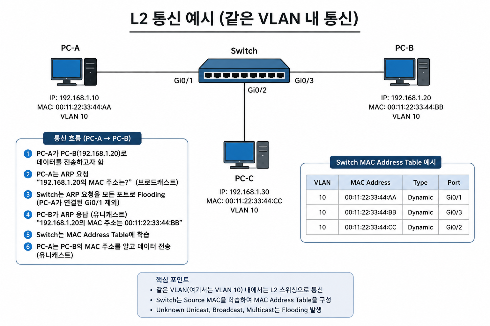

# L2 통신 / MAC Address Table

## 1. 개념

Layer 2 forwarding refers to the process switches used to forward frames within a LAN.

---

## 2. 동작 원리

내용 작성

---

## 3. 예시 및 구성도

내용 작성\
\

---

## 4. 명령어

---

## 5. Troubleshooting

---

## 6. 실무 질문

Q1. 스위치는 목적지 MAC Address를 모르면 어떻게 동작하는가?
- L2 Header에서 Destination MAC을 확인한다.
