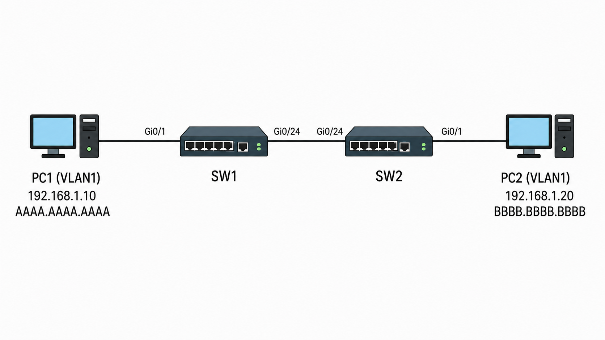

# L2 통신 / MAC Address Table

## 개념

Layer 2 통신은 같은 네트워크(LAN) 안에 있는 장비들이 MAC Address를 기반으로 통신하는 방식이다. Layer 2에서는 데이터를 Frame 단위로 전달한다.

스위치는 전달받은 Frame의 Ethernet Header에서 Source MAC Address를 확인하고, 해당 MAC Address와 Frame이 들어온 인터페이스를 MAC Address Table에 매핑한다. 이후 Destination MAC Address를 확인하고, MAC Address Table에 해당 주소가 있으면 매핑된 인터페이스로 Frame을 Forwarding한다.

---

## 동작 원리

1. 단말이 Frame을 전송한다.  
2. 스위치가 인터페이스를 통해 Frame을 수신한다.  
3. 스위치는 Ethernet Header의 Source MAC Address와 Destination MAC Address를 확인한다.  
4. Source MAC Address는 Frame이 들어온 인터페이스와 함께 MAC Address Table에 매핑하여 학습한다.  
5. Destination MAC Address는 자신의 MAC Address Table에서 Lookup한다.  
6. Destination MAC Address가 있으면 매핑된 인터페이스로 Frame을 Forwarding한다.  
7. 만약 Destination MAC Address가 없으면 Frame이 들어온 인터페이스를 제외하고, 같은 VLAN에 속한 모든 인터페이스로 Frame을 Flooding한다.  
8. 목적지 단말이 응답하면 스위치는 응답 Frame의 Source MAC Address도 같은 방식으로 학습한다.  
9. 이후에는 학습된 정보를 이용하여 목적지 단말이 연결된 인터페이스로 Frame을 Forwarding한다.

---

## 예시 및 구성도
PC1
- IP Address: 192.168.1.10
- MAC Address: AAAA.AAAA.AAAA

PC2
- IP Address: 192.168.1.20
- MAC Address: BBBB.BBBB.BBBB




1\. PC1이 Frame을 만들어서 SW1으로 전송한다.
- Frame 안에는 PC1의 Source MAC Address와 PC2의 Destination MAC Address 정보가 들어 있다.

2\. SW1은 해당 Frame을 받고 Ethernet Header의 Destination MAC Address를 확인한다.
- Destination MAC Address인 `BBBB.BBBB.BBBB`가 자신의 `Gi0/24`에 매핑되어 있는 것을 확인한다.

3\. SW1은 `Gi0/24`를 통해 SW2로 해당 Frame을 Forwarding한다.

4\. SW2는 Frame을 받고 Destination MAC Address를 확인한다.
- `BBBB.BBBB.BBBB`가 PC2가 연결된 `Gi0/1`에 매핑되어 있는 것을 확인한다.

5\. SW2는 `Gi0/1`을 통해 PC2로 Frame을 Forwarding한다.

6\. PC2는 Frame을 받고 Ethernet Header의 Destination MAC Address가 자신의 MAC Address와 일치하는지 확인한다.
- 일치하면 Ethernet Frame을 Decapsulation하고 Data를 확인한다. 

---

## 명령어

```
SW1# show mac address-table
```
스위치가 학습한 MAC Address와 해당 MAC Address가 매핑된 인터페이스를 확인한다.

```
SW1# show interfaces status
```
인터페이스의 연결 상태, VLAN 등의 상태를 확인할 수 있다.

---

## Troubleshooting

1\. L2 통신이 되지 않으면 먼저 인터페이스 상태를 확인한다.

2\. 인터페이스가 `connected` 상태인데도 통신되지 않는다면 양쪽 인터페이스의 Access VLAN이 서로 다르게 설정되어 있을 가능성이 높다.

3\. 케이블이 정상적으로 연결되어 있는데 인터페이스가 Down 상태라면 해당 인터페이스에 `shutdown`이 설정되어 있는지 확인한다.

---

## 실무 질문

스위치는 Destination MAC Address를 모르면 어떻게 동작하는가?
- Frame이 들어온 인터페이스를 제외하고, 같은 VLAN에 속한 모든 인터페이스로 Frame을 Flooding한다.

스위치는 MAC Address를 어떻게 학습하는가?
- 수신한 Frame의 Source MAC Address와 Frame이 들어온 인터페이스를 MAC Address Table에 매핑하여 학습한다.

인터페이스가 Up 상태인데도 L2 통신이 되지 않으면 무엇을 확인해야 하는가?
- 양쪽 인터페이스의 Access VLAN이 같은지 확인하고, MAC Address Table에 단말의 MAC Address가 올바르게 학습되어 있는지 확인한다.


