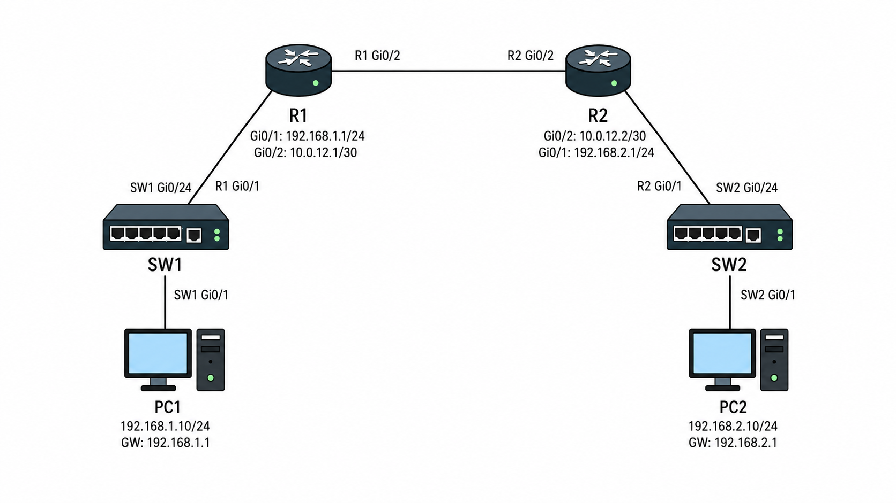

# L3 통신 / Routing

## 개념

Layer 3 통신은 서로 다른 네트워크에 있는 장비들이 IP Address를 기반으로 통신하는 방식이다. Layer 3에서는 데이터를 Packet 단위로 전달한다.

단말은 Destination IP Address가 자신의 네트워크에 속하지 않으면 Packet을 Default Gateway로 전송한다. 라우터는 IP Header의 Destination IP Address를 확인하고 Routing Table에서 목적지 네트워크를 Lookup한다. 목적지 경로가 있으면 Next-Hop과 Exit Interface를 확인하고 Packet을 Forwarding한다.

---

## 동작 원리

1. 단말이 Payload에 IP Header를 붙여 Packet을 만든다. IP Header 안에는 Source IP Address와 Destination IP Address 등의 정보가 포함되어 있다.

2. 단말은 Packet을 Ethernet Frame으로 Encapsulation하여 Default Gateway인 라우터에게 전송한다.

3. 라우터는 Frame을 Decapsulation하여 Ethernet Header를 제거하고, IP Header의 Destination IP Address를 확인한다.

4. 라우터는 Destination IP Address를 Routing Table에서 Lookup한다.

5. 목적지와 일치하는 경로가 있으면 Next-Hop과 Exit Interface를 확인한다.

6. Packet을 새로운 Ethernet Frame으로 Encapsulation한다. Source MAC Address에는 현재 라우터의 Exit Interface MAC Address를, Destination MAC Address에는 Next-Hop 라우터의 MAC Address를 지정한다. 라우터는 Exit Interface를 통해 Frame을 Forwarding한다.

7. Next-Hop 라우터는 Frame을 다시 Decapsulation하고 Destination IP Address를 확인한다.

8. 목적지 네트워크가 자신에게 Directly Connected되어 있으면 목적지 단말의 MAC Address를 확인한 후, 새로운 Ethernet Frame으로 Encapsulation하여 목적지 단말로 Forwarding한다.

9. 목적지 경로가 다른 라우터를 통해 연결되어 있으면 같은 과정을 반복한다.

10. 목적지 단말은 Frame을 수신하고 Decapsulation하여 Packet의 Data를 확인한다.

---

## 예시 및 구성도

PC1
- IP Address: 192.168.1.10/24
- Default Gateway: 192.168.1.1

R1
- Gi0/1: 192.168.1.1/24
- Gi0/2: 10.0.12.1/30

R2
- Gi0/2: 10.0.12.2/30
- Gi0/1: 192.168.2.1/24

PC2
- IP Address: 192.168.2.10/24
- Default Gateway: 192.168.2.1

### PC1 ↔ PC2 통신



1\. PC1은 PC2의 IP Address가 자신의 네트워크가 아닌걸 확인한다.
- PC2는 다른 네트워크에 있으므로 PC1은 Packet을 Default Gateway인 R1으로 전송한다.

2\. PC1은 Source IP Address가 `192.168.1.10`, Destination IP Address가 `192.168.2.10`인 Packet을 생성한다.
- Packet을 Ethernet Frame으로 Encapsulation하고 Destination MAC Address에는 R1 `Gi0/1`의 MAC Address를 지정한다.

3\. SW1은 Frame을 수신하고 Destination MAC Address를 확인하고, R1이 연결된 `Gi0/24`로 Forwarding한다.

4\. R1은 Frame을 Decapsulation하고 Destination IP Address를 확인한다.
- Routing Table에서 `192.168.2.0/24`로 가는 경로를 Lookup한다.

5\. R1은 `192.168.2.10/24`로 가기위해서는 Next-Hop인 `10.0.12.2`와 Exit Interface인 `Gi0/2`로 내보내야되는걸 확인한다.
- Packet을 새로운 Ethernet Frame으로 Encapsulation한다.
- Source MAC Address에는 R1 `Gi0/2`의 MAC Address를, Destination MAC Address에는 R2 `Gi0/2`의 MAC Address를 지정한다.

6\. R1은 `Gi0/2`를 통해 R2로 Frame을 Forwarding한다.

7\. R2는 Frame을 Decapsulation하고 Destination IP Address를 Routing Table에서 Lookup한다.
- `192.168.2.0/24`가 `Gi0/1`에 Directly Connected된 것을 확인한다.

8\. R2는 Packet을 새로운 Ethernet Frame으로 Encapsulation한다.
- Source MAC Address에는 R2 `Gi0/1`의 MAC Address를, Destination MAC Address에는 PC2의 MAC Address를 지정한다.

9\. R2는 `Gi0/1`을 통해 SW2로 Frame을 전송하고, SW2는 PC2가 연결된 `Gi0/1`로 Frame을 Forwarding한다.

10\. PC2는 Frame을 수신하고 Destination IP Address가 자신의 IP Address와 일치하는지 확인한다.
- 일치하면 Frame을 Decapsulation하고 Data를 확인한다.

---

## 명령어

```
R1# show ip interface brief
```
인터페이스의 IP Address와 연결 상태를 확인한다.

```
R1# show ip route
```
라우터가 알고 있는 목적지 네트워크, Next-Hop 및 Exit Interface를 확인한다.

---

## Troubleshooting

1\. L3 통신이 되지 않으면 먼저 인터페이스의 IP Address와 상태가 `up/up`인지 확인한다.

2\. 인터페이스가 `up/up`인데도 통신되지 않는다면 Routing Table에 목적지 네트워크로 가는 경로가 있는지 확인한다.

3\. 목적지 경로가 존재한다면 반대편 라우터에도 응답 Packet이 돌아오기 위한 Return Route가 있는지 확인한다.

4\. 단말에 올바른 IP Address, Subnet Mask 및 Default Gateway가 설정되어 있는지 확인한다.

---

## 실무 질문

Q1. 스위치는 목적지 MAC Address를 모르면 어떻게 동작하는가?
- L2 Header에서 Destination MAC을 확인한다.

