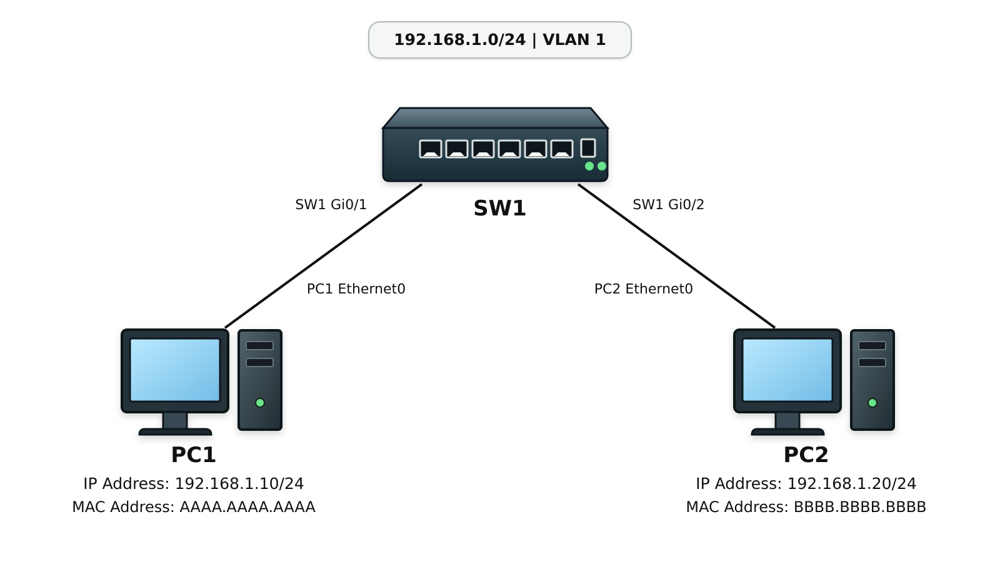
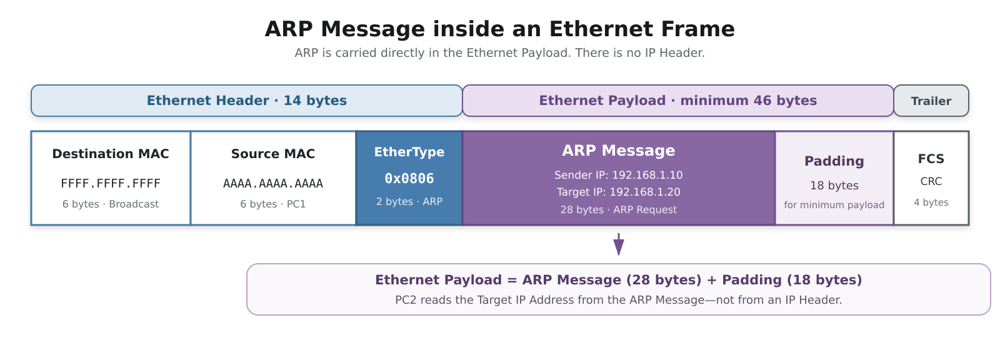
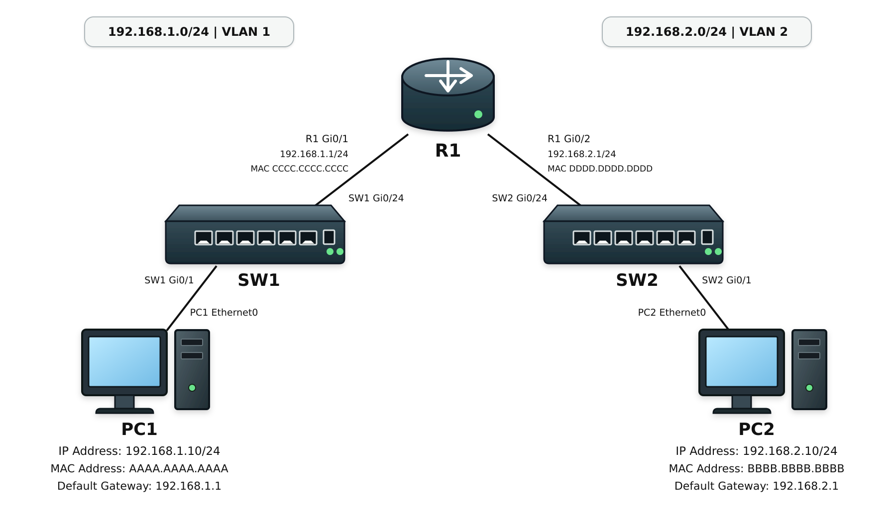
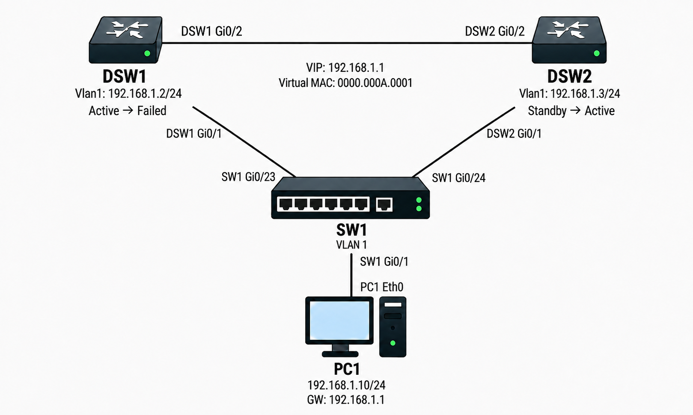

# ARP / Gratuitous ARP

## 개념

ARP(Address Resolution Protocol)는 같은 네트워크에서 통신할 때 IPv4 Address에 매핑된 MAC Address를 확인하는 프로토콜이다.

단말은 목적지와 통신하기 전에 자신의 ARP Table에서 목적지 IP Address에 해당하는 MAC Address를 확인한다. ARP 정보가 없으면 ARP Request를 같은 네트워크에 Broadcast로 전송하고, 해당 IP Address를 사용하는 단말은 자신의 MAC Address를 ARP Reply에 포함하여 Unicast로 전송한다.

목적지가 다른 네트워크에 있다면 단말은 Default Gateway로 ARP Request를 보낸다. Default Gateway는 자신의 MAC Address를 ARP Reply에 포함하여 단말로 Unicast 전송한다.

Gratuitous ARP는 단말이 ARP Request를 받지 않은 상태에서 자신의 IP Address와 MAC Address 정보를 같은 네트워크에 광고하는 기능이다.

---

## 동작 원리

### ARP

1\. 단말은 목적지 IP Address가 같은 네트워크에 있는지 확인한다.

2\. 같은 네트워크에 있다면 목적지 IP Address에 매핑된 MAC Address를 ARP Table에서 확인한다. 다른 네트워크에 있다면 Default Gateway의 IP Address에 매핑된 MAC Address를 확인한다.

3\. ARP Table에 필요한 MAC Address 정보가 없으면 해당 IP Address를 Target IP Address로 지정한 ARP Request를 Broadcast로 전송한다.

4\. 스위치는 ARP Request를 수신한 인터페이스를 제외하고, 같은 VLAN에 속한 모든 인터페이스로 Flooding한다.

5\. Target IP Address를 사용하는 장비는 자신의 MAC Address를 포함한 ARP Reply를 요청한 단말에게 Unicast로 전송한다.

6\. 요청한 단말은 전달받은 IP Address와 MAC Address 정보를 ARP Table에 매핑한다.

7\. 이후 단말은 응답받은 MAC Address를 Destination MAC Address로 지정하여 Ethernet Frame을 생성하고 전송한다.

### Gratuitous ARP

1\. 단말은 자신의 IP Address와 MAC Address가 포함된 Gratuitous ARP를 Broadcast로 전송한다.

2\. 같은 네트워크에 있는 장비들은 Gratuitous ARP를 확인하고 ARP Table을 갱신할 수 있다.

3\. 이중화 환경에서는 Active 장비가 변경되었을 때 새로운 Active 장비의 MAC Address를 네트워크에 알리는 용도로도 사용한다.

---

## 예시 및 구성도

### 목저기가 같은 네트워크인 경우 

PC1
- IP Address: 192.168.1.10/24
- MAC Address: AAAA.AAAA.AAAA

PC2
- IP Address: 192.168.1.20/24
- MAC Address: BBBB.BBBB.BBBB




1\. PC1은 PC2가 자기와 같은 네트워크인것을 확인한다.

2\. PC1은 자신의 ARP Table에서 PC2의 IP Address인 `192.168.1.20`에 매핑된 MAC Address를 확인한다.

3\. ARP 정보가 없으면 `192.168.1.20`을 Target IP Address로 지정한 ARP Request를 Broadcast로 전송한다.
- Destination MAC Address에는 Broadcast 주소인 `FFFF.FFFF.FFFF`를 지정한다.

4\. SW1은 PC1의 ARP Request를 수신한 인터페이스를 제외하고, 같은 VLAN에 속한 모든 인터페이스로 Flooding한다.

5. PC2는 Ethernet Frame을 Decapsulation하고, Payload에 들어 있는 ARP 메시지를 확인한다.
- Target IP Address가 자신의 IP Address와 일치하는지 확인한다.

6\. PC2는 자신의 MAC Address인 `BBBB.BBBB.BBBB`를 포함한 ARP Reply를 PC1에게 Unicast로 전송한다.

7\. PC1은 전달받은 IP Address와 MAC Address 정보를 ARP Table에 매핑한다.
- `192.168.1.20` → `BBBB.BBBB.BBBB`

8\. PC1은 PC2의 MAC Address를 Destination MAC Address로 지정하여 Ethernet Frame을 생성하고 전송한다.

### PC1과 PC2가 다른 네트워크인 경우

PC1
- IP Address: 192.168.1.10/24
- MAC Address: AAAA.AAAA.AAAA
- Default Gateway: 192.168.1.1

R1
- Gi0/1 IP Address: 192.168.1.1/24
- Gi0/1 MAC Address: CCCC.CCCC.CCCC

R2
- Gi0/1 IP Address: 192.168.2.1/24
- Gi0/1 MAC Address: DDDD.DDDD.DDDD

PC2
- IP Address: 192.168.2.10/24
- MAC Address: BBBB.BBBB.BBBB
- Default Gateway: 192.168.2.1



1\. PC1은 PC2의 IP Address가 자신의 네트워크에 속하지 않는 것을 확인한다.

2\. PC1은 Default Gateway인 `192.168.1.1`에 매핑된 MAC Address를 ARP Table에서 확인한다.

3\. ARP 정보가 없으면 `192.168.1.1`을 Target IP Address로 지정한 ARP Request를 Broadcast로 전송한다.

4\. SW1은 ARP Request를 수신한 인터페이스를 제외하고, 같은 VLAN에 속한 모든 인터페이스로 Flooding한다.

5\. R1은 Ethernet Frame의 Payload에 들어 있는 ARP 메시지를 확인한다.
- Target IP Address가 자신의 `Gi0/1` IP Address와 일치하는지 확인한다.

6\. R1은 `Gi0/1`의 MAC Address인 `CCCC.CCCC.CCCC`를 포함한 ARP Reply를 PC1에게 Unicast로 전송한다.

7\. PC1은 전달받은 IP Address와 MAC Address 정보를 ARP Table에 매핑한다.
- `192.168.1.1` → `CCCC.CCCC.CCCC`

8\. PC1은 R1 `Gi0/1`의 MAC Address를 Destination MAC Address로 지정하여 Ethernet Frame을 생성하고 전송한다.

9\. R1은 Ethernet Frame을 Decapsulation하고, Destination IP Address가 `192.168.2.10`인 것을 확인한다.

10\. R1은 `192.168.2.0/24`가 `Gi0/2`에 Directly Connected되어 있는 것을 확인한다.

11\. R1은 ARP Table에서 PC2의 IP Address인 `192.168.2.10`에 매핑된 MAC Address를 확인한다.

12\. ARP 정보가 없으면 R1은 `192.168.2.10`을 Target IP Address로 지정한 ARP Request를 `Gi0/2`를 통해 Broadcast로 전송한다.

13\. SW2는 ARP Request를 수신한 인터페이스를 제외하고, 같은 VLAN에 속한 모든 인터페이스로 Flooding한다.

14\. PC2는 Ethernet Frame의 Payload에 들어 있는 ARP 메시지를 확인한다.
- Target IP Address가 자신의 IP Address와 일치하는지 확인한다.

15\. PC2는 자신의 MAC Address인 `BBBB.BBBB.BBBB`를 포함한 ARP Reply를 R1에게 Unicast로 전송한다.

16\. R1은 전달받은 IP Address와 MAC Address 정보를 ARP Table에 매핑한다.
- `192.168.2.10` → `BBBB.BBBB.BBBB`

17\. R1은 PC2의 MAC Address를 Destination MAC Address로 지정하여 새로운 Ethernet Frame을 생성하고 PC2에게 전송한다.

18\. PC2는 R1이 전달한 Ethernet Frame을 수신하고 Decapsulation하여 PC1이 전송한 Packet의 Data를 확인한다.

### 이중화 환경에서 Active 장비가 변경된 경우

PC1
- IP Address: 192.168.1.10/24
- Default Gateway: 192.168.1.1

DSW1
- Vlan1 IP Address: 192.168.1.2/24
- HSRP 상태: Active → 장애 발생

DSW2
- Vlan1 IP Address: 192.168.1.3/24
- HSRP 상태: Standby → Active

HSRP
- Virtual IP Address: 192.168.1.1
- Virtual MAC Address: 0000.000A.0001
- Group Number: 1



1\. PC1은 HSRP Virtual IP Address인 `192.168.1.1`을 Default Gateway로 사용한다.

2\. 기존 Active 장비인 DSW1은 Virtual IP Address `192.168.1.1`과 Virtual MAC Address `0000.000A.0001`을 사용하여 PC1의 트래픽을 처리한다.

3\. DSW1에 장애가 발생하여 SW1의 Gi0/23이 Down이 된다. 

4\. STP는 Topology 변경을 감지하고 경로를 다시 계산한다. 기존에 Blocking 상태였던 SW1의 `Gi0/24`는 Forwarding 상태로 전환된다.

5\. DSW2는 DSW1으로부터 HSRP Hello 메시지를 받지 못하여 기존 Standby 상태에서 Active 상태로 전환된다.

6\. DSW2는 HSRP Virtual IP Address `192.168.1.1`과 Virtual MAC Address `0000.000A.0001`이 포함된 Gratuitous ARP를 VLAN 1에 Broadcast로 전송한다.
- DSW2가 여러 SVI에서 HSRP Active로 전환된다면 각 SVI가 속한 VLAN마다 해당 Virtual IP Address와 Virtual MAC Address가 포함된 Gratuitous ARP를 각각 전송한다.

7\. SW1은 Gratuitous ARP를 수신한 인터페이스를 제외하고, VLAN 1에 속한 모든 인터페이스로 Flooding한다.

8\. SW1은 Gratuitous ARP가 DSW2와 연결된 `Gi0/24`로 들어온 것을 확인하고, Virtual MAC Address의 위치를 DSW2 방향으로 갱신한다.
- 변경 전: `0000.000A.0001` → DSW1 `Gi0/23`
- 변경 후: `0000.000A.0001` → DSW2 `Gi0/24`

9\. PC1의 ARP Table에는 기존과 동일한 HSRP 정보가 유지된다.
- `192.168.1.1` → `0000.000A.0001`

10\. 이후 PC1은 Virtual MAC Address `0000.000A.0001`을 Destination MAC Address로 지정하여 Ethernet Frame을 전송한다.

11\. SW1은 MAC Address Table을 확인하고 Ethernet Frame을 DSW2와 연결된 `Gi0/24`로 전달한다.

12\. 새로운 Active 장비인 DSW2는 PC1의 트래픽을 수신하고, Routing Table을 확인하여 목적지 네트워크로 전달한다.

---

## 명령어

```
DSW1# show ip arp
```

L3 장비가 학습한 IP Address와 MAC Address의 매핑 정보를 확인한다.

```
DSW1# show ip arp | include 192.168.1.20
```

특정 IP Address가 포함된 ARP 정보를 확인한다.

```
PC1> arp -a
```

Windows PC의 ARP Table을 확인한다.

---

## Troubleshooting

1\. ARP Table에 MAC Address가 표시되지 않거나 `Incomplete` 상태라면 상대 장비에서 ARP Reply를 받지 못한 것이다.

2\. 인터페이스 상태와 Access VLAN을 확인하고, 단말의 IP Address, Subnet Mask, Default Gateway 설정이 올바른지 확인한다.

3\. 장비의 MAC Address가 변경되었지만 이전 ARP 정보가 남아 있다면 기존 ARP 정보를 삭제한 후 통신을 다시 시도하여 새로운 ARP 정보를 학습하는지 확인한다.

Cisco 장비에서 특정 ARP 정보를 삭제한다.
- 삭제 후 통신을 다시 시도하여 새로운 ARP 정보를 학습하는지 확인한다.

```
DSW1# clear ip arp 192.168.1.20
DSW1# ping 192.168.1.20
```

Windows 단말에서 특정 ARP 정보를 삭제한다.
- 삭제 후 통신을 다시 시도한다.

```
PC1> arp -d 192.168.1.20
PC1> ping 192.168.1.20
```

---

## 실무 질문

ARP Request와 ARP Reply는 어떤 방식으로 전송되는가?
- ARP Request는 상대방의 IP Address는 알지만 MAC Address를 모를 때, 해당 MAC Address를 확인하기 위해 자신이 속한 네트워크에 Broadcast를 전송한다.
- ARP Reply는 자신의 MAC Address를 ARP Request를 보낸 장비에게 Unicast로 전송한다.

다른 네트워크에 있는 장비와 통신할 때 어떤 MAC Address를 ARP로 확인하는가?
- 원격 목적지 단말의 MAC Address가 아니라 같은 네트워크에 있는 Default Gateway의 MAC Address를 확인한다.

Gratuitous ARP는 언제 사용하는가?
- IP Address와 MAC Address 정보를 갱신하거나 이중화 장비가 전환된 사실을 같은 네트워크에 알릴 때 사용한다.

