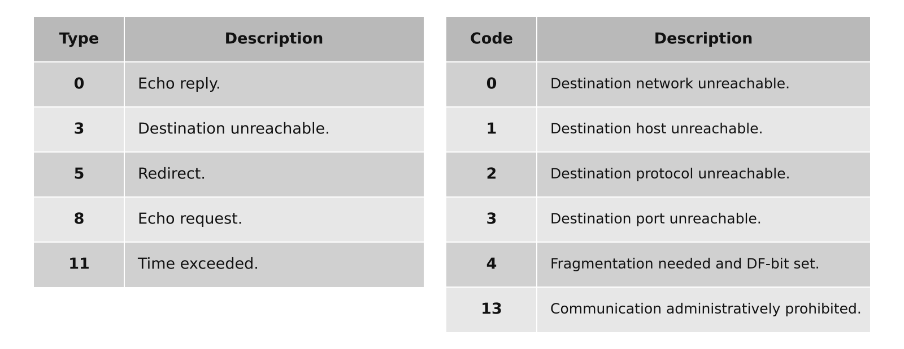
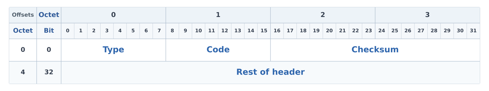
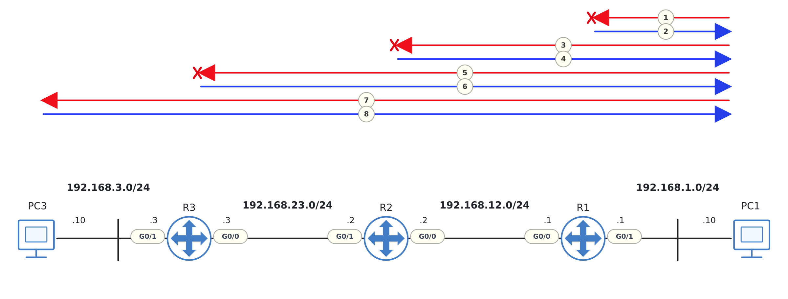

# ICMP / Ping / Traceroute

## 개념

### ICMP
ICMP(Internet Control Message Protocol)는 IP 통신 중 발생한 오류를 알리거나 네트워크의 연결 상태를 확인할 때 사용하는 프로토콜이다.

ICMP 메시지는 IP Packet 안에 Encapsulation되며, IP Header의 Protocol Number는 `1`을 사용한다. 

ICMP Data에 ICMP Header가 추가되어 ICMP 메시지가 되고, 이후 IP Header가 추가되어 IP Packet으로 Encapsulation된다.

### Ping

Ping은 ICMP Echo Request와 Echo Reply를 사용하여 목적지 장비와 IP 통신이 가능한지 확인하는 도구이다.

출발지 장비가 ICMP Echo Request를 전송하고 목적지 장비가 Echo Reply를 보내면 통신이 가능한 것으로 판단한다. 또한 응답 시간과 Packet Loss를 통해 네트워크 상태를 확인할 수 있다.
- 하지만 Ping이 실패했다고 해서 네트워크 경로에 장애가 발생한 것은 아니다. 방화벽이나 ACL에서 ICMP를 차단했거나 목적지 장비가 ICMP에 응답하지 않도록 설정했을 수도 있다.

### Traceroute

Traceroute는 TTL 값을 순차적으로 증가시키며 Packet을 전송하고, 각 Layer 3 장비가 보내는 ICMP Time Exceeded 메시지를 이용하여 출발지에서 목적지까지의 경로를 확인하는 도구이다.

Traceroute는 IP Header의 TTL 값을 `1`부터 순차적으로 증가시켜 Packet을 전송한다. 각 라우터에서 TTL이 `0`이 되면 Packet을 폐기하고 ICMP Time Exceeded 메시지를 출발지로 전송한다. 출발지는 이 메시지의 Source IP Address를 확인하여 중간 경로를 파악한다.

Windows의 `tracert`는 일반적으로 ICMP Echo Request를 사용한다. Cisco와 Linux의 `traceroute`는 일반적으로 UDP를 사용한다.

---

## 동작 원리

### Ping

1\. 출발지 장비는 목적지 IP Address가 같은 네트워크에 있는지 확인한다.

2\. 같은 네트워크에 있다면 목적지 장비의 MAC Address를 확인하고, 다른 네트워크에 있다면 Default Gateway의 MAC Address를 확인한다.

3\. 필요한 MAC Address 정보가 없다면 ARP를 통해 MAC Address를 확인한다.

4\. 출발지 장비는 ICMP Echo Request를 생성한다.
- ICMP Type: `8`
- ICMP Code: `0`

5\. ICMP Echo Request는 IP Packet 안에 Encapsulation된다.
- Source IP Address: 출발지 장비의 IP Address
- Destination IP Address: 목적지 장비의 IP Address
- Protocol Number: `1`

6\. 출발지 장비는 IP Packet을 Ethernet Frame으로 Encapsulation하여 전송한다.

7\. 중간 라우터들은 Routing Table을 확인하여 Packet을 목적지 방향으로 전달한다.

8\. 목적지 장비는 ICMP Echo Request를 수신하고 ICMP Echo Reply를 생성한다.
- ICMP Type: `0`
- ICMP Code: `0`

9\. 목적지 장비는 ICMP Echo Reply를 출발지 장비로 전송한다.

10\. 출발지 장비는 Echo Reply를 수신하고 응답 시간과 Packet Loss를 확인한다.

### Traceroute

1\. 출발지 장비는 TTL 값을 `1`로 지정한 첫 번째 Probe Packet을 전송한다.

2\. 첫 번째 라우터는 TTL을 `1` 감소시킨다.

3\. TTL이 `0`이 되면 첫 번째 라우터는 Packet을 폐기하고 ICMP Time Exceeded 메시지를 출발지 장비로 전송한다.
- ICMP Type: `11`
- ICMP Code: `0`

4\. 출발지 장비는 ICMP 메시지의 Source IP Address를 확인하여 첫 번째 라우터의 IP Address를 표시한다.

5\. 출발지 장비는 TTL 값을 `2`로 지정한 두 번째 Probe Packet을 전송한다.

6\. 첫 번째 라우터를 통과한 Packet은 두 번째 라우터에서 TTL이 `0`이 된다.

7\. 두 번째 라우터는 Packet을 폐기하고 ICMP Time Exceeded 메시지를 출발지 장비로 전송한다.

8\. 출발지 장비는 같은 방법으로 TTL 값을 계속 증가시키면서 중간 경로를 확인한다.

9\. Probe Packet이 최종 목적지에 도착하면 목적지 장비가 응답하고 Traceroute가 종료된다.
- ICMP 방식: Echo Reply를 수신하면 종료한다.
- UDP 방식: ICMP Port Unreachable을 수신하면 종료한다.

---

## 예시 및 구성도

### Ping 예시

내용 작성

### Traceroute 예시

내용 작성

---

## 명령어

내용 작성

---

## Troubleshooting

1\. Ping이 실패하면 인터페이스 상태와 IP Address 설정을 확인한다.

2\. 중간 경로의 Routing Table과 ACL 설정을 확인한다.

3\. Traceroute 결과가 특정 구간에서 멈추면 해당 구간의 경로와 ICMP 차단 여부를 확인한다.

---

## 실무 질문

ICMP는 어떤 용도로 사용하는가?
- 내용 작성

Ping은 어떤 방식으로 통신 상태를 확인하는가?
- 내용 작성

Traceroute는 어떤 방식으로 중간 경로를 확인하는가?
- 내용 작성

Ping이 실패하면 반드시 통신 장애인가?
- 내용 작성
