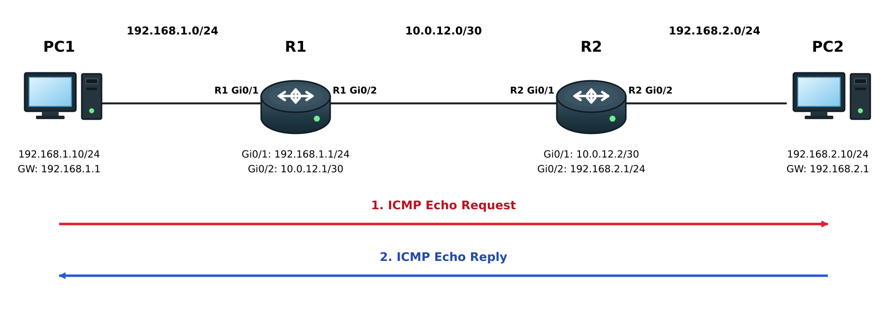
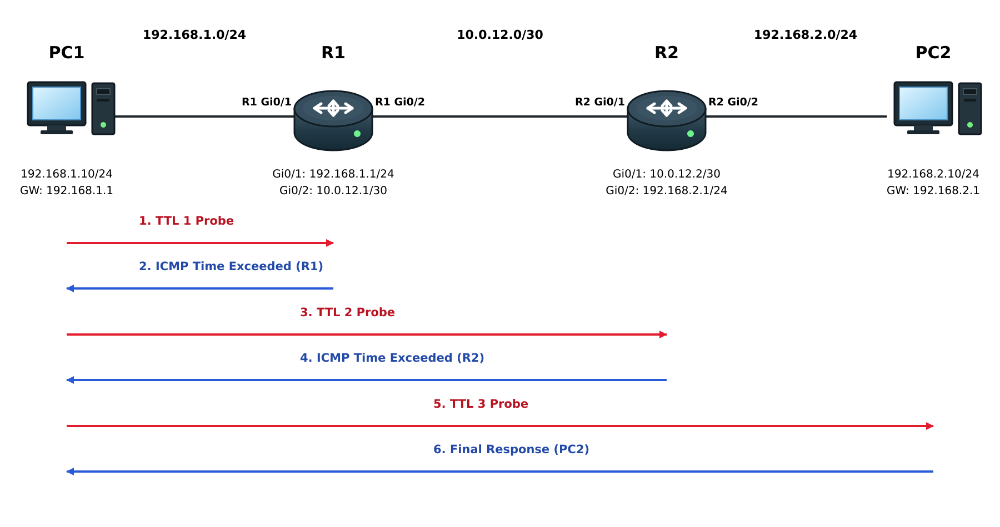

# ICMP / Ping / Traceroute

## 개념

### ICMP
ICMP(Internet Control Message Protocol)는 IP 통신 중 발생한 오류를 알리거나 네트워크의 연결 상태를 확인할 때 사용하는 프로토콜이다.

ICMP 메시지는 IP Packet 안에 Encapsulation되며, IP Header의 Protocol Number는 `1`을 사용한다. 

ICMP Data에 ICMP Header가 추가되어 ICMP 메시지가 되고, 이후 IP Header가 추가되어 IP Packet으로 Encapsulation된다.


### Ping

Ping은 ICMP Echo Request와 Echo Reply를 사용하여 목적지 장비와 IP 통신이 가능한지 확인하는 도구이다.

출발지 장비가 ICMP Echo Request를 전송하고 목적지 장비가 Echo Reply를 보내면 통신이 가능한 것으로 판단한다. 또한 응답 시간과 Packet Loss를 통해 네트워크 상태를 확인할 수 있다.
- 하지만 Ping이 실패했다고 해서 네트워크 경로에 장애가 발생한 것은 아니다. 방화벽이나 ACL에서 ICMP를 차단했거나 목적지 장비가 ICMP에 응답하지 않도록 설정했을 수도 있다.

### Traceroute

Traceroute는 TTL 값을 순차적으로 증가시키며 Packet을 전송하고, 각 Layer 3 장비가 보내는 ICMP Time Exceeded 메시지를 이용하여 출발지에서 목적지까지의 경로를 확인하는 도구이다.

Traceroute는 IP Header의 TTL 값을 `1`부터 순차적으로 증가시켜 Packet을 전송한다. 각 라우터에서 TTL이 `0`이 되면 Packet을 폐기하고 ICMP Time Exceeded 메시지를 출발지로 전송한다. 출발지는 이 메시지의 Source IP Address를 확인하여 중간 경로를 파악한다.

Windows의 `tracert`는 일반적으로 ICMP Echo Request를 사용한다. Cisco와 Linux의 `traceroute`는 일반적으로 UDP를 사용한다.

---

## 동작 원리

### Ping

1\. 출발지 장비는 목적지 IP Address가 같은 네트워크에 있는지 확인한다.

2\. 같은 네트워크에 있다면 목적지 장비의 MAC Address를 확인하고, 다른 네트워크에 있다면 Default Gateway의 MAC Address를 확인한다.

3\. 필요한 MAC Address 정보가 없다면 ARP를 통해 MAC Address를 확인한다.

4\. 출발지 장비는 ICMP Echo Request를 생성한다.
- ICMP Type: `8`
- ICMP Code: `0`

5\. ICMP Echo Request는 IP Packet 안에 Encapsulation된다.
- Source IP Address: 출발지 장비의 IP Address
- Destination IP Address: 목적지 장비의 IP Address
- Protocol Number: `1`

6\. 출발지 장비는 IP Packet을 Ethernet Frame으로 Encapsulation하여 전송한다.

7\. 중간 라우터들은 Routing Table을 확인하여 Packet을 목적지 방향으로 전달한다.

8\. 목적지 장비는 ICMP Echo Request를 수신하고 ICMP Echo Reply를 생성한다.
- ICMP Type: `0`
- ICMP Code: `0`

9\. 목적지 장비는 ICMP Echo Reply를 출발지 장비로 전송한다.

10\. 출발지 장비는 Echo Reply를 수신하고 응답 시간과 Packet Loss를 확인한다.

### Traceroute

1\. 출발지 장비는 TTL 값을 `1`로 지정한 첫 번째 Probe Packet을 전송한다.

2\. 첫 번째 라우터는 TTL을 `1` 감소시킨다.

3\. TTL이 `0`이 되면 첫 번째 라우터는 Packet을 폐기하고 ICMP Time Exceeded 메시지를 출발지 장비로 전송한다.
- ICMP Type: `11`
- ICMP Code: `0`

4\. 출발지 장비는 ICMP 메시지의 Source IP Address를 확인하여 첫 번째 라우터의 IP Address를 표시한다.

5\. 출발지 장비는 TTL 값을 `2`로 지정한 두 번째 Probe Packet을 전송한다.

6\. 첫 번째 라우터를 통과한 Packet은 두 번째 라우터에서 TTL이 `0`이 된다.

7\. 두 번째 라우터는 Packet을 폐기하고 ICMP Time Exceeded 메시지를 출발지 장비로 전송한다.

8\. 출발지 장비는 같은 방법으로 TTL 값을 계속 증가시키면서 중간 경로를 확인한다.

9\. Probe Packet이 최종 목적지에 도착하면 목적지 장비가 응답하고 Traceroute가 종료된다.
- ICMP 방식: Echo Reply를 수신하면 종료한다.
- UDP 방식: ICMP Port Unreachable을 수신하면 종료한다.

---

## 예시 및 구성도

PC1
- IP Address: 192.168.1.10/24
- Default Gateway: 192.168.1.1

R1
- Gi0/1 IP Address: 192.168.1.1/24
- Gi0/2 IP Address: 10.0.12.1/30

R2
- Gi0/1 IP Address: 10.0.12.2/30
- Gi0/2 IP Address: 192.168.2.1/24

PC2
- IP Address: 192.168.2.10/24
- Default Gateway: 192.168.2.1

### Ping



PC1이 PC2의 IP Address인 `192.168.2.10`으로 Ping을 전송한다.

1\. PC1은 PC2가 다른 네트워크에 있는 것을 확인한다.

2\. PC1은 Default Gateway인 R1의 MAC Address를 Destination MAC Address로 지정하여 ICMP Echo Request를 전송한다.

3\. R1은 Routing Table을 확인하고 Packet을 R2 방향으로 전달한다.

4\. R2는 `192.168.2.0/24` 네트워크가 Directly Connected되어 있는 것을 확인하고 Packet을 PC2에게 전달한다.

5\. PC2는 ICMP Echo Request를 수신하고 ICMP Echo Reply를 PC1에게 전송한다.

6\. PC1은 Echo Reply를 수신하고 PC2와 IP 통신이 가능한 것을 확인한다.

### Traceroute



PC1이 PC2의 IP Address인 `192.168.2.10`으로 Traceroute를 실행한다.

1\. PC1은 TTL을 `1`로 지정한 Probe Packet을 전송한다.

2\. R1에서 TTL이 `0`이 되고, R1은 ICMP Time Exceeded 메시지를 PC1에게 전송한다.
- 첫 번째 경로: `192.168.1.1`

3\. PC1은 TTL을 `2`로 지정한 Probe Packet을 전송한다.

4\. R2에서 TTL이 `0`이 되고, R2는 ICMP Time Exceeded 메시지를 PC1에게 전송한다.
- 두 번째 경로: `10.0.12.2`

5\. PC1은 TTL을 `3`으로 지정한 Probe Packet을 전송한다.

6\. Probe Packet이 PC2에 도착하고 PC2가 응답한다.
- 최종 목적지: `192.168.2.10`

Output:
```
1    192.168.1.1
2    10.0.12.2
3    192.168.2.10
```
---

## 명령어

### Cisco

```
R1# ping 192.168.2.10
```
목적지 장비와 IP 통신이 가능한지 확인한다.

```
R1# traceroute 192.168.2.10
```
목적지까지 Packet이 통과하는 Layer 3 경로를 확인한다.

```
R1# show ip interface brief
```
인터페이스의 IP Address와 동작 상태를 확인한다.

```
R1# show ip route 192.168.2.10
```
목적지 IP Address와 일치하는 경로가 Routing Table에 있는지 확인한다.

```
R1# show access-lists
```
ACL에서 ICMP 또는 목적지 트래픽을 차단하고 있는지 확인한다.

### Windows

```
PC1> ping 192.168.2.10
```
목적지 장비와 IP 통신이 가능한지 확인한다.

```
PC1> ping -t 192.168.2.10
```
사용자가 중지할 때까지 Ping을 계속 전송한다.

```
PC1> tracert 192.168.2.10
```
목적지까지 통과하는 Layer 3 경로를 확인한다.

```
PC1> ipconfig
```
단말의 IP Address, Subnet Mask, Default Gateway 설정을 확인한다.

---

## Troubleshooting

1\. Ping이 실패하면 단말의 IP Address, Subnet Mask, Default Gateway 설정이 올바른지 확인한다.

2\. 해당 단말 VLAN의 Default Gateway를 가지고 있는 백본 스위치에 접속하여ARP 정보를 확인한다.
```
DSW1# show ip arp | include <Host IP>
```

3\. ARP 정보가 확인되지 않으면 단말이 연결된 Access Switch부터 L3 스위치까지 다음 항목을 확인한다.
- 인터페이스 상태
- Access VLAN 설정
- Trunk allowed VLAN 설정
- VLAN Database

4\. 내부 네트워크에서는 Ping이 성공하지만 외부 목적지로 Ping이 실패하면 Traceroute를 실행하여 어느 구간부터 응답이 없는지 확인한다.

5\. 중간 라우터의 Routing Table에 목적지로 가는 경로와 출발지로 돌아오는 Return Path가 있는지 확인한다.

6\. 방화벽이나 ACL에서 ICMP Echo Request, Echo Reply 또는 Time Exceeded 메시지를 차단하고 있는지 확인한다.

7\. Traceroute 결과에 `* * *`가 표시되더라도 해당 장비나 경로에 장애가 발생한 것은 아니다.
- 중간 장비가 ICMP 메시지에 응답하지 않을 수 있다.
- 방화벽이나 ACL에서 ICMP 메시지를 차단했을 수 있다.
- 장비가 ICMP 응답을 제한하고 있을 수 있다.

8\. Ping은 성공하지만 실제 서비스에 접속할 수 없다면 ICMP 통신은 가능하지만 TCP 또는 UDP Port가 차단되었거나 Application에 문제가 있을 수 있다.

---

## 실무 질문

ICMP는 어떤 용도로 사용하는가?
- IP 통신 중 발생한 오류를 알리거나 네트워크의 연결 상태를 확인할 때 사용한다.

Ping은 어떤 방식으로 통신 상태를 확인하는가?
- ICMP Echo Request를 목적지에 전송하고 Echo Reply가 돌아오는지 확인하여 IP 통신 상태를 확인한다.

Ping이 성공하면 서비스도 정상이라고 판단할 수 있는가?
- Ping 성공은 목적지와 ICMP 통신이 가능하다는 의미일 뿐, TCP 또는 UDP를 사용하는 Application이 정상이라는 의미는 아니다.

Ping이 실패하면 반드시 네트워크 장애인가?
- 방화벽이나 ACL에서 ICMP를 차단했거나 목적지 장비가 ICMP에 응답하지 않도록 설정했을 수 있으므로 반드시 네트워크 장애라고 판단할 수는 없다.

Traceroute는 어떤 방식으로 중간 경로를 확인하는가?
- TTL 값을 `1`부터 순차적으로 증가시키고 각 라우터가 보내는 ICMP Time Exceeded 메시지를 확인하여 중간 경로를 파악한다.

Traceroute에서 `* * *`가 표시되는 이유는 무엇인가?
- 제한 시간 안에 ICMP 응답을 받지 못했기 때문이다. ICMP가 차단되었거나 장비가 응답하지 않는 경우에도 표시될 수 있다.
