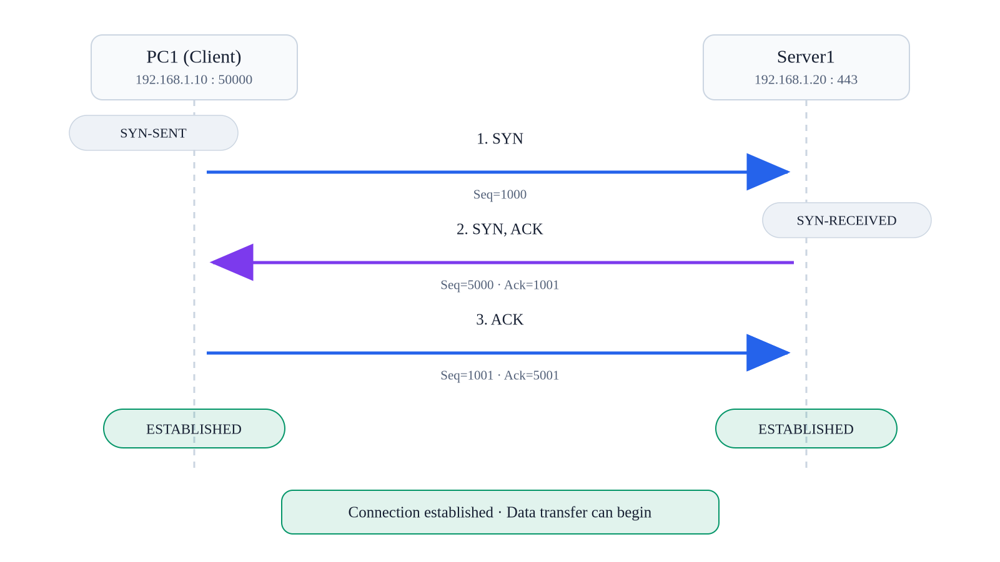
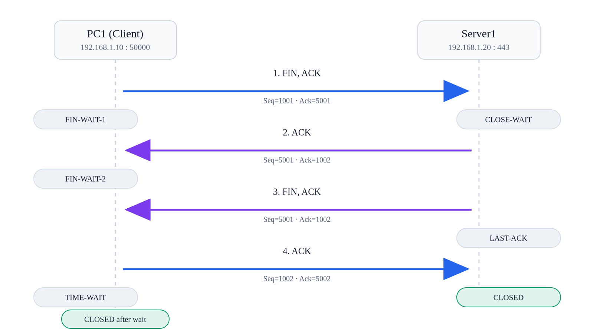
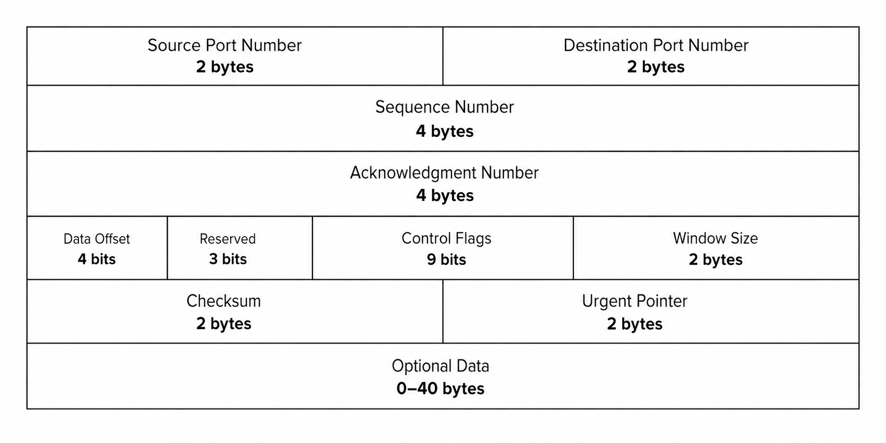
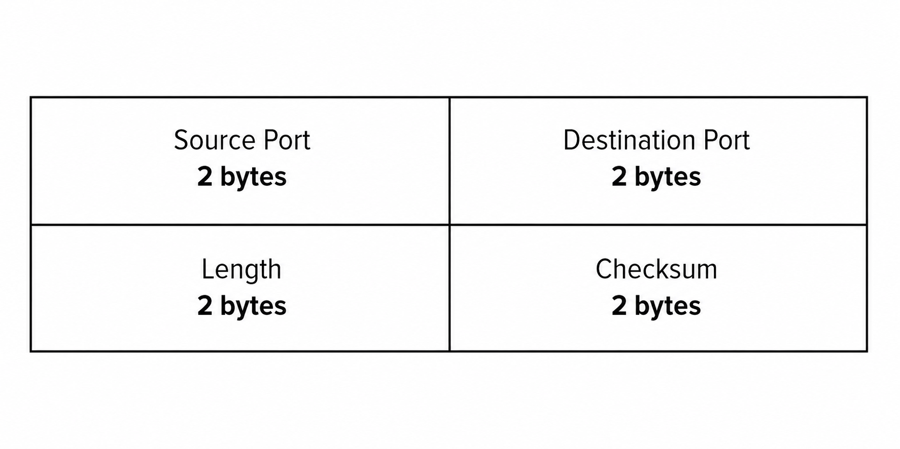

# TCP / UDP

## 개념

TCP와 UDP는 Transport Layer에서 동작하며, 출발지 장비의 Application Data를 목적지 장비의 Application까지 전달하는 프로토콜이다. TCP와 UDP는 Port Number를 사용하여 Application을 구분한다.

Application Data에 TCP Header가 추가되면 TCP Segment가 되고, UDP Header가 추가되면 UDP Datagram이 된다. 이후 IP Header가 추가되어 IP Packet으로 Encapsulation된다.
- TCP Protocol Number: `6`
- UDP Protocol Number: `17`

### Port Number

Port Number는 장비에서 실행 중인 Application이나 서비스를 구분하는 번호이다.

TCP와 UDP는 각각 `0`부터 `65535`까지의 Port Number를 사용한다.
- Well-Known Port: `0~1023` HTTP, HTTPS, SSH처럼 널리 알려진 표준 서비스가 사용하는 Port 범위이다.
- Registered Port: `1024~49151` 특정 Application이나 서비스를 위해 등록하여 사용하는 Port 범위이다.
- Dynamic/Private Port: `49152~65535` 클라이언트가 서버에 접속할 때 운영체제로부터 임시로 할당받는 port 범위이다.

서버는 일반적으로 서비스에 Well-Known Port Number를 사용하고, 클라이언트는 운영체제가 임시로 할당한 Dynamic Port Number를 사용한다. 예를 들어 PC1이 Server1의 TCP Port `443`에 접속하면 다음과 같이 Port Number가 지정될 수 있다.

```
TCP 192.168.1.10:50000 → 192.168.1.20:443
```
- Source Port: `50000`
- Destination Port: `443`

Server1이 PC1에게 응답할 때는 Source Port와 Destination Port의 방향이 반대로 변경된다.
```
TCP 192.168.1.20:443 → 192.168.1.10:50000
```

TCP와 UDP의 Port Number는 서로 별도로 관리되어 하나의 장비에서 TCP Port `5000`과 UDP Port `5000`을 동시에 사용할 수 있다.

### TCP

TCP(Transmission Control Protocol)는 Data를 전송하기 전에 3-Way Handshake를 통해 상대방과 연결을 설정하는 Connection-Oriented 프로토콜이다.

TCP는 Sequence Number와 Acknowledgment Number를 사용하여 Data의 순서와 수신 여부를 확인한다. TCP Segment가 손실되면 재전송하고, 순서가 바뀌어 도착하면 올바른 순서로 재조립하며, 중복된 Segment는 제거한다. 또한 Flow Control과 Congestion Control을 통해 전송량을 조절하고, Checksum으로 오류를 확인한다. 통신이 완료되면 FIN과 ACK를 주고받아 연결을 종료한다.

TCP는 주로 모든 Data를 정확하게 받아야 하는 웹 통신, 파일 전송, 이메일 및 SSH 등에 사용한다.  




TCP Flags
- SYN: TCP 연결 설정 요청
- ACK: TCP Segment를 정상적으로 수신했다는 응답
- FIN: TCP 연결을 정상적으로 종료하기 위한 요청
- RST: TCP 연결을 즉시 종료하거나 연결 요청을 거부

### TCP Header



TCP Header의 기본 크기는 `20 Byte`이며, TCP Option이 포함되면 Header의 크기가 증가할 수 있다.

TCP Header의 구성 요소
- Source Port: 출발지 Application의 Port Number
- Destination Port: 목적지 Application의 Port Number
- Sequence Number: 전송하는 Data의 시작 Byte 번호
- Acknowledgment Number: 다음에 수신하기를 기대하는 Byte 번호
- Header Length: TCP Header의 길이
- Flags: TCP Segment의 연결 상태
- Window Size: 수신 장비가 다음 ACK를 보내기 전까지 추가로 받을 수 있는 Data의 크기
- Checksum: TCP Header와 Data에 오류가 있는지 확인하는 값  
- Options: TCP의 추가 기능 정보

### UDP

UDP는 TCP와 달리 통신 상대방과 연결을 설정하지 않고 즉시 Data를 전송하는 Connectionless 프로토콜이며, TCP보다 작은 Header를 사용한다.

UDP는 Acknowledgment를 통한 수신 확인, 손실된 UDP Datagram의 재전송, 도착 순서 보장, Flow Control 및 Congestion Control 기능을 제공하지 않는다. 하지만 Checksum을 통해 전송 중 발생한 오류를 확인할 수 있다. TCP는 기본적으로 `1:1` 통신을 사용하지만, UDP는 `1:1` 통신뿐만 아니라 Broadcast와 Multicast를 통한 `1:many` 통신도 지원한다.

UDP는 TCP와 달리 상대방이 Data를 정상적으로 수신했는지 확인하는 ACK를 기다리지 않고 전송하므로 처리 과정이 단순하고 전송 속도가 빠르다. 따라서 일부 Data가 손실되더라도 실시간 전송이 중요한 인터넷 전화, 영상 통화, 실시간 방송 및 온라인 게임 등에 주로 사용한다.

### UDP Header



UDP Header의 크기는 항상 `8 Byte`이다.

UDP Header 구성 요소
- Source Port: 출발지 Application의 Port Number
- Destination Port: 목적지 Application의 Port Number
- Length: UDP Header와 Data를 포함한 전체 길이
- Checksum: UDP Header와 Data의 오류 확인

---

## 동작 원리

### TCP Connection

1\. 클라이언트는 서버와 TCP 연결을 설정하기 위해 SYN Segment를 전송한다.

2\. 서버는 SYN을 수신하고 SYN과 ACK Flag가 설정된 Segment를 클라이언트에게 전송한다.

3\. 클라이언트는 SYN-ACK를 수신하고 ACK Segment를 서버에게 전송한다.

4\. 3-Way Handshake가 정상적으로 완료되면 TCP Connection State가 `ESTABLISHED`가 되고 Data를 전송할 수 있다.

5\. Application Data에 TCP Header가 추가되어 TCP Segment가 생성되고 목적지 장비로 전송된다.

6\. 수신 장비의 TCP는 Destination Port를 확인하여 해당 Port를 사용하는 Application에 Data를 전달한다.

7\. 수신 장비는 Sequence Number를 확인하여 Data를 올바른 순서로 재조립한다.

8\. Data를 정상적으로 수신하면 다음으로 받기를 기대하는 Byte 번호를 Acknowledgment Number로 지정하여 ACK를 전송한다.

9\. 송신 장비는 ACK를 확인하고 다음 Data를 전송한다.

10\. 송신 장비는 일정 시간 안에 수신 장비로부터 ACK를 받지 못하면 TCP Segment가 손실된 것으로 판단하고 해당 Segment를 다시 전송한다.

11\. 수신 장비는 Sequence Number를 확인하여 재전송된 Segment를 올바른 위치에 재조립하고, 중복된 Data는 제거한다.

12\. 클라이언트는 Data 전송을 완료하면 FIN과 ACK Flag가 설정된 Segment를 서버에게 전송한다.

13\. 서버는 클라이언트의 FIN을 수신하고 ACK Segment를 전송한다.

14\. 서버도 Data 전송을 완료하면 FIN과 ACK Flag가 설정된 Segment를 클라이언트에게 전송한다.

15\. 클라이언트는 서버의 FIN을 수신하고 마지막 ACK Segment를 전송한다.

16\. 서버는 마지막 ACK를 수신하면 연결을 종료하고, 클라이언트는 마지막 ACK를 전송한 후 `TIME-WAIT` 상태를 거쳐 연결을 종료한다.

### UDP Connection

1\. Application은 전달할 Data를 생성한다.

2\. UDP Header에 Source Port와 Destination Port가 추가되어 UDP Datagram이 생성된다.

3\. UDP Datagram은 IP Packet 안에 Encapsulation된다.

4\. 출발지 장비는 별도의 연결 설정 과정 없이 UDP Datagram을 목적지 장비로 전송한다.

5\. 목적지 장비는 UDP Header의 Destination Port를 확인한다.

6\. 목적지 장비는 해당 Port를 사용하는 Application에 Data를 전달한다.
- UDP는 Data의 수신 여부를 확인하는 ACK 메시지를 주고받지 않으므로, UDP Datagram을 전송한 후 목적지 Application이 Data를 정상적으로 수신했는지 확인하지 않는다. 또한 ACK를 기다리거나 손실된 Data를 재전송하는 과정이 없어 TCP보다 전송 과정이 단순하고 빠르다.

---

## 실무 질문

TCP와 UDP는 어떤 역할을 하는가?
- Transport Layer에서 Port Number를 사용하여 출발지 Application의 Data를 목적지 장비의 Application까지 전달한다.

TCP와 UDP가 사용하는 Protocol Number는 무엇인가?
- TCP는 `6`, UDP는 `17`을 사용한다.

TCP와 UDP의 가장 큰 차이점은 무엇인가?
- TCP는 Connection-Oriented 프로토콜이며, Data의 수신 여부와 순서를 확인하고 손실된 Data를 재전송한다. UDP는 Connectionless 프로토콜이며, Data의 수신 여부를 확인하지 않고 순서 관리와 재전송 기능도 제공하지 않는다.

Port Number는 어떤 용도로 사용하는가?
- 장비에서 실행 중인 여러 Application과 서비스를 구분하기 위해 사용한다.

TCP 3-Way Handshake의 순서는 어떻게 되는가?
- 클라이언트가 SYN을 전송하고 서버가 SYN-ACK로 응답한 후 클라이언트가 ACK를 전송한다.

Sequence Number는 어떤 역할을 하는가?
- 전송되는 Byte의 순서를 구분하여 수신 장비가 Data를 올바른 순서로 재조립할 수 있도록 한다.

Acknowledgment Number는 무엇을 의미하는가?
- 상대방에게 다음으로 받기를 기대하는 Byte의 Sequence Number를 알려준다.

TCP Segment가 손실되면 어떻게 되는가?
- 일정 시간 안에 ACK를 받지 못하거나 Duplicate ACK를 여러 번 수신하면 손실된 TCP Segment를 재전송한다.

TCP FIN과 RST의 차이는 무엇인가?
- FIN은 TCP Connection을 정상적인 절차에 따라 종료할 때 사용하고, RST는 TCP Connection을 즉시 종료하거나 연결 요청을 거부할 때 사용한다.

UDP Datagram이 손실되면 어떻게 되는가?
- UDP 자체적으로는 손실을 확인하거나 재전송하지 않는다.

TCP Connection이 `ESTABLISHED` 상태라는 것은 무엇을 의미하는가?
- TCP 3-Way Handshake가 완료되어 두 장비가 TCP Data를 주고받을 수 있는 상태라는 의미이다.


