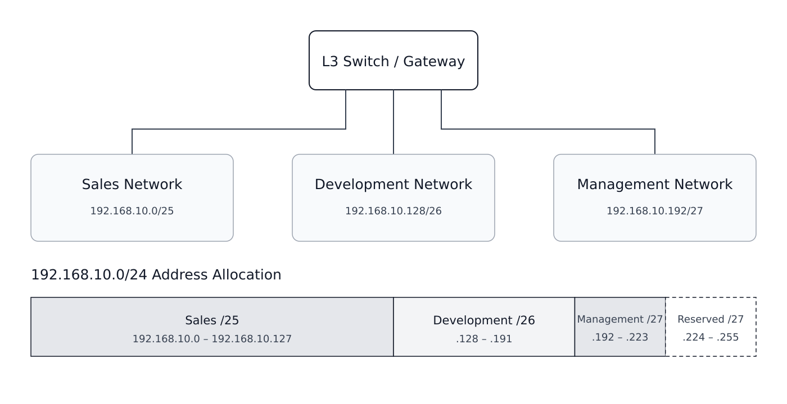
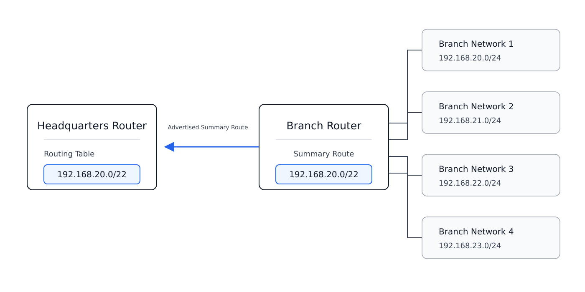

# Subnetting / VLSM / CIDR

## 개념

### Subnet Mask

Subnet Mask는 IP Address에서 Network 영역과 Host 영역을 구분하는 값이다.
```
192.168.1.10/24
```
- Subnet Mask: `255.255.255.0`
- Network Address: `192.168.1.0`
- Usable Host: `192.168.1.1~192.168.1.254`
- Broadcast Address: `192.168.1.255`

Network Address와 Broadcast Address는 장비에 할당할 수 없다.

### Subnetting

Subnetting은 하나의 큰 Network를 여러 개의 작은 Subnet으로 나누는 방식이다. 회사에서는 부서별 네트워크, 사무망, 공장망 등을 구분하고 각 네트워크의 규모에 맞게 IP Address를 할당하기 위해 사용한다.

`192.168.1.0/24`를 `/26`으로 Subnetting한다.

- 가져온 Host Bit: `2 Bit`
- 남아 있는 Host Bit: `6 Bit`
- Subnet 수: `2^2 = 4개`
- Subnet당 전체 IP Address 수: `2^6 = 64개`
- Subnet당 사용 가능한 Host 수: `2^6 - 2 = 62개`

생성되는 Subnet:
- `192.168.1.0/26`
- `192.168.1.64/26`
- `192.168.1.128/26`
- `192.168.1.192/26`

### VLSM

VLSM(Variable Length Subnet Mask)은 하나의 Network를 필요한 Host 수에 따라 서로 다른 크기의 Subnet으로 나누는 방식이다.
- VLSM은 하나의 IP Address 대역을 필요한 크기로 나누는 것 

예를 들어 Host가 100대인 부서에는 `/25`, 20대인 부서에는 `/27`, Point-to-Point Link에는 `/30`을 할당할 수 있다.
1\. Host가 100대인 부서에는 `/25`를 할당한다.
- Subnet당 전체 IP Address 수: `2^7 = 128개`
- Subnet당 사용 가능한 Host 수: `2^7 - 2 = 126개`

2\. Host가 20대인 부서에는 `/27`을 할당한다.
- Subnet당 전체 IP Address 수: `2^5 = 32개`
- Subnet당 사용 가능한 Host 수: `2^5 - 2 = 30개`

3\. Point-to-Point Link에는 `/30`을 할당한다.
- Subnet당 전체 IP Address 수: `2^2 = 4개`
- Subnet당 사용 가능한 Host 수: `2^2 - 2 = 2개`

### CIDR

CIDR(Classless Inter-Domain Routing)은 Class A, B, C와 같은 고정된 Class를 사용하지 않고, Prefix Length로 Network 범위를 지정하거나 여러 개의 연속된 Network를 하나의 Summary Route로 요약하는 방식이다.  
- CIDR은 여러 개의 연속된 IP Address 대역을 하나의 Summary Route로 묶는 것

다음 네 개의 연속된 Network를 하나의 Summary Route로 묶는다.
- `192.168.0.0/24`
- `192.168.1.0/24`
- `192.168.2.0/24`
- `192.168.3.0/24`

Summary Route: `192.168.0.0/22`

---

## 동작 원리

### VLSM 할당 과정

1\. 각 Network에 필요한 Host 수를 확인한다.

2\. Host 수가 많은 Network부터 필요한 Prefix Length를 계산한다.

3\. 가장 큰 Subnet에 IP Address 대역을 먼저 할당한다.

4\. 이후 남은 대역에 더 작은 Subnet을 순서대로 할당한다.

5\. 각 Subnet의 주소 범위가 서로 겹치지 않는지 확인한다.

### CIDR Route Summarization 과정

1\. 하나의 Summary Route로 묶을 Network들을 확인한다.

2\. 각 Network가 동일한 Prefix Length를 사용하고 주소 범위가 연속되는지 확인한다.

3\. 각 Network Address를 Binary로 변환하여 앞에서부터 공통되는 Bit를 확인한다.
```
192.168.0.0 = 11000000.10101000.000000|00.00000000
192.168.1.0 = 11000000.10101000.000000|01.00000000
192.168.2.0 = 11000000.10101000.000000|10.00000000
192.168.3.0 = 11000000.10101000.000000|11.00000000
```
4\. 공통되는 Bit 수를 Summary Route의 Prefix Length로 지정한다.

5\. 공통 Bit 이후의 값을 모두 `0`으로 설정하여 Summary Network Address를 구한다.


## 예시 및 구성도

### 시나리오 1
회사가 새로운 사옥의 내부 네트워크를 구축하면서 `192.168.10.0/24` 대역을 추가하기로 했다. 네트워크 담당자는 영업부, 개발부, 관리부에 필요한 Host 수에 맞게 IP Address를 할당해야 한다. 



`192.168.10.0/24` Network를 다음 요구 사항에 맞게 VLSM으로 나눈다.
- Sales: Host `100대`
- Development: Host `50대`
- Management: Host `20대`

1\. Host 수가 가장 많은 Sales Network에 `/25`를 할당한다.
```
Network: 192.168.10.0/25
Usable Host: 192.168.10.1~192.168.10.126
Broadcast: 192.168.10.127
```

2\. Development Network에 `/26`을 할당한다.
```
Network: 192.168.10.128/26
Usable Host: 192.168.10.129~192.168.10.190
Broadcast: 192.168.10.191
```

3\. Management Network에 `/27`을 할당한다.
```
Network: 192.168.10.192/27
Usable Host: 192.168.10.193~192.168.10.222
Broadcast: 192.168.10.223
```
Comment:

IP Address 대역을 나누면 네트워크 관리자가 주소를 부서별로 체계적으로 운영할 수 있으며, 불필요한 IP Address 낭비를 줄일 수 있다. 각 Subnet을 별도의 VLAN으로 구성하여 Broadcast와 장애의 영향 범위를 줄일 수 있고, 향후 장비 증가에 대비하여 확장용 주소를 미리 확보할 수 있다.

### 시나리오 2
회사는 여러 지점에서 사용하는 네트워크를 본사 라우터에서 관리하고 있다. 네트워크 담당자는 Routing Table을 단순화하기 위해 여러 개의 연속된 Network를 하나의 Summary Route로 묶는 작업을 하려고 한다.  



다음 Network를 CIDR을 사용하여 하나의 Network로 요약한다.
- `192.168.20.0/24`
- `192.168.21.0/24`
- `192.168.22.0/24`
- `192.168.23.0/24`

1\. 각 Network의 세 번째 Octet을 Binary로 변환한다.
```
192.168.20.0 = 00010100
192.168.21.0 = 00010101
192.168.22.0 = 00010110
192.168.23.0 = 00010111
```

2\. Binary 값을 비교하여 공통으로 일치하는 Bit를 확인한다.
```
20 = 00010100
21 = 00010101
22 = 00010110
23 = 00010111
```
- 세 번째 Octet에서 앞의 `6 Bit`가 공통으로 일치한다.

3\. 앞의 `16 Bit`와 공통 `6 Bit`를 합쳐 `/22`로 Summary한다.
```
Summary Network: 192.168.20.0/22
Network Range: 192.168.20.0~192.168.23.255
```
Comment:

여러 개의 연속된 Network를 하나의 Summary Route로 구성하면 Routing Table의 Route 수를 줄일 수 있으며, 네트워크 관리와 Routing Table Lookup을 단순화할 수 있다. 또한 하위(지점) Network의 경로가 변경되더라도 본사 Network에 전달되는 Routing Update를 줄일 수 있다.  

---

## Troubleshooting

### VLSM 적용 후 다음 날 사용자들이 통신이 안 되는 경우

1\. 작업 전에 해당 네트워크 대역을 사용하고 있는 사용자들에게 작업 일정과 예상되는 네트워크 중단 시간을 안내한다.
- DHCP 사용자는 따로 네트워크 설정을 직접 변경할 필요가 없다.
- 하지만 Static IP를 사용하는 장비의 담당자에게는 변경할 IP Address, Subnet Mask 및 Default Gateway 정보를 전달한다.

2\. 장애가 전체 사용자에게 발생하는지 특정 부서나 VLAN에서만 발생하는지 확인한다.

3\. 단말의 IP Address, Subnet Mask 및 Default Gateway가 VLSM 설계와 일치하는지 확인한다.
- DHCP 정보가 잘못되었다면 DHCP Scope를 확인하고 IP Address를 다시 할당받는다.
```
PC1> ipconfig /all
PC1> ipconfig /release
PC1> ipconfig /renew
```

4\. 백본 스위치에서 SVI의 IP Address, Subnet Mask 및 동작 상태를 확인한다.
```
DSW1# show ip interface brief
DSW1# show running-config interface vlan <VLAN ID>
```

5\. 단말이 연결된 인터페이스의 Access VLAN과 Trunk의 Allowed VLAN을 확인한다.
```
SW1# show vlan brief
SW1# show interfaces trunk
```

6\. 단말에서 Default Gateway로 Ping을 전송한다.
- Ping이 실패하면 단말 설정, Access VLAN, Trunk, ACL 및 SVI를 확인한다.
```
PC1> ping <Default Gateway>
```

7\. Default Gateway까지 통신되지만 다른 Subnet과 통신할 수 없다면 Routing Table, ACL 및 Return Path를 확인한다.
```
DSW1# show ip route <Destination IP>
DSW1# show access-lists
```

### CIDR Route Summarization 후 Upstream Router가 Summary Route를 받지 못하는 경우

1\. Branch Router(R1)와 Upstream Router(R2) 사이의 인터페이스 및 IP 통신 상태를 확인한다.
```
R1# show ip interface brief
R1# ping <Upstream Router IP>
```

2\. 두 라우터 사이에 OSPF Neighbor가 `FULL` 상태로 형성되었는지 확인한다.
```
R1# show ip ospf neighbor
```

3\. Branch Router에서 Summary Route가 올바른 OSPF Process와 Area에 설정되었는지 확인한다.
```
R1# show running-config | section router ospf
```

4\. Branch Router가 `192.168.20.0/22` Summary LSA를 생성했는지 확인한다.
```
R1# show ip ospf database summary 192.168.20.0
```

5\. OSPF Area Filter-List나 Prefix-List에서 Summary Route를 차단하고 있지 않은지 확인한다.
```
R1# show ip prefix-list
R1# show running-config | include filter-list
```

6\. Upstream Router의 OSPF Database에 Summary LSA가 수신되었는지 확인한다.
```
R2# show ip ospf database summary 192.168.20.0
```

---

## 실무 질문

Subnetting은 무엇인가?
- 하나의 큰 Network를 여러 개의 작은 Subnet으로 나누는 방식이다.

Subnetting을 사용하는 이유는 무엇인가?
- 부서나 서비스별로 Network를 구분하고 IP Address를 효율적으로 사용하기 위해서이다.

Network Address와 Broadcast Address의 차이는 무엇인가?
- Network Address는 Subnet 자체를 나타내고, Broadcast Address는 해당 Subnet의 모든 장비로 전송할 때 사용한다.

VLSM은 무엇인가?
- 필요한 Host 수에 따라 서로 다른 Prefix Length를 사용하여 Subnet을 나누는 방식이다.

CIDR은 무엇인가?
- Class 구분 없이 Prefix Length로 Network 범위를 지정하고, 여러 개의 연속된 Network를 하나의 Summary Route로 요약할 수 있는 방식이다.

Route Summarization을 사용하는 이유는 무엇인가?
- 여러 개의 연속된 Network를 하나의 Route로 묶어 Routing Table을 단순하게 관리하기 위해서이다.

Subnet Mask가 잘못 설정되면 어떤 문제가 발생하는가?
- 단말이 목적지를 같은 Network 또는 다른 Network로 잘못 판단하여 통신하지 못할 수 있다.
