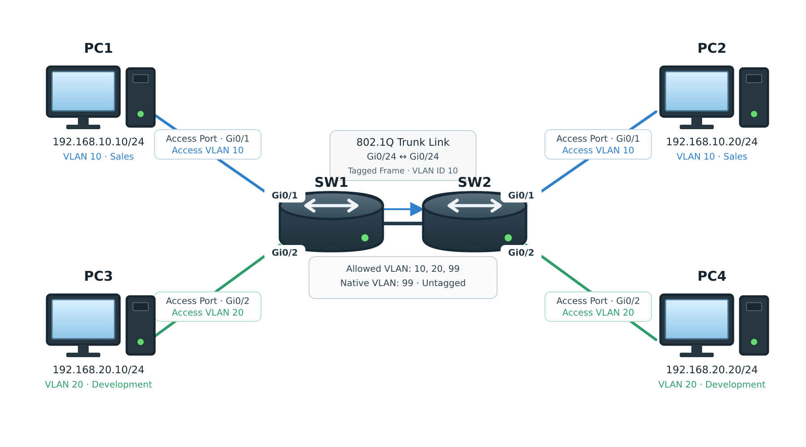

# VLAN / Access / Trunk / Native VLAN

## 개념

### VLAN

VLAN(Virtual Local Area Network)은 하나의 물리적인 LAN을 여러 개의 논리적인 LAN으로 분리하는 방식이다.

각 VLAN은 서로 다른 Broadcast Domain으로 동작하므로 Broadcast Traffic은 같은 VLAN에 속한 인터페이스로만 전달된다. 일반적으로 하나의 VLAN에는 하나의 IP Subnet을 할당하며, Layer 3 Switch에서는 해당 VLAN의 Default Gateway 역할을 하는 SVI를 구성할 수 있다.

같은 VLAN의 Traffic은 Trunk Link를 통해 다른 Switch로 전달될 수 있다. 하지만 서로 다른 VLAN에 속한 장비가 통신하려면 Layer 3 장비를 통한 Inter-VLAN Routing이 필요하다.

### Access Port

Access Port는 하나의 VLAN Traffic만 전달하며 PC, Server 및 Printer와 같은 일반 단말을 연결할 때 사용한다.

Access Port는 단말로부터 Untagged Frame을 수신하면 해당 인터페이스에 설정된 Access VLAN으로 Frame을 분류한다. 이후 Access Port를 통해 단말로 Frame을 전송할 때는 VLAN Tag가 없는 Untagged 상태로 전송한다.

### Trunk Port

Trunk Port는 하나의 Link를 통해 여러 VLAN Traffic을 전달하는 인터페이스이다. Trunk Port는 주로 Switch 간 연결이나 하나의 Link를 통해 여러 VLAN의 Traffic을 전달해야 하는 장비와의 연결에 사용한다. 

Trunk Port는 Tagged Port라고도 불린다. Access Port와 달리 IEEE 802.1Q 표준을 사용하여 Frame에 VLAN ID를 식별하기 위한 VLAN Tag를 추가한다. 단, Native VLAN의 Frame은 기본적으로 Untagged 상태로 전송된다.  

Trunk의 Allowed VLAN에 포함된 VLAN만 해당 Link를 통과할 수 있다.

### Native VLAN

Native VLAN은 Trunk Link에서 VLAN Tag 없이 Untagged Frame으로 전송되는 VLAN이다.

Cisco Switch의 기본 Native VLAN은 VLAN 1이며, 다른 VLAN으로 변경할 수 있다.

Trunk Link 양쪽 장비의 Native VLAN은 동일하게 설정해야 한다. Trunk Port로 Untagged Frame이 들어오면 Switch는 해당 Frame을 자신의 Native VLAN Traffic으로 판단하기 때문에, 양쪽 Switch의 Native VLAN이 다르면 같은 Frame을 서로 다른 VLAN Traffic으로 처리하여 통신 장애가 발생할 수 있다. 

---

## 동작 원리

### Access와 Trunk 동작 과정

1\. PC1은 VLAN Tag가 없는 Ethernet Frame을 SW1의 Access Port로 전송한다.

2\. SW1은 Frame이 들어온 인터페이스의 Access VLAN을 확인한다.
- SW1의 `Gi0/1`이 VLAN `10`으로 설정되어 있다면 Frame을 VLAN `10` Traffic으로 처리한다.

3\. SW1은 Source MAC Address를 Frame이 들어온 인터페이스와 매핑하여 VLAN `10`의 MAC Address Table에 학습한다.

4\. Destination MAC Address가 다른 Switch에 연결되어 있다면 SW1은 해당 Frame에 VLAN ID `10`이 포함된 802.1Q Tag를 붙여서 Trunk Port로 전송한다.

5\. SW2는 802.1Q Tag를 확인하고 해당 Frame이 VLAN `10`에 속한다는 것을 확인한다.

6\. SW2는 VLAN `10`의 MAC Address Table을 확인하고 Destination MAC Address가 매핑된 Access Port로 Frame을 전달한다.

7\. SW2는 Access Port로 Frame을 전송하기 전에 VLAN Tag를 제거한다.

8\. PC2는 Untagged Ethernet Frame을 수신한다.

### Native VLAN 동작 과정

1\. Trunk Port가 VLAN Tag가 없는 Frame을 수신한다.

2\. Switch는 Untagged Frame을 해당 Trunk Port에 설정된 Native VLAN Traffic으로 처리한다.

3\. Native VLAN에 속한 Frame은 Untagged 형식으로 Trunk Link로 전송된다.

4\. Trunk 양쪽의 Native VLAN이 다르면 동일한 Untagged Frame을 서로 다른 VLAN Traffic으로 처리할 수 있다.

---

## 예시 및 구성도

회사에서 영업부와 개발부의 네트워크를 논리적으로 구분하기 위해 다음과 같이 VLAN을 구성한다.

PC1
- IP Address: `192.168.10.10/24`
- VLAN: `10`
- 연결 인터페이스: SW1 `Gi0/1`

PC2
- IP Address: `192.168.10.20/24`
- VLAN: `10`
- 연결 인터페이스: SW2 `Gi0/1`

PC3
- IP Address: `192.168.20.10/24`
- VLAN: `20`
- 연결 인터페이스: SW1 `Gi0/2`

PC4
- IP Address: `192.168.20.20/24`
- VLAN: `20`
- 연결 인터페이스: SW2 `Gi0/2`

SW1 & SW2
- Trunk 인터페이스: `Gi0/24`
- Allowed VLAN: `10,20,99`
- Native VLAN: `99`



1\. PC1은 PC2의 MAC Address를 Destination MAC Address로 지정한 Ethernet Frame을 생성하고, 연결된 인터페이스를 통해 SW1의 `Gi0/1`로 전송한다.

2\. SW1은 `Gi0/1`에 설정된 Access VLAN을 확인하고 해당 Frame을 VLAN `10` Traffic으로 처리한다.

3\. SW1은 MAC Address Table을 확인하고 PC2의 MAC Address가 SW2 방향의 Trunk Port에 매핑되어 있는 것을 확인한다.

4\. SW1은 Frame에 VLAN ID `10`이 포함된 802.1Q Tag를 추가하여 SW2와 연결된 Trunk Port로 전송한다.

5\. SW2는 VLAN Tag를 확인하고 해당 Frame을 VLAN `10` Traffic으로 처리한다.

6\. SW2는 MAC Address Table을 확인하고 PC2가 연결된 VLAN `10` Access Port로 Frame을 전달한다.
- Access Port로 전송하기 전에 VLAN Tag를 제거한다.

7\. PC2는 VLAN Tag가 없는 Ethernet Frame을 수신한다.

8\. PC1과 PC3은 서로 다른 VLAN에 속하므로 Layer 2 통신만으로는 통신할 수 없다.
- 서로 다른 VLAN 간 통신에는 Inter-VLAN Routing이 필요하다.

Comment:

VLAN을 사용하면 부서별로 Broadcast Domain을 분리하여 불필요한 Broadcast Traffic과 장애의 영향 범위를 줄일 수 있다. 또한 부서별 VLAN을 기준으로 ACL이나 Firewall Policy를 적용하여 통신을 제어할 수 있다.

---

## 명령어

### VLAN 구성

```
SW1(config)# vlan 10
SW1(config-vlan)# name SALES
SW1(config)# vlan 20
SW1(config-vlan)# name DEVELOPMENT
SW1(config)# vlan 99
SW1(config-vlan)# name NATIVE
```
VLAN `10`, `20`, `99`를 생성하고 VLAN 이름을 설정한다.

### Access Port 구성

```
SW1(config)# interface gi0/1
SW1(config-if)# switchport mode access
SW1(config-if)# switchport access vlan 10
```
`Gi0/1`을 Access Port로 설정하고 VLAN `10`에 할당한다.

### Trunk Port 구성

```
SW1(config)# interface gigabitethernet 0/24
SW1(config-if)# switchport trunk encapsulation dot1q
SW1(config-if)# switchport mode trunk
SW1(config-if)# switchport trunk allowed vlan 10,20,99
SW1(config-if)# switchport trunk native vlan 99
```
`Gi0/24`를 Trunk Port로 설정하고 VLAN `10`, `20`, `99`만 통과하도록 허용한다. Native VLAN은 VLAN `99`로 설정한다.

### VLAN 확인

```
SW1# show vlan brief
```
Switch에 생성된 VLAN과 할당 상태를 보여준다.

```
SW1# show interfaces trunk
```
Trunk Port의 동작 상태, Native VLAN 및 Allowed VLAN을 보여준다.


---

## Troubleshooting

### VLAN 구성 후 사용자 통신이 안 되는 경우

1\. 백본 스위치에서 통신이 안 되는 단말로 Ping을 전송한 후 ARP Table을 확인한다.
```
DSW1# show ip arp | include <IP Address>
```

2\. ARP Table에서 해당 IP Address의 MAC Address가 확인되지 않으면 단말이 연결된 Switch 인터페이스의 동작 상태를 확인한다.
```
SW1# show interfaces status
```

3\. 단말이 연결된 인터페이스가 올바른 Access VLAN에 할당되어 있는지 확인한다.
```
SW1# show vlan brief
SW1# show interfaces <Interface ID> switchport
```

4\. 해당 VLAN이 연결 경로에 있는 모든 Switch의 VLAN Database에 생성되어 있는지 확인한다.
```
SW1# show vlan
SW2# show vlan
```

5\. Switch 간 인터페이스가 Trunk 상태이고 해당 VLAN이 Allowed VLAN에 포함되어 있는지 확인한다.
```
SW1# show interfaces trunk
SW2# show interfaces trunk
```

6\. Trunk Link 양쪽의 Native VLAN이 동일하게 설정되어 있는지 확인한다.
- Native VLAN이 다르면 Untagged Frame을 서로 다른 VLAN Traffic으로 처리할 수 있다.
- Native VLAN이 다르면 양쪽 Switch의 Native VLAN을 동일하게 변경한다.

7\. 같은 VLAN 간 통신은 가능하지만 서로 다른 VLAN 간 통신만 실패한다면 SVI, Inter-VLAN Routing, ACL 및 Default Gateway를 확인한다.
- 단말의 Default Gateway가 해당 VLAN의 SVI IP Address로 설정되어 있는지 확인한다.

---

## 주요 질문

VLAN은 무엇인가?
- VLAN은 하나의 물리적인 Switch를 논리적으로 여러 대의 Switch처럼 나누어, 하나의 물리적인 LAN을 여러 개의 논리적인 LAN으로 분리하는 방식이다.

VLAN을 사용하는 이유는 무엇인가?
- 부서나 서비스별로 Broadcast Domain을 분리하고 Network를 체계적으로 관리하기 위해 사용한다.

Access Port는 무엇인가?
- PC, Server 및 Printer와 같은 단말을 연결하는 인터페이스이다.

Trunk Port는 무엇인가?
- 하나의 Link를 통해 여러 VLAN Traffic을 전달하는 인터페이스이다.

802.1Q Tag는 어떤 역할을 하는가?
- Trunk Link를 통과하는 Ethernet Frame이 어느 VLAN에 속하는지 구분한다.

Native VLAN은 무엇인가?
- 802.1Q Trunk Link에서 VLAN Tag가 없는 Untagged Frame을 처리하는 VLAN이다.

Native VLAN이 Trunk Link 양쪽에서 다르면 어떤 문제가 발생하는가?
- Untagged Frame이 서로 다른 VLAN Traffic으로 처리되어 통신 장애가 발생할 수 있다.

서로 다른 VLAN에 속한 장비가 통신하려면 무엇이 필요한가?
- Router나 Layer 3 Switch를 통한 Inter-VLAN Routing이 필요하다.
