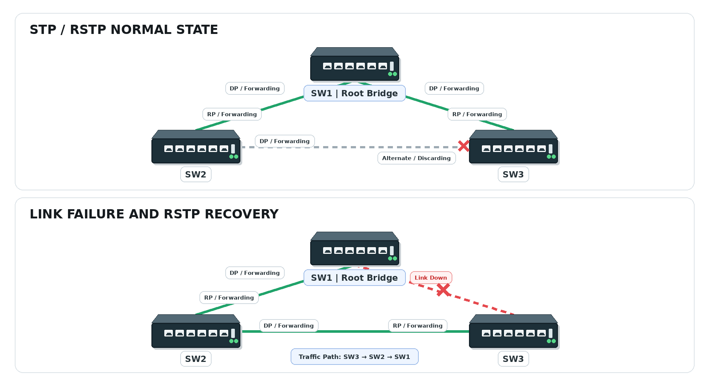
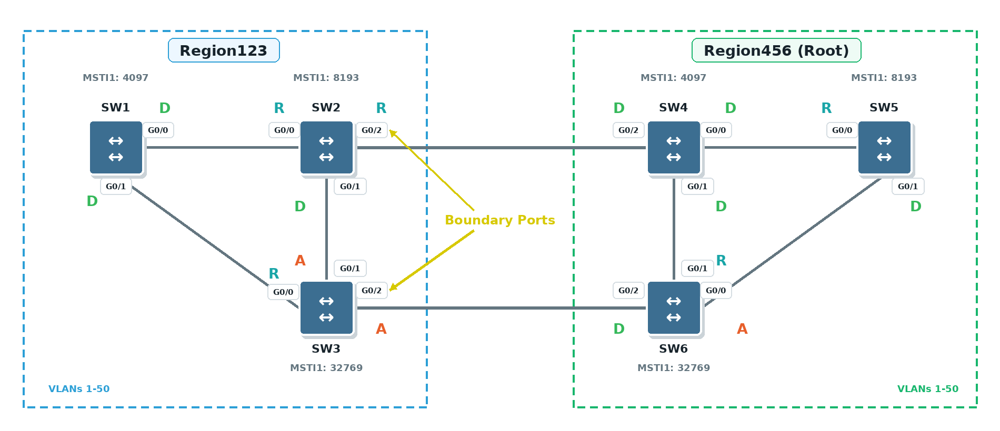

# STP / RSTP / MSTP

## 개념

### STP

STP(Spanning Tree Protocol)는 Switch 간에 이중화 Link가 구성된 Layer 2 Network에서 Loop가 발생하지 않도록 방지하는 프로토콜이다.

Layer 2 Header에는 Packet과 같은 TTL이 없기 때문에 Loop가 발생하면 Frame이 계속 돌면서 Broadcast Storm이 일어나 운행 중인 장비가 과부하로 꺼질 수 있다.

STP는 Switch들이 BPDU(Bridge Protocol Data Unit)를 교환하여 Root Bridge를 선출하고, 목적지까지의 경로 중 하나만 Forwarding 상태로 사용한다. 나머지 이중화 경로는 Blocking 상태로 전환하여 Loop를 방지한다.

만약 현재 사용 중인 Link에 장애가 발생하면 Blocking 상태였던 Link는 Forwarding 상태로 전환된다.

### Root Bridge

Root Bridge는 STP Topology의 기준이 되는 Switch이다.

Root Bridge는 가장 낮은 Bridge ID를 가진 Switch로 선출된다. Bridge ID는 Bridge Priority와 MAC Address를 기준으로 결정한다.
- Bridge Priority가 가장 낮은 Switch가 Root Bridge로 선출된다.
- Priority가 같으면 MAC Address가 가장 낮은 Switch가 Root Bridge로 선출된다.
- Priority는 일반적으로 `4096` 단위로 설정한다.

### STP Port State

STP Port는 다음 과정을 거쳐 Forwarding 상태로 전환된다.

1\. Blocking: BPDU만 수신하며 Frame 전달과 MAC Address 학습은 하지 않는다.

2\. Listening: BPDU를 송수신하지만 Frame 전달과 MAC Address 학습은 하지 않는다.

3\. Learning: BPDU를 송수신하고 MAC Address를 학습하지만 Frame은 전달하지 않는다.

4\. Forwarding: BPDU를 송수신하고 MAC Address를 학습하며 Frame을 전달한다.
- Disabled: BPDU와 Frame을 처리하지 않으며 MAC Address도 학습하지 않는다.

### STP Port 역할

Root Port는 Non-Root Switch에서 Root Bridge까지 가장 낮은 Path Cost를 가진 인터페이스이다. Switch마다 하나의 Root Port를 선택한다.

Designated Port는 각 Network Segment에서 Root Bridge 방향으로 가장 좋은 경로를 제공하는 인터페이스이다. Root Bridge의 모든 동작 중인 Port는 Designated Port가 된다.

Blocking Port는 Loop를 방지하기 위해 일반 Frame을 전달하지 않는 인터페이스이다. 하지만 다른 스위치들이 보내는 BPDU는 계속 수신하여 STP Topology의 변경을 확인한다.

### STP Convergence

Traditional STP는 Port가 Blocking 상태에서 Forwarding 상태로 전환되는 데 30초 이상이 걸릴 수 있다.
- 기존 BPDU 정보가 만료될 때까지 기다려야 하는 경우 Max Age Timer로 최대 20초가 소요될 수 있다. 
- 이후 Listening 상태에서 15초, Learning 상태에서 15초 동안 머무른 후 Forwarding 상태로 전환된다.
- 따라서 상황에 따라 최대 약 50초가 소요될 수 있으며, 해당 Timer 값은 변경할 수 있다.

### RSTP

RSTP(Rapid Spanning Tree Protocol)는 Traditional STP보다 빠르게 Network Topology를 수렴하도록 개선된 프로토콜이다.

RSTP도 BPDU를 교환하여 Root Bridge를 선출하고, 이중화 경로 중 하나를 Discarding 상태로 전환하여 Layer 2 Loop를 방지한다.

Traditional STP는 Forward Delay Timer(Listening과 Learning)를 기다린 후 Port를 Forwarding 상태로 전환하지만, RSTP는 스위치들끼리 Proposal과 Agreement BPDU를 교환하여 Loop가 없음을 확인하면 Port를 빠르게 Forwarding 상태로 전환한다.

### RSTP Port State

RSTP Port는 Discarding, Learning 및 Forwarding 사용한다.
- RSTP는 Traditional STP의 Blocking, Listening 및 Disabled 상태를 Discarding 상태로 통합했다.

1\. Discarding: BPDU를 송수신하지만 Frame 전달과 MAC Address 학습은 하지 않는다.

2\. Learning: BPDU를 송수신하고 MAC Address를 학습하지만 Frame은 전달하지 않는다.

3\. Forwarding: BPDU를 송수신하고 MAC Address를 학습하며 Frame을 전달한다.

### RSTP의 Port 역할

Root Port는 Root Bridge까지 가장 좋은 경로를 가진 Port이다.

Designated Port는 각 Network Segment에서 Root Bridge까지 가장 좋은 경로를 제공하는 Port이다.

Alternate Port는 Root Port를 대신할 수 있는 예비 Discarding Port이다.

Backup Port는 Designated Port를 대신할 수 있는 예비 Discarding Port이다.
- Backup Port는 주로 Hub와 같이 하나의 Network Segment에 여러 Port가 연결된 환경에서 발생한다. 현재는 Hub를 거의 사용하지 않기 때문에 실제 Network에서 볼 일은 많지 않다.

### RSTP Convergence

1\. 스위치는 자신의 Designated Port를 통해 Proposal Bit가 포함된 BPDU를 이웃 Switch로 전송한다.

2\. BPDU를 수신한 Switch는 Root Bridge ID, Root Path Cost, Sender Bridge ID 및 Port ID를 비교한다.

3\. 더 우수한 BPDU를 수신하면 BPDU에 포함된 Root 정보를 받아들이고, 해당 BPDU를 수신한 Port를 Root Port로 선택한다.

4\. Switch는 임시 Loop를 방지하기 위해 Root Port를 제외한 Non-Edge Designated Port를 Discarding 상태로 전환한다.
- 이 과정을 Sync라고 한다.
- Edge Port는 Sync 대상에서 제외된다.

5\. Sync가 완료되면 Agreement Bit가 포함된 BPDU를 상위 Switch로 전송한다.

6\. Agreement BPDU를 수신한 Switch는 해당 Designated Port를 빠르게 Forwarding 상태로 전환한다.

7\. 같은 과정이 하위 Switch에서도 반복되면서 전체 RSTP Topology가 빠르게 수렴한다.

RSTP는 Traditional STP처럼 Listening과 Learning 상태에서 각각 15초의 Timer를 기다리지 않는다.
- 하지만 상대 Switch가 RSTP를 지원하지 않으면 해당 Port는 Traditional STP 방식으로 동작한다.

RSTP의 Link Type
- Point-to-Point: Switch 간에 Full-Duplex로 연결된 Link이다.
- Shared: Hub와 같이 여러 장비가 하나의 Segment에 Half-Duplex로 동작하는 Link이다.
- Edge: PC나 Server와 같은 단말이 연결된 Port이다.

RSTP Sync는 Point-to-Point Link에서만 동작한다.

### PVST+ / Rapid PVST+

PVST+(Per-VLAN Spanning Tree Plus)는 VLAN마다 별도의 STP Instance를 동작시키는 Cisco 방식이다. VLAN별로 서로 다른 Root Bridge와 경로를 설정할 수 있다.
- STP: 모든 VLAN이 하나의 STP Instance를 사용한다.
- RSTP: 모든 VLAN이 하나의 RSTP Instance를 사용한다.
- PVST+: VLAN마다 STP가 동작한다.
- Rapid PVST+: VLAN마다 RSTP가 동작한다.

현재 대부분의 Cisco 스위치는 Rapid PVST+를 사용하며, VLAN마다 각각의 STP Instance가 동작한다.

### MSTP

MSTP(Multiple Spanning Tree Protocol)는 여러 VLAN을 하나의 STP Instance로 묶어 관리하는 프로토콜이다.

PVST+와 Rapid PVST+는 VLAN마다 별도의 STP Instance가 동작하므로 VLAN이 많아질수록 CPU, Memory 및 BPDU 처리량이 증가한다. 

MSTP는 여러 VLAN을 동일한 MST Instance에 매핑하여 STP Instance의 수를 줄일 수 있다. 또한 Instance별로 서로 다른 Root Bridge를 지정하여 Traffic을 여러 Link로 분산할 수 있다.
- MSTI 0: IST(Internal Spanning Tree)라고 하며 모든 MST Region에 기본으로 존재한다.
- MST Instance를 생성하고 지정한 VLAN을 해당 Instance에 매핑할 수 있다.
- 다른 Instance에 매핑되지 않은 VLAN은 기본적으로 MSTI 0에 포함된다.

같은 MST Region에 속하는 Switch들은 다음 설정이 동일해야 한다.
- MST Region Name
- Revision Number
- VLAN과 MST Instance의 매핑 정보

MST Switch는 BPDU를 교환할 때 CIST 정보와 각 MSTI의 정보를 하나의 MST BPDU에 포함하여 전달한다.  
- IST: MST Region 내부에서 동작하는 MSTI 0이다. 
- CST: 서로 다른 MST Region과 Non-MSTP Switch를 연결하는 Spanning Tree이다.
- CIST: 각 MST Region 내부의 IST와 MST Region 사이의 CST 전체를 포함하는 Spanning Tree이다.

다른 MST Region이나 Non-MSTP Switch에서는 하나의 MST Region을 하나의 논리적인 Switch처럼 인식한다.
- Boundary Port: 다른 MST Region이나 Non-MSTP Switch와 연결되는 Port이다.

### MSTP Root Bridge 종류

MSTP에서는 전체 Network에 하나의 CIST Root가 선출되고, 각 MST Region에 하나의 CIST Regional Root가 선출되며, 각 MST Region의 MSTI마다 하나의 MSTI Regional Root가 선출된다.
- CIST Root: 전체 CIST의 Root Bridge이며, MSTI 0의 Bridge Priority와 MAC Address를 기준으로 선출된다.
- CIST Regional Root: 각 MST Region에서 CIST Root까지 가장 우수한 외부 경로를 가진 Switch, CIST Root가 해당 MST Region 내부에 있으면 CIST Root가 그 Region의 CIST Regional Root도 됨
- MSTI Regional Root: 각 MST Region의 MSTI별로 가장 낮은 Bridge ID를 가진 Switch


## 동작 원리

### STP 동작 과정 
 
1\. Switch들은 BPDU를 서로 교환한다. 
 
2\. BPDU에 포함된 Bridge ID를 비교하여 가장 낮은 Bridge ID를 가진 Switch를 Root Bridge로 선출한다. 
 
3\. Root Bridge가 아닌 각 Switch는 Root Bridge까지 가장 좋은 경로를 가진 인터페이스를 Root Port로 선택한다. 
 
4\. 각 Network Segment에서는 Root Bridge까지 가장 좋은 경로를 제공하는 인터페이스를 Designated Port로 선택한다. 
  
5\. Loop가 발생할 수 있는 인터페이스는 Blocking 상태로 전환된다. 
 
6\. 현재 사용 중인 Link에 장애가 발생하면 STP는 Topology를 다시 계산한다. 
  
7\. Topology 변경을 감지한 Switch는 Root Port를 통해 TCN(Topology Change Notification) BPDU를 Root Bridge 방향으로 전달한다. 
 
8\. TCN BPDU를 수신한 Root Bridge는 TC Bit가 설정된 Configuration BPDU를 전체 STP Topology에 전파한다. 
 
9\. TC Bit를 수신한 Switch들은 MAC Address Table의 Aging Time을 기본 `300초`에서 Forward Delay 값인 `15초`로 줄여 오래된 정보를 빠르게 삭제하고, 새로운 경로를 통해 MAC Address를 다시 학습한다.

10\. 새로운 경로가 선택되면 기존 Blocking Port가 Listening과 Learning 상태를 거쳐 Forwarding 상태로 전환된다. 

### RSTP 동작 과정

1\. RSTP Switch들은 서로 이웃 Switch들에게 Proposal Bit가 포함된 BPDU를 전송한다.

2\. Proposal Bit가 포함된 BPDU를 수신한 Switch는 자신의 BPDU와 비교하여 더 우수한 BPDU인지 확인한다.

3\. 더 우수한 BPDU라면 해당 Port를 Root Port로 선택하고 Sync를 시작한다. 이때 임시 Loop를 방지하기 위해 자신의 Non-Edge Designated Port를 Discarding 상태로 전환한다.
- Edge Port는 Sync 대상에서 제외된다.

4\. Sync가 완료되면 Switch는 Agreement Bit가 포함된 BPDU를 상위 Switch로 전송한다.

5\. Agreement Bit가 포함된 BPDU를 수신한 상위 Switch는 해당 Designated Port를 Forwarding 상태로 전환한다.

6\. 이 과정이 하위 Switch에서도 반복되면서 전체 RSTP Topology가 빠르게 수렴한다.

7\. 만약 Root Port에 장애가 발생하면 Alternate Port가 새로운 Root Port로 선택되어 빠르게 Forwarding 상태로 전환된다.
- RSTP는 Traditional STP처럼 Listening과 Learning 상태에서 각각 15초의 Timer를 기다리지 않는다.
- Proposal과 Agreement를 이용한 빠른 전환은 Point-to-Point Link에서만 동작하며, 상대 Switch가 RSTP를 지원하지 않으면 해당 Port는 Traditional STP 방식으로 동작한다.

### MSTP 동작 과정

1\. 관리자는 여러 VLAN을 하나의 MST Instance에 매핑한다.

2\. 같은 MST Region에 속하는 Switch들은 다음 설정을 동일하게 구성한다.
- MST Region Name
- Revision Number
- VLAN과 MST Instance의 매핑 정보

3\. 설정 중 하나라도 다르면 서로 다른 MST Region으로 인식한다.
- Switch는 VLAN과 MST Instance의 매핑 정보를 기반으로 Configuration Digest를 생성하고, Region Name과 Revision Number를 함께 비교하여 같은 MST Region인지 확인한다.

4\. MST Instance에 매핑되지 않은 VLAN은 MSTI `0`에 포함된다.
- MSTI `0`은 MST Region 내부에서 IST로 동작한다.

5\. 전체 CIST에서 CIST Root Bridge를 선출한다.

6\. 각 MST Region에서는 CIST Root Bridge까지 가장 좋은 경로를 가진 Switch가 CIST Regional Root Bridge가 된다.
- CIST Regional Root는 해당 MST Region 내부에서 MSTI 0, 즉 IST의 Root Bridge로 동작한다.
- CIST Root Bridge가 MST Region 내부에 있으면 해당 Region의 CIST Regional Root Bridge도 된다.

7\. 각 MSTI에서는 MSTI Regional Root Bridge를 별도로 선출한다.
- MSTI마다 서로 다른 Regional Root Bridge를 사용할 수 있다.

8\. MST Switch는 CIST 정보와 각 MSTI의 정보를 하나의 MST BPDU에 포함하여 전달한다.

9\. 다른 MST Region이나 Non-MSTP Switch와 연결되는 Port는 Boundary Port로 동작한다.

10\. 외부 Network에서는 하나의 MST Region을 하나의 논리적인 Switch처럼 인식한다.
- MST Region 내부의 MSTI별 Topology는 외부에 직접 노출되지 않는다.

## 예시 및 구성도



1\. SW1, SW2 및 SW3는 Proposal Bit가 포함된 BPDU를 서로 교환한다.

2\. 각 Switch는 수신한 BPDU를 자신의 BPDU와 비교하고, 더 우수한 BPDU를 수신하면 해당 정보를 받아들인 후 Agreement Bit가 포함된 BPDU를 전송한다. 이 과정에서 가장 낮은 Bridge ID를 가진 SW1이 Root Bridge로 결정된다.

3\. Root Bridge인 SW1의 모든 동작 중인 Port는 Designated Port가 된다.

4\. SW2는 SW1과 직접 연결된 Port를 Root Port로 선택한다.

5\. SW3도 SW1과 직접 연결된 Port를 Root Port로 선택한다.

6\. SW2와 SW3 사이의 Link에서는 Root Bridge까지의 Path Cost를 비교하여 Designated Port를 결정한다.

7\. Path Cost가 같으면 Bridge ID를 비교한다.
- SW2의 Bridge ID가 더 낮다고 가정하면 SW2의 Port가 Designated Port가 된다.
- SW3의 Port는 Alternate Port가 되어 Discarding 상태로 동작한다.

8\. SW2의 Port가 SW3의 Port로 BPDU 및 Frame을 계속 전송하지만, SW3의 Port는 이를 수신만 하고 Frame을 전달하지 않으므로 Layer 2 Loop가 발생하지 않는다.

### Link 장애 발생

1\. SW1과 SW3 사이의 Link에 장애가 발생하면 SW3의 기존 Root Port가 Down 상태가 된다.

2\. SW3는 SW2 방향의 Alternate Port를 새로운 Root Port로 선택한다.

3\. RSTP는 해당 Port를 빠르게 Forwarding 상태로 전환한다.

4\. SW3의 Traffic은 SW2를 거쳐 Root Bridge인 SW1으로 전달된다.

5\. 각 Switch는 Topology Change 정보를 전달하고 새로운 경로에 맞게 MAC Address Table을 갱신한다.

### MSTP



1\. SW1, SW2 및 SW3는 Region123을 구성하고, SW4, SW5 및 SW6는 Region456을 구성한다.

2\. 각 Switch는 CIST 정보와 MSTI 정보를 하나의 MST BPDU에 포함하여 전달한다.

3\. SW4가 전체 CIST의 Root Bridge로 동작하며, Region456의 CIST Regional Root Bridge 역할도 한다.

4\. Region123에서는 CIST Root Bridge까지 가장 좋은 Path Cost를 가진 SW2가 CIST Regional Root Bridge로 동작한다.

5\. 서로 다른 MST Region을 연결하는 다음 Port는 Boundary Port로 동작한다.
- SW2 `G0/2` ↔ SW4 `G0/2`
- SW3 `G0/2` ↔ SW6 `G0/2`

6\. SW2와 SW4 사이의 Link가 CIST의 경로가 된다.
- SW2의 Port: Root Port
- SW4의 Port: Designated Port

7\. SW3와 SW6 사이의 Link는 예비 경로가 된다.
- SW3의 Port: Alternate Port
- SW6의 Port: Designated Port

8\. Region123의 MSTI `1`에서는 SW1이 Regional Root Bridge로 동작하고, Region456의 MSTI `1`에서는 SW4가 Regional Root Bridge로 동작한다.

9\. VLAN Traffic은 Region 내부에서는 매핑된 MSTI의 경로를 사용하고, 다른 Region으로 전달될 때는 CIST가 선택한 경로를 사용한다.

10\. SW2와 SW4 사이의 Boundary Link에 장애가 발생하면 SW2의 기존 Root Port가 Down 상태가 된다.

11\. SW3의 Alternate Port가 새로운 Root Port로 선택되어 빠르게 Forwarding 상태로 전환된다.

12\. SW3는 Region123의 새로운 CIST Regional Root Bridge로 동작한다.

13\. Region 사이의 Traffic은 SW3와 SW6 사이의 Boundary Link를 통해 전달된다.

14\. 각 Switch는 Topology Change 정보를 전달하고 새로운 경로에 맞게 MAC Address Table을 갱신한다.

## 명령어

### STP Mode 활성화
```
SW1(config)# spanning-tree mode rapid-pvst
```

RSTP를 동작시키는 Rapid PVST+를 설정한다.

### Root Bridge 설정

```
SW1(config)# spanning-tree vlan 10 priority 4096 
SW1(config)# spanning-tree vlan 20 priority 4096
SW1(config)# spanning-tree vlan 10 root primary
SW1(config)# spanning-tree vlan 20 root primary
```

SW1의 VLAN `10`과 VLAN `20`을 Root Bridge로 선출되도록 Bridge Priority에 낮은 값을 주거나 자동 조정한다. 

```
SW2(config)# spanning-tree vlan 10 priority 8192
SW2(config)# spanning-tree vlan 20 priority 8192
SW2(config)# spanning-tree vlan 10 root secondary
SW2(config)# spanning-tree vlan 20 root secondary
```
SW2가 VLAN `10`과 VLAN `20`이 Secondary Root Bridge가 되도록 Bridge Priority 값에 SW1보다 더 높은 값을 주거나 자동으로 조정한다.


### Port Cost 설정

```
SW1(config)# interface gi0/24
SW1(config-if)# spanning-tree vlan 10 cost 10
```
VLAN `10`에서 해당 인터페이스의 Port Cost를 `10`으로 설정한다.


### STP 상태 확인

```
SW1# show spanning-tree
```
전체 STP Instance의 Root Bridge, Port 역할 및 Port 상태를 확인한다.

```
SW1# show spanning-tree vlan 10
```

VLAN `10`의 Root Bridge 정보와 Port 역할 및 상태를 확인한다.

```
SW1# show spanning-tree root
```

각 STP Instance의 Root Bridge와 Root Port를 확인한다.


```
SW1# show spanning-tree summary
```

현재 STP Mode와 전체 STP Instance의 상태를 확인한다.

### MSTP 설정

```
SW1(config)# spanning-tree mode mst
SW1(config)# spanning-tree mst configuration
SW1(config-mst)# name COMPANY
SW1(config-mst)# revision 1
SW1(config-mst)# instance 1 vlan 10,30
SW1(config-mst)# instance 2 vlan 20,40
SW1(config-mst)# exit
```
- MST Region Name: `COMPANY`
- Revision Number: `1`
- MST Instance `1`: VLAN `10`, `30`
- MST Instance `2`: VLAN `20`, `40`


### MSTI Regional Root Bridge 설정

```
SW1(config)# spanning-tree mst 1 priority 4096
SW2(config)# spanning-tree mst 2 priority 4096
SW1(config)# spanning-tree mst 1 root primary
SW2(config)# spanning-tree mst 2 root primary
```

SW1이 MST Instance 1의 Regional Root Bridge로, SW2가 MST Instance 2의 Regional Root Bridge로 선출되도록 Bridge Priority에 낮은 값을 주거나 자동으로 조정한다.  

```
SW2(config)# spanning-tree mst 1 priority 8192
SW1(config)# spanning-tree mst 2 priority 8192
SW2(config)# spanning-tree mst 1 root secondary
SW1(config)# spanning-tree mst 2 root secondary
```
SW2가 MST Instance 1의 Secondary Root Bridge로, SW1이 MST Instance 2의 Secondary Root Bridge가 되도록 Bridge Priority에 Primary Root보다 더 높은 값을 주거나 자동으로 조정한다.  
### MST Bridge Priority 직접 설정

### MSTP 상태 확인

```
SW1# show spanning-tree mst configuration
```

MST Region Name, Revision Number, Configuration Digest 및 VLAN과 MST Instance의 매핑 정보를 확인한다.

```
SW1# show spanning-tree mst
```
전체 MST Instance의 Regional Root Bridge와 Port 역할 및 상태를 확인한다.

```
SW1# show spanning-tree mst 0
```
MST Instance `0`의 CIST와 IST 정보를 확인한다.

```
SW1# show spanning-tree mst 1
```
MST Instance `1`의 Regional Root Bridge, Root Port 및 Port 상태를 확인한다.

---

## Troubleshooting

### Primary Link 장애 후 Backup Link로 전환되지 않는 경우

1\. Primary Link와 Backup Link의 물리적인 상태를 확인한다.
```
SW1# show interfaces status
SW1# show interfaces gi0/23 ← Active Port
SW1# show interfaces gi0/24 ← Block Port
SW1# show interfaces counters errors
SW1# clear counters gi0/24
SW1# show interfaces counters errors
```
- Primary Link가 실제로 `Down` 상태인지 확인한다.
- Backup Link가 물리적으로 `Up` 상태인지 확인한다.
- Backup Link의 `Input Errors`와 `CRC Error`를 확인한다.
- 기존 Counter를 기록한 후 Backup Link의 Counter만 초기화한다.
- 잠시 후 Error Counter를 다시 확인하여 `Input Errors`와 `CRC Error`가 계속 증가하는지 확인한다.

2\. Root Bridge가 의도한 Switch인지 확인한다.
```
SW1# show spanning-tree root
SW1# show spanning-tree vlan <VLAN-ID>
```

3\. Primary Link와 Backup Link의 Port 역할 및 상태를 확인한다.
```
SW1# show spanning-tree
SW1# show spanning-tree interface gi0/23 detail
SW1# show spanning-tree interface gi0/24 detail
```

4\. STP 보호 기능으로 인해 Port가 차단되었는지 확인한다.
- Root Guard
- Loop Guard
- BPDU Guard

```
SW1# show spanning-tree inconsistentports
SW1# show interfaces status err-disabled
SW1# show running-config interface gi0/24
SW1# show logging
```

5\. RSTP를 사용하는 경우 Link Type을 확인한다.

```
SW1# show spanning-tree interface gi0/24 detail
SW1# show interfaces gi0/24
```
- Proposal과 Agreement를 이용한 빠른 전환은 Point-to-Point Link에서 동작한다.
- Switch 간 Link가 Half-Duplex 또는 Shared Link로 인식되면 Backup Link의 상태 전환이 지연될 수 있다.


6\. MSTP를 사용하는 경우 MST Region과 MSTI 설정을 확인한다.
```
SW1# show spanning-tree mst configuration
SW1# show spanning-tree mst
```

## 실무 질문

STP를 사용하는 이유는 무엇인가?
- Switch 간 이중화 Link에서 Layer 2 Loop가 발생하는 것을 방지하기 위해 사용한다.

Root Bridge는 어떻게 선출되는가?
- 가장 낮은 Bridge ID를 가진 Switch가 선출된다. Priority가 같으면 가장 낮은 MAC Address를 가진 Switch가 선출된다.

Root Port는 어떻게 선택하는가?
- Non-Root Switch에서 Root Bridge까지 가장 낮은 Root Path Cost를 가진 Port를 선택한다.

Designated Port는 어떻게 선택하는가?
- 각 Network Segment에서 Root Bridge까지 가장 좋은 경로를 제공하는 Port를 선택한다.

STP와 RSTP의 가장 큰 차이는 무엇인가?
- RSTP는 Proposal과 Agreement 방식을 사용하여 STP보다 빠르게 Topology를 수렴한다.

RSTP에서 Root Port에 장애가 발생하면 어떻게 동작하는가?
- 기존 Alternate Port를 새로운 Root Port로 선택하고 빠르게 Forwarding 상태로 전환한다.

Traditional STP에서 Topology가 변경되면 MAC Address Table은 어떻게 갱신되는가?
- Topology 변경을 감지한 Switch가 TCN BPDU를 Root Bridge 방향으로 전달한다. Root Bridge는 TC Bit가 설정된 Configuration BPDU를 전체 Topology에 전파한다. 이를 수신한 Switch들은 MAC Address Aging Time을 Forward Delay 값인 기본 `15초`로 줄여 오래된 MAC Address 정보를 빠르게 삭제하고, 새로운 경로에서 MAC Address를 다시 학습한다.

MSTP를 사용하는 이유는 무엇인가?
- 여러 VLAN을 하나의 MST Instance로 묶어 STP Instance의 수를 줄이고, Instance별로 서로 다른 경로를 사용하여 Traffic을 분산하기 위해 사용한다.

같은 MST Region에 속하려면 어떤 설정이 같아야 하는가?
- MST Region Name, Revision Number 및 VLAN과 MST Instance의 매핑 정보가 같아야 한다.

MSTP에서 CIST Root Bridge와 MSTI Regional Root Bridge의 차이는 무엇인가? 
- CIST Root Bridge는 전체 CIST의 기준이 되는 Switch이고, MSTI Regional Root Bridge는 하나의 MST Region 내부에서 특정 MST Instance의 Root Bridge 역할을 하는 Switch이다.
 
Boundary Port는 무엇인가? 
- 다른 MST Region이나 Non-MSTP Switch와 연결되는 Port이다. 


