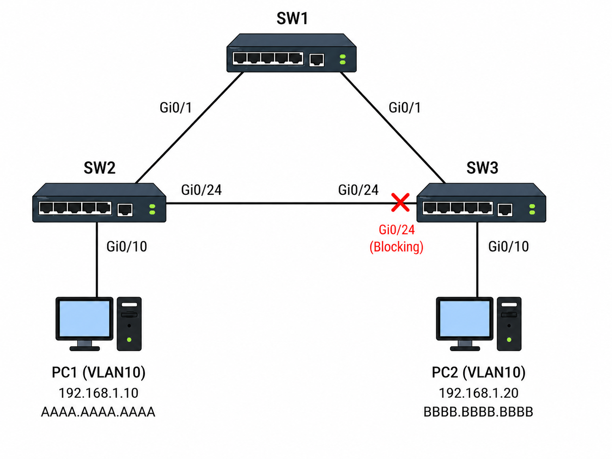
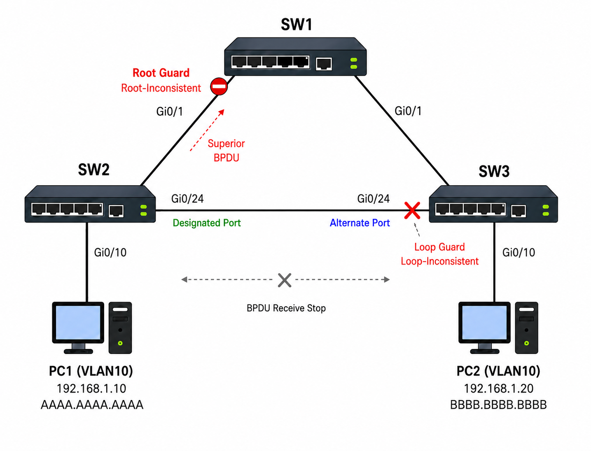

# STP Toolkit

## 개념

STP Toolkit은 Layer 2 Loop를 방지하며, 링크 장애 발생 시 Network가 빠르게 수렴할 수 있게 해주는 기능이다.

### PortFast

PortFast는 해당 Port를 Listening과 Learning 상태를 거치지 않고 즉시 Forwarding 상태로 전환해주는 기능이다.

PortFast는 PC, Server, Printer, AP와 같은 단말이 연결된 Edge Port에 사용한다. PortFast를 설정해도 STP가 비활성화되는 것은 아니며, BPDU는 계속 수신한다.

만약 Switch가 연결된 Port에 PortFast를 잘못 설정하면 Layer 2 Loop가 발생할 수 있으므로, 해당 Port가 어디에 연결되어 있는지 주의해야 한다.  

### BPDU Guard

BPDU Guard는 연결된 Port에서 BPDU가 수신되면 해당 Port를 `Err-Disabled` 상태로 전환하여 해당 Port를 차단하여 혹시 모를 Layer 2 Loop를 방지하는 기술이다. 

일반적으로 PortFast가 설정된 단말 Port에 함께 사용한다. 사용자가 임의로 Switch를 연결하여 STP Topology를 변경하거나 Layer 2 Loop를 발생시키는 것을 방지한다.

### BPDU Filter

BPDU Filter는 Port에서 BPDU를 송수신하지 않도록 하는 기능이다.

BPDU를 전달할 필요가 없거나 BPDU가 외부 장비로 전달되는 것을 막아야 하는 특정 환경에서 사용한다. BPDU Filter 기능은 일반적인 상황에서는 잘 사용하지 않는 기술이다.

인터페이스에 직접 BPDU Filter를 설정하면 해당 Port는 BPDU를 송수신하지 않기 때문에 STP가 정상적으로 Loop를 감지할 수 없어 Loop가 발생할 수 있다.

### Root Guard

Root Guard는 Port에서 Superior BPDU가 수신되면 해당 Port가 Root Port로 변경되지 않도록 제한하는 기능이다.  

Root Guard가 설정된 Port에서 Superior BPDU가 수신되면 해당 Port는 `Root-Inconsistent` 상태로 전환되면서 해당 인터페이스로 들어오는 트래픽을 차단한다. 

Root Guard는 새로 추가되는 Access Switch나 외부 Network의 Switch가 Root Bridge로 선출되는 것을 방지하기 위해 백본 Switch의 하위 방향 Port에 주로 설정한다.

### Loop Guard

Loop Guard는 Alternate Port에 BPDU 수신이 중단되었을 때 해당 Port가 Designated Port로 변경되어 Forwarding 상태로 전환되는 것을 방지하는 기능이다.

연결된 장비나 링크의 문제로 인해 Alternate Port에서 BPDU를 받지 못하면 해당 Port는 연결된 장비의 링크가 죽었다고 판단하고 자신의 Alternate Port를 Forwarding 상태로 만든다. 하지만 연결된 장비는 BPDU만 보내지 못하고 있고 실질적인 Data Frame은 계속 보내고 있는 상황이기 때문에 Loop를 구성하는 Port들이 모두 Forwarding 상태가 되어 Layer 2 Loop가 발생할 수 있다.

Root Guard와 Loop Guard는 목적이 다르기 때문에 같은 Port에 동시에 설정할 수 없다.
- Root Guard는 BPDU를 받으면 동작하는 기능
- Loop Guard는 BPDU를 받지 않으면 동작하는 기능

### UplinkFast

UplinkFast는 Access Switch의 Root Port에 직접적인 Link 장애가 발생했을 때 Backup Link를 빠르게 활성화하는 Cisco 전용 기능이다.

기존 Root Port가 Down 상태가 되면 Blocking 상태였던 Backup Port를 새로운 Root Port로 선택하고 즉시 Forwarding 상태로 전환한다.

UplinkFast를 활성화하면 해당 Switch가 Root Bridge로 선출되지 않도록 Bridge Priority가 `49152`로 변경된다.

UplinkFast는 Traditional STP에서 사용하던 기능이며, RSTP에서는 기본적으로 UplinkFast의 기능이 탑재되어 있어 해당 설정 없이 장애 발생 시 Block Port를 빠르게 Forwarding 상태로 전환할 수 있다.

### BackboneFast

BackboneFast는 Switch에 직접 연결되지 않은 간접적인 Link 장애가 발생했을 때 STP의 수렴 속도를 높이는 Cisco 전용 기능이다.

Switch가 Block Port를 통해 Neighbor Switch로부터 Inferior BPDU를 수신하면 해당 Switch는 자신의 Root Port 방향으로 Root Link Query를 보내 Root Bridge까지 가는 경로가 살아 있는지 확인한다. Root Bridge는 RLQ Response를 보내 해당 경로가 정상적으로 살아 있다는 것을 알려준다.

Root Bridge로 가는 경로가 확인되면 해당 Switch는 Max Age Timer를 기다리지 않고 Port를 Listening / Learning 상태로 전환해 복구 시간을 단축한다.  

BackboneFast는 STP Domain에 속한 모든 Switch에 설정해야 한다. RSTP에는 BackboneFast와 유사한 빠른 수렴 기능이 기본적으로 포함되어 있다.

## 동작 원리

### PortFast와 BPDU Guard 동작 과정

1\. 단말이 연결된 Access Port에 PortFast와 BPDU Guard를 설정한다.

2\. 단말이 연결되면 해당 Port는 Listening과 Learning 상태를 기다리지 않고 즉시 Forwarding 상태로 전환된다.

3\. 단말들은 BPDU를 전송하지 않으므로 Port는 계속 Forwarding 상태로 동작한다.

4\. 만약 사용자가 해당 단말을 제거하고 Switch를 연결해서 BPDU가 수신되면 해당 Port에서 BPDU Guard가 동작한다.

5\. BPDU Guard는 해당 Port를 `Err-Disabled` 상태로 전환하여 Traffic을 차단한다.

6\. 관리자는 연결 상태와 Loop 원인을 확인한 후 Port를 수동으로 복구한다.

### BPDU Filter 동작 과정

1\. 인터페이스에 BPDU Filter를 직접 설정하면 해당 Port는 BPDU를 송수신하지 않는다.

2\. BPDU Filter가 설정된 Port로 연결된 Switch들은 서로의 BPDU를 확인할 수 없기 때문에 STP Topology를 정상적으로 계산할 수 없다.

3\. 해당 Switch에 이중화 Link가 구성되어 있으면 STP가 Loop를 감지하지 못하여 Layer 2 Loop가 발생할 수 있다.

### Root Guard 동작 과정

1\. 백본 스위치의 하위 방향 Port에 Root Guard를 설정한다.

2\. 하위 Switch가 현재 Root Bridge보다 낮은 Bridge ID를 가진 Superior BPDU를 전송한다.

3\. Root Guard가 Superior BPDU를 감지하고 해당 Port를 `Root-Inconsistent` 상태로 전환한다.

4\. 해당 Port는 BPDU를 확인하지만 일반 Frame은 전달하지 않는다.

5\. 하위 Switch가 Superior BPDU 전송을 중단하면 Port는 자동으로 정상 상태로 복구된다.

6\. 기존에 지정한 Root Bridge가 계속 STP Topology의 Root Bridge로 동작한다.

### Loop Guard 동작 과정

1\. Alternate Port는 이웃 Switch로부터 BPDU를 계속 수신한다.

2\. Alternate Port와 연결된 이웃 Switch에 문제가 생겨 일반 Frame은 전달되지만 BPDU는 전달되지 않는다.

3\. Loop Guard가 없다면 Max Age Timer가 지난 후 해당 Alternate Port는 Designated Port로 변경되어 Forwarding 상태로 전환될 수 있다.

4\. 하지만 해당 Port에 Loop Guard가 설정되어 있으므로 BPDU 수신이 중단되면 Port는 `Loop-Inconsistent` 상태로 전환된다.

5\. 해당 Port는 Forwarding 상태로 전환되지 않으므로 Layer 2 Loop가 발생하지 않는다.

6\. BPDU가 다시 수신되면 Port는 자동으로 정상 상태로 복구된다.

### UplinkFast 동작 과정

1\. Access Switch는 Root Bridge 방향의 Port를 Root Port로 사용한다.

2\. 해당 스위치에 이중화된 다른 Uplink는 Loop 방지를 위해 Blocking 상태로 대기한다.

3\. Access Switch의 Root Port에 직접적인 Link 장애가 발생하면, UplinkFast는 Blocking 상태의 Backup Port를 새로운 Root Port로 선택한다.

4\. Backup Port는 Listening과 Learning 상태를 기다리지 않고 즉시 Forwarding 상태로 전환된다.

5\. Access Switch의 Traffic은 새로운 Root Port를 통해 Root Bridge 방향으로 전달된다.

### BackboneFast 동작 과정

1\. 다른 Switch에서 Link 장애가 발생하지만 현재 Switch에 직접 연결된 Link의 장애가 아니므로 물리적으로 감지할 수 없다.

2\. 장애가 일어나 Root Bridge로 가는 경로를 잃어버린 Neighbor Switch는 자신을 Root Bridge로 표시한 Inferior BPDU를 전송한다.

3\. Inferior BPDU를 수신한 다른 Switch는 Network의 간접적인 Link 장애를 감지한다.

4\. 해당 Switch는 R`oot Link Query Request`를 전송하여 기존 Root Bridge로 가는 경로가 남아 있는지 확인한다.

5\. Root Bridge는 `Root Link Query Response`를 전송한다.

6\. Response를 수신한 Switch는 기존 Root Bridge가 정상적으로 동작하고 있음을 확인한다.

7\. Switch는 Max Age Timer를 기다리지 않고 Port를 Listening과 Learning 상태로 전환해 복구 시간을 단축한다.

## 예시 및 구성도

### PortFast와 BPDU Guard



1\. SW2와 SW3의 `Gi0/24`는 PC가 연결된 Access Port이며 PortFast와 BPDU Guard가 설정되어 있다.

2\. PC1과 PC2가 연결되면 `Gi0/24`는 STP의 Listening/Learning 과정을 기다리지 않고 즉시 Forwarding 상태로 전환된다.

3\. 만약 PC1 대신 다른 Switch를 SW2의 `Gi0/24`에 연결하면 해당 Port에서 BPDU가 수신된다.

4\. BPDU Guard는 BPDU를 감지하면 SW2의 `Gi0/24`를 `Err-Disabled` 상태로 전환하여 Traffic을 차단한다.

5\. 이를 통해 사용자가 임의로 연결한 Switch가 SW1, SW2, SW3의 STP Topology에 참여하거나 Layer 2 Loop를 발생시키는 것을 방지한다.

### Root Guard



SW1은 Distribution Switch 역할을 하고, SW2와 SW3는 Access Switch 역할을 한다.

SW2의 `Gi0/24`는 Designated Port이고, SW3의 `Gi0/24`는 Alternate Port로 동작한다.

1\. SW1에서 SW2 방향의 `Gi0/1`에 Root Guard를 설정한다.

2\. 주니어 네트워크 관리자가 작업 중 실수로 SW2의 Priority 값을 SW1보다 낮게 설정한다.

3\. SW2는 자신이 더 우선순위가 높은 Root Bridge라고 판단하여 SW1 방향으로 Superior BPDU를 전송한다.

4\. 하지만 SW1의 `Gi0/1`에는 Root Guard가 설정되어 있으므로 Superior BPDU를 수신하면 해당 Port를 `Root-Inconsistent` 상태로 전환한다.

5\. 관리자는 `Root-Inconsistent` 상태를 해결하기 위해 SW2에 접속하여 Priority 값을 SW1보다 높게 수정한다.

6\. Superior BPDU 전송이 중단되면 SW1의 `Gi0/1`은 `Root-Inconsistent` 상태에서 자동으로 복구된다.

### Loop Guard

1\. SW3의 `Gi0/24`는 정상적인 상태에서 SW2의 `Gi0/24`가 전송하는 BPDU를 계속 수신하며 Blocking 상태를 유지한다.

2\. SW2의 단방향 Link 장애로 SW2의 `Gi0/24`에서 BPDU를 전송하지 못하면 SW3의 `Gi0/24`는 기존 BPDU 정보가 만료된 후 해당 Port가 Forwarding 상태로 전환될 수 있다.

3\. 하지만 SW3의 `Gi0/24`에 Loop Guard가 설정되어 있으면 BPDU 수신이 중단될 때 해당 Port를 `Loop-Inconsistent` 상태로 전환한다.

4\. 이를 통해 Alternate Port가 잘못 Forwarding 상태로 전환되어 Layer 2 Loop가 발생하는 것을 방지한다.

## 명령어

### PortFast 설정

```
SW1(config)# interface gi0/1
SW1(config-if)# spanning-tree portfast
```
해당 Access Port가 연결되면 즉시 Forwarding 상태로 전환하도록 설정한다.

```
SW1(config)# spanning-tree portfast default
```
모든 Access Port에 PortFast를 기본으로 적용한다.

```
SW1(config)# interface gi0/1
SW1(config-if)# spanning-tree portfast trunk
```
Server나 가상화 장비처럼 Trunk로 연결된 단말 Port에 PortFast를 설정한다.

### BPDU Guard 설정

```
SW1(config)# interface gi0/1
SW1(config-if)# spanning-tree bpduguard enable
```
해당 Port에서 BPDU가 수신되면 `Err-Disabled` 상태로 전환한다.

```
SW1(config)# spanning-tree portfast bpduguard default
```
PortFast가 설정된 모든 Port에 BPDU Guard를 적용한다.

### BPDU Filter 설정

```
SW1(config)# interface gi0/1
SW1(config-if)# spanning-tree bpdufilter enable
```
해당 Port에서 BPDU를 송수신하지 않도록 설정한다.

```
SW1(config)# spanning-tree portfast bpdufilter default
```
PortFast가 설정된 모든 Port에 BPDU Filter를 적용한다.

### Root Guard 설정

```
SW1(config)# interface gi0/24
SW1(config-if)# spanning-tree guard root
```
해당 Port에서 Superior BPDU가 수신되면 `Root-Inconsistent` 상태로 전환한다.

### Loop Guard 설정

```
SW1(config)# interface gi0/24
SW1(config-if)# spanning-tree guard loop
```
해당 Port에서 BPDU 수신이 중단되면 `Loop-Inconsistent` 상태로 전환한다.

```
SW1(config)# spanning-tree loopguard default
```
Switch의 Point-to-Point Link에 Loop Guard를 기본으로 적용한다.

### UplinkFast 설정

```
SW1(config)# spanning-tree uplinkfast
```
직접적인 Root Port 장애가 발생하면 Backup Port를 빠르게 Forwarding 상태로 전환한다.

### BackboneFast 설정

```
SW1(config)# spanning-tree backbonefast
```
간접적인 Link 장애가 발생하면 Max Age Timer를 기다리지 않고 STP Topology를 다시 계산한다. \
BackboneFast는 STP Domain에 속한 모든 Switch에 설정해야 한다.

### STP Toolkit 상태 확인

```
SW1# show spanning-tree summary
```
PortFast, BPDU Guard, BPDU Filter, Loop Guard, UplinkFast 및 BackboneFast의 설정 상태를 확인한다.

```
SW1# show spanning-tree inconsistentports
```
Root Guard나 Loop Guard로 인해 `Inconsistent` 상태가 된 Port를 확인한다.

```
SW1# show interfaces status err-disabled
```
BPDU Guard로 인해 `Err-Disabled` 상태가 된 Port를 확인한다.

## Troubleshooting

### STP 보호 기능으로 Port가 차단된 경우

1\. Port가 차단되거나 통신이 되지 않으면 STP 상태와 Port 상태를 확인한다.
```
SW1# show spanning-tree
SW1# show interfaces status
```

2\. Port가 `Err-Disabled` 상태라면 BPDU Guard가 동작했는지 확인한다.
```
SW1# show logging
```

3\. BPDU Guard가 동작했다면 해당 Access Port에 PC 대신 Switch가 연결되어 BPDU가 수신되지 않았는지 확인한다.

4\. Port가 `Root-Inconsistent` 상태라면 Root Guard가 Superior BPDU를 수신했는지 확인한다.
```
SW1# show spanning-tree inconsistentports
```

5\. 연결된 Switch의 STP Priority를 확인하고, 잘못 설정되어 있다면 정상적인 Priority 값으로 수정한다.

6\. Port가 `Loop-Inconsistent` 상태라면 Loop Guard가 동작했는지 확인한다.

7\. Loop Guard가 동작했다면 Switch 간 Link에서 단방향 장애로 BPDU 수신이 중단되지 않았는지 확인한다.

8\. 문제를 해결한 후 Port가 정상적인 STP 상태로 복구되었는지 확인한다.

## 실무 질문

PortFast를 사용하는 이유는 무엇인가?
- PC나 Server가 연결된 Port를 Listening과 Learning 상태를 기다리지 않고 즉시 Forwarding 상태로 전환하기 위해 사용한다. 단말이 연결된 Edge Port는 일반적으로 다른 Switch와 연결되지 않으므로 STP Convergence를 기다릴 필요가 없다.

BPDU Guard를 사용하는 이유는 무엇인가?
- 단말이 연결된 Port에 사용자가 실수로 Switch나 BPDU를 전송하는 장비를 연결했을 때, 해당 장비가 STP에 영향을 주는 것을 방지하기 위한 기능이다.  

Root Guard는 어느 위치에 설정하는가?
- Access Switch나 외부 Network와 연결되는 하위 방향 Port에 설정한다.

Root Guard와 Loop Guard를 같은 Port에 설정할 수 있는가?
- Root Guard와 Loop Guard는 목적이 다르기 때문에 같은 Port에 동시에 설정할 수 없다.

Root-Inconsistent와 Loop-Inconsistent 상태는 Err-Disabled 상태와 같은가?
- 같은 상태가 아니다. Root Guard와 Loop Guard는 원인이 해결되면 자동으로 복구되지만, BPDU Guard로 발생한 `Err-Disabled` 상태는 일반적으로 수동으로 복구해야 한다.

RSTP에서도 UplinkFast와 BackboneFast를 설정해야 하는가?
- RSTP에서는 기본적으로 UplinkFast나 BackboneFast에 해당하는 기능이 포함되어 있다. 하지만 PortFast, BPDU Guard, Root Guard, Loop Guard와 같은 보호 기능은 별도로 설정해서 사용한다.  
