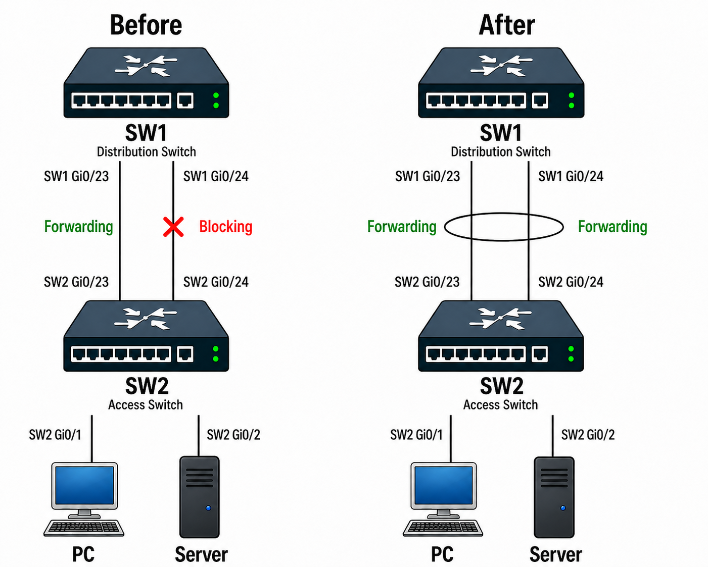
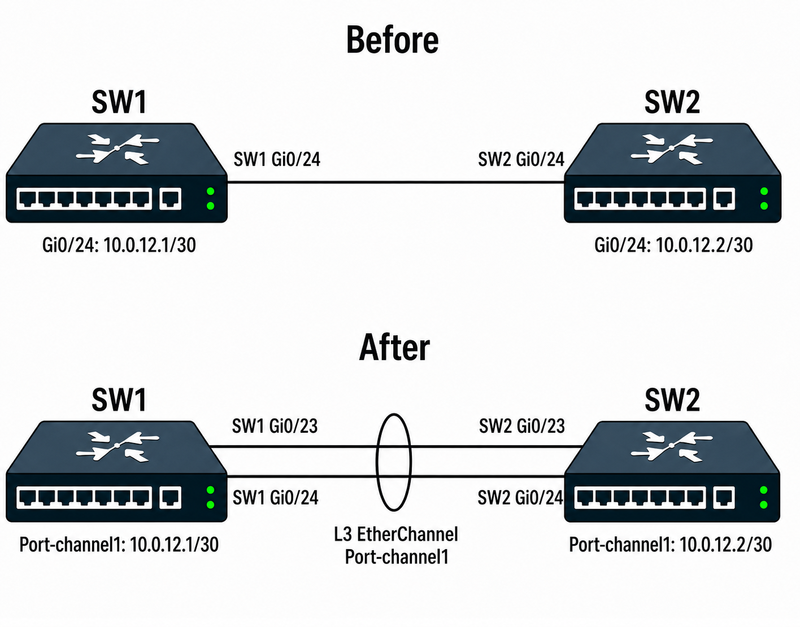

# EtherChannel / LACP

## 개념

### EtherChannel

EtherChannel은 여러 개의 물리적인 Ethernet Link를 하나의 논리적인 Link로 묶어 대역폭을 증가시키면서 동시에 이중화를 제공하는 기술이다.

여러 개의 물리적인 Port를 하나의 `Port-Channel` Interface에 포함시킨다. Layer 2 EtherChannel의 경우 STP에서는 여러 개의 물리적인 Link가 아니라 하나의 논리적인 Link로 인식한다.

또한 하나의 Member Port에 장애가 발생해도 나머지 Port를 통해 Traffic을 전달할 수 있다.
- EtherChannel에 포함되는 물리적인 Interface를 Member Port라고 한다.
- EtherChannel에 포함되는 Member Port의 설정은 서로 일치해야 한다.

EtherChannel은 Layer 2 또는 Layer 3 방식으로 구성할 수 있다.

### Port-Channel

Port-Channel은 EtherChannel로 묶인 여러 개의 물리적인 Interface를 하나의 논리적인 Interface로 표현한 것이다.

예를 들어 다음 Interface를 EtherChannel Group `1`로 구성하면:
- `Gi0/1`
- `Gi0/2`

논리적인 Interface인 `Port-channel1`이 생성된다.

```
SW1# show ip interface brief

Interface              IP-Address      OK? Method Status                Protocol
GigabitEthernet0/1     unassigned      YES unset  up                    up
GigabitEthernet0/2     unassigned      YES unset  up                    up
Port-channel1          unassigned      YES unset  up                    up
```

실제 Traffic은 Member Port를 통해 전달되지만 STP나 Routing Protocol에서는 Port-Channel을 하나의 Interface로 인식한다.

### LACP

LACP(Link Aggregation Control Protocol)는 여러 개의 물리적인 Link를 하나의 논리적인 Link로 묶기 위해 사용하는 표준 Protocol이다.

LACP는 IEEE 표준이기 때문에 Cisco 장비뿐만 아니라 다른 Vendor의 장비와 EtherChannel을 구성할 때도 사용할 수 있다.

LACP를 사용하면 Switch들이 서로 LACP 메시지를 교환하여 EtherChannel을 구성할 수 있는 Port인지 확인한다.

### LACP Active

Active Mode는 상대방에게 LACP 메시지를 전송하여 적극적으로 EtherChannel 구성을 시도한다.

Active Mode는 상대방이 Active 또는 Passive Mode인 경우 EtherChannel을 구성할 수 있다.

### LACP Passive

Passive Mode는 먼저 LACP Negotiation을 시작하지 않고 상대방으로부터 LACP 메시지를 수신하면 응답한다.

Passive와 Passive를 연결하면 양쪽 모두 먼저 LACP Negotiation을 시작하지 않기 때문에 EtherChannel이 구성되지 않는다.

실무에서는 보통 양쪽을 `active` Mode로 구성한다.

### PAgP

PAgP(Port Aggregation Protocol)는 Cisco 전용 EtherChannel Negotiation Protocol이다.

PAgP에는 `Desirable`와 `Auto Mode`가 있다.

Desirable Mode는 LACP의 Active Mode와 같이 적극적으로 PAgP 메시지를 전송하며, Auto Mode는 LACP의 Passive Mode와 같이 상대방으로부터 PAgP 메시지를 수신하면 응답한다.

LACP가 IEEE 표준이기 때문에 일반적으로 다양한 Vendor 환경에서는 LACP를 사용한다. 

### Layer 2 EtherChannel

Layer 2 EtherChannel은 여러 Switchport를 하나의 논리적인 Layer 2 Port-Channel로 구성하는 방식이다.

예를 들어 SW1과 SW2 사이의 Trunk Link 2개를 EtherChannel로 묶을 수 있다.

### Layer 3 EtherChannel

Layer 3 EtherChannel은 여러 Routed Port를 하나의 논리적인 Layer 3 Interface로 구성하는 방식이다.

Member Port에서 `no switchport`를 설정하고 Port-Channel Interface에 IP Address를 설정한다.
```
SW1(config)# interface range gi0/1 - 2
SW1(config-if-range)# no switchport
SW1(config-if-range)# channel-group 1 mode active
SW1(config-if-range)# interface port-channel 1
SW1(config-if)# no switchport
SW1(config-if)# ip address 10.0.12.1 255.255.255.252
```
Layer 3 EtherChannel에서는 Routing을 할 때 각각의 Member Port를 사용하지 않고 `Port-channel1`을 하나의 Layer 3 Interface로 사용한다.

### EtherChannel과 STP

EtherChannel을 사용하지 않고 Switch에 여러 개의 Layer 2 Link를 연결하면 STP는 Layer 2 Loop를 방지하기 위해 일부 Link를 Blocking 상태로 전환한다.

하지만 EtherChannel로 구성하면 STP는 Member Port를 각각의 Link로 보지 않고 하나의 Layer 2 Link로 인식한다.

따라서 EtherChannel에 포함된 Member Port들은 개별적으로 Blocking 상태로 전환되지 않는다.

### Load Balancing

EtherChannel은 Traffic을 여러 Member Port에 순차적으로 전송하는 방식을 사용하지 않고, Source/Destination 등의 정보를 Hash로 계산하여 Traffic을 특정 Member Port에 전달한다.

Load Balancing 방식은 Switch Model과 IOS Version에 따라 지원되는 방식이 다를 수 있다.

예를 들어 Source/Destination IP Address를 기준으로 Load Balancing하는 경우 특정 Source와 Destination 사이의 Traffic은 동일한 Member Port를 사용할 수 있다.

따라서 1Gbps Link 4개를 EtherChannel로 구성했다고 해서 하나의 TCP Session이 반드시 4Gbps의 대역폭을 사용하는 것은 아니다.

---

## 동작 원리

### LACP EtherChannel 동작 과정

1\. SW1의 `Gi0/1`, `Gi0/2`와 SW2의 `Gi0/1`, `Gi0/2`를 LACP Active Mode로 설정한다.
- 될 수 있으면 양쪽 Switch의 Interface 번호를 맞추는 것이 관리 측면에서 용이하다.

2\. SW1과 SW2는 서로 LACP 메시지를 교환한다.

3\. LACP가 각 Member Port의 정보와 설정을 확인하고 정상적으로 Negotiation이 완료되면 `Gi0/1`과 `Gi0/2`가 하나의 `Port-channel1`로 묶인다.

4\. STP는 더 이상 `Gi0/1`과 `Gi0/2`를 각각의 Link로 처리하지 않고 `Port-channel1`을 하나의 논리적인 Link로 처리한다.

5\. Traffic은 설정된 Load Balancing 방식에 따라 Member Port로 분산된다.

6\. 만약 `Gi0/1`의 Link에 장애가 발생하면 해당 Port는 EtherChannel에서 제외된다.

7\. `Gi0/2`가 계속 Port-Channel의 Member Port로 동작하기 때문에 Traffic은 중단되지 않고 나머지 Link를 통해 전달된다.

8\. 장애가 발생한 `Gi0/1`이 정상 상태로 복구되면 다시 LACP Negotiation을 거친 후 EtherChannel의 Member Port로 참여한다.

### LACP Active와 Passive 동작 과정

1\. SW1의 Port는 `active` Mode로 설정하고 SW2의 Port는 `passive` Mode로 설정한다.

2\. SW1은 LACP 메시지를 SW2로 먼저 전송한다.

3\. SW2는 LACP 메시지를 수신하고 자신의 Port 설정을 확인 후 응답한다.

4\. 양쪽 Port의 설정이 EtherChannel을 구성할 수 있는 조건을 만족하면 Port-Channel이 생성된다.

5\. 만약 양쪽 Switch를 모두 `passive` Mode로 설정하면 어느 쪽도 먼저 LACP Negotiation을 시작하지 않는다.

6\. 따라서 LACP EtherChannel이 정상적으로 구성되지 않는다.

### Layer 3 EtherChannel 동작

1\. 각 Member Port는 `no switchport`를 설정하여 Layer 3 Port로 사용한다.
- Switch의 Interface는 기본적으로 Switchport로 동작하기 때문에, 해당 Port를 Routing에 사용할 수 있도록 Layer 3 Port로 변경해줘야 한다.

2\. IP Address는 개별 Member Port에 설정하지 않고 `Port-channel1`에만 설정한다.

3\. Routing Protocol이나 Static Route에서는 각각의 Member Port가 아니라 `Port-channel1`을 하나의 Layer 3 Interface로 사용한다.
- 예를 들어 OSPF Neighbor를 형성하거나 Static Route의 Next-Hop 경로를 구성할 때 개별 Member Port가 아닌 `Port-channel1`을 사용한다.

---

## 예시 및 구성도

### Layer 2 EtherChannel

한 회사의 Distribution Switch인 SW1과 Access Switch인 SW2 사이에는 여러 VLAN의 Traffic을 전달하기 위해 두 개의 Trunk Link가 연결되어 있다.

SW1과 SW2 사이의 `Gi0/23`, `Gi0/24` 두 개의 Link가 각각 연결되어 있다.

STP는 `Gi0/23`은 Forwarding 상태로 사용하고, `Gi0/24`는 Blocking 상태로 사용한다.

따라서  `Gi0/23`만 Traffic을 전달하고 `Gi0/24`의 대역폭은 사용할 수 없었다.

회사에 사용자와 Server가 증가하면서 Traffic이 많아졌고, 하나의 Link에 Traffic이 몰리면서 Queue에서 대기하거나 Drop되는 빈도가 증가하여 사용자들의 업무에 영향을 주기 시작했다.  

관리자는 `Gi0/23`과 `Gi0/24`를 LACP EtherChannel로 구성하여 하나의 `Port-channel1`로 사용하려고 한다.



1\. SW1과 SW2에 가상의 `Port-channel1` Interface를 생성한다.
- `Port-channel1`을 미리 생성하지 않아도 Member Port에 `channel-group 1 mode active`를 설정하면 `Port-channel1`이 자동으로 생성된다.

2\. 생성된 `Port-channel1`을 Trunk Port로 설정한다.

3\. SW1과 SW2의 `Gi0/23`, `Gi0/24`에 LACP Active Mode를 설정하고 `channel-group 1`에 묶는다.

4\. SW1과 SW2는 LACP 메시지를 교환하고, 각 Member Port의 설정이 EtherChannel 구성 조건에 맞는지 확인한다.

5\. 정상적으로 Negotiation이 완료되면 `Gi0/23`과 `Gi0/24`가 `Port-channel1`의 Member Port로 동작한다.

6\. STP는 더 이상 `Gi0/23`과 `Gi0/24`를 각각의 Layer 2 Link로 보지 않고 `Port-channel1`을 하나의 논리적인 Link로 인식한다.

7\. 따라서 기존에 Blocking 상태였던 `Gi0/24`도 EtherChannel의 Member Port로 사용되며 두 Link를 모두 사용할 수 있다.

8\. VLAN Traffic은 `Port-channel1`을 통해 전달되고 실제 Frame은 Load Balancing 결과에 따라 `Gi0/23` 또는 `Gi0/24`를 통해 전송된다.

9\. 만약 `Gi0/23`에 장애가 발생하면 해당 Interface는 EtherChannel에서 제외된다.

10\. `Gi0/24`가 계속 정상적으로 동작하고 있기 때문에 `Port-channel1`은 Up 상태를 유지하며 Traffic을 계속 전달한다.

11\. `Gi0/23`이 복구되면 다시 LACP Negotiation을 거치고 `Port-channel1`에 참여한다.

### Layer 3 EtherChannel

본사의 SW1과 지사의 SW2 사이에는 Layer 3 Routing Link가 구성되어 있다. 

기존에는 하나의 Link만 사용하고 있었지만 두 지점 사이의 Traffic이 증가하면서 대역폭을 늘리고, 하나의 Link에 장애가 발생하더라도 통신을 유지할 수 있도록 이중화 작업을 하려고 한다.

관리자는 SW1과 SW2 사이의 `Gi0/1`, `Gi0/2`를 Layer 3 EtherChannel로 구성하여 하나의 `Port-channel1`을 Routing Interface로 사용한다.



1\. 기존에 SW1과 SW2의 `Gi0/24`를 Layer 3 Routing Link로 사용하고 있으며 IP Address가 설정되어 있다.
- SW1 `Gi0/24`: `10.0.12.1/30`
- SW2 `Gi0/24`: `10.0.12.2/30`

2\. EtherChannel을 구성하기 위해 기존 `Gi0/24`의 IP Address를 제거하고, `Gi0/23`과 `Gi0/24`에 `no switchport`를 설정하여 Layer 3 Port로 변경한다.

3\. SW1과 SW2에 `Port-channel1`을 구성하고 `Gi0/23`, `Gi0/24`에 LACP Active Mode를 설정하여 `channel-group 1`에 묶는다.

4\. 기존에 `Gi0/24`에서 사용하던 IP Address를 `Port-channel1`에 동일하게 설정한다.
- SW1 `Port-channel1`: `10.0.12.1/30`
- SW2 `Port-channel1`: `10.0.12.2/30`

5\. SW1과 SW2는 LACP 메시지를 교환하고 각 Member Port의 설정이 EtherChannel 구성 조건에 맞는지 확인한다.

6\. 정상적으로 Negotiation이 완료되면 `Gi0/23`과 `Gi0/24`가 `Port-channel1`의 Member Port로 동작한다.

7\. Routing Protocol이나 Static Route에서는 기존 `Gi0/24`가 아니라 `Port-channel1`을 하나의 Layer 3 Interface로 사용한다.
- 예를 들어 OSPF를 사용한다면 `Port-channel1`을 통해 OSPF Neighbor를 형성한다.

8\. Traffic은 Load Balancing 결과에 따라 `Gi0/23` 또는 `Gi0/24`를 통해 전달된다.

9\. 만약 `Gi0/23`에 장애가 발생하면 해당 Interface는 EtherChannel에서 제외된다.

10\. `Gi0/24`가 정상적으로 동작하고 있기 때문에 `Port-channel1`은 Up 상태를 유지하며 Traffic을 계속 전달한다.

11\. `Gi0/23`이 복구되면 다시 LACP Negotiation을 거치고 `Port-channel1`의 Member Port로 참여한다.

---

## 명령어

### Layer 2 LACP EtherChannel 설정

SW1과 SW2의 `Gi0/23`, `Gi0/24`를 LACP Active Mode로 설정하여 `Port-channel1`에 묶는다.
```
SW1(config)# interface range gi0/23 - 24
SW1(config-if-range)# channel-group 1 mode active
```

SW2에도 동일하게 설정한다.
```
SW2(config)# interface range gi0/23 - 24
SW2(config-if-range)# channel-group 1 mode active
```
`channel-group 1`을 설정하면 `Port-channel1` Interface가 자동으로 생성된다.

### Port-Channel Trunk 설정

생성된 `Port-channel1`을 Trunk Port로 설정한다.
```
SW1(config)# interface port-channel 1
SW1(config-if)# switchport mode trunk
```

SW2에도 동일하게 설정한다.
```
SW2(config)# interface port-channel 1
SW2(config-if)# switchport mode trunk
```

Trunk로 전달할 VLAN을 제한하려면 `Port-channel1`에 Allowed VLAN을 설정한다.
```
SW1(config)# interface port-channel 1
SW1(config-if)# switchport trunk allowed vlan 10,20,30
```

SW2에도 동일하게 설정한다.
```
SW2(config)# interface port-channel 1
SW2(config-if)# switchport trunk allowed vlan 10,20,30
```
### LACP Active / Passive 설정

SW1을 Active Mode로 설정한다.
```
SW1(config)# interface range gi0/1 - 2
SW1(config-if-range)# channel-group 1 mode active
```

SW2를 Passive Mode로 설정한다.
```
SW2(config)# interface range gi0/1 - 2
SW2(config-if-range)# channel-group 1 mode passive
```

Active와 Passive 조합이므로 LACP EtherChannel을 구성할 수 있다.

### Layer 3 LACP EtherChannel 설정

Member Port를 Routed Port로 변경한다.
```
SW1(config)# interface range gi0/1 - 2
SW1(config-if-range)# no switchport
SW1(config-if-range)# channel-group 1 mode active
```

Port-Channel Interface에 IP Address를 설정한다.
```
SW1(config)# interface port-channel 1
SW1(config-if)# no switchport
SW1(config-if)# ip address 10.0.12.1 255.255.255.252
SW1(config-if)# no shutdown
```

### EtherChannel 상태 확인

EtherChannel Group, Port-Channel 상태, Member Port등의 상태를 확인한다.
```
SW1# show etherchannel summary
```

EtherChannel Group과 Member Port의 상세 정보를 확인한다.
```
SW1# show etherchannel 1 detail
```

상대방 Switch의 LACP 정보와 연결된 Port 정보를 확인한다.
```
SW1# show lacp neighbor
```

`Port-channel1`의 상태와 Traffic 정보를 확인한다.
```
SW1# show interfaces port-channel 1
```

현재 EtherChannel에서 사용 중인 Load Balancing 방식을 확인한다.
```
SW1# show etherchannel load-balance
```

Source/Destination IP Address를 기준으로 Load Balancing하도록 설정한다.
```
SW1(config)# port-channel load-balance src-dst-ip
```

---

## Troubleshooting

### EtherChannel이 정상적으로 구성되지 않는 경우

1\. EtherChannel이 정상적으로 구성되지 않으면 Port-Channel과 Member Port 상태를 확인한다.
```
SW1# show etherchannel summary
SW1# show interfaces status
```

2\. Member Port가 정상적으로 `P` 상태로 Port-Channel에 포함되어 있는지 확인한다.
```
SW1# show etherchannel summary
```

3\. LACP를 사용하는 경우 양쪽 Switch의 LACP Mode가 올바르게 설정되어 있는지 확인한다.
- Active + Active: 정상
- Active + Passive: 정상
- Passive + Passive: 구성되지 않음

4\. 양쪽 Switch의 Member Port 설정이 동일한지 확인한다.
```
SW1# show running-config interface gi0/1
SW1# show running-config interface gi0/2
```

5\. Layer 2 EtherChannel이라면 Access/Trunk Mode, VLAN, Native VLAN 및 Allowed VLAN 설정이 일치하는지 확인한다.

6\. Member Port의 Speed와 Duplex 설정이 서로 일치하는지 확인한다.

7\. LACP Neighbor가 정상적으로 확인되는지 확인한다.
```
SW1# show lacp neighbor
```

---

## 주요 질문

EtherChannel을 사용하는 이유는 무엇인가?
- 여러 개의 물리적인 Link를 하나의 논리적인 Link로 묶어 대역폭을 증가시키고 Link 이중화를 제공하기 위해 사용한다.

EtherChannel과 Port-Channel의 차이는 무엇인가?
- EtherChannel은 여러 개의 물리적인 Link를 하나로 묶는 기술이고, Port-Channel은 EtherChannel로 생성되는 논리적인 Interface이다.

LACP Active와 Passive의 차이는 무엇인가?
- Active는 LACP Negotiation을 먼저 시작하고, Passive는 상대방으로부터 LACP 메시지를 수신하면 응답한다.
- Passive와 Passive 조합에서는 EtherChannel이 구성되지 않는다.

`mode on`은 무엇이며 언제 사용하는가?
- `mode on`은 LACP나 PAgP Negotiation 없이 EtherChannel을 강제로 구성하는 Static EtherChannel 방식이다.
- 주로 LACP를 지원하지 않는 장비와 연결할 때 사용한다.

EtherChannel Member Port의 설정은 왜 같아야 하는가?
- 여러 Member Port가 하나의 Port-Channel로 묶이기 위해 Speed, Duplex, Layer 2/3 Mode 등의 기본 설정이 서로 호환되어야 한다.
- Trunk, VLAN 등의 설정은 EtherChannel이 구성된 후 `Port-channel` Interface에 설정하여 관리할 수 있다.

EtherChannel을 구성하면 STP는 Member Port를 어떻게 처리하는가?
- STP는 각각의 Member Port를 별도의 Link로 보지 않고 Port-Channel 전체를 하나의 논리적인 Link로 처리한다.

EtherChannel에서 Member Port 하나가 Down되면 어떻게 되는가?
- 남아 있는 Member Port가 정상이라면 Port-Channel은 Up 상태를 유지하고 나머지 Link를 통해 Traffic을 계속 전달한다.

EtherChannel이 정상적으로 구성되지 않을 때 무엇을 확인하는가?
- Port-Channel과 Member Port 상태를 확인하고, LACP Mode와 Member Port의 Trunk, VLAN, Speed, Duplex 등의 설정이 일치하는지 확인한다.
