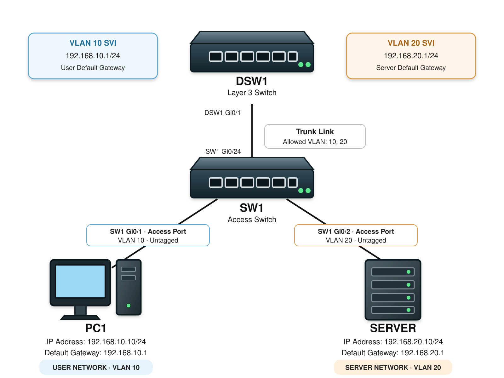
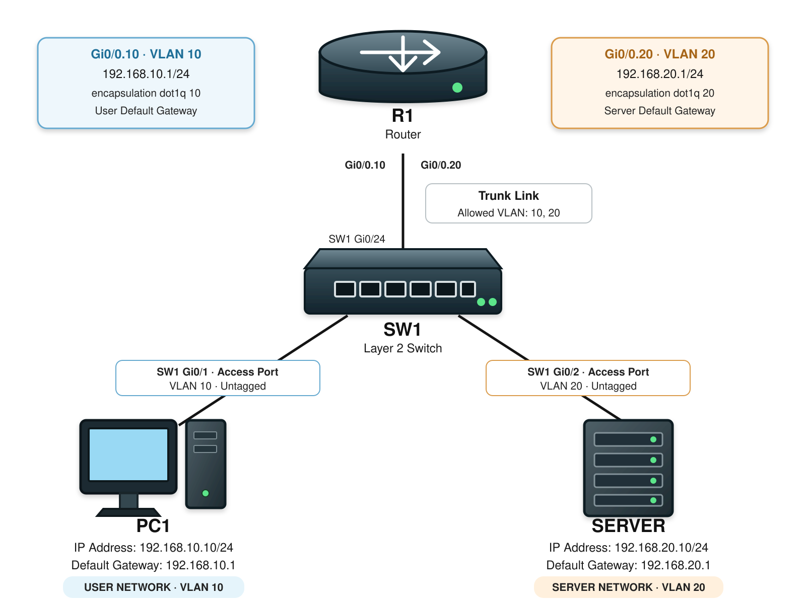

# SVI / Inter-VLAN Routing

## 개념

### SVI (Switched Virtual Interface)

SVI(Switched Virtual Interface)는 Switch에 구성된 VLAN을 Layer 3 Interface로 사용하기 위해 생성하는 논리적인 Interface이다.

SVI에 IP Address를 설정하여 VLAN에 속한 단말들의 Default Gateway로 사용한다.

예를 들어 VLAN 10의 Network가 `192.168.10.0/24`라면 다음과 같이 구성할 수 있다.
- VLAN 10 SVI: `192.168.10.1/24` 
- PC1: `192.168.10.10/24`
- PC1 Default Gateway: `192.168.10.1`

대부분의 SVI는 Backbone Switch에 구성하고, 서로 다른 VLAN 대역 간의 통신은 Backbone Switch에서 Routing한다.

Layer 2 Switch에서도 SVI를 설정하며, 해당 SVI는 SSH 접속, Ping, SNMP 등 Switch를 관리하기 위한 관리용 IP Address로 사용한다.
- 해당 Layer 2 Switch에서 사용하는 관리용 SVI의 Default Gateway는 Backbone Switch에 구성된다.

### Inter-VLAN Routing

VLAN들은 서로 다른 Broadcast Domain으로 동작하기에 서로 다른 VLAN과 통신할 수 없다.

Inter-VLAN Routing은 Layer 3 Switch를 사용하여 서로 다른 VLAN 사이의 Traffic을 Routing하게 해준다.

Layer 3 Switch에서는 각 VLAN에 SVI를 생성하고 `ip routing`을 활성화하여 Inter-VLAN Routing을 구성한다.

### Router-on-a-Stick

Router-on-a-Stick은 Router의 하나의 Physical Interface에 여러 Subinterface를 생성하여 Inter-VLAN Routing을 한다.

Switch와 Router에 사이의 Link를 Trunk를 구성하고, Router의 각 Subinterface에는 VLAN별 802.1Q Encapsulation과 Default Gateway IP Address를 설정한다.
```
R1(config)# interface gi0/0.10
R1(config-subif)# encapsulation dot1q 10
R1(config-subif)# ip address 192.168.10.1 255.255.255.0  

R1(config)# interface gi0/0.20
R1(config-subif)# encapsulation dot1q 20
R1(config-subif)# ip address 192.168.20.1 255.255.255.0  
```
모든 VLAN Traffic이 하나의 물리적인 Link를 사용하기 때문에 작은 Network에서 주로 사용한다.

Router-on-a-Stick은 Layer 3 Switch가 사용되기 전에 사용하던 Inter-VLAN Routing 방식이다.

현재는 Layer 3 Switch의 SVI를 사용하여 Inter-VLAN Routing을 구성하기 때문에 실무에서는 일반적으로 많이 사용하지 않는다. 

하지만 Layer 3 Switch가 없고 Layer 2 Switch와 Router만 사용하는 SOHO와 같은 소규모 Network 환경에서는 사용할 수 있다.

---

## 동작 원리

### SVI를 이용한 Inter-VLAN Routing
- PC1: `192.168.10.10/24`
- PC1 Default Gateway (VLAN 10): `192.168.10.1`
- Server: `192.168.20.10/24`
- Server Default Gateway (VLAN 20): `192.168.20.1`

1\. PC1은 목적지 `192.168.20.10`이 자신의 Network에 없다는 것을 확인한다.

2\. PC1은 Packet을 Default Gateway인 VLAN 10 SVI로 전송하기 위해 SVI의 MAC Address를 ARP로 확인한다.
- SVI를 생성하면 Switch가 해당 SVI에 MAC Address를 할당하며, Vendor와 장비에 따라 여러 SVI가 같은 MAC Address를 사용할 수 있다. 하지만 ARP는 VLAN별로 따로 동작하기 때문에 같은 MAC Address를 사용해도 문제가 발생하지 않는다.

3\. PC1은 Destination MAC Address를 VLAN 10 SVI의 MAC Address로 설정하여 Frame을 전송한다.

4\. Layer 3 Switch는 VLAN 10 SVI로 전달된 Frame의 Layer 2 Header를 제거하고 Destination IP Address를 확인한다.

5\. Routing Table에서 `192.168.20.0/24` Network가 VLAN 20 SVI에 연결되어 있는 것을 확인한다.

6\. Layer 3 Switch는 ARP Table에서 Server의 MAC Address를 확인한다.

7\. Layer 3 Switch는 Source MAC Address를 VLAN 20 SVI의 MAC Address로, Destination MAC Address를 Server의 MAC Address로 설정하여 새로운 Frame을 생성한다.

8\. 새로운 Frame을 VLAN 20에 속한 Server로 전달한다.

9\. Server가 응답할 때도 Default Gateway인 VLAN 20 SVI로 Packet을 전송하고 Layer 3 Switch가 VLAN 10으로 Routing한다.

Routing 과정에서 Source IP Address와 Destination IP Address는 유지되지만 Source MAC Address와 Destination MAC Address는 변경된다.

### Router-on-a-Stick 동작

1\. PC1은 다른 VLAN에 있는 목적지로 Packet을 전송하기 위해 자신의 Default Gateway로 Frame을 전송한다.

2\. Switch는 Router 방향의 Trunk Port로 Frame을 전달하면서 VLAN Tag를 추가한다.

3\. Router의 Subinterface는 Frame을 수신하고 Routing Table에서 목적지 Network를 확인한다.

4\. Router는 목적지 VLAN Tag가 포함된 새로운 Frame을 생성하여 동일한 Physical Interface로 다시 전송한다.

4\. Router는 목적지 Network에 연결된 Subinterface를 선택하고, 해당 Subinterface의 설정에 따라 VLAN Tag를 추가하여 동일한 Physical Interface로 Frame을 전송한다.

5\. Switch는 VLAN Tag를 확인하여 목적지 VLAN으로 Frame을 전달하고, Access Port에서 해당 Frame의 VLAN Tag를 제거한 후 Untagged 형식으로 목적지 단말로 전송한다.

---

## 예시 및 구성도

### Layer 3 Switch를 이용한 Inter-VLAN Routing

현재 회사에서는 사용자와 Server가 같은 VLAN의 SVI를 Default Gateway로 사용하고 있다. 하지만 Network 관리자는 보안 문제로 사용자와 Server의 Network 대역을 서로 다른 VLAN으로 분리하려고 한다.

- VLAN 10: User Network
- VLAN 20: Server Network

PC1과 Server를 서로 다른 VLAN으로 분리하면 Layer 2 Switching만으로는 통신할 수 없다.

관리자는 Layer 3 Switch인 DSW1에 VLAN 10과 VLAN 20을 생성하고 각 VLAN의 SVI를 구성하여 Inter-VLAN Routing을 사용하려고 한다.



- PC1: `192.168.10.10/24`
- PC1 Default Gateway: `192.168.10.1`
- Server: `192.168.20.10/24`
- Server Default Gateway: `192.168.20.1`
- VLAN 10 SVI: `192.168.10.1/24`
- VLAN 20 SVI: `192.168.20.1/24`

1\. DSW1과 SW1에 VLAN 10과 VLAN 20을 생성한다.

2\. PC1이 연결된 SW1의 Port를 VLAN 10 Access Port로 설정한다.

3\. Server가 연결된 SW1의 Port를 VLAN 20 Access Port로 설정한다.

4\. SW1과 DSW1 사이의 Link를 Trunk로 설정하고 VLAN 10과 VLAN 20을 Allowed VLAN에 추가한다.

5\. DSW1에 VLAN 10과 VLAN 20의 SVI를 생성하고 IP Address를 설정한다.

6\. DSW1에서 `ip routing`을 활성화하여 Layer 3 기능을 켠다.

7\. VLAN 10과 VLAN 20의 Network가 DSW1의 Routing Table에 Connected Route로 등록된다.

8\. PC1은 목적지 Server가 다른 Network에 있다는 것을 확인하고 Packet을 Default Gateway인 VLAN 10 SVI로 전송한다.

9\. SW1은 Frame에 VLAN 10 Tag를 추가하고 Trunk Link를 통해 DSW1로 전달한다.

10\. DSW1은 VLAN 10 SVI로 Frame을 수신하고 Routing Table을 확인하여 VLAN 20 SVI 방향으로 Routing한다.

11\. DSW1은 Frame에 VLAN 20 Tag를 추가하고 Trunk Link를 통해 SW1로 전달한다.

12\. SW1은 Frame을 VLAN 20이 할당된 Access Port에서 VLAN Tag를 제거하고 Untagged 형식으로 Server에 전달한다.

13\. Server는 Packet을 수신하고 응답 Packet을 Default Gateway인 VLAN 20 SVI로 전송한다.

14\. DSW1은 응답 Packet을 VLAN 10으로 Routing하여 PC1에게 전달한다.

### Router-on-a-Stick을 이용한 Inter-VLAN Routing

해당 회사는 규모가 작은 회사로 L2 Switch와 Router만으로 네트워크가 구성되어 있다.   

현재 사용자 PC와 Server가 같은 VLAN과 IP 대역을 사용하고 있어 Broadcast Traffic이 모든 장비에 전달되고, 사용자와 Server의 Traffic을 구분하여 관리하기 어렵다.

관리자는 Network 관리와 접근 제어를 위해 사용자와 Server를 서로 다른 VLAN으로 분리하려고 한다.

- VLAN 10: User Network
- VLAN 20: Server Network

VLAN을 분리하면 SW1은 다른 VLAN으로 Traffic을 보낼 수 없다.

그래서 관리자는 사용자가 Server에 Traffic을 전달할 수 있도록 SW1과 R1 사이의 Link를 Trunk로 구성하고 Router-on-a-Stick 방식으로 Inter-VLAN Routing을 사용하려고 한다.



1\. SW1에 VLAN 10과 VLAN 20을 생성한다.

2\. PC1이 연결된 Port를 VLAN 10 Access Port로 설정한다.

3\. Server가 연결된 Port를 VLAN 20 Access Port로 설정한다.

4\. SW1과 R1 사이의 Link를 Trunk로 설정하고 VLAN 10과 VLAN 20을 Allowed VLAN에 추가한다.

5\. R1의 `Gi0/0` Interface에 VLAN 10과 VLAN 20의 Subinterface를 생성한다.

6\. `Gi0/0.10`에는 VLAN 10 Encapsulation과 Default Gateway IP Address를 설정한다.

7\. `Gi0/0.20`에는 VLAN 20 Encapsulation과 Default Gateway IP Address를 설정한다.

8\. VLAN 10 Traffic은 `Gi0/0.10`으로 전달되고 VLAN 20 Traffic은 `Gi0/0.20`으로 전달된다.

9\. R1은 각 Subinterface를 통해 VLAN 10과 VLAN 20 사이의 Packet을 Routing한다.

---

## 명령어

### Layer 3 Switch Inter-VLAN Routing 설정

VLAN 10과 VLAN 20을 생성한다.
```
DSW1(config)# vlan 10
DSW1(config-vlan)# name USER
DSW1(config-vlan)# exit
DSW1(config)# vlan 20
DSW1(config-vlan)# name SERVER
```

VLAN 10과 VLAN 20의 SVI를 설정한다.
```
DSW1(config)# interface vlan 10
DSW1(config-if)# ip address 192.168.10.1 255.255.255.0
DSW1(config-if)# no shutdown

DSW1(config)# interface vlan 20
DSW1(config-if)# ip address 192.168.20.1 255.255.255.0
DSW1(config-if)# no shutdown
```

Inter-VLAN Routing을 사용할 수 있도록 IP Routing을 활성화한다.
```
DSW1(config)# ip routing
```

### Layer 2 Switch Management SVI 설정

L3 Switch에 Mgmt SVI를 만든다.
```
DSW1(config)# vlan 99
DSW1(config-vlan)# name Mgmt
DSW1(config-vlan)# interface vlan 99
DSW1(config-if)# ip address 192.168.99.1 255.255.255.0
```

Layer 2 Switch를 원격으로 관리하기 위한 Management SVI와 Default Gateway를 설정한다.
```
SW1(config)# vlan 99
SW1(config-vlan)# name Mgmt

SW1(config)# interface vlan 99
SW1(config-if)# ip address 192.168.99.2 255.255.255.0
SW1(config-if)# no shutdown

SW1(config)# ip default-gateway 192.168.99.1
```

### Router-on-a-Stick 설정

Switch와 Router 사이의 Port를 Trunk로 설정한다.
```
SW1(config)# interface gi0/24
SW1(config-if)# switchport mode trunk
SW1(config-if)# switchport trunk allowed vlan 10,20
```

Router에 VLAN별 Subinterface를 설정한다.
```
R1(config)# interface gi0/0
R1(config-if)# no shutdown

R1(config)# interface gi0/0.10
R1(config-subif)# encapsulation dot1q 10
R1(config-subif)# ip address 192.168.10.1 255.255.255.0

R1(config)# interface gi0/0.20
R1(config-subif)# encapsulation dot1q 20
R1(config-subif)# ip address 192.168.20.1 255.255.255.0
```

### 상태 확인

VLAN과 Port 할당 상태를 확인한다.
```
DSW1# show vlan brief
```

SVI의 IP Address와 상태를 확인한다.
```
DSW1# show ip interface brief
DSW1# show interfaces vlan 10
```
---

