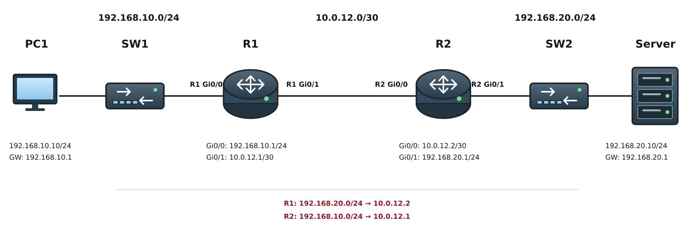
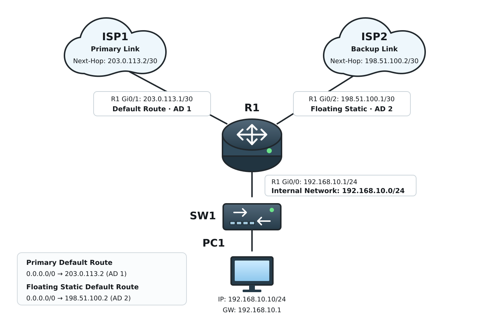

# Static Route / Default Route / Floating Static

## 개념

### Static Route

Static Route는 목적지 Network까지의 경로를 관리자가 라우터에 직접 설정하는 방식이다.

Static Route는 Next-Hop IP Address, Exit Interface 또는 두 가지를 함께 사용하여 설정할 수 있다.

Static Route는 간단하지만 Network에 변화가 발생하면 관리자가 직접 경로를 변경해야 한다.
- 회사 Network에 Static Route가 계속 쌓이면 ACL과 마찬가지로 어떤 Route가 실제로 사용되는지 확인하기 어렵다. 사용하지 않는 Route처럼 보여도 제거했을 때 예상하지 못한 장애가 발생할 수 있어 쉽게 제거하기 어렵다.

따라서 경로가 많지 않은 소규모 Network, 외부로 나가는 경로가 하나뿐인 Network 및 Backup Route를 구성할 때 주로 사용한다.

#### Next-Hop Static Route

목적지 Network로 Packet을 전달할 다음 Router의 IP Address를 지정한다.
``` 
R1(config)# ip route 192.168.20.0 255.255.255.0 10.0.12.2
```
Router는 Next-Hop IP Address로 Packet을 전달하기 위해 Routing Table에서 Next-Hop까지의 경로를 확인한다.

#### Exit Interface Static Route

Packet을 전달할 Interface를 직접 지정한다.
``` 
R1(config)# ip route 192.168.20.0 255.255.255.0 gigabitEthernet0/1
```
Exit Interface 방식은 Serial과 같은 Point-to-Point Link에서 주로 사용한다.

#### Ethernet 환경에서 Exit Interface만 설정하면 안 되는 이유

Exit Interface만 지정하면 Router는 목적지 Network가 해당 Interface에 직접 연결된 것으로 판단한다.

Router는 Ethernet Link로 Packet을 전달하기 위해 Next-Hop IP Address의 MAC Address를 ARP로 확인한다.

하지만 Static Route에 Exit Interface만 지정하면 Next-Hop IP Address가 없으므로 실제 목적지 IP Address에 대해 ARP Request를 전송한다.

이때 Next-Hop Router의 Proxy ARP가 활성화되어 있으면 실제 목적지 장비의 MAC Address 대신 자신의 MAC Address로 ARP Reply를 전송한다.

하지만 Next-Hop Router에서 Proxy ARP가 비활성화되어 있으면 자신의 MAC Address로 ARP Reply를 대신할 수 없으므로 Router는 Traffic을 목적지 Network로 전달할 수 없다.

#### Fully Specified Static Route

Exit Interface와 Next-Hop IP Address를 함께 지정한다.
``` 
R1(config)# ip route 192.168.20.0 255.255.255.0 gigabitEthernet0/1 10.0.12.2
```
Packet을 전달할 Interface와 Next-Hop 모두 지정하는 방식이다.
- 하지만 대부분의 운영 환경에서는 Next-Hop Router의 IP Address만 지정하여 사용한다.

### Default Route

Default Route는 Routing Table에 목적지 Network에 대한 Route가 없을 때 Packet을 전달하는 경로이다. 
``` 
R1(config)# ip route 0.0.0.0 0.0.0.0 10.0.12.2
```

`0.0.0.0/0`은 모든 목적지 Network를 의미하며, Router는 목적지와 일치하는 Route를 찾지 못하면 Default Route로 Packet을 전달한다.

Default Route는 일반적으로 내부 Network의 Traffic을 ISP 등의 상위 Router로 전달하기 위해 상위 Router의 IP Address를 Next-Hop으로 설정한다.

### Floating Static Route

Floating Static Route는 주 경로에 장애가 발생했을 때 사용할 Backup Static Route이다.

Static Route의 기본 Administrative Distance는 `1`이다.

Floating Static Route에는 주 경로보다 높은 Administrative Distance를 설정한다.

``` 
R1(config)# ip route 192.168.20.0 255.255.255.0 10.0.12.2
R1(config)# ip route 192.168.20.0 255.255.255.0 10.0.13.2 2
```
- Primary Route: Next-Hop `10.0.12.2`, AD `1`
- Backup Route: Next-Hop `10.0.13.2`, AD `2`

AD가 낮은 경로가 우선되므로 평상시에는 Primary Route가 Routing Table에 등록된다.

하지만 Primary Route가 제거되면 다음으로 AD가 높은 Route가 Routing Table에 등록되어 Backup 경로로 사용된다.

또한 Interface는 Up 상태이지만 원격 구간의 장애로 목적지와 통신할 수 없는 경우에도 Primary Route가 Routing Table에서 제거되지 않을 수 있다. 이는 Router가 직접 연결된 Link의 상태만 확인하고 원격 목적지의 통신 상태는 확인하지 못하기 때문이다.

통신은 가능하지만 지연이나 Packet Loss가 발생하여 Traffic 처리 속도가 느려진 경우에도 Link가 완전히 끊어진 것은 아니므로 Primary Route가 Routing Table에서 제거되지 않는다.

이러한 장애에 대응하려면 IP SLA와 Object Tracking을 함께 사용하여 원격 목적지의 통신 상태를 확인하고 Primary Route를 자동으로 제거할 수 있다.

---

## 동작 원리

### Default Route 동작

1\. Router가 Packet의 Destination IP Address를 확인한다.

2\. Routing Table에서 목적지와 일치하는 Route를 확인한다.

3\. 목적지에 해당하는 Route가 없으면 라우터는 패킷을 `0.0.0.0/0`으로 전달한다.

4\. Router는 Default Route에 설정된 Next-Hop 또는 Exit Interface로 Packet을 전달한다.
``` 
S* 0.0.0.0/0 [1/0] via 10.0.12.2
```
목적지에 대한 구체적인 Route가 존재하면 Default Route보다 구체적인 Route가 우선된다.

### Floating Static Route 동작

1\. R1에는 목적지 Network로 가는 Primary Route와 Backup Route가 설정되어 있다.

2\. Primary Route의 AD는 `1`이고 Backup Route의 AD는 `2`이다.

3\. R1은 AD가 낮은 Primary Route를 Routing Table에 등록한다.

4\. 평상시에는 Primary Route를 통해 Packet을 전달한다.

5\. Primary Link가 장애로 Down되면 Primary Route는 Routing Table에서 제거된다.

6\. R1은 다음로 AD가 높은 Floating Static Route를 Routing Table에 등록한다.

7\. 이후 Packet은 Backup Link를 통해 전달된다.

8\. Primary Link가 복구되면 AD가 더 낮은 Primary Route가 다시 Routing Table에 등록된다.

9\. Floating Static Route는 Routing Table에서 제거되고 다시 Backup Route로 대기한다.

---

## 예시 및 구성도

### Static Route를 이용한 Network 연결

회사에서 새로운 Server Farm을 구축하기 위해 Router와 Server를 새로 구매하여 Network를 구성하였다.

사용자들이 Server를 사용하기 위해 Server Network에 접근해야 하지만, 아직 R1과 R2에 상대방 Network로 가는 Route가 설정되어 있지 않아 Server에 접근하지 못하고 있다.

해당 경로는 단순하고 Network의 변화가 많지 않기 때문에 관리자는 Static Route를 구성하려고 한다.



- R1: User Network
- R2: Server Network
- PC1: `192.168.10.10/24`
- PC1 Default Gateway: `192.168.10.1`
- R1 `Gi0/0`: `192.168.10.1/24`
- R1 `Gi0/1`: `10.0.12.1/30`
- R2 `Gi0/0`: `10.0.12.2/30`
- R2 `Gi0/1`: `192.168.20.1/24`
- Server: `192.168.20.10/24`
- Server Default Gateway: `192.168.20.1`

1\. R1에는 Server Network인 `192.168.20.0/24`로 가는 Static Route를 설정한다.
``` 
R1(config)# ip route 192.168.20.0 255.255.255.0 10.0.12.2
```

2\. R2에는 User Network인 `192.168.10.0/24`로 돌아가는 Static Route를 설정한다.
``` 
R2(config)# ip route 192.168.10.0 255.255.255.0 10.0.12.1
```

3\. PC1이 Server로 Packet을 전송하면 R1은 Static Route를 확인하여 R2로 전달한다.

4\. R2는 Packet을 Connected Network인 `192.168.20.0/24`로 전달한다.

5\. Server는 응답 Packet을 Default Gateway인 R2로 전송한다.

6\. R2는 Static Route를 확인하여 응답 Packet을 R1으로 전달한다.

7\. R1은 응답 Packet을 Connected Network인 `192.168.10.0/24`의 PC1으로 전달한다.

---

## 예시 및 구성도

### Static Route를 이용한 Network 연결

회사에서 새로운 Server Farm을 구축하기 위해 Router와 Server를 새로 구매하여 Network를 구성하였다.

사용자들이 Server를 사용하기 위해 Server Network에 접근해야 하지만, 아직 R1과 R2에 상대방 Network로 가는 Route가 설정되어 있지 않아 Server에 접근하지 못하고 있다.

해당 경로는 단순하고 Network의 변화가 많지 않기 때문에 관리자는 Static Route를 구성하려고 한다.


- R1: User Network
- R2: Server Network
- PC1: `192.168.10.10/24`
- PC1 Default Gateway: `192.168.10.1`
- R1 `Gi0/0`: `192.168.10.1/24`
- R1 `Gi0/1`: `10.0.12.1/30`
- R2 `Gi0/0`: `10.0.12.2/30`
- R2 `Gi0/1`: `192.168.20.1/24`
- Server: `192.168.20.10/24`
- Server Default Gateway: `192.168.20.1`

1\. R1에는 Server Network인 `192.168.20.0/24`로 가는 Static Route를 설정한다.
``` 
R1(config)# ip route 192.168.20.0 255.255.255.0 10.0.12.2
```

2\. R2에는 User Network인 `192.168.10.0/24`로 돌아가는 Static Route를 설정한다.
``` 
R2(config)# ip route 192.168.10.0 255.255.255.0 10.0.12.1
```

3\. PC1이 Server로 Packet을 전송하면 R1은 Static Route를 확인하여 R2로 전달한다.

4\. R2는 Packet을 Connected Network인 `192.168.20.0/24`로 전달한다.

5\. Server는 응답 Packet을 Default Gateway인 R2로 전송한다.

6\. R2는 Static Route를 확인하여 응답 Packet을 R1으로 전달한다.

7\. R1은 응답 Packet을 Connected Network인 `192.168.10.0/24`의 PC1으로 전달한다.

### Internet 회선 이중화

회사는 Internet 회선을 이중화하기 위해 두 개의 ISP 회선을 사용하려고 한다.

평상시에는 ISP1을 Primary Link로 사용하고, Primary Link에 장애가 발생하면 ISP2를 통해 Internet을 사용할 수 있도록 구성하려고 한다.

관리자는 ISP1 방향으로 Default Route를 설정하고, ISP2 방향에는 더 높은 AD를 가진 Floating Static Default Route를 설정한다.



- Internal Network: `192.168.10.0/24`
- R1 `Gi0/0`: `192.168.10.1/24`
- R1 `Gi0/1`: `203.0.113.1/30`
- ISP1 Next-Hop: `203.0.113.2/30`
- R1 `Gi0/2`: `198.51.100.1/30`
- ISP2 Next-Hop: `198.51.100.2/30`

1\. R1에 ISP1을 Next-Hop으로 사용하는 Primary Default Route를 설정한다.
``` 
R1(config)# ip route 0.0.0.0 0.0.0.0 203.0.113.2
```

2\. ISP2를 Next-Hop으로 사용하는 Floating Static Default Route에는 AD `200`을 설정한다.
``` 
R1(config)# ip route 0.0.0.0 0.0.0.0 198.51.100.2 2
```

3\. Primary Default Route의 AD가 `1`로 더 낮으므로 ISP1을 통한 경로가 Routing Table에 등록된다.

4\. R1은 Routing Table에 목적지 Network에 대한 Route가 없으면 Packet을 Default Route에 설정된 ISP1으로 전달한다.

5\. ISP1의 Primary Link에 장애가 발생하면 해당 Default Route가 Routing Table에서 제거된다.

6\. AD가 `2`인 Floating Static Default Route가 Routing Table에 등록된다.

7\. 이후 Internet으로 향하는 Traffic은 ISP2를 통해 전달된다.

8\. ISP1의 Primary Link가 복구되면 AD가 낮은 Primary Default Route가 Routing Table에 다시 등록된다.

9\. Floating Static Default Route는 Routing Table에서 제거되고 다시 Backup Route로 대기한다.

Interface는 Up 상태이지만 ISP 내부의 원격 구간에 장애가 발생한 경우에는 Primary Default Route가 제거되지 않을 수 있다. 이러한 장애까지 감지하려면 IP SLA와 Object Tracking을 함께 사용해야 한다.
- 실제 환경에서 Private IP Address를 사용하는 내부 단말이 Internet에 접근하려면 NAT 또는 PAT 설정도 필요하다.
- PC가 외부 Network와 통신하려면 Packet이 R1에서 ISP로 전달되기 전에 PC의 Private Source IP Address를 ISP로부터 할당받은 Public IP Address로 NAT 또는 PAT해야 한다.


