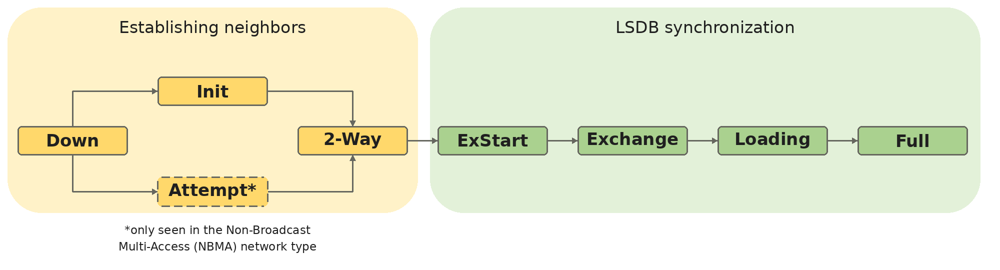
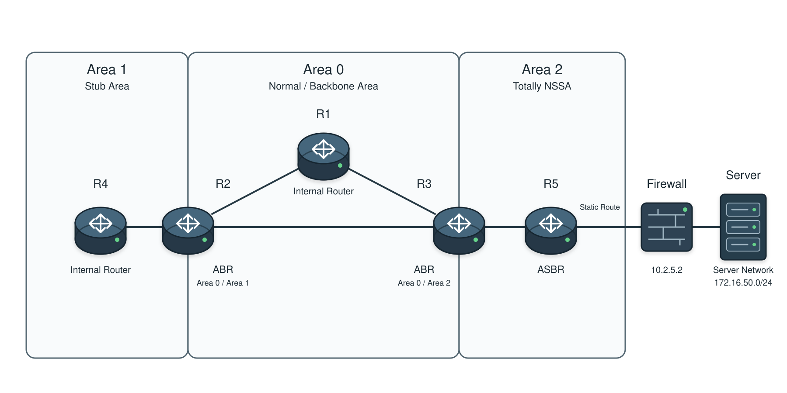

# OSPF

## 개념

OSPF(Open Shortest Path First)는 Link-State 기반의 동적 라우팅 프로토콜이다. 각 Router는 LSA(Link-State Advertisement)를 교환하여 LSDB(Link-State Database)를 구성하고, Dijkstra의 SPF(Shortest Path First) 알고리즘으로 목적지까지의 최적 경로를 계산한다.

OSPF의 특징은 다음과 같다.
- IP Protocol Number `89`를 사용하며 TCP나 UDP를 사용하지 않는다.
- 같은 Area의 Router들은 동일한 LSDB를 유지한다.
- Cost를 Metric으로 사용한다.
- AD 값은 `110`이다.
- `224.0.0.5`와 `224.0.0.6` Multicast Address를 사용한다.
- Cisco 장비에서는 OSPF Packet을 일반적으로 DSCP `CS6`로 표시한다.

`224.0.0.5`는 모든 OSPF Router가 수신하고, `224.0.0.6`은 DR과 BDR이 수신한다.

OSPF Process ID는 Router 내부에서만 의미가 있는 값이다. 따라서 서로 연결된 Router의 Process ID가 달라도 OSPF Neighbor를 형성할 수 있다. 하나의 Router에서 여러 OSPF Process를 사용하면 각 Process는 별도의 LSDB를 유지하며, Process 간에 Route를 공유하려면 Redistribution이 필요하다.

### Router ID

Router ID는 OSPF Router를 식별하는 32 Bit 값이다. IPv4 Address 형식으로 표시하지만 실제 Interface에 할당된 IP Address일 필요는 없다.

Router ID는 OSPF Process가 시작될 때 다음 순서로 결정된다.

1\. `router-id` 명령어로 직접 설정한 값

2\. Up 상태인 Loopback Interface 중 가장 높은 IP Address

3\. Up 상태인 Physical Interface 중 가장 높은 IP Address

OSPF Domain 안에서 Router ID는 중복되지 않아야 한다. Router ID가 중복되면 LSA가 충돌하여 Neighbor 및 Route 학습 문제가 발생할 수 있다. 

운영 중 Router ID를 변경하면 OSPF Process가 재시작되면서 Neighbor 관계가 일시적으로 끊기고 LSDB가 다시 구성된다. IOS Version에 따라 Router ID 변경 후 `clear ip ospf process` 명령어를 추가로 실행해야 하거나 별도의 명령어 없이 Router-ID가 변경되어 Neighbor이 끊킬 수 있으므로 작업 전에 확인해야 한다.

### OSPF Cost

OSPF는 목적지까지 누적된 Cost중에서 가장 낮은 경로를 선택한다.
```
Cost = Reference Bandwidth / Interface Bandwidth
```

Cisco 장비의 기본 Reference Bandwidth는 `100 Mbps`이다.
- FastEthernet 100 Mbps: `100 / 100 = Cost 1`
- GigabitEthernet 1 Gbps: `100 / 1000 = 0.1 → Cost 1`

OSPF Cost는 최소값이 `1`이므로 기본 설정에서는 FastEthernet과 GigabitEthernet이 모두 Cost `1`로 계산될 수 있다. 따라서 현재 회사 Network에서 사용하는 가장 빠른 Link를 기준으로 Reference Bandwidth를 변경해야 Link 속도에 따른 Cost를 제대로 구분할 수 있다.

Reference Bandwidth는 OSPF Domain의 모든 Router에서 동일하게 설정해야 한다. 또한 Interface Cost는 `ip ospf cost` 명령어를 사용하여 Interface 단위로 직접 설정할 수 있다.

### OSPF Area

OSPF는 규모가 큰 Network를 여러 Area로 나누어 LSA의 Flooding 범위와 SPF 계산 범위를 줄인다. 각 Area는 별도의 LSDB를 유지하며, 다른 Area의 구성은 알지 못한다.

Area 0은 OSPF를 Backbone Area라고 부른다. 모든 Non-Backbone Area는 Area 0과 연결되어야 하며, 다른 Area 간 Traffic은 Area 0을 통해 전달된다.

### OSPF Router 역할

Backbone Router: Area 0에 속한 Router이다.

ABR(Area Border Router): Area 0과 Non-Backbone Area를 연결하는 Router이다.

ASBR(Autonomous System Boundary Router): Static Route 및 다른 Routing Protocol의 Route를 OSPF로 
Redistribution하는 Router이다.

### OSPF Packet

OSPF는 다섯 가지 Packet을 사용한다.

1\. Hello: Neighbor를 탐색하고 관계를 유지한다.

2\. DBD(Database Description): LSDB에 있는 LSA Header 목록을 요약하여 전달한다.
- Point-to-Point 환경에서는 연결된 두 Router가 서로 DBD Packet을 교환한다.  
- Broadcast 환경에서는 DROther가 DR 및 BDR과 DBD Packet을 교환하지만, DROther끼리는 교환하지 않는다. 

3\. LSR(Link-State Request): 없거나 오래된 LSA의 내용을 요청한다.

4\. LSU(Link-State Update): 하나 이상의 전체 LSA를 전달한다.

5\. LSAck(Link-State Acknowledgment): 수신한 LSA에 대한 확인 응답을 전송한다.

Hello Packet에는 Network Mask, Hello/Dead Interval, Area ID, Area Type, Router Priority, DR/BDR 정보가 포함된다. Neighbor를 형성하려면 양쪽의 Hello Parameter가 서로 일치해야 한다.

DBD Packet은 LSA Type, Link State ID, Advertising Router 및 Sequence Number 등이 포함된 LSA Header만 전달한다. 상대 Router는 DBD와 자신의 LSDB를 비교하고 필요한 LSA를 LSR로 요청한다.

### OSPF Neighbor State



1\. Down: Neighbor로부터 Hello Packet을 수신하지 못한 상태이다.

2\. Attempt: NBMA 환경에서 수동으로 지정한 Neighbor에게 Hello Packet을 보내고 응답을 기다리는 상태이다.
- 일반적인 Ethernet Broadcast 및 Point-to-Point 환경에서는 Attempt 상태가 나타나지 않는다.
- NBMA는 여러 Router가 같은 IP 대역을 공유하지만 Broadcast와 Multicast가 자동으로 전달되지 않는 환경이다. 일반적인 OSPF 환경에서는 Hello Packet을 `224.0.0.5`로 전송하지만, NBMA 환경에서는 수동으로 지정한 Neighbor에게 Unicast로 전송한다.

3\. Init: 상대방의 Hello Packet은 받았지만, 양방향 Hello 통신은 아직 확인되지 않은 상태이다.

4\. 2-Way: 양쪽 Router가 서로의 Hello Packet에서 자신의 Router ID를 확인한 상태이다.

5\. ExStart: Master와 Slave를 결정하고 DBD Sequence Number를 협상하는 상태이다.
- DBD Sequence Number는 DBD Packet을 구분하기 위한 순서 번호이다. DBD Packet을 여러 번 나누어 보내면 Master가 `100`, `101`, `102`처럼 번호를 증가시키고 Slave는 같은 번호로 응답한다. 이를 통해 어떤 DBD Packet을 주고받았는지 확인하고 누락이나 중복을 방지한다.

6\. Exchange: DBD Packet으로 서로의 LSA Header 목록을 교환하는 상태이다.

7\. Loading: 필요한 LSA를 LSR로 요청하고 LSU로 수신하는 상태이다.

8\. Full: LSDB 동기화가 완료된 상태이다.

Point-to-Point Link에서는 연결된 두 Router가 Full 상태까지 Neighbor 관계를 형성한다. 하지만 Broadcast Network에서는 DROther가 DR 및 BDR과만 Full Adjacency를 형성하고, 다른 DROther와는 2-Way 상태를 유지한다.
- 2-Way는 두 Router가 Hello Packet을 주고받아 서로를 Neighbor로 확인한 상태이다.
- DROther끼리는 Neighbor 관계를 형성하지만 DBD를 교환하거나 LSDB를 직접 동기화하지 않는다.
- 대신 DR을 통해 LSA를 전달받아 같은 Area의 Router들과 동일한 LSDB를 유지한다.

### LSA Type

Type 1 Router LSA: 모든 OSPF Router가 생성하며 자신이 연결된 Link, Neighbor, Network와 Cost를 같은 Area에 광고한다.
- 각 Router가 자신과 연결된 Neighbor 및 Network와 해당 경로의 Cost를 같은 Area에 광고한다.

Type 2 Network LSA: DR이 생성하며 같은 Network에 연결된 OSPF Router 목록과 Subnet Mask를 같은 Area에 광고한다.
- DR이 자신이 속한 OSPF Network의 대역과 자기와 연결된 OSPF Router 목록을 같은 Area에 광고한다.  

Type 3 Summary LSA: ABR이 생성하며 다른 Area의 Network와 해당 Network까지의 Cost를 자신의 Area에 광고한다.
- ABR이 자신을 통해 다른 Area의 OSPF Network로 갈 수 있다는 정보를 자신의 Area에 광고한다. 

Type 4 ASBR Summary LSA: ABR이 생성하며 다른 Area에 있는 ASBR의 Router ID와 해당 ASBR까지의 Cost를 자신의 Area에 광고한다.
- ABR이 자신을 통해 다른 Area에 있는 ASBR로 갈 수 있다는 정보를 자신의 Area에 광고한다.
- 만약 ASBR이 같은 Area에 있으면 Type 1 LSA를 통해 경로를 확인할 수 있으므로 Type 4 LSA는 필요하지 않다.

Type 5 AS External LSA: ASBR이 생성하며 Redistribution된 외부 Network와 External Metric을 OSPF Domain에 광고한다.
- ASBR이 OSPF 외부 Network와 External Metric을 OSPF Domain에 광고한다.
- Static, EIGRP, BGP 등의 Route를 OSPF로 Redistribution할 때 생성된다.

Type 6 Group Membership LSA: OSPF 환경에서는 거의 사용되지 않는다.

Type 7 NSSA External LSA: NSSA 내부 ASBR이 생성하며 NSSA로 Redistribution된 외부 Route를 광고한다.
- NSSA 내부 ASBR이 외부 Network를 NSSA에 광고하며 ABR에서 Type 5 LSA로 변환되어 다른 Area에 전달될 수 있다.


ASBR이 외부 Route를 Redistribution하면 Type 5 LSA를 생성한다. ASBR과 다른 Area에 있는 Router가 해당 ASBR까지 도달할 수 있도록 ABR은 Type 4 LSA를 생성한다. ASBR과 같은 Area에 있는 Router는 Type 1 LSA로 ASBR의 위치를 알 수 있으므로 Type 4 LSA가 필요하지 않다.

NSSA 내부에서 Redistribution된 Route는 Type 7 LSA로 생성된다. Type 7 LSA는 NSSA 내부에서만 Flooding되며 ABR은 Type 7 LSA를 Type 5 LSA로 변환하여 다른 Area에 광고한다.

ABR은 연결된 Area마다 별도의 LSDB를 유지하고 하나의 Routing Table을 사용한다. 한 Area의 Type 1과 Type 2 LSA를 다른 Area로 그대로 전달하지 않고, 해당 LSA로 계산한 Network 정보를 Type 3 LSA로 요약하여 광고한다.

### DR and BDR

Broadcast와 NBMA Network에서는 모든 Router가 DR과 BDR을 선출한다.
- 모든 Router가 서로 Full Adjacency를 형성하면 LSA 교환량이 증가하여 과부하가 발생할 수 있기 때문이다.

DR과 BDR은 다음 순서로 선출된다.

1\. OSPF Interface Priority가 가장 높은 Router

2\. Priority가 같으면 Router ID가 가장 높은 Router

Priority의 기본값은 `1`이며, Priority를 `0`으로 설정한 Interface는 DR이나 BDR로 선출될 수 없다.

DR/BDR 선출은 `Non-Preemptive` 방식이다. DR이 선출된 이후 더 높은 Priority나 Router ID를 가진 Router가 연결되어도 기존 DR을 교체하지 않는다. DR에 장애가 발생하면 BDR이 DR로 승격되고 새로운 BDR을 선출한다.

### Stub Area

Stub Area는 외부 Route를 나타내는 Type 5 LSA와 외부 ASBR의 위치를 나타내는 Type 4 LSA를 차단하여 LSDB와 Routing Table을 단순화하는 Area이다.
- Type 1과 Type 2 LSA를 사용하여 Area 내부 Route를 학습한다.
- Type 3 LSA를 사용하여 다른 OSPF Area의 Network를 학습한다.
- Type 4와 Type 5 LSA는 차단한다.
- ABR은 Stub Area 내부에 `0.0.0.0/0` Type 3 Default Route를 자동으로 광고한다.
- Stub Area의 모든 내부 Router는 ABR이 광고한 `0.0.0.0/0` Default Route를 routing table에 추가하고, 목적지 Route가 없으면 자신의 Default Route를 사용하여 ABR로 패킷을 전달한다.  
- ABR은 자신이 알고 있는 외부 Route를 사용하여 패킷을 ASBR 방향으로 전달한다.

### Totally Stubby Area

Totally Stubby Area는 Stub Area의 기능에 더해 다른 Area의 Network를 나타내는 Type 3 LSA까지 차단하는 Area이다.
- Type 1과 Type 2 LSA를 사용하여 Area 내부 Route를 학습한다.
- Type 3, Type 4, Type 5 LSA를 차단한다.
- ABR은 Type 3 Default Route를 광고한다.
- 다른 OSPF Area와 External Network로 가기 위해서는 ABR이 광고한 Type 3 Default Route를 통해 나갈 수 있다.
- 다른 Area의 네트워크를 학습하지 않으므로 Stub Area보다 LSDB와 Routing Table을 더 작게 유지할 수 있다.

Stub Area에서 Totally Stubby Area가 되기 위해서는 `no-summary`를 ABR에 설정해야 한다. 이후 ABR은 다른 Area에서 받은 Type 3 LSA를 내부 Router에 광고하지 않고, 대신 `0.0.0.0/0` Type 3 Default Route를 광고한다.
- `no-summary`는 해당 Area의 Route가 밖으로 나가는 것을 차단하는 것이 아니라, 다른 Area의 일반 Type 3 LSA가 해당 Area로 들어오는 것만 차단한다.

### NSSA and LSA Type 7

NSSA(Not-So-Stubby Area)는 Stub Area처럼 다른 Area에서 들어오는 Type 4와 Type 5 LSA를 차단하지만, NSSA 내부에서 외부 Route를 Redistribution할 수 있는 Area이다.
- Type 1과 Type 2 LSA를 사용하여 NSSA 내부 Route를 학습한다.
- Type 3 LSA를 사용하여 다른 OSPF Area의 Network를 학습한다.
- 다른 Area에서 들어오는 Type 4와 Type 5 LSA는 차단한다.
- NSSA 내부 ASBR의 Redistribution은 허용한다.
- NSSA 내부에서 Redistribution된 외부 Route는 Type 7 LSA로 생성된다.
- Type 7 LSA는 NSSA 내부에서만 Flooding된다.

일반 Stub Area에서는 Type 5 LSA를 사용할 수 없고 Area 내부에서도 외부 Route를 Redistribution할 수 없다. 하지만 NSSA는 Type 5 LSA 대신 Type 7 LSA를 사용하여 이를 해결한다.

### Type 7에서 Type 5로의 변환

NSSA 내부 ASBR이 외부 Route를 Redistribution하면 Type 7 LSA가 생성된다. NSSA의 ABR은 다른 Area에서도 해당 외부 Route를 사용할 수 있도록 Type 7 LSA를 Type 5 LSA로 변환한다.
- NSSA 내부 ASBR이 외부 Route를 OSPF로 Redistribution한다.
- ASBR이 해당 외부 Route를 Type 7 LSA로 생성한다.
- Type 7 LSA가 NSSA 내부에 Flooding된다.
- NSSA의 ABR이 변환 대상 Type 7 LSA를 수신한다.
- ABR이 Type 7 LSA를 Type 5 LSA로 변환한다.
- 변환된 Type 5 LSA가 Area 0과 Type 5 LSA를 허용하는 다른 Normal Area로 전달된다.
- Area 0의 Router는 Type 1 LSA를 통해 변환 ABR의 위치를 알 수 있으므로 Type 4 LSA가 필요하지 않다.
- 다른 Normal Area의 ABR은 Area 0에서 Type 5 LSA를 통해 External Network와 변환 ABR의 Router ID를 확인하고, Type 1 LSA를 통해 변환 ABR까지의 경로를 확인한다. 이후 변환 ABR까지의 경로를 Type 4 LSA로 만들어 자신의 Area에 광고한다.

하나의 NSSA에 ASBR과 ABR이 동시에 존재할 수 있다. ASBR은 외부 Route를 NSSA로 Redistribution하여 Type 7 LSA를 생성하고, ABR은 Type 7 LSA를 Type 5 LSA로 변환하여 다른 Area에 광고한다.

### NSSA의 Default Route 동작

일반 NSSA는 Stub Area와 달리 ABR이 Default Route를 자동으로 광고하지 않는다.

- 일반 NSSA는 Type 3 LSA를 통해 다른 OSPF Area의 Network를 학습한다.
- 다른 Area에서 생성된 Type 5 LSA는 NSSA로 들어오지 않는다.
- Default Route가 필요하면 별도의 Default Route 광고 설정이 필요하다.
- Cisco IOS에서 일반 NSSA의 Default Route는 Type 7 LSA로 광고되며 Routing Table에는 일반적으로 `O*N2`로 표시된다.

NSSA에 Default Route가 없더라도 Type 3 LSA로 학습한 다른 OSPF Area의 Network에는 통신할 수 있다. 그러나 Type 5 LSA로만 알려진 외부 목적지는 별도의 Default Route나 구체적인 Route가 없으면 통신할 수 없다.

### NSSA의 Default Route 동작

일반 NSSA는 Stub Area와 달리 ABR이 Default Route를 자동으로 광고하지 않는다.
- 일반 NSSA는 Type 3 LSA를 통해 다른 OSPF Area의 Network를 학습한다.
- 다른 Area에서 생성된 Type 5 LSA는 NSSA로 들어오지 않는다.
- Default Route가 필요하면 별도의 Default Route 광고 설정이 필요하다.
- Cisco IOS에서 일반 NSSA의 Default Route는 Type 7 LSA로 광고되며 Routing Table에는 일반적으로 `O*N2`로 표시된다.

NSSA에 Default Route를 광고하면 NSSA 내부 Router는 0.0.0.0/0 Type 7 Default Route를 학습한다. 이후 Routing Table에 목적지 Route가 없는 패킷은 Default Route를 통해 ABR로 전달한다. NSSA 내부 Router는 다른 Area의 External Route를 구체적으로 알지 못하지만, ABR은 Area 0을 통해 해당 Route를 알고 있으므로 패킷을 목적지로 전달할 수 있다.   

```
router ospf 1
 area 2 nssa default-information-originate
```
Area 2를 NSSA로 설정하고, `0.0.0.0/0` Default Route를 Area 2 내부에 Type 7 LSA로 광고한다.

### Totally NSSA

Totally NSSA는 Totally Stubby Area의 기능과 NSSA의 Redistribution 기능을 함께 사용하는 Area이다.
- Type 1과 Type 2 LSA를 사용하여 Area 내부 Route를 학습한다.
- Type 3, Type 4, Type 5 LSA를 차단한다.
- ABR은 Type 3 Default Route를 광고한다.
- NSSA 내부 ASBR이 생성한 Type 7 LSA는 허용한다.
- Type 7 LSA는 ABR에서 Type 5 LSA로 변환되어 다른 Area에 전달될 수 있다.
- 해당 Area 외부 OSPF Network는 Type 3 Default Route를 통해 ABR 방향으로 전달한다.

NSSA에서 Totally NSSA가 되기 위해서는 `no-summary`를 ABR에 설정해야 한다. 이후 ABR은 다른 Area에서 받은 Type 3 LSA를 내부 Router에 광고하지 않고, 대신 `0.0.0.0/0` Type 3 Default Route를 광고한다.

### OSPF Route Summarization

OSPF Route Summarization은 여러 상세 Route를 하나의 Summary Route로 묶어 다른 Area에 광고하는 기술이다.

- Routing Table과 LSDB의 Route 및 LSA 수가 줄어든다.
- Route가 변경이 되도 다른 Area까지 전파되는 범위를 줄어든다.
- 같은 Area 내부에서는 Type 1과 Type 2 LSA를 통해 Route를 그대로 공유하고, 다른 Area로 광고할 때만 ABR이 Route를 요약한다.
- Summarization은 ABR 또는 ASBR에서 수행한다.
- ABR은 한 Area의 여러 내부 Route를 요약하여 다른 Area에 Type 3 LSA로 광고한다.
```
area 1 range 10.1.0.0 255.255.252.0
```

- ASBR은 OSPF로 Redistribution되는 External Route를 요약하여 Normal Area에서는 Type 5 LSA로, NSSA에서는 Type 7 LSA로 광고한다.
- ASBR에서는 `summary-address` 명령어를 사용한다.
```
summary-address 10.11.11.0 255.255.255.128
```

Summary Route를 생성하면 ABR 또는 ASBR의 Routing Table에 Summary 범위의 `Null0` Discard Route가 생성된다. 목적지에 대한 실제 Route가 Routing Table에 있으면 해당 Route로 전달하지만, 목적지가 Summary 범위에만 포함되고 실제 Route가 없으면 Traffic은 `Null0`로 전달되어 폐기된다. 
```
R1# show ip route ospf

O     10.1.0.0/22 is a summary, 00:05:21, Null0
O     10.1.0.0/24 [110/20] via 10.0.12.1, 00:05:21, GigabitEthernet0/1
O     10.1.1.0/24 [110/20] via 10.0.12.1, 00:05:21, GigabitEthernet0/1
```

`10.1.0.0/22`는 `10.1.2.0/24`와 `10.1.3.0/24`까지 포함한다. 하지만 Routing Table에는 `10.1.2.0/24` 또는 `10.1.3.0/24`로 가는 Route가 없다. 이 상태에서 `10.1.2.10`이나 `10.1.3.10`으로 패킷을 보내면 해당 패킷은 `Null0`로 전달되어 폐기된다.

### OSPF Route Filtering

OSPF Route Filtering은 특정 Route가 다른 Area에 광고되것을 제한하는 기능이다. 

ABR Filtering은 Area 사이에 전달되는 Type 3 LSA를 제한한다.

`area 1 range 10.1.0.0 255.255.0.0 not-advertise`는 Area 1에서 `10.1.0.0 255.255.0.0`를 다른 Area에 광고하지 않는다. `not-advertise`는 큰 Network 범위를 한꺼번에 차단할 때 사용한다.
```
R3(config)# router ospf 1
R3(config-router)# area 1 range 10.1.0.0 255.255.0.0 not-advertise
```

`area filter-list prefix`는 Prefix List를 사용하여 특정 Type 3 LSA를 필터링하며, `in`은 지정한 Area로 들어오는 Route를 제한하고 `out`은 지정한 Area에서 나가는 Route를 제한한다.
```
ip prefix-list BLOCK35 seq 5 deny 10.1.35.0/24
ip prefix-list BLOCK35 seq 10 permit 0.0.0.0/0 le 32

router ospf 1
 area 2 filter-list prefix BLOCK35 in
```
- 다른 Area의 `10.1.35.0/24` Type 3 LSA가 Area 2로 들어오는 것을 차단한다.
- 나머지 Prefix는 Area 2로 들어오는 것을 허용한다.

```
ip prefix-list BLOCK35 seq 5 deny 10.1.35.0/24
ip prefix-list BLOCK35 seq 10 permit 0.0.0.0/0 le 32

router ospf 1
 area 1 filter-list prefix BLOCK35 out
```
- Area 1의 `10.1.35.0/24`가 다른 Area에 Type 3 LSA로 광고되는 것을 차단한다.
- 나머지 Prefix는 다른 Area로 광고되는 것을 허용한다.

ASBR은 Route Map을 사용하여 외부 Route가 OSPF로 Redistribution되는 것을 제한한다.
- 허용된 Route만 Type 5 또는 Type 7 LSA로 생성된다.
- 차단된 Route는 OSPF Domain에 광고되지 않는다.
- Route Map을 사용하여 External Metric과 Metric Type을 설정할 수 있다.
- Route를 차단하려면 ACL이나 Prefix List에서 대상을 `permit`으로 일치시키고 `route-map deny`에서 차단한다.

예를 들어 `10.11.16.0/24`는 OSPF로 Redistribution하지 않고, 나머지 Static Route는 E1 Metric `100`으로 Redistribution한다.
```
ip prefix-list BLOCK16 seq 5 permit 10.11.16.0/24

route-map STATIC-TO-OSPF deny 10
 match ip address prefix-list BLOCK16

route-map STATIC-TO-OSPF permit 20
 set metric 100
 set metric-type type-1

router ospf 1
 redistribute static subnets route-map STATIC-TO-OSPF
```
---

## 동작 원리

### OSPF Neighbor 형성 및 LSDB 동기화

1\. OSPF Domain을 Area 0과 여러 Non-Backbone Area로 나눈다.
- Area 0은 Backbone Area이다.
- 모든 Non-Backbone Area는 Area 0과 연결되어야 한다.

2\. OSPF가 활성화된 Interface에서 `224.0.0.5`로 Hello Packet을 전송한다.

3\. Hello Packet을 수신한 Router는 OSPF 설정이 일치하는지 확인한다.
- Area ID
- Area Type
- Network Mask
- Hello/Dead Interval
- Authentication

4\. 설정이 일치하면 상대 Router를 Neighbor로 인식하고 Neighbor 관계 형성을 시작한다.
- 상대방의 Hello Packet을 처음 수신하면 `Init` 상태가 된다.
- 서로의 Hello Packet에서 자신의 Router ID를 확인하면 `2-Way` 상태가 된다.

5\. Broadcast와 NBMA Network에서는 DR과 BDR을 선출한다.
- Interface Priority가 가장 높은 Router가 우선적으로 선출된다.
- Priority가 같으면 Router ID가 높은 Router가 선출된다.
- 나머지 Router는 DROther가 된다.

6\. DROther는 DR 및 BDR과 Full Adjacency를 형성하고, 다른 DROther와는 `2-Way` 상태를 유지한다.
- Point-to-Point Network에서는 DR과 BDR을 선출하지 않고 연결된 두 Router가 Full Adjacency를 형성한다.

7\. DR과 BDR 선출은 `Non-Preemptive` 방식으로 동작한다.
- 더 높은 Priority를 가진 Router가 나중에 연결되어도 기존 DR을 교체하지 않는다.
- DR에 장애가 발생하면 BDR이 DR로 승격되고 새로운 BDR을 선출한다.

8\. Full Adjacency를 형성하는 Router들은 `ExStart` 상태에서 Master와 Slave를 결정하고 DBD Sequence Number를 협상한다.
- Router ID가 높은 Router가 Master가 된다.

9\. `Exchange` 상태에서 DBD Packet으로 서로의 LSA Header 목록을 교환한다.
- Master가 DBD Packet을 먼저 전송한다. 
- Slave는 자신의 DBD Packet으로 응답한다. 
- DBD Packet은 LSA Type, Link State ID, Advertising Router, Sequence Number 등의 요약 정보만 전달한다.

10\. 각 Router는 수신한 LSA Header 목록과 자신의 LSDB를 비교한다.

11\. 자신의 LSDB에 없거나 오래된 LSA가 있으면 `Loading` 상태에서 LSR Packet으로 요청한다.

12\. 요청을 받은 Router는 LSU Packet에 LSA를 담아 전달한다.

13\. LSU Packet을 수신한 Router는 LSAck Packet으로 LSA 수신을 확인한다.

14\. 필요한 LSA 교환이 완료되면 `Full` 상태가 된다.
- 같은 Area의 Router들은 동일한 LSA 정보를 가진 LSDB를 유지한다.

15\. 같은 Area의 Router들은 Type 1과 Type 2 LSA로 Area 내부 Network를 학습한다.

16\. ABR은 Type 1과 Type 2 LSA를 다른 Area로 그대로 전달하지 않고, Area 내부의 Network Prefix와 Cost를 Type 3 LSA로 광고한다.
- ABR은 연결된 Area마다 별도의 LSDB를 유지하지만 하나의 Routing Table을 사용한다.

17\. ASBR이 외부 Route를 OSPF로 Redistribution하면 Normal Area에서는 Type 5 LSA를 생성한다.
- NSSA 내부에서 Redistribution하면 Type 7 LSA를 생성한다.

18\. 다른 Area의 Router가 ASBR까지 도달할 수 있도록 ABR은 필요한 경우 Type 4 LSA를 광고한다.

19\. 각 Router는 LSDB를 기반으로 SPF 알고리즘을 실행하여 Cost가 가장 낮은 경로를 Routing Table에 등록한다.

20\. DROther에서 Network 변화가 발생하면 새로운 LSA를 LSU Packet에 담아 `224.0.0.6`으로 전송한다.
- `224.0.0.6`은 DR과 BDR이 수신한다.

21\. DR은 수신한 LSA를 `224.0.0.5`로 다시 Flooding한다.
- `224.0.0.5`는 모든 OSPF Router가 수신한다.

22\. 같은 Area의 Router들은 DR이 전달한 LSA로 LSDB를 갱신하고 SPF를 다시 계산하여 Routing Table을 갱신한다.

---

## 예시 및 구성도

### Multi-Area OSPF와 Totally NSSA

한 회사는 OSPF의 LSA Flooding 범위와 Routing Table의 크기를 줄이기 위해 Network를 Area 0, Area 1, Area 2로 나누어 운영하고 있다.

Area 0은 Backbone 역할을 하는 Normal Area이며 R1, R2, R3가 연결되어 있다.

R2는 Area 0과 Area 1을 연결하는 ABR이고, R3는 Area 0과 Area 2를 연결하는 ABR이다.

Area 1은 회사의 지사 Network이며 R4가 연결되어 있다. R4는 다른 Area의 External Route를 구체적으로 학습할 필요가 없으므로 Area 1을 Stub Area로 구성한다.

Area 2는 회사의 Data Center Network이며 R5가 연결되어 있다. R5는 Firewall과 연결되어 있고, Firewall 뒤에는 OSPF를 사용하지 않는 `172.16.50.0/24` Server Network가 있다.

Firewall의 IP Address는 `10.2.5.2`이며, R5는 다음 Static Route를 사용하여 Server Network로 패킷을 전달한다.
```
R5(config)# ip route 172.16.50.0 255.255.255.0 10.2.5.2
```
Area 0의 Router들도 해당 Server Network와 통신해야 하므로 R5의 Static Route를 OSPF로 Redistribution한다.

Area 2는 다른 Area의 상세 Route와 External Route를 학습할 필요가 없어 Totally NSSA로 구성한다.



1\. R1, R2, R3는 Area 0에서 OSPF Neighbor를 형성하고 LSA를 교환하여 LSDB를 구성한다.
- Area 0은 Type 1, 2, 3, 4, 5 LSA를 허용하는 Normal Area이다.

2\. R2는 Area 0과 Area 1을 연결하는 ABR로 동작하고, R4는 Area 1의 내부 Router로 동작한다.

3\. Area 1은 Stub Area이므로 Type 1, Type 2, Type 3 LSA를 허용하고 다른 Area에서 들어오는 Type 4와 Type 5 LSA를 차단한다.

4\. R2는 다른 OSPF Area의 내부 Route를 Type 3 LSA로 Area 1에 광고하고, Type 3 Default Route도 자동으로 광고한다.

5\. R4는 같은 Area의 Route를 `O`, 다른 Area의 Route를 `O IA`, Default Route를 `O*IA`로 학습한다.

6\. R3는 Area 0과 Area 2를 연결하는 ABR로 동작하고, R5는 Area 2의 ASBR로 동작한다.

7\. Area 2는 Totally NSSA이므로 Type 1, Type 2, Type 7 LSA를 허용하고 다른 Area에서 들어오는 일반 Type 3, Type 4, Type 5 LSA를 차단한다.

8\. R3는 다른 Area의 Route 대신 Type 3 Default Route를 Area 2에 광고한다.

9\. R5는 `172.16.50.0/24`로 가는 Static Route를 OSPF로 Redistribution한다.
- R5의 Routing Table에는 원본 Static Route가 그대로 유지된다.

10\. R5는 Area 2의 ASBR로서 Redistribution된 Static Route를 Type 7 LSA로 생성하여 Area 2에 광고한다.
- Area 2의 내부 Router들은 해당 외부 Route를 `O N1` 또는 `O N2`로 학습한다.

11\. R3는 R5가 생성한 Type 7 LSA를 수신하고 `172.16.50.0/24` Route를 학습한다.

12\. R3는 Type 7 LSA를 Type 5 LSA로 변환하여 Area 0에 광고한다.
- 변환된 Type 5 LSA는 Type 5 LSA를 허용하는 다른 Normal Area에도 전달된다.

13\. R1과 R2는 Type 5 LSA를 통해 `172.16.50.0/24`를 `O E1` 또는 `O E2`로 학습한다.

14\. R2는 Area 1이 Stub Area이므로 Type 5 LSA를 R4에게 광고하지 않는다.

15\. R4가 `172.16.50.0/24`로 패킷을 보내면 해당 Route가 Routing Table에 없으므로 `O*IA` Default Route를 통해 Area 1의 ABR인 R2로 전달한다.

16\. R2는 Type 5 LSA를 통해 해당 External Route를 알고 있으며, Area 0의 Type 1 LSA를 통해 R3까지의 경로를 확인한다.

17\. R2는 해당 패킷을 R3로 전달한다.

18\. R3는 Area 2에서 Type 7 LSA로 학습한 Route를 사용하여 패킷을 R5로 전달한다.

19\. R5는 자신의 Static Route를 사용하여 패킷을 Firewall인 `10.2.5.2`로 전달하고, Firewall은 패킷을 Server Network로 전달한다.

20\. 최종적으로 Traffic은 `R4 → R2 → R3 → R5 → Firewall → 172.16.50.0/24` 순서로 전달된다.

## 명령어

OSPF Process를 생성하고 Router ID를 설정한다.
```
R1(config)# router ospf 1
R1(config-router)# router-id 1.1.1.1
```

Interface에서 OSPF를 활성화하고 Area에 포함시킨다.
```
R1(config-router)# network 10.0.12.0 0.0.0.3 area 0
R1(config-router)# network 10.1.1.0 0.0.0.255 area 1
```

OSPF Process가 시작된 이후 Router ID를 변경했다면 Process를 재시작해야 할 수 있다.
```
R1# clear ip ospf process
```

`network` 명령어 대신 Interface에서 직접 OSPF Process와 Area를 지정할 수 있다.
```
R1(config)# interface gi0/1
R1(config-if)# ip ospf 1 area 0
```

사용자 또는 Server처럼 OSPF Neighbor를 형성할 필요가 없는 Interface를 Passive Interface로 설정한다.
```
R1(config)# router ospf 1
R1(config-router)# passive-interface gi0/2
```

모든 Interface를 Passive로 설정한 후 Neighbor를 형성할 Interface만 제외할 수 있다.
```
R1(config)# router ospf 1
R1(config-router)# passive-interface default
R1(config-router)# no passive-interface gi0/1
```

Interface의 OSPF Cost를 직접 설정한다.
```
R1(config)# interface gi0/1
R1(config-if)# ip ospf cost 10
```

Reference Bandwidth를 `10 Gbps`로 변경한다. Reference Bandwidth는 OSPF Domain의 모든 Router에 동일하게 설정해야 한다.
```
R1(config)# router ospf 1
R1(config-router)# auto-cost reference-bandwidth 10000
```

ABR과 Area 1에 속한 모든 Router에 Stub Area를 설정한다.
```
R2(config)# router ospf 1
R2(config-router)# area 1 stub
```

```
R4(config)# router ospf 1
R4(config-router)# area 1 stub
```

Totally Stubby Area는 Area 내부 Router에 `stub`을 설정하고 ABR에만 `no-summary`를 추가한다.
```
R2(config)# router ospf 1
R2(config-router)# area 1 stub no-summary
```

```
R4(config)# router ospf 1
R4(config-router)# area 1 stub
```

ABR과 Area 2에 속한 모든 Router에 NSSA를 설정한다.
```
R3(config)# router ospf 1
R3(config-router)# area 2 nssa
```

```
R5(config)# router ospf 1
R5(config-router)# area 2 nssa
```

일반 NSSA에 Type 7 Default Route를 광고한다.
```
R3(config)# router ospf 1
R3(config-router)# area 2 nssa default-information-originate
```

Totally NSSA는 Area 내부 Router에 `nssa`를 설정하고 ABR에만 `no-summary`를 추가한다.
```
R3(config)# router ospf 1
R3(config-router)# area 2 nssa no-summary
```

```
R5(config)# router ospf 1
R5(config-router)# area 2 nssa
```

Static Route를 OSPF로 Redistribution한다.
```
R5(config)# ip route 172.16.50.0 255.255.255.0 10.2.5.2

R5(config)# router ospf 1
R5(config-router)# redistribute static subnets
```

External Metric과 Metric Type을 지정할 수 있다.
```
R5(config)# router ospf 1
R5(config-router)# redistribute static subnets metric 100 metric-type 1
```

Routing Table에 존재하는 Default Route를 OSPF Domain에 광고한다. 
```
R1(config)# ip route 0.0.0.0 0.0.0.0 203.0.113.1

R1(config)# router ospf 1
R1(config-router)# default-information originate
```

Routing Table에 Default Route가 없어도 강제로 광고하려면 `always`를 사용한다.
```
R1(config-router)# default-information originate always
```

ABR에서 Area 1의 내부 Route를 하나의 Type 3 Summary LSA로 광고한다.
```
R2(config)# router ospf 1
R2(config-router)# area 1 range 10.1.0.0 255.255.252.0
```

ASBR에서 OSPF로 Redistribution되는 External Route를 요약한다.
```
R5(config)# router ospf 1
R5(config-router)# summary-address 172.16.48.0 255.255.252.0
```

Area 1의 특정 Network 범위를 다른 Area에 광고하지 않는다.
```
R2(config)# router ospf 1
R2(config-router)# area 1 range 10.1.0.0 255.255.0.0 not-advertise
```

Prefix List를 사용하여 `10.1.35.0/24`가 Area 2로 들어오는 것을 차단한다.
```
R3(config)# ip prefix-list BLOCK35 seq 5 deny 10.1.35.0/24
R3(config)# ip prefix-list BLOCK35 seq 10 permit 0.0.0.0/0 le 32

R3(config)# router ospf 1
R3(config-router)# area 2 filter-list prefix BLOCK35 in
```

OSPF Neighbor와 Neighbor State를 확인한다.
```
R1# show ip ospf neighbor
```

OSPF가 활성화된 Interface와 Area를 확인한다.
```
R1# show ip ospf interface brief
```

OSPF Process, Router ID 및 Area 정보를 확인한다.
```
R1# show ip ospf
```

OSPF LSDB를 확인한다.
```
R1# show ip ospf database
```

OSPF로 학습한 Route를 확인한다.
```
R1# show ip route ospf
```

OSPF Network 설정과 Redistribution 정보를 확인한다.
```
R1# show ip protocols
```

---

## Troubleshooting

### OSPF Neighbor가 형성되지 않는 경우

1\. Interface와 IP Address가 정상인지 확인한다.
```
R1# show ip interface brief
R1# ping 10.0.12.2
```

2\. 양쪽 Interface에서 OSPF가 활성화되어 있고 같은 Area에 포함되어 있는지 확인한다.
```
R1# show ip ospf interface brief
R1# show running-config | section router ospf
```

3\. 양쪽 Router의 다음 설정이 일치하는지 확인한다.
- Area ID
- Area Type
- Subnet Mask
- Hello/Dead Interval
- Authentication
- Network Type

4\. Interface가 Passive Interface로 설정되어 있는지 확인한다.
```
R1# show ip protocols
```

5\. Router ID가 다른 Router와 중복되지 않았는지 확인한다.
```
R1# show ip ospf
R1# show ip ospf neighbor
```

6\. ACL이나 Firewall에서 OSPF의 IP Protocol Number `89` 또는 Multicast Traffic을 차단하는지 확인한다.
- `224.0.0.5`, `224.0.0.6`

7\. Neighbor가 `ExStart` 또는 `Exchange` 상태에서 멈추면 양쪽 Interface의 MTU와 Router ID 중복 여부를 확인한다.
```
R1# show interfaces gi0/1
R1# show ip ospf interface gi0/1
```

### OSPF Route를 학습하지 못하는 경우

1\. OSPF Neighbor가 `Full` 상태인지 확인한다.
```
R1# show ip ospf neighbor
```

2\. 해당 Network의 LSA가 LSDB에 존재하는지 확인한다.
```
R1# show ip ospf database
```

3\. OSPF Route가 Routing Table에 등록되어 있는지 확인한다.
```
R1# show ip route ospf
R1# show ip route 10.1.1.0
```

4\. `network` 명령어의 Network Address, Wildcard Mask 및 Area가 올바른지 확인한다.
```
R1# show running-config | section router ospf
```

5\. Stub, Totally Stubby, NSSA와 같은 Area Type에 의해 필요한 LSA가 차단되고 있는지 확인한다.

6\. `area filter-list prefix`, `not-advertise` 또는 Route Map에 의해 Route가 차단되고 있는지 확인한다.

7\. External Route라면 ASBR의 Routing Table에 원본 Route가 존재하는지 확인하고 Redistribution 설정을 확인한다.
```
R5# show ip route static
R5# show ip protocols
R5# show ip ospf database external
R5# show ip ospf database nssa-external
```

## 주요 질문

OSPF는 어떤 Routing Protocol인가?
- OSPF는 LSA를 교환하여 LSDB를 구성하고, SPF 알고리즘으로 Cost가 가장 낮은 경로를 선택하는 Link-State Routing Protocol이다.

OSPF Process ID가 Neighbor Router와 같아야 하는가?
- Process ID는 Router 내부에서만 의미가 있으므로 서로 달라도 Neighbor를 형성할 수 있다.

OSPF Neighbor를 형성하려면 어떤 설정이 일치해야 하는가?
- Area ID, Area Type, Subnet Mask, Hello/Dead Interval 및 Authentication 설정이 일치해야 한다.

OSPF에서 DR과 BDR을 선출하는 이유와 기준은 무엇인가?
- 모든 Router가 서로 Full Adjacency를 형성할 때 발생하는 LSA 교환량과 부하를 줄이기 위해 선출한다.
- Interface Priority가 높은 Router가 우선이며, Priority가 같으면 Router ID가 높은 Router가 선출된다.

OSPF Router ID는 어떻게 결정되는가?
- 직접 설정한 Router ID, 가장 높은 Loopback IP Address, 가장 높은 Physical Interface IP Address 순서로 결정된다.

LSA와 LSU의 차이는 무엇인가?
- LSA는 Link-State 정보를 담은 정보 단위이고, LSU는 하나 이상의 LSA를 전달하는 OSPF Packet이다.

ABR과 ASBR의 차이는 무엇인가?
- ABR은 Area 0과 Non-Backbone Area를 연결하고, ASBR은 외부 Route를 OSPF로 Redistribution한다.

Stub Area와 NSSA의 차이는 무엇인가?
- 두 Area 모두 다른 Area에서 들어오는 Type 4와 Type 5 LSA를 차단한다.
- Stub Area는 내부 Redistribution을 허용하지 않지만 NSSA는 Type 7 LSA를 사용하여 내부 Redistribution을 허용한다.
