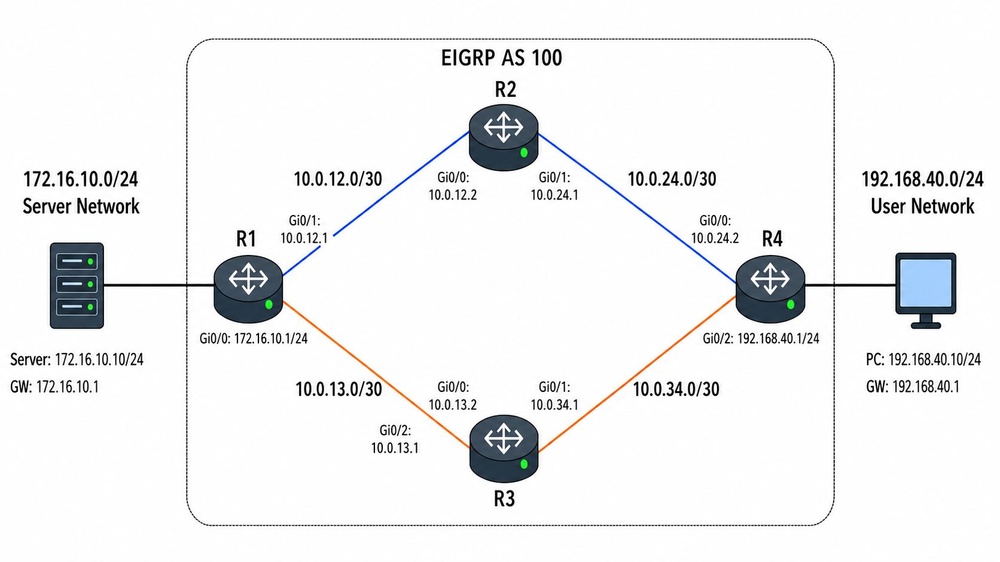

# EIGRP

## 개념

EIGRP(Enhanced Interior Gateway Routing Protocol)는 Neighbor로부터 받은 Route 정보를 기반으로 최적 경로와 Backup 경로를 계산하는 Advanced Distance-Vector Routing Protocol이다. OSPF처럼 전체 Network의 Link-State 정보를 구성하지 않고 Neighbor가 광고한 Route 정보를 기반으로 경로를 계산하므로 `Routing by Rumor`라고도 표현한다.

EIGRP의 특징은 다음과 같다.
- IP Protocol Number `88`을 사용하며 TCP나 UDP를 사용하지 않는다.
- IPv4에서는 `224.0.0.10` Multicast Address를 사용한다.
- Internal EIGRP Route의 AD 값은 `90`, Redistribution된 External EIGRP Route의 AD 값은 `170`이다.
- 경로에서 가장 낮은 Bandwidth와 모든 Interface Delay의 합을 기반으로 Metric을 계산하고, Metric이 가장 낮은 경로를 최적 경로로 선택한다. 
- Equal-Cost Load Balancing과 Unequal-Cost Load Balancing을 지원한다.
- Neighbor를 형성하려면 AS Number가 같아야 한다.

### EIGRP Route Advertisement

EIGRP가 활성화된 Interface는 Hello Packet을 전송하여 Neighbor를 찾는다. 양쪽 Router가 Neighbor 조건을 충족하면 EIGRP Neighbor를 형성하고 서로의 Neighbor Table에 등록한다.

`network` 명령어는 입력한 Network 자체를 직접 광고하는 명령어가 아니라 해당 범위에 포함되는 Interface에서 EIGRP를 활성화하는 명령어이다. Interface에서 EIGRP가 활성화되면 해당 Interface의 Connected Network가 Neighbor에게 광고된다.
```
R1(config)# router eigrp 100
R1(config-router)# network 10.0.12.0 0.0.0.3
R1(config-router)# network 192.168.10.0 0.0.0.255
```

Passive Interface를 설정하면 해당 Interface로는 Hello Packet을 보내지 않고 Neighbor도 형성하지 않는다.

Neighbor 관계가 처음 형성되면 각 EIGRP Router는 Update Packet을 사용하여 자신이 알고 있는 EIGRP Route를 Neighbor에게 광고한다.
- `network` 명령어로 EIGRP가 활성화된 Interface의 Connected Network
- 다른 EIGRP Neighbor에게 학습한 Route

Neighbor에게 Route를 광고하고 경로를 선택하는 과정은 다음과 같다.
- R1과 R2는 Hello Packet을 주고받아 Neighbor 관계를 형성한다.
- R1과 R2는 서로를 Neighbor Table에 저장한다.
- R1은 자신이 알고 있는 EIGRP Route를 Update Packet으로 R2에게 광고한다.
- R2는 Update Packet을 정상적으로 수신했다는 것을 알리기 위해 R1에게 ACK Packet을 전송한다.
- R2는 전달받은 Route와 Metric 정보를 Topology Table에 저장한다.
- R2는 자신이 알고 있는 다른 Route와 Metric을 비교하여 가장 낮은 경로를 Successor로 선택한다.
- 선택된 Successor Route를 Routing Table에 등록한다.

Neighbor 관계를 형성한 이후에는 전체 EIGRP Route를 주기적으로 다시 광고하지 않는다. 새로운 Network가 추가되거나 기존 Route가 변경 또는 삭제되면 변경된 Route 정보만 Partial Update로 광고한다.

### EIGRP Table

EIGRP는 세 가지 Table을 사용한다.

Neighbor Table: 직접 연결된 EIGRP Neighbor의 IP Address, Interface, Hold Time 및 Uptime 등을 저장한다.
```
R1# show ip eigrp neighbors

EIGRP-IPv4 Neighbors for AS(100)

H   Address         Interface       Hold  Uptime    SRTT   RTO  Q  Seq
                                  (sec)            (ms)       Cnt Num
0   10.0.12.2       Gi0/0             12  00:18:42    8   100  0  25
1   10.0.13.3       Gi0/1             11  00:15:10   10   100  0  31
```

Topology Table: Neighbor에게 학습한 모든 EIGRP Route와 Metric 정보를 저장한다.
```
R1# show ip eigrp topology

EIGRP-IPv4 Topology Table for AS(100)

P 192.168.10.0/24, 1 successors, FD is 28160
        via 10.0.12.2 (28160/25600), GigabitEthernet0/0

P 192.168.20.0/24, 1 successors, FD is 30720
        via 10.0.13.3 (30720/28160), GigabitEthernet0/1

P 192.168.30.0/24, 2 successors, FD is 33280
        via 10.0.12.2 (33280/30720), GigabitEthernet0/0
        via 10.0.13.3 (33280/30720), GigabitEthernet0/1
```
Routing Table: Topology Table에서 선택한 최적 경로인 Successor Route를 등록한다.

### EIGRP Packet

EIGRP는 주요 다섯 가지 Packet을 사용한다.

1\. Hello: Neighbor를 탐색하고 관계를 유지한다.

2\. Update: 새로운 Route나 변경된 Route 정보를 전달한다.

3\. Query: Successor를 잃고 Feasible Successor가 없을 때 Neighbor에게 다른 경로가 있는지 요청한다.

4\. Reply: Query를 보낸 Neighbor에게 대체 경로가 있는지 없는지 응답한다.

5\. ACK: Update, Query, Reply와 같은 Reliable Packet을 정상적으로 수신했음을 확인한다.

Hello Packet은 일반적으로 Multicast로 전송되며 ACK를 요구하지 않는다. 하지만 Update, Query, Reply Packet은 RTP(Reliable Transport Protocol)를 통해 전달되며 ACK를 요구한다.

### EIGRP Neighbor

EIGRP가 활성화된 Interface는 Hello Packet을 전송하여 Neighbor를 탐색한다. Neighbor를 형성하기 위해서는 다음 조건을 충족해야 한다.
- 양쪽 Router의 EIGRP AS Number가 같아야 한다.
- 양쪽 Router의 K-values가 같아야 한다.
- 양쪽 Interface의 IP Address와 통신할 수 있어야 한다.
- Authentication을 사용하면 인증 설정이 같아야 한다.

대부분의 일반적인 Link에서 Hello Interval의 기본값은 `5초`, Hold Time은 `15초`이다. 저속 NBMA Link에서는 일반적으로 `60초`와 `180초`를 사용한다.

EIGRP는 양쪽 Router의 Hello/Hold Interval이 서로 달라도 Neighbor를 형성할 수 있다. 각 Router는 상대방이 알려준 Hold Time 안에 Hello Packet을 포함한 EIGRP Packet을 수신하면 Neighbor 관계를 유지한다.

### EIGRP Metric

EIGRP는 Bandwidth, Delay, Load, Reliability 등의 값을 Metric 계산에 사용할 수 있지만 기본 K-values는 `K1=1, K2=0, K3=1, K4=0, K5=0`이다. 따라서 기본적으로 Bandwidth와 Delay만 Metric 계산에 사용한다.
- Bandwidth: 출발지에서 목적지까지의 경로 중 가장 낮은 Bandwidth를 사용한다.
- Delay: 출발지에서 목적지까지의 경로에 포함된 모든 Interface의 Delay를 합산한다.
```
Metric = 256 × [(10^7 / Lowest Bandwidth) + Sum of Delay]
```
Bandwidth는 `Kbps`, Delay는 `10 Microseconds` 단위로 계산하며, Metric 값이 가장 낮은 경로를 선택한다.

### Successor and Feasible Successor

Successor는 Routing Table에 등록되는 최적 경로이다.
- Successor은 Next-hop IP Address이다.

Feasible Distance(FD)는 현재 Router가 Successor를 통해 목적지까지 도달하는 데 사용하는 전체 Metric이다.

Reported Distance(RD)는 Neighbor가 해당 목적지까지 도달하는 데 사용하는 Metric이다, Advertised Distance(AD)라고도 한다.

Feasible Successor는 Successor에 장애가 발생했을 때 즉시 사용할 수 있는 Loop 없는 Backup 경로이다.

Backup 경로가 Feasible Successor가 되려면 다음 Feasibility Condition을 만족해야 한다.
```
Neighbor의 Reported Distance < 현재 Successor의 Feasible Distance
```

Neighbor의 RD가 현재 Router의 FD보다 작다는 것은 Neighbor가 현재 Router보다 목적지에 더 가까이 있다는 의미이다. 만약 RD가 FD보다 크거나 같으면 현재 Router는 “어? 이 Neighbor의 RD가 내 FD보다 큰데, 그러면 이 Neighbor가 나를 거쳐 목적지로 가고 있을 수도 있겠네. 이 경로를 Backup으로 선택하면 Loop가 발생할 수도 있겠다.”라고 판단한다.  

하지만 RD가 FD보다 작으면 “이 Neighbor는 나보다 목적지에 더 가까우니까 나를 다시 거쳐 가는 경로가 아니겠네.”라고 판단한다. 따라서 해당 경로를 Loop 없는 Backup 경로인 Feasible Successor로 저장한다.  

### Passive and Active State

Passive와 Active는 EIGRP Topology Table에 저장된 각 Route의 상태이다.

Passive는 해당 Route의 경로 계산이 완료되어 정상적으로 수렴한 상태이며 `P`로 표시된다. EIGRP Topology Table에서 대부분의 정상 Route는 Passive 상태이다. 
```
R1# show ip eigrp topology

EIGRP-IPv4 Topology Table for AS(100)/ID(1.1.1.1)

Codes: P - Passive, A - Active, U - Update, Q - Query, R - Reply

P 192.168.10.0/24, 1 successors, FD is 28160
        via 10.0.12.2 (28160/25600), GigabitEthernet0/0
```

Active는 Successor를 잃고 Feasible Successor도 없어 Neighbor에게 Query를 보내고 대체 경로를 찾는 상태이며 `A`로 표시된다.
```
R1# show ip eigrp topology active

EIGRP-IPv4 Topology Table for AS(100)/ID(1.1.1.1)

Codes: P - Passive, A - Active, Q - Query, R - Reply

A 192.168.10.0/24, 0 successors, FD is Inaccessible, Q
        1 replies, active 00:00:12, query-origin: Local origin
        Remaining replies:
                via 10.0.12.2, GigabitEthernet0/0
```

Successor에 장애가 발생하면 EIGRP는 먼저 Feasible Successor가 있는지 확인한다.
- Feasible Successor가 있으면 해당 경로를 즉시 Successor로 변경하고 Passive 상태를 유지한다.
- Feasible Successor가 없으면 해당 Route를 Active 상태로 전환하고 Neighbor에게 Query를 보낸다.

Active 상태에서는 Query를 보낸 모든 Neighbor의 Reply를 기다린다. 모든 Reply를 수신하여 경로 계산이 완료되면 다시 Passive 상태가 되고, 대체 경로가 없으면 해당 Route를 Topology Table에서 삭제한다. 
- Active Timer의 기본값은 `3분`이며, 이 시간 안에 모든 Reply를 받지 못하면 SIA(Stuck-in-Active)가 발생하고 응답하지 않은 Neighbor와의 EIGRP Neighbor 관계가 끊어진다.

### EIGRP Stub

EIGRP Stub은 일반적으로 본사와 연결된 Branch Router에 설정하여 Query가 불필요하게 Branch까지 확산되는 것을 제한하는 기능이다.
- 본사 Router는 Stub으로 설정된 지사 Router를 본사 내부 Route에 대한 대체 경로로 사용할 수 없다는 것을 인식하고 해당 Router에 Query를 보내지 않는다.
- Stub Router는 `eigrp stub`에서 허용한 Route만 Neighbor에게 광고하며, Connected, Static, Summary Route 등을 광고 항목으로 지정할 수 있다.
- 본사에서 지사로 불필요한 Query를 보내지 않으므로 WAN Traffic이 줄어들고, Reply를 받지 못해 SIA가 일어날 가능성도 낮아진다.

### EIGRP Load Balancing

Equal-Cost Load Balancing은 같은 목적지로 가는 여러 경로의 Metric이 같을 때 모두 Routing Table에 등록하여 사용하는 방식이다.

Unequal-Cost Load Balancing은 variance를 설정하여 Metric이 다른 경로도 Routing Table에 등록하여 함께 사용하는 방식이다.
- `variance`를 사용하면 Metric이 다른 Feasible Successor도 Routing Table에 등록하여 Unequal-Cost Load Balancing을 수행할 수 있다.

경로가 Unequal-Cost Load Balancing에 포함되려면 다음 두 조건을 모두 충족해야 한다.
- Feasibility Condition을 만족하여 Feasible Successor가 되어야 한다.
- 경로의 Metric이 `Successor Metric × Variance` 범위 안에 있어야 한다.

예를 들어 Successor의 Metric이 `1000`이고 Feasible Successor의 Metric이 `1500`이면 `variance 2`를 설정했을 때 허용 범위는 `2000`이 된다. Feasible Successor의 Metric이 허용 범위 안에 있으므로 두 경로를 모두 사용할 수 있다.

`variance`의 기본값은 `1`이며 단순히 Variance 값을 높여도 Feasibility Condition을 만족하지 못한 경로는 Load Balancing에 포함되지 않는다.

### EIGRP Route Summarization

EIGRP Route Summarization은 여러 상세 Route를 하나의 Summary Route로 묶어 Neighbor에게 광고하는 기능이다.
- Topology Table과 Routing Table의 Route 수를 줄일 수 있다.
- 상세 Route의 변경이 다른 Network까지 전달되는 범위를 줄일 수 있다.
- Query가 불필요하게 확산되는 범위를 줄일 수 있다.
- Summary를 설정한 Router에는 Summary 범위의 `Null0` Route가 자동으로 생성된다.

목적지가 Summary 범위에는 포함되지만 실제 Routing Table에 Route가 없으면 `Null0`로 전달하여 폐기함으로써 Routing Loop를 방지한다.

### Classic Mode and Named Mode

Classic Mode는 `router eigrp <AS Number>` 형식으로 EIGRP Process를 생성하고 `network` 명령어로 Interface를 활성화한다.

Named Mode는 `router eigrp <Name>` 아래에 IPv4, IPv6 및 VRF별 Address Family를 구성한다. 
- Interface 설정은 `af-interface`, 경로 계산 관련 설정은 `topology base`에서 관리한다.

Classic Mode는 AS Number로 EIGRP를 구성하는 기존 방식으로, 설정이 단순하지만 IPv4, IPv6 및 Interface 설정이 여러 위치에 나누어져 있다.  

Named Mode는 하나의 Name 아래에서 IPv4, IPv6, VRF 및 Interface 설정을 통합하여 관리하기 위해 만든 새로운 방식이다.  

Classic Mode
```
R1(config)# router eigrp 100
R1(config-router)# network 10.0.12.0 0.0.0.3
R1(config-router)# variance 2

R1(config)# interface GigabitEthernet0/0
R1(config-if)# ip hello-interval eigrp 100 5
R1(config-if)# ip hold-time eigrp 100 15
```

Named Mode
```
R1(config)# router eigrp CORP-EIGRP
R1(config-router)# address-family ipv4 unicast autonomous-system 100
R1(config-router-af)# network 10.0.12.0 0.0.0.3
R1(config-router-af)# af-interface GigabitEthernet0/0
R1(config-router-af-interface)# hello-interval 5
R1(config-router-af-interface)# hold-time 15
R1(config-router-af-interface)# exit-af-interface
R1(config-router-af)# topology base
R1(config-router-af-topology)# variance 2
R1(config-router-af-topology)# exit-af-topology
R1(config-router-af)# exit-address-family
```
--- 

## 동작 원리

### EIGRP Neighbor 및 경로 선택

1\. R1은 EIGRP가 활성화된 Interface에서 `224.0.0.10`으로 Hello Packet을 전송한다.

2\. R2는 R1의 Hello Packet을 수신하고 AS Number, K-values 및 Authentication 설정 등을 확인한다.

3\. 설정이 일치하면 R2는 R1을 Neighbor Table에 등록한다.

4\. R2도 자신의 Hello Packet을 R1에게 전송한다.

5\. R1은 R2의 Hello Packet을 수신하고 설정이 일치하면 R2를 Neighbor Table에 등록한다.

6\. R1은 자신이 알고 있는 EIGRP Route를 Update Packet으로 R2에게 전달한다.
- Hello Packet에는 Route 정보가 포함되지 않으며, Neighbor 관계가 형성된 후 Update Packet으로 처음 Route 정보를 공유한다.
- 이때 R1은 전체 Routing Table이 아니라 EIGRP에 포함된 Connected Route와 다른 Neighbor에게 학습한 EIGRP Route 등을 전달한다.

7\. R2는 Update Packet을 정상적으로 수신하면 R1에게 ACK Packet을 전송하고, 전달받은 Route와 Metric 정보를 Topology Table에 저장한다.

8\. R2도 자신이 알고 있는 EIGRP Route를 Update Packet으로 R1에게 전달한다.

9\. R1은 Update Packet을 정상적으로 수신하면 R2에게 ACK Packet을 전송하고, 전달받은 Route와 Metric 정보를 Topology Table에 저장한다.

10\. 각 Router의 DUAL은 목적지별 경로의 Metric을 비교하여 Metric이 가장 낮은 경로를 Successor로 선택한다.
- DUAL은 EIGRP가 Loop 없는 최적 경로와 Backup 경로를 계산하는 알고리즘이다.

11\. R1과 R2가 선택한 Successor Route는 각 Router의 Routing Table에 `D` Route로 등록된다.

12\. 각 Router는 다른 경로의 RD가 현재 Successor의 FD보다 작은지 확인한다.
- EIGRP로 학습한 경로는 Topology Table에 저장된다.
- `RD < FD`를 만족하면 해당 경로를 Feasible Successor로 지정하여 즉시 사용할 수 있는 Backup 경로로 유지한다.
- 조건을 만족하지 못하면 Topology Table에 일반 경로로 저장하지만 Feasible Successor로 사용하지 않는다.

13\. Network에 변화가 발생하면 변경을 감지한 Router는 전체 Routing Table이 아니라 변경된 Route만 Partial Update로 Neighbor에게 전달한다.
- R1의 Route가 변경되면 R1이 R2에게 Partial Update를 전달한다.
- R2의 Route가 변경되면 R2가 R1에게 Partial Update를 전달한다.

14\. Successor에 장애가 발생하면 해당 Router는 Feasible Successor가 있는지 확인한다.
- Feasible Successor가 있으면 해당 경로를 즉시 새로운 Successor로 변경한다.
- Feasible Successor가 없으면 Route를 Active 상태로 전환하고 Neighbor에게 Query를 보낸다.

15\. Query를 받은 Neighbor는 자신의 Topology Table에서 대체 경로가 있는지 확인하고 Reply를 전달한다.
- R1이 Query를 보내면 R2가 대체 경로의 유무를 Reply한다.
- R2가 Query를 보내면 R1이 대체 경로의 유무를 Reply한다.

16\. Query를 보낸 Router는 모든 Reply를 수신하면 DUAL로 경로를 다시 계산하고 해당 Route를 Passive 상태로 전환한다. 대체 경로가 없으면 해당 Route를 Topology Table에서 삭제한다.

---

## 예시 및 구성도

### Neighbor and Route Selection

회사 사용자들은 R4에 연결되어 있으며, 기존의 R1, R2, R4는 EIGRP AS `100`으로 구성되어 있다. 사용자들은 R1의 `172.16.10.0/24` Server Network에 접속할 때 R2를 통하는 경로를 사용하고 있다. 하지만 R2 경로에 장애가 발생하면 통신이 중단될 수 있으므로, 관리자는 이중화를 위해 R3를 R1과 R4에 연결하고 EIGRP AS `100`을 활성화하였다.  R3는 Server Network의 Route를 R4에 광고하여 Backup 경로를 제공한다.  



1. R3는 EIGRP가 활성화된 Interface에서 Hello Packet을 전송한다.

2. R1과 R4는 R3의 Hello Packet을 수신하고 AS Number, K-values 및 Authentication 설정 등을 확인한다.

3. 설정이 일치하면 R3는 R1 및 R4와 각각 EIGRP Neighbor를 형성한다.

4. R1은 `172.16.10.0/24` Server Network를 Update Packet으로 R3에게 광고한다.

5. R3는 R1에게 학습한 Server Network의 Route를 Topology Table에 저장하고 R4에게 광고한다.

6. R4는 기존 R2 경로와 새로 학습한 R3 경로를 Topology Table에 저장한다.
- R2 경로: R2의 RD `2000`, R4가 계산한 전체 Metric `2500` 
- R3 경로: R3의 RD `2200`, R4가 계산한 전체 Metric `3000`

7. R4는 전체 Metric이 더 낮은 R2 경로를 Successor로 선택한다.

8. R4는 R3 경로가 Feasibility Condition을 만족하는지 확인한다.
```
R3의 RD 2200 < R4의 FD 2500
```

9. R3의 RD가 R4의 FD보다 작으므로 R3 경로는 Feasible Successor가 된다.
- R3 경로는 Backup 경로로 Topology Table에 유지된다.

10. R2 경로에 장애가 발생하면 R4는 Query를 보내지 않고 R3 경로를 즉시 Successor로 변경한다.

11. R4에 `variance 2`를 설정하면 R3 경로의 Metric `3000`은 `2500 × 2` 범위 안에 포함된다.
- R3 경로는 Feasibility Condition도 만족하므로 R2와 R3 경로가 모두 Routing Table에 등록된다.
- Metric이 낮은 R2 경로에 더 많은 Traffic이 전달된다.

---

## 명령어

### Classic Mode

EIGRP AS `100`을 생성하고 지정한 IPv4 Interface에서 EIGRP를 활성화한다.
```
R1(config)# router eigrp 100
R1(config-router)# network 10.0.12.0 0.0.0.3
R1(config-router)# network 172.16.10.0 0.0.0.255
```

모든 Interface를 Passive로 설정한 후 Neighbor를 형성할 Interface만 제외한다.
```
R1(config)# router eigrp 100
R1(config-router)# passive-interface default
R1(config-router)# no passive-interface gi0/1
```

Unequal-Cost Load Balancing을 설정한다.
```
R4(config)# router eigrp 100
R4(config-router)# variance 2
R4(config-router)# maximum-paths 4
```

Branch Router를 EIGRP Stub으로 설정하고 Connected Route와 Summary Route만 광고한다.
```
R4(config)# router eigrp 100
R4(config-router)# eigrp stub connected summary
```

R1이 R2 방향으로 광고하는 여러 Route를 `172.16.8.0/21`로 요약한다.
```
R1(config)# interface gi0/1
R1(config-if)# ip summary-address eigrp 100 172.16.8.0 255.255.248.0
```

### Named Mode

Named EIGRP를 생성하고 IPv4 AS `100`을 설정한다.
```
R1(config)# router eigrp CORP-EIGRP
R1(config-router)# address-family ipv4 unicast autonomous-system 100
R1(config-router-af)# network 10.0.12.0 0.0.0.3
R1(config-router-af)# network 172.16.10.0 0.0.0.255
```

Named Mode에서 Interface를 Passive로 설정한다.
```
R1(config-router-af)# af-interface gi0/2
R1(config-router-af-interface)# passive-interface
R1(config-router-af-interface)# exit-af-interface
```

Named Mode에서 Variance를 설정한다.
```
R4(config-router-af)# topology base
R4(config-router-af-topology)# variance 2
R4(config-router-af-topology)# maximum-paths 4
```

Named Mode에서 Branch Router를 EIGRP Stub으로 설정한다.
```
R4(config-router-af)# eigrp stub connected summary
```

### 확인 명령어

EIGRP Neighbor를 확인한다.
```
R1# show ip eigrp neighbors
```

EIGRP가 활성화된 Interface를 확인한다.
```
R1# show ip eigrp interfaces
```

EIGRP Topology Table과 Successor, FD, RD를 확인한다.
```
R1# show ip eigrp topology
```

EIGRP로 학습한 Route를 확인한다.
```
R1# show ip route eigrp
```

EIGRP AS Number, K-values, Network, Passive Interface 및 Redistribution 정보를 확인한다.
```
R1# show ip protocols
```

---

## Troubleshooting

### EIGRP Neighbor가 형성되지 않는 경우

1\. Interface와 IP Address가 정상인지 확인한다.
```
R1# show ip interface brief
R1# ping 10.0.12.2
```

2\. 양쪽 Interface에서 EIGRP가 활성화되어 있는지 확인한다.
```
R1# show ip eigrp interfaces
R1# show running-config | section router eigrp
```

3\. 양쪽 Router의 AS Number가 같은지 확인한다.
```
R1# show ip protocols
```

4\. 양쪽 Router의 K-values가 같은지 확인한다.
- 기본값은 `K1=1, K2=0, K3=1, K4=0, K5=0`이다.
- K-values가 다르면 Neighbor를 형성할 수 없다.
```
R1# show ip protocols
```

5\. 연결 Interface가 Passive Interface로 설정되어 있는지 확인한다.
```
R1# show ip protocols
```

6\. Authentication을 사용한다면 Key Chain, Key 및 Authentication Mode가 일치하는지 확인한다.

7\. ACL이나 Firewall이 EIGRP Protocol Number `88` 또는 `224.0.0.10` Multicast Traffic을 차단하는지 확인한다.


### EIGRP Route를 학습하지 못하거나 경로가 비정상인 경우

1\. 목적지까지 Ping과 Traceroute를 실행하여 도달 여부와 실제 경로를 확인한다.
```
R1# ping 172.16.10.10
R1# traceroute 172.16.10.10
```

2\. EIGRP Neighbor가 정상적으로 형성되어 있는지 확인한다.
```
R1# show ip eigrp neighbors
```

3\. 목적지 Route가 Topology Table에 존재하는지 확인한다.
```
R1# show ip eigrp topology 172.16.10.0/24
R1# show ip eigrp topology all-links
```

4\. Successor Route가 Routing Table에 등록되어 있는지 확인한다.
```
R1# show ip route eigrp
```

5\. `network` 명령어의 Network Address와 Wildcard Mask가 해당 Interface를 포함하는지 확인한다.
```
R1# show running-config | section router eigrp
R1# show ip eigrp interfaces
```

6\. 더 낮은 AD 값을 가진 Static Route나 다른 Routing Protocol의 Route가 EIGRP Route보다 우선하는지 확인한다.

---

## 주요 질문

EIGRP는 어떤 Routing Protocol인가?
- EIGRP는 Neighbor에게 받은 Route 정보를 기반으로 DUAL을 실행하여 Loop 없는 최적 경로와 Backup 경로를 계산하는 Distance-Vector Routing Protocol이다.

EIGRP가 사용하는 IP Protocol Number와 Multicast Address는 무엇인가?
- IP Protocol Number `88`과 IPv4 Multicast Address `224.0.0.10`을 사용한다.

EIGRP Neighbor를 형성하려면 어떤 설정이 일치해야 하는가?
- AS Number와 K-values가 같아야 하며, Authentication을 사용하면 인증 설정도 같아야 한다.

EIGRP의 Hello/Hold Interval이 달라도 Neighbor를 형성할 수 있는가?
- 각 Router가 자신의 Hold Time을 Hello Packet으로 전달하므로 Hello/Hold Interval이 달라도 Neighbor를 형성할 수 있다.

EIGRP가 사용하는 세 가지 Table은 무엇인가?
- Neighbor Table, Topology Table, Routing Table을 사용한다.

Successor와 Feasible Successor의 차이는 무엇인가?
- Successor는 Routing Table에 등록되는 최적 경로이고, Feasible Successor는 Successor 장애 시 즉시 사용할 수 있는 Loop 없는 Backup 경로이다.

Feasible Distance와 Reported Distance의 차이는 무엇인가?
- FD는 현재 Router가 목적지까지 계산한 Metric이고, RD는 Neighbor가 해당 목적지까지 계산하여 광고한 Metric이다.

Feasibility Condition은 무엇인가?
- Neighbor의 RD가 현재 Successor의 FD보다 작아야 해당 경로를 Feasible Successor로 사용할 수 있다는 조건이다.

EIGRP Route의 Passive와 Active 상태는 무엇인가?
- Passive는 경로 계산이 완료된 정상 상태이고, Active는 Feasible Successor가 없어 Query를 보내고 대체 경로를 계산하는 상태이다.

Successor에 장애가 발생하면 EIGRP는 어떻게 동작하는가?
- Feasible Successor가 있으면 즉시 경로를 전환하고, 없으면 Route를 Active 상태로 전환하여 Neighbor에게 Query를 보낸다.
