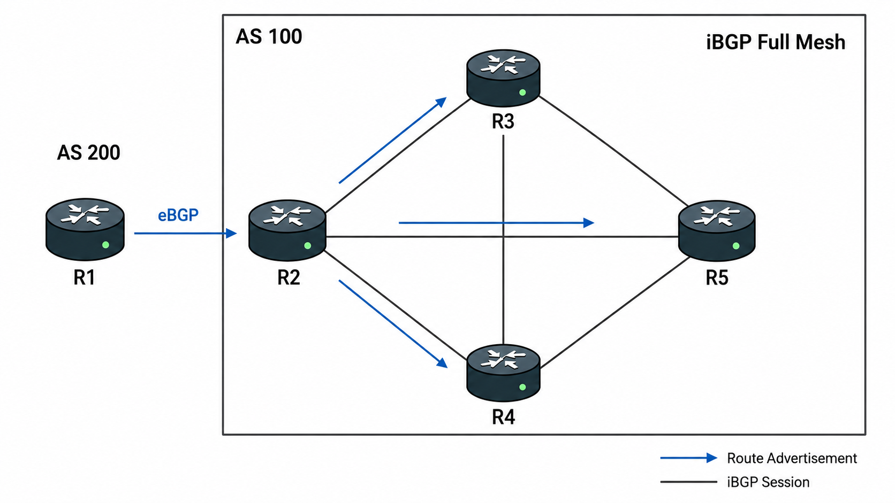
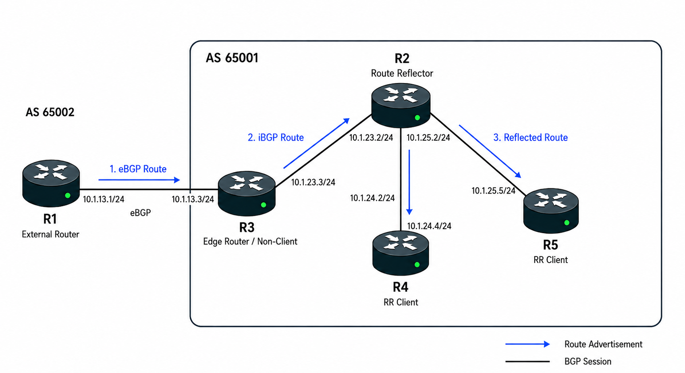
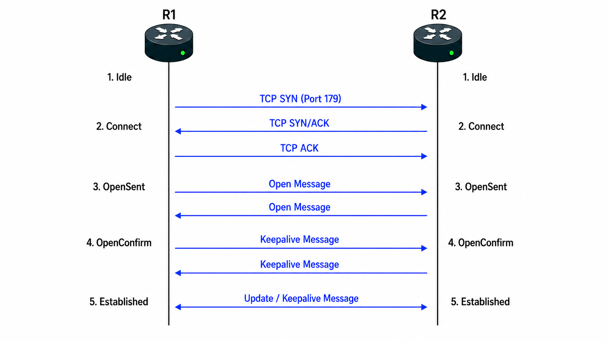
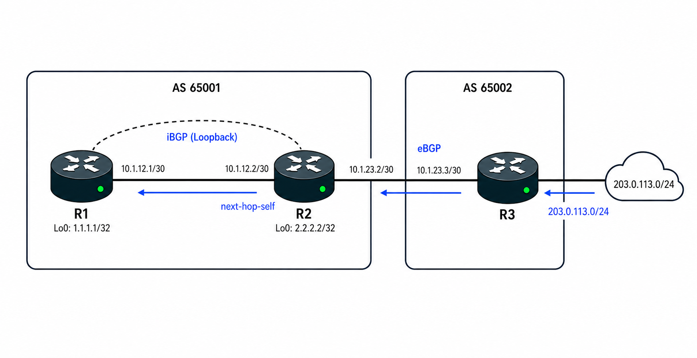

# BGP 기초

## 개념

### BGP

BGP(Border Gateway Protocol)는 서로 다른 Autonomous System 사이에서 Network 경로를 교환하기 위해 사용하는 Path Vector Routing Protocol이다.

OSPF와 EIGRP는 하나의 AS 내부에서 최적 경로를 계산하는 IGP이고, BGP는 AS 사이에서 경로를 교환하고 정책을 기준으로 Best Path를 선택하는 EGP이다.

BGP는 인터넷 규모의 많은 Route를 처리해야 하므로 빠른 수렴보다 안정성, 확장성 및 정책 제어에 중점을 둔다.

BGP는 다음과 같은 특징이 있다.
- BGP Neighbor를 자동으로 발견하지 않고 관리자가 직접 설정한다.
- TCP `179` Port를 사용하여 신뢰성 있게 Route를 교환한다.
- 여러 Path Attribute를 순서대로 비교하여 Best Path를 선택한다.
- 처음에는 전체 Route를 교환하고, 이후에는 변경된 Route만 `Partial Update`한다. 
- OSPF와 EIGRP의 `network` 명령은 Interface에서 Protocol을 활성화하고, BGP의 `network` 명령은 Routing Table의 특정 Route를 BGP에 등록한다.  

### Autonomous System

Autonomous System(AS)은 회사나 ISP가 독립적인 Routing 정책으로 관리하는 Network와 Router의 집합이다.  
- 하나의 ISP가 여러 지역의 Router와 IP Network를 하나의 Routing 정책으로 관리하면 전체가 하나의 AS가 된다.  
- 회사가 ISP로부터 할당받은 Public IP와 Default Route만 사용하고 ISP가 해당 Route를 대신 광고하면, 회사는 독립적인 AS로 보이지 않는다. 인터넷에서는 ISP의 AS를 통해 회사 Network에 도달하며, 회사는 ISP에 연결된 고객 Network로 인식된다.
- 회사가 인터넷 주소 관리기관으로부터 Public ASN을 할당받고 자신의 Public IP 대역을 BGP로 직접 광고하면, 인터넷에서는 해당 회사를 독립적인 AS로 인식한다.

AS는 자신을 구분하기 위한 고유한 ASN(Autonomous System Number)을 사용하며, BGP는 이 번호를 통해 Route가 어떤 AS를 거쳐왔는지 확인한다.

예를 들어 AS `65001`과 AS `65002`가 BGP Neighbor를 형성하면 서로 다른 AS 사이의 eBGP Session으로 동작한다.

### eBGP

eBGP(External BGP)는 서로 다른 AS에 속한 Router 사이에서 BGP Route를 교환한다.

eBGP는 일반적으로 직접 연결된 Router끼리 Neighbor를 형성하며, 기본 TTL은 `1`이다.

eBGP로 학습한 Route의 Cisco 기본 Administrative Distance는 `20`이다.

Route를 광고할 때 일반적으로 Next-Hop을 자신의 IP Address로 변경한다.  

### iBGP 
 
iBGP(Internal BGP)는 같은 AS에 속한 Router 사이에서 BGP Route를 교환한다. 
 
iBGP는 외부 AS에서 학습한 BGP Route를 같은 AS 내부의 다른 BGP Router에게 전달하기 위해 사용한다. OSPF나 EIGRP와 같은 IGP를 대체하는 Protocol은 아니다. 
 
기본 TTL은 `255`이다. 
 
iBGP로 학습한 Route의 Cisco 기본 Administrative Distance는 `200`이다. 

### BGP Neighbor

BGP는 OSPF나 EIGRP처럼 Multicast Hello를 사용하여 Neighbor를 자동으로 찾지 않는다.

양쪽 Router에서 상대방의 IP Address와 ASN을 직접 설정해야 하며, 상대방 IP까지 IP Reachability가 확보되어 있어야 한다.

설정한 Remote AS가 자신의 AS와 다르면 eBGP, 같으면 iBGP로 동작한다.

### BGP Router ID

BGP Router ID는 BGP Router를 식별하는 `32-bit` 값이다.

Router ID를 직접 설정하지 않으면 일반적으로 가장 높은 Loopback IP Address를 사용하고, Loopback Interface가 없으면 가장 높은 Active Physical Interface IP Address를 사용한다.

Router ID를 자동으로 선택하면 사용 중인 Interface가 Down되거나 BGP가 재시작될 때 Router ID도 달라질 수 있다. 따라서 운영 환경에서는 Router ID가 항상 동일하게 유지되도록 직접 설정하는 것이 좋다.  
- Router ID가 Interface 상태나 IP 변경의 영향을 받지 않도록 직접 설정하는 것이 좋다.

### BGP Timer

Cisco BGP의 기본 Keepalive Time은 `60초`이고 Hold Time은 `180초`이다.

Keepalive 메시지를 주기적으로 교환하여 Session을 유지하며, Hold Time 동안 BGP 메시지를 수신하지 못하면 Neighbor Session을 종료한다.

### BGP 메시지

BGP는 Neighbor Session을 형성하고 Route 정보를 교환하기 위해 다음 메시지를 사용한다.
- Open: BGP Version, ASN, Hold Time, Router ID 등의 정보를 교환하여 Session을 시작한다.
- Keepalive: Neighbor Session이 정상적으로 유지되고 있음을 알린다.
- Update: 새로 추가되거나 사라진 Route와 경로 정보를 전달한다.
- Notification: 오류 내용을 알리고 BGP Session을 종료한다.

### BGP Neighbor State

BGP Neighbor는 다음 과정을 거쳐 `Established` 상태까지 진행된다.

1\. Idle: BGP Neighbor 연결을 시작하기 전의 상태이다.  

2\. Connect: Neighbor와 `TCP 3-Way Handshake`가 완료되기를 기다리는 상태이다.  

3\. Active: TCP 연결에 실패하여 다시 연결을 시도하는 상태이다.

4\. OpenSent: TCP 연결 후 Open 메시지를 전송하고 상대방의 Open 메시지를 기다리는 상태이다.

5\. OpenConfirm: 상대방의 Open 메시지를 정상적으로 확인한 후 Keepalive 메시지를 전송하고, 상대방의 Keepalive 또는 Notification 메시지를 기다리는 상태이다.

6\. Established: BGP Neighbor가 정상적으로 형성되어 Update와 Keepalive 메시지를 교환하는 상태이다.

### BGP Route 광고

BGP는 Connected Route나 IGP Route를 자동으로 광고하지 않는다.

로컬 Route를 BGP로 광고하려면 `network` 또는 `redistribute` 명령을 사용해야 한다.

`network` 명령을 사용하려면 광고하려는 Network와 Subnet Mask가 Local Routing Table의 Route와 정확히 일치해야 한다.

예를 들어 `203.0.113.0/24`를 광고하려면 Local Routing Table에도 동일한 `203.0.113.0/24` Route가 존재해야 한다.
```
R1(config)# router bgp 65001
R1(config-router)# network 203.0.113.0 mask 255.255.255.0
```

`redistribute` 명령은 Local Routing Table에 등록된 특정 종류의 Route 전체를 BGP로 가져와 광고할 때 사용한다.
 
Local Routing Table에 다음과 같은 Static Route가 있다. 
 ``` 
S  203.0.113.0/24 
S  198.51.100.0/24 
``` 
 
다음과 같이 설정하면 Local Routing Table에 등록된 모든 Static Route를 BGP로 가져와 광고한다. 
 ``` 
R1(config)# router bgp 65001 
R1(config-router)# redistribute static 
``` 
 
OSPF Route를 BGP로 가져오려면 다음과 같이 설정한다. 
``` 
R1(config-router)# redistribute ospf 1 
``` 
 
`network`: 광고할 Route를 하나씩 직접 지정한다. 

`redistribute`: Static, Connected, OSPF, EIGRP와 같은 특정 종류의 Route를 BGP로 가져와 광고한다. 

`redistribute`는 여러 Route가 함께 광고될 수 있으므로 `Route-Map`이나 `Prefix-List`를 사용하여 필요한 Route만 제한하는 것이 좋다.

### Next-Hop 
 
eBGP는 Route를 다른 AS로 광고할 때 Next-Hop을 자신으로 변경한다.

iBGP는 외부 AS에서 eBGP로 학습한 Route를 같은 AS 내부의 iBGP Neighbor에게 광고할 때, 기존 Next-Hop을 그대로 유지한다.    
- `next-hop-self`를 사용하여 자신을 Next-Hop으로 변경할 수 있다.    
  
### iBGP Route 재광고 규칙  
  
iBGP Neighbor에게 학습한 Route를 다른 iBGP Neighbor에게 광고하지 않는다.    
- 같은 AS 내부에서는 Route를 전달해도 AS_PATH에 ASN이 추가되지 않아 Loop를 확인하기 어렵기 때문에, iBGP로 학습한 Route를 다른 iBGP Neighbor에게 다시 광고하지 않는다.  
  
eBGP로 학습한 Route는 직접 연결된 iBGP Neighbor에게 광고할 수 있지만, 해당 Route를 iBGP로 학습한 Router는 다른 iBGP Neighbor에게 다시 광고하지 않는다.  
```  
R1 --eBGP-- R2 --iBGP-- R3 --iBGP-- R4 --iBGP-- R5  
  
R1 → R2 : eBGP로 Route 전달  
R2 → R3 : iBGP로 Route 전달 가능  
R3 → R4 : 전달 불가  
R4 → R5 : 전달 불가  
``` 

따라서 기본 iBGP 환경에서는 모든 iBGP Router가 서로 직접 Neighbor를 형성하는 Full Mesh 구성이 필요하다. 
 


iBGP Router가 `n`대일 때 필요한 Session 수는 다음과 같다. 
 
`n × (n - 1) / 2` 
 
예를 들어 iBGP Router가 4대라면 총 6개의 iBGP Session이 필요하다. 
 
대규모 Network에서는 iBGP Session 수를 줄이기 위해 Route Reflector를 사용할 수 있다. 

###  Route Reflector

iBGP로 학습한 Route는 다른 iBGP Neighbor에게 다시 광고하지 않는다, 기본 iBGP 환경에서는 모든 Router가 서로 Neighbor를 형성하는 Full Mesh 구성이 필요하다.

Route Reflector(RR)는 iBGP로 학습한 Route를 다른 iBGP Neighbor에게 다시 광고하여 Full Mesh 구성을 줄이는 Router이다.

Route Reflector와 Neighbor를 형성하고 Route를 전달받는 Router를 RR Client라고 한다.

RR Client는 다른 Client와 직접 Neighbor를 형성하지 않아도 Route Reflector를 통해 BGP Route를 교환할 수 있다.



R2를 Route Reflector로 구성하려면 R4, R5를 RR Client로 지정한다.
- R3는 외부 AS로부터 eBGP Route를 직접 광고받으므로 RR Client로 지정할 필요가 없으며, R4와 R5만 RR Client로 지정한다.
```
R2(config)# router bgp 65001
R2(config-router)# neighbor 10.1.23.3 remote-as 65001
R2(config-router)# neighbor 10.1.24.4 remote-as 65001
R2(config-router)# neighbor 10.1.24.4 route-reflector-client
R2(config-router)# neighbor 10.1.25.5 remote-as 65001
R2(config-router)# neighbor 10.1.25.5 route-reflector-client
```

Route Reflector는 Route를 전달할 때 Next-Hop을 변경하지 않기 때문에, 필요한 경우 `next-hop-self`를 설정해야 한다.

### BGP Best Path

BGP는 동일한 Prefix에 여러 경로가 존재하면 Path Attribute를 비교하여 Best Path를 선택한다.

Cisco BGP의 주요 Best Path 선택 순서는 다음과 같다.

1\. Next-Hop에 도달할 수 있는 Route만 Best Path 후보로 사용한다.

2\. Weight가 가장 높은 Route를 선택한다.

3\. Local Preference가 가장 높은 Route를 선택한다.

4\. Local Router에서 생성한 Route를 선택한다.

5\. AS-Path가 가장 짧은 Route를 선택한다.

6\. Origin Type이 가장 낮은 Route를 선택한다.
- `IGP(i)` → `EGP(e)` → `Incomplete(?)` 순서로 선호한다.

7\. MED가 가장 낮은 Route를 선택한다.
- 기본적으로 같은 인접 AS에서 받은 경로끼리 비교한다.

8\. eBGP로 학습한 Route를 iBGP로 학습한 Route보다 우선한다.

9\. BGP Next-Hop까지의 IGP Metric이 가장 낮은 Route를 선택한다.

10\. 두 경로가 모두 eBGP Route라면 가장 오래된 Route를 선택한다.

11\. Neighbor의 BGP Router ID가 가장 낮은 Route를 선택한다.

12\. 마지막으로 Neighbor IP Address가 가장 낮은 Route를 선택한다.

일반적인 환경에서는 다른 BGP Router에서 학습한 Route의 Weight가 `0`이고, Local Preference도 기본값 `100`을 사용하는 경우가 많다. 또한 Locally Originated Route가 아닌 외부에서 학습한 Route끼리 비교하는 경우가 많기 때문에, 실질적으로 AS-Path부터 경로 차이가 발생하는 경우가 많다. 

### 주요 Path Attribute

#### Weight

Cisco Router 내부에서만 사용하는 로컬 우선순위이며, 다른 BGP Router로 전달되지 않는다.  
- 값이 높을수록 우선한다.	
- 다른 BGP Router에서 학습 받은 Route의 기본값은 0이다. 
- 로컬 Router에서 직접 생성한 Route의 기본값은 32768이다.

#### Local Preference

같은 AS에서 외부 Network로 나가는 경로가 여러 개일 때 어떤 출구를 우선 사용할지 결정한다.     
- 값이 높을수록 우선한다.
- Cisco 기본값은 `100`이다.
- Local Preference 값은 같은 AS의 iBGP Neighbor에게 Route와 함께 전달되는 값이다.

#### AS-Path

목적지까지 거쳐야 하는 ASN의 목록이다.  
- AS-Path가 짧을수록 우선한다.
- eBGP로 Route를 광고할 때 자신의 ASN을 AS-Path에 추가한다.
- AS-Path에 자신의 ASN이 포함되어 있으면 Routing Loop로 판단하고 해당 Route를 받지 않는다.

#### Origin

Route가 BGP에 등록된 방식을 나타낸다.  
- `i` → `e` → `?` 순서로 우선한다.
- `i` (IGP): `network` 명령으로 BGP에 직접 등록된 Route이다.
- `e` (EGP): 과거의 EGP Routing Protocol을 통해 학습된 Route이며 현재는 거의 사용하지 않는다.
- `?` (Incomplete): OSPF, EIGRP 같은 다른 Routing Protocol의 Route를 Redistribution하여 출처가 명확하지 않은 Route이다.

#### MED

상대 AS에게 우리 AS로 들어올 때 어떤 경로를 우선해서 사용하면 되는지 알려주는 값이다.  
- 값이 낮을수록 우선한다.
- 같은 AS에서 광고받은 여러 경로끼리 MED 값을 비교한다.

---

## 동작 원리

### BGP Neighbor 형성 과정

BGP Neighbor를 형성하려면 양쪽 Router에 상대방의 Neighbor IP Address와 Remote AS를 설정해야 한다.



1\. R1과 R2는 `Idle` 상태에서 BGP Process를 Neighbor 연결을 시작한다.

2\. Router는 Routing Table을 확인하여 설정한 Neighbor IP Address까지 도달할 수 있는지 확인한다.

3\. Neighbor IP Address에 도달할 수 있으면 `Connect` 상태에서 TCP Port `179`를 사용하여 TCP `3-Way Handshake`를 진행한다.
- TCP 연결에 실패하면 `Active` 상태에서 TCP 연결을 다시 시도하며, BGP 정보에 오류가 있으면 `Notification Message`를 전송한 후 Session을 종료한다.

4\. TCP 연결이 완료되면 R1과 R2는 서로 `Open Message`를 전송하고 `OpenSent` 상태가 된다.
- Open Message에는 BGP Version, ASN, Hold Time 및 Router ID 등의 정보가 포함된다.

5\. 상대방의 Open Message를 받아 BGP Version, ASN, Hold Time 및 Router ID를 확인한다.
- 정보에 오류가 있으면 `Notification Message`를 전송하고 BGP Session을 종료한다.

6\. Open Message의 정보가 정상이면 `Keepalive Message`를 전송하고 `OpenConfirm` 상태가 된다.

7\. 상대방의 Keepalive Message를 받으면 BGP Neighbor가 정상적으로 형성되고 `Established` 상태가 된다.

8\. Established 상태에서는 `Update Message`를 사용하여 Route와 Path Attribute를 교환하고, `Keepalive Message`를 주기적으로 교환하여 Session을 유지한다.

### BGP Route 처리 과정

1\. BGP Router가 Neighbor로부터 Update 메시지를 수신한다.

2\. 수신한 Route의 AS-Path에 자신의 ASN이 포함되어 있는지 확인한다.
- 자신의 ASN이 포함되어 있으면 Loop로 판단하고 해당 Route를 거부한다.

3\. Inbound Policy가 설정되어 있으면 Route가 정책을 통과하는지 확인한다.

4\. Next-Hop에 도달할 수 있는지 확인한다.

5\. 동일 Prefix의 여러 경로가 있으면 Path Attribute를 순서대로 비교하여 Best Path를 선택한다.

6\. 선택한 Best Path를 Routing Table에 설치한다.

7\. 선택한 Best Path가 BGP 재광고 규칙과 Outbound Policy에 맞으면 다른 Neighbor에게 광고한다.  

### eBGP에서 iBGP로 Route를 전달하는 과정

1\. 외부 AS의 Router가 eBGP Neighbor에게 Network를 광고한다.

2\. eBGP Router는 Route를 수신하고 외부 Neighbor를 Next-Hop으로 설정한다.

3\. eBGP Router가 같은 AS의 iBGP Neighbor에게 해당 Route를 전달한다.

4\. iBGP는 Next-Hop을 변경하지 않기 때문에 외부 Router의 IP Address가 그대로 유지된다.

5\. 내부 Router가 외부 Next-Hop에 도달할 수 없으면 Route를 Routing Table에 설치하지 못한다.

6\. eBGP Router에서 iBGP Neighbor 방향으로 `next-hop-self`를 설정한다.

7\. 내부 Router가 수신한 Route의 Next-Hop이 eBGP Router로 변경된다.

8\. 내부 Router가 변경된 Next-Hop에 도달할 수 있으면 Route를 Best Path로 선택하고 Routing Table에 설치한다.

---

## 예시 및 구성도

### eBGP와 iBGP를 사용한 외부 Network 학습



한 회사는 AS `65001`을 사용하고 있으며 내부에는 R1과 R2가 있다.

R2는 AS `65002`의 ISP Router인 R3와 eBGP Neighbor를 형성하고, R1과는 iBGP Neighbor를 형성한다.

R1과 R2는 물리 Link 장애 시에도 iBGP Session을 유지할 수 있도록 Loopback IP Address로 Neighbor를 형성하였고, 내부 IGP를 통해 서로의 Loopback에 도달할 수 있다.

R3는 `203.0.113.0/24` Network를 R2에게 광고하고, R2는 해당 Route를 R1에게 전달한다.

1\. R2와 R3는 서로 다른 AS를 사용하므로 eBGP Neighbor를 형성한다.

2\. R1과 R2는 같은 AS `65001`을 사용하므로 iBGP Neighbor를 형성한다.

3\. R1과 R2는 Loopback으로 Neighbor를 형성하므로 양쪽에 `update-source loopback0`를 설정한다.

4\. R3의 Routing Table에 `203.0.113.0/24`는 `network` 명령으로 BGP에 등록한다.

5\. R3는 `203.0.113.0/24`를 eBGP Neighbor인 R2에게 광고한다.

6\. R2가 수신한 Route의 Next-Hop은 R3의 eBGP Interface IP Address이다.

7\. R2는 해당 Route를 iBGP Neighbor인 R1에게 전달하지만 Next-Hop은 변경하지 않는다.

8\. R1이 R3의 eBGP Interface IP Address에 도달할 수 없으면 해당 Route를 Routing Table에 설치하지 못한다.

9\. R2에서 R1 Neighbor 방향에 `next-hop-self`를 설정한다.

10\. R1이 수신한 Route의 Next-Hop이 R2의 Loopback IP Address로 변경된다.

11\. R1은 내부 IGP를 통해 R2의 Loopback에 도달할 수 있으므로 `203.0.113.0/24`를 Routing Table에 설치한다.

12\. R1의 Traffic은 R2를 거쳐 R3의 `203.0.113.0/24` Network로 전달된다.

---

## 명령어

### eBGP Neighbor 설정

R2에서 AS `65002`의 R3와 eBGP Neighbor를 형성한다.
```
R2(config)# router bgp 65001
R2(config-router)# bgp router-id 2.2.2.2
R2(config-router)# neighbor 192.0.2.2 remote-as 65002
```

R3에서도 R2를 Neighbor로 설정한다.
```
R3(config)# router bgp 65002
R3(config-router)# bgp router-id 3.3.3.3
R3(config-router)# neighbor 192.0.2.1 remote-as 65001
```

### iBGP Loopback Neighbor 설정

R1과 R2가 서로의 Loopback IP Address로 iBGP Neighbor를 형성한다.
```
R1(config)# router bgp 65001
R1(config-router)# bgp router-id 1.1.1.1
R1(config-router)# neighbor 2.2.2.2 remote-as 65001
R1(config-router)# neighbor 2.2.2.2 update-source loopback0
```

```
R2(config)# router bgp 65001
R2(config-router)# neighbor 1.1.1.1 remote-as 65001
R2(config-router)# neighbor 1.1.1.1 update-source loopback0
```

iBGP Neighbor를 형성하기 전에 상대방 Loopback까지의 Reachability를 확보해야 한다.

### BGP Network 광고

R3의 Local Routing Table에 존재하는 `203.0.113.0/24`를 BGP로 광고한다.
```
R3(config)# router bgp 65002
R3(config-router)# network 203.0.113.0 mask 255.255.255.0
```

`network` 명령의 Network와 Mask가 Local Routing Table의 Route와 정확히 일치해야 한다.

### Next-Hop Self 설정

R2가 R1에게 Route를 광고할 때 Next-Hop을 R2 자신으로 변경한다.
```
R2(config)# router bgp 65001
R2(config-router)# neighbor 1.1.1.1 next-hop-self
```

### BGP 상태 확인

BGP Neighbor State와 수신한 Prefix 수를 확인한다.
```
R2# show ip bgp summary
```

BGP Neighbor의 State, Timer, Message 및 Route 정보를 확인한다.
```
R2# show ip bgp neighbors
```

BGP Table과 Best Path를 확인한다.
```
R2# show ip bgp
```

BGP Best Path가 Routing Table에 설치되었는지 확인한다.
```
R2# show ip route bgp
```

---

## Troubleshooting

### BGP Neighbor가 형성되지 않는 경우

1\. BGP Neighbor State를 확인한다.
```
R2# show ip bgp summary
```

2\. Neighbor IP Address까지 Ping이 가능한지 확인한다.
```
R2# ping 192.0.2.2
R2# show ip route 192.0.2.2
```

3\. 양쪽 Router의 Neighbor IP와 Remote AS가 정확한지 확인한다.
```
R2# show running-config | section router bgp
```

4\. ACL이나 Firewall에서 TCP `179`를 차단하고 있지 않은지 확인한다.

5\. Loopback으로 Neighbor를 형성한다면 양쪽에 `update-source loopback0`가 설정되어 있는지 확인한다.

6\. eBGP Neighbor가 직접 연결되어 있지 않다면 `ebgp-multihop` 설정이 필요한지 확인한다.

eBGP의 기본 TTL은 1이므로 일반적으로 직접 연결된 Router와만 Neighbor를 형성할 수 있다  
- 만약 중간 Router를 거쳐 eBGP Neighbor를 형성한다면 `ebgp-multihop`으로 TTL을 늘려야 한다.  

### Neighbor는 Established이지만 Route를 받지 못하는 경우

R2 - 내 라우터

R3 - 상대방 라우터

1\. 상대방 Router가 Route를 실제로 광고하고 있는지 확인한다.
```
R3# show ip bgp neighbors 192.0.2.1 advertised-routes
```

2\. 상대방 BGP 설정에 `network` 또는 `redistribute` 명령이 있는지 확인한다.

3\. `network` 명령의 Network와 Mask가 상대방 Local Routing Table의 Route와 정확히 일치하는지 확인한다.
```
R3# show ip route 203.0.113.0 255.255.255.0
R3# show ip bgp 203.0.113.0
```

4\. Inbound 또는 Outbound Filter에서 Route를 차단하고 있지 않은지 확인한다.

---

## 주요 질문

BGP는 어떤 Routing Protocol인가?
- BGP는 서로 다른 AS 사이에서 Route를 교환하고 Path Attribute를 기준으로 Best Path를 선택하는 Path Vector Routing Protocol이다.

eBGP와 iBGP의 차이는 무엇인가?
- eBGP는 서로 다른 AS 사이에서 Route를 교환하고, iBGP는 같은 AS 내부에서 BGP Route를 공유한다.

BGP Neighbor는 어떻게 형성되는가?
- 양쪽 Router에 Neighbor IP와 Remote AS를 설정하고 TCP 연결 후 Open과 Keepalive 메시지를 정상적으로 교환하면 `Established` State가 된다.

iBGP로 학습한 Route를 다른 iBGP Neighbor에게 광고하지 않는 이유는 무엇인가?
- 같은 AS 내부에서 BGP Routing Loop가 발생하는 것을 방지하기 위해서이다.

왜 같은 AS 내부에서 Routing Loop가 발생할 수 있는가?
- iBGP로 Route를 전달할 때 AS-Path에 자신의 ASN을 추가하지 않기 때문에, 해당 Route가 같은 AS의 여러 Router를 거쳐 다시 자신에게 돌아온 것인지 확인하기 어렵다.

BGP는 Best Path를 어떻게 선택하는가?
- Weight, Local Preference, Locally Originated, AS-Path, Origin, MED 등의 순서로 비교하여 Best Path를 선택한다.
