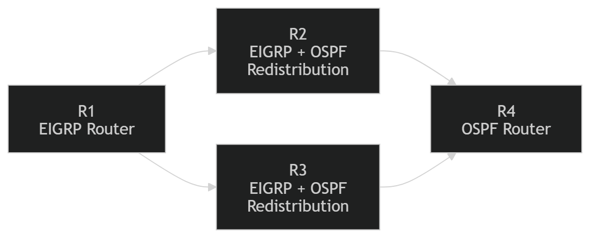
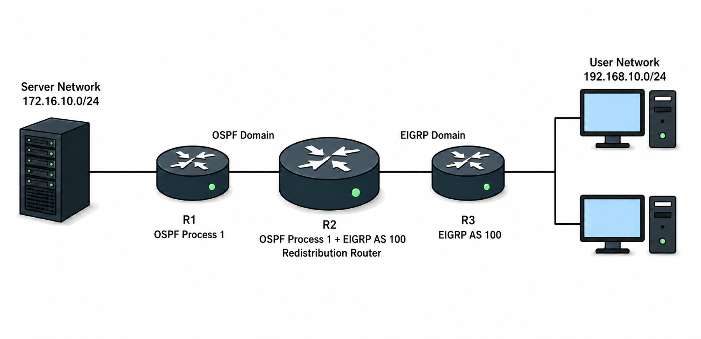

# Route Redistribution

## 개념

### Route Redistribution

Route Redistribution은 서로 다른 Routing Protocol 사이에서 Route 정보를 전달하는 기능이다.

OSPF를 사용하는 환경의 Route를 EIGRP 환경으로 Redistribution하기 위해서는 두 Routing Protocol이 연결되는 Router에서 OSPF와 EIGRP를 모두 실행해야 한다. 해당 Router에서 Redistribution을 설정하면 OSPF Route를 EIGRP Domain으로 전달할 수 있다.  
- 다른 Protocol에서 전달받은 Route는 일반적으로 External Route로 처리된다.
- 필요한 Route만 전달하도록 Prefix-List와 Route-Map을 사용하는 것이 안전하다.

### Redistribution 방향

Redistribution은 Route를 전달받는 Routing Protocol 아래에서 설정한다.

예를 들어 EIGRP AS `100`의 Route를 OSPF Process `1`에 전달하려면 다음과 같이 설정한다.
```
R2(config)# router ospf 1
R2(config-router)# redistribute eigrp 100 subnets
```

### Seed Metric

Routing Protocol마다 Metric을 계산하는 방식이 다르기 때문에 기존 Metric을 그대로 사용할 수 없다.

Seed Metric은 다른 Routing Protocol에서 전달받은 Route를 자신의 Routing Protocol에서 사용할 수 있도록 설정하는 Metric이다.
- OSPF는 Cost를 사용한다.
- EIGRP는 Bandwidth, Delay, Reliability, Load, MTU 값을 사용한다.
- RIP은 Hop Count를 사용한다.

#### EIGRP Seed Metric

다른 Dynamic Routing Protocol의 Route를 EIGRP로 Redistribution할 때는 다섯 개의 Metric 값을 직접 지정해야 한다. `default-metric`으로 공통 Metric을 설정하면 redistribute 명령어마다 다섯 값을 반복해서 지정하지 않아도 된다.
```
R2(config)# router eigrp 100
R2(config-router)# redistribute ospf 1 metric 100000 100 255 1 1500
```

각 값의 의미는 다음과 같다.
- Bandwidth: `100000Kbps`
- Delay: `100` (10 Microsecond 단위)
- Reliability: `255`
- Load: `1`
- MTU: `1500`

#### OSPF Seed Metric

다른 Dynamic Routing Protocol의 Route를 OSPF로 Redistribution하면 OSPF는 해당 Route에 OSPF Cost를 설정한다.
- 이때 설정되는 OSPF Cost를 Seed Metric이라고 한다.

Metric을 따로 설정하지 않으면 기본 Seed Metric은 `20`이며, 기본 Route Type은 `E2`이다.
```
R2(config)# router ospf 1
R2(config-router)# redistribute eigrp 100 subnets
```

위와 같이 설정하면 해당 EIGRP Route는 Seed Metric `20`과 `E2` Type을 가진 OSPF External Route로 OSPF Domain에 광고된다.

필요한 경우 Seed Metric과 Route Type을 직접 변경할 수 있다.
```
R2(config)# router ospf 1
R2(config-router)# redistribute eigrp 100 subnets metric 30 metric-type 1
```
- `subnets`: Subnet Route을 OSPF로 Redistribution한다.  
- `metric 30`: Redistribution되는 Route의 OSPF Seed Metric을 `30`으로 설정한다.
- `metric-type 1`: Redistribution되는 Route를 OSPF `E1` Route로 설정한다.

#### E1

E1은 Seed Metric에 ASBR까지의 OSPF 내부 Cost를 더하여 최종 Metric을 계산한다.

예를 들어 Seed Metric이 `20`이고 ASBR까지의 OSPF Cost가 `10`이라면 최종 Metric은 `30`이 된다.

```
Seed Metric 20 + ASBR까지의 Cost 10 = 최종 Metric 30
```
Routing Table에서는 `O E1`으로 표시된다.

#### E2

E2는 ASBR까지의 OSPF 내부 Cost를 더하지 않고 Seed Metric만 사용한다.

예를 들어 Seed Metric이 `20`이라면 ASBR에서 멀어져도 기본적으로 Metric `20`을 유지한다.

```
Seed Metric 20 = 최종 Metric 20
```
E2는 OSPF Redistribution의 기본 Route Type이며 Routing Table에서는 `O E2`로 표시된다.

### Route Filtering

Redistribution을 Filtering 없이 설정하면 Routing Table에 등록된 Routing Protocol의 Route들이 다른 Routing Domain으로 전달될 수 있다.
- 예를 들어 EIGRP Route를 OSPF로 Redistribution할 때 별도의 Filtering이 없으면 EIGRP로 학습한 Route들이 모두 OSPF Domain으로 전달된다.
 
Prefix-List로 전달할 Network를 지정하고 Route-Map을 `redistribute` 명령어에 적용하면 필요한 Route만 선택하여 전달할 수 있다.

### Route Tag

Route Tag는 Redistribution된 Route가 원래 어느 Routing Protocol에서 왔는지 표시하는 번호이다.

예를 들어 EIGRP Route를 OSPF로 전달할 때 Tag를 설정하면, 혹여나 해당 Route가 OSPF Domain에서 다시 나한테 Redistribution되는 것을 차단할 수 있다.
- EIGRP Route가 `EIGRP → OSPF → EIGRP`로 다시 되돌아오는 것을 막는 것이다.

---

## 동작 원리

### Route Redistribution

1\. R2는 OSPF Process `1`과 EIGRP AS `100`을 모두 실행한다.

2\. R2는 EIGRP와 OSPF에서 Route를 학습하고 최적 Route를 자신의 Routing Table에 등록한다.
- 같은 Network를 여러 Routing Protocol에서 학습하면 Administrative Distance가 낮은 Route가 등록된다.

3\. EIGRP Route가 R2의 Routing Table에 등록되면 R2는 해당 Network로 패킷을 전달할 수 있다.
- 하지만 R2의 Routing Table에 EIGRP Route가 등록되었다고 해서 OSPF Router들에게 자동으로 광고되는 것은 아니다.
- OSPF는 EIGRP로 학습한 Route를 자동으로 광고하지 않는다.

4\. OSPF Router들도 EIGRP Network를 학습하도록 R2에서 EIGRP Route를 OSPF로 Redistribution한다.
```
R2(config)# router ospf 1
R2(config-router)# redistribute eigrp 100 subnets
```

5\. R2는 Routing Table에 EIGRP Route로 등록된 Route를 확인하고 OSPF로 전달한다.
- Filtering을 설정하지 않으면 Routing Table에 등록된 EIGRP Route들이 모두 OSPF Domain으로 전달될 수 있다.

6\. R2는 EIGRP Route에 OSPF가 사용할 Seed Metric과 External Route Type을 적용한다.
- Metric을 따로 설정하지 않으면 Seed Metric `20`을 사용한다.
- Route Type을 따로 설정하지 않으면 기본값인 `E2`를 사용한다.

7\. R2는 EIGRP Route를 OSPF External Route로 광고하며 OSPF에서 ASBR로 동작한다.

8\. OSPF Router들은 Redistribution된 EIGRP Route를 `O E1` 또는 `O E2` Route로 학습한다.
- Redistribution을 수행한 R2에서는 EIGRP Route는 `D`로 유지된다.

9\. 반대로 EIGRP Router들도 OSPF Network를 학습해야 한다면 OSPF Route를 EIGRP로 Redistribution한다.
```
R2(config)# router eigrp 100
R2(config-router)# redistribute ospf 1 metric 100000 100 255 1 1500
```

10\. EIGRP Router들은 Redistribution된 OSPF Route를 EIGRP External Route인 `D EX`로 학습한다.

11\. 양쪽 Routing Domain이 서로의 Route를 학습하면 EIGRP Network와 OSPF Network가 양방향으로 통신할 수 있다.
- 한쪽 방향의 Route만 전달하면 돌아오는 Route가 없을 수 있으므로 Return Route도 확인해야 한다.

### Route Feedback



1\. R1은 EIGRP Domain에 있고 R4는 OSPF Domain에 있다. R2와 R3는 두 Routing Domain 사이에서 Redistribution을 수행한다.

2\. R1은 자신의 Network를 EIGRP로 광고하고 R2는 해당 Route를 `D`로 학습한다.

3\. R2는 EIGRP Route를 OSPF로 Redistribution한다.

4\. R2는 해당 Route를 OSPF External Route로 광고하며 R4는 이를 `O E1` 또는 `O E2`로 학습한다.

5\. R4는 R2가 생성한 OSPF External LSA를 OSPF Domain의 R3 방향으로 전달한다.

6\. R3가 OSPF Route를 EIGRP로 Redistribution하면 원래 EIGRP에서 시작된 Route가 다시 EIGRP Domain으로 전달된다.

7\. EIGRP Router들은 되돌아온 Route를 EIGRP External Route인 `D EX`로 학습할 수 있다.
- Route가 `EIGRP → OSPF → EIGRP` 순서로 되돌아온 것이다.

8\. R3는 OSPF로 학습한 해당 Route가 원래 EIGRP에서 시작된 Route라는 것을 자동으로 구분하지 못한다.

9\. 이를 방지하기 위해 R2가 EIGRP Route를 OSPF로 Redistribution할 때 Route Tag를 설정한다.

10\. R3는 Route Tag를 확인하고 원래 EIGRP에서 시작된 Route가 다시 EIGRP로 Redistribution되는 것을 Route-Map으로 차단한다.

---

## 예시 및 구성도

### OSPF와 EIGRP Redistribution

본사 Network에서 OSPF Process `1`을 사용하고 지사 Network에서 EIGRP AS `100`을 사용하고 있다.

본사의 R1에는 `172.16.10.0/24` Server Network가 연결되어 있고, 지사의 R3에는 `192.168.10.0/24` User Network가 연결되어 있다.

R2는 본사와 지사를 연결하며 OSPF와 EIGRP를 모두 실행하는 Redistribution Router이다.



1\. R1은 `172.16.10.0/24` Server Network를 OSPF로 광고한다.

2\. R3는 `192.168.10.0/24` User Network를 EIGRP로 광고한다.

3\. R2는 R1의 Server Network를 OSPF Route인 `O`로 학습하고, R3의 User Network를 EIGRP Route인 `D`로 학습한다.

4\. R2의 Routing Table에 두 Route가 등록되므로 R2는 양쪽 Network로 패킷을 전달할 수 있다.
- 하지만 OSPF는 EIGRP Route를 자동으로 광고하지 않고, EIGRP도 OSPF Route를 자동으로 광고하지 않는다.

5\. 본사의 R1이 지사 Network를 학습할 수 있도록 R2에서 EIGRP Route를 OSPF로 Redistribution한다.

6\. R2는 `192.168.10.0/24` Route에 OSPF Seed Metric과 External Route Type을 적용하여 OSPF Domain으로 광고한다.
- R2는 OSPF에서 외부 Route를 전달하는 ASBR로 동작한다.
- `metric-type 1`을 설정하면 R1은 해당 Route를 `O E1`으로 학습한다.

7\. 지사의 R3가 본사 Network를 학습할 수 있도록 R2에서 OSPF Route를 EIGRP로 Redistribution한다.

8\. R2는 `172.16.10.0/24` Route에 EIGRP가 사용할 Seed Metric을 설정하고 EIGRP Domain으로 광고한다.
- R3는 해당 Route를 EIGRP External Route인 `D EX`로 학습한다.

10\. 양쪽 Routing Domain이 서로의 Route를 학습하므로 본사 Server와 지사 사용자가 양방향으로 통신할 수 있다.

---

## 명령어

### EIGRP Route를 OSPF로 Redistribution

EIGRP AS `100`의 Route를 OSPF Process `1`로 전달한다.
```
R2(config)# router ospf 1
R2(config-router)# redistribute eigrp 100 subnets metric 20 metric-type 1
```
- `subnets`: Subnet Route를 포함한다.
- `metric 20`: OSPF External Route의 초기 Cost를 `20`으로 설정한다.
- `metric-type 1`: Redistribution된 Route를 OSPF E1 Route로 처리한다.

### OSPF Route를 EIGRP로 Redistribution

OSPF Process `1`의 Route를 EIGRP AS `100`으로 전달한다.
```
R2(config)# router eigrp 100
R2(config-router)# redistribute ospf 1 metric 100000 100 255 1 1500
```
Redistribution된 OSPF Route는 EIGRP에서 `D EX` Route로 확인된다.

### EIGRP Default Metric 설정

같은 Routing Protocol로 여러 종류의 Route를 Redistribution할 때 공통 Seed Metric을 설정할 수 있다.
```
R2(config)# router eigrp 100
R2(config-router)# default-metric 100000 100 255 1 1500
R2(config-router)# redistribute ospf 1
```

### Static Route 선택적 Redistribution

`172.16.50.0/24` Static Route만 OSPF로 전달한다.
```
R2(config)# ip prefix-list STATIC-TO-OSPF seq 5 permit 172.16.50.0/24

R2(config)# route-map STATIC-TO-OSPF permit 10
R2(config-route-map)# match ip address prefix-list STATIC-TO-OSPF

R2(config)# router ospf 1
R2(config-router)# redistribute static subnets route-map STATIC-TO-OSPF metric 20 metric-type 1
```
Route-Map에 일치하지 않는 Static Route는 OSPF로 전달되지 않는다.

### Route Tag를 이용한 Route Feedback 방지

EIGRP에서 시작된 Route에는 Tag `100`을 설정하고, OSPF에서 시작된 Route에는 Tag `200`을 설정한다.
```
R2(config)# route-map EIGRP-TO-OSPF deny 10
R2(config-route-map)# match tag 200
R2(config-route-map)# exit
R2(config)# route-map EIGRP-TO-OSPF permit 20
R2(config-route-map)# set tag 100
R2(config-route-map)# exit

R2(config)# route-map OSPF-TO-EIGRP deny 10
R2(config-route-map)# match tag 100
R2(config-route-map)# exit
R2(config)# route-map OSPF-TO-EIGRP permit 20
R2(config-route-map)# set tag 200
```

Route-Map을 Redistribution에 적용한다.
```
R2(config)# router ospf 1
R2(config-router)# redistribute eigrp 100 subnets metric 20 metric-type 1 route-map EIGRP-TO-OSPF

R2(config)# router eigrp 100
R2(config-router)# redistribute ospf 1 metric 100000 100 255 1 1500 route-map OSPF-TO-EIGRP
```
- Tag `100`이 있는 Route는 원래 EIGRP에서 시작되었으므로 EIGRP로 다시 전달하지 않는다. 
- Tag `200`이 있는 Route는 원래 OSPF에서 시작되었으므로 OSPF로 다시 전달하지 않는다.

### Redistribution 상태 확인

Router에서 실행 중인 Routing Protocol과 Redistribution 설정을 확인한다.
```
R2# show ip protocols
```

Redistribution된 OSPF External Route를 확인한다.
```
R1# show ip route ospf
R1# show ip ospf database external
```

Redistribution된 EIGRP External Route를 확인한다.
```
R3# show ip route eigrp
R3# show ip eigrp topology
```

---

## Troubleshooting

### Redistribution Route가 학습되지 않는 경우

1\. Source Routing Protocol의 Route가 Redistribution Router의 Routing Table에 등록되어 있는지 확인한다.
- 예를 들어 R2가 EIGRP의 192.168.10.0/24 Route를 OSPF로 전달하려면, 먼저 해당 Route가 R2의 Routing Table에 D로 등록되어 있어야 한다.  
```
R2# show ip route
```

2\. `redistribute` 명령어의 Source Protocol, Process ID 또는 AS Number가 올바른지 확인한다.
```
R2# show ip protocols
```

3\. OSPF로 Redistribution할 때 `subnets`가 설정되어 있는지 확인한다.

4\. EIGRP로 Redistribution할 때 `metric` 또는 `default-metric`이 설정되어 있는지 확인한다.

5\. Prefix-List에 필요한 Network와 Prefix Length가 올바르게 허용되어 있는지 확인한다.
```
R2# show ip prefix-list
```

6\. Route-Map의 `permit`, `deny`, `match` 조건을 확인한다.
```
R2# show route-map
```
7\. Route-Map에는 마지막에 Implicit Deny가 있으므로 허용할 Route가 Permit 문장에 일치하는지 확인한다.

8\. 양방향 Redistribution 지점이 여러 개이면 Route가 원래 Protocol로 다시 들어오는지 확인하고 Route Tag와 Route-Map을 적용한다.
- 처럼 원래 EIGRP Route가 다시 EIGRP로 들어오면 Route Feedback이 발생할 수 있으므로, Tag를 설정하고 Route-Map으로 차단한다.  

---

## 주요 질문

Route Redistribution이란 무엇인가?
- 서로 다른 Routing Protocol 사이에서 Route 정보를 전달하는 기능이다.

Redistribution은 어느 Routing Protocol 아래에서 설정하는가?
- Route를 전달받는 Routing Protocol 아래에서 설정한다.

OSPF의 E1과 E2 Route의 차이는 무엇인가?
- E1은 External Metric과 ASBR까지의 OSPF 내부 Cost를 더하고, E2는 External Metric만 사용한다.

Mutual Redistribution의 주의점은 무엇인가?
- Redistribution 지점이 여러 개이면 Route Feedback으로 인해 Routing Loop나 비효율적인 경로가 발생할 수 있다.

Route Tag를 사용하는 이유는 무엇인가?
- Redistribution된 Route의 출처 Tag를 표시하고 해당 Route가 원래 Routing Protocol로 다시 전달되는 것을 차단하기 위해 사용한다.

필요한 Route만 Redistribution하려면 어떻게 하는가?
- Prefix-List로 Route를 지정하고 Route-Map에 연결한 후 `redistribute` 명령어에 적용한다.
