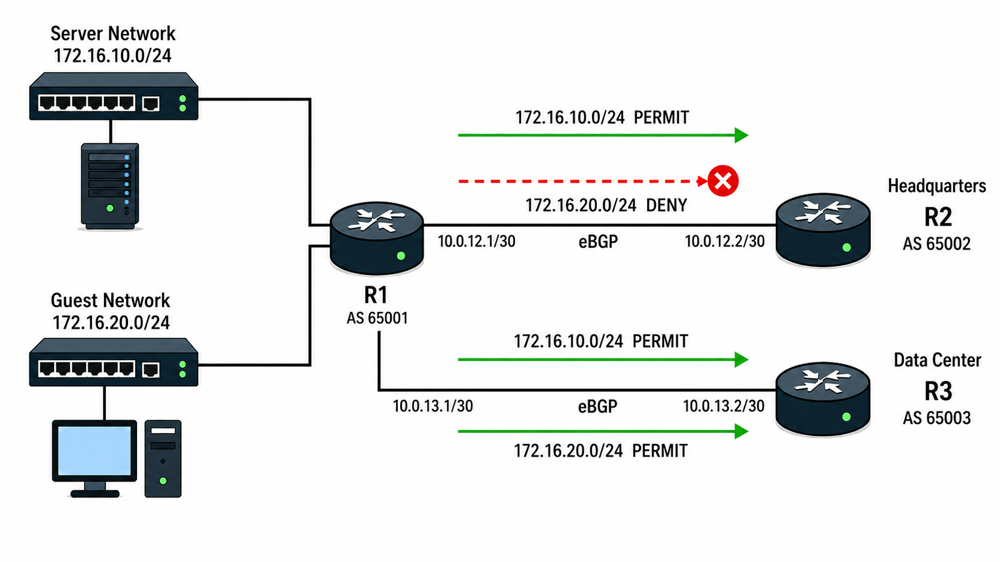

# Prefix-List / Route-Map / Route Filtering

## 개념

### Prefix-List

Prefix-List는 Network Address와 Prefix Length를 기준으로 Route를 허용하거나 차단하는 기능이다.

ACL과 비슷하게 동작하지만 Network Address뿐만 아니라 Prefix Length까지 확인할 수 있어 Route Filtering에 사용한다.
- ACL: 10.0.0.0/8에 해당하는 IP Address의 Traffic을 허용한다. 
- Prefix-List: 10.0.0.0/8에 포함된 /16부터 /24까지의 Route만 허용한다.
```
R1(config)# ip prefix-list SERVER-NETWORK seq 5 permit 172.16.10.0/24
```
`SERVER-NETWORK`라는 이름의 Prefix-List는 `172.16.10.0/24` Route만 허용한다.

Prefix-List에서 `ge`와 `le`를 설정하지 않으면 지정한 Network Address와 Prefix Length가 모두 일치하는 Route만 허용하거나 차단한다.
- `10.0.0.0/8`을 지정하면 `10.0.0.0/8`만 일치하며, `10.1.0.0/16`과 `10.1.1.0/24`는 일치하지 않는다.  
- `ge`는 허용할 최소 Prefix Length를 지정한다.
- `le`는 허용할 최대 Prefix Length를 지정한다
```
R1(config)# ip prefix-list TEST seq 5 permit 10.0.0.0/8 ge 16 le 24
```
- 위 설정은 `10.0.0.0/8`에 포함되면서 Prefix Length가 `/16`부터 `/24`까지인 Route를 허용한다.

Prefix-List는 Sequence 번호가 낮은 문장부터 순서대로 확인하며, 일치하는 문장을 찾으면 이후 문장은 확인하지 않는다.

마지막에는 보이지 않는 Implicit Deny가 있기 때문에 어떤 문장에도 일치하지 않은 Route는 차단된다.

### Route-Map

Route-Map은 Route를 확인한 후 조건에 맞는 Route를 허용하거나 차단하거나 Metric, Tag 등의 속성을 변경하는 기능이다.

Route-Map은 주로 다음과 같이 사용한다.
- Route Filtering
- Policy-Based Routing
- Route Redistribution
- Route Tag 설정
- BGP Path Attribute 변경

Route-Map은 Sequence 번호가 낮은 문장부터 확인한다.
```
R1(config)# route-map BRANCH-TO-HQ permit 10
R1(config-route-map)# match ip address prefix-list SERVER-NETWORK
R1(config-route-map)# set metric 50
```
- `match`: Route가 일치해야 하는 조건을 지정한다.
- `set metric 50`: 조건에 일치한 Route의 Metric을 `50`으로 변경한다.
- `permit`: 조건에 일치한 Route를 허용한다.
- `deny`: 조건에 일치한 Route를 차단한다.

Route-Map에도 마지막에 Implicit Deny가 있기 때문에 어떤 Sequence에도 일치하지 않은 Route는 차단된다.

### Prefix-List와 Route-Map

Prefix-List는 어떤 Route인지 지정하고 Route-Map은 해당 Route를 어떻게 처리할지 결정한다.

```
R1(config)# ip prefix-list BLOCK-GUEST seq 5 permit 172.16.20.0/24

R1(config)# route-map FILTER-ROUTE deny 10
R1(config-route-map)# match ip address prefix-list BLOCK-GUEST

R1(config)# route-map FILTER-ROUTE permit 20
```
Prefix-List의 `permit`으로 `172.16.20.0/24` Route를 선택하고 Route-Map의 `deny 10`으로 해당 Route를 차단한다. 이후 나머지 Route는 `permit 20`에 의해 허용된다.
- Route-Map은 설정만으로 동작하지 않으며 Routing Protocol, Redistribution, PBR 등의 기능에 적용해야 한다.

### Route Filtering

Route Filtering은 Routing Protocol이 Route를 학습하거나 Neighbor에게 광고하는 것을 제한하는 기능이다.

필요한 Route만 전달하여 Routing Table의 크기를 줄이고 잘못된 Route이 다른 Network로 전달되는 것을 방지할 수 있다.

Route Filtering은 Router가 Route를 학습하거나 광고하는 것을 제한하며, 실제 Traffic을 차단하는 ACL과는 다르다.  
- Inbound Filtering은 Neighbor로부터 들어오는 Route를 제한한다.
- Outbound Filtering은 Local Router가 Neighbor에게 광고하는 Route를 제한한다.

### Match와 Set

Roue-Map은 `match`로 Route를 선택하고 `set`으로 선택한 Route의 값을 변경한다.
- `set metric`: Route-Map이 적용된 Routing Protocol에서 사용할 Metric 값을 변경한다.
- `set tag`: Route에 Tag를 설정한다.
- `set local-preference`: BGP Local Preference 값을 변경한다.
- `set ip next-hop`: PBR에서 패킷을 전달할 Next-Hop을 지정한다.

`set`은 Route의 값을 변경할 때만 사용되고, 단순히 Route를 permit하거나 deny할때는 설정하지 않아도 된다.

### Routing Protocol별 Route Filtering

BGP는 Neighbor별로 Prefix-List 또는 Route-Map을 Inbound와 Outbound 방향에 적용할 수 있다.

EIGRP는 `distribute-list`를 사용하여 특정 Interface로 들어오거나 나가는 Route를 제한할 수 있다.

OSPF의 Inbound `distribute-list`는 학습한 Route가 자신의 Routing Table에 등록되는 것을 제한할 수 있다.
- LSA 자체를 차단하는 것은 아니므로 해당 LSA는 LSDB에 남아 다른 Router로 전달될 수 있다.
- ABR에서 Area 사이의 Type 3 LSA를 제한하려면 `area filter-list prefix`를 사용할 수 있다.

Prefix-List 또는 ACL → 어떤 Route인지 지정

Route-Map → 해당 Route를 허용·차단하거나 값을 변경

Distribute-List → Filtering 규칙을 Routing Protocol에 적용

---

## 동작 원리

### Prefix-List와 Route-Map 동작 과정

1\. Router가 Neighbor에게 광고하거나 Neighbor로부터 전달받을 Route를 확인한다.

2\. Routing Protocol에 적용된 Route-Map을 Sequence 번호가 낮은 순서대로 확인한다.

3\. Route-Map의 `match`에 Prefix-List가 설정되어 있으면 Route의 Network Address와 Prefix Length를 확인한다.

4\. Route가 Prefix-List의 조건과 일치하면 Route-Map의 `permit` 또는 `deny`를 적용한다.

5\. Route-Map이 `permit`이면 해당 Route를 허용한다.
- `set`이 설정되어 있다면 Metric, Tag 또는 BGP Path Attribute등의 속성도 함께 변경한다.

6\. Route-Map이 `deny`이면 해당 Route를 차단한다.

7\. Route가 해당 Sequence와 일치하지 않으면 다음 Sequence를 확인한다.

8\. 마지막 Sequence까지 일치하지 않으면 Implicit Deny에 의해 Route가 차단된다.

---

## 예시 및 구성도

### BGP Route Filtering

지사의 R1은 본사의 R2 및 Data Center의 R3와 eBGP Neighbor를 형성하고 있다.

R1에는 `172.16.10.0/24` Server Network와 `172.16.20.0/24` Guest Network가 연결되어 있다.

Data Center의 R3에는 두 Route를 모두 광고해야 하므로 R1은 Server Route와 Guest Route를 모두 BGP에 등록한다.

하지만 본사의 R2에는 Server Route만 필요하므로 R2 Neighbor의 Outbound 방향에 Route Filtering을 적용한다.



1\. R1의 Interface에는 Server Network와 Guest Network의 IP Address가 설정되어 있으며 두 Network는 Connected Route인 `C`로 Routing Table에 등록된다.
```
R1(config)# interface gi0/0
R1(config-if)# ip address 172.16.10.1 255.255.255.0
R1(config-if)# no shutdown

R1(config)# interface gi0/1
R1(config-if)# ip address 172.16.20.1 255.255.255.0
R1(config-if)# no shutdown
```

R1은 두 Route를 Data Center의 R3에게 광고해야 하므로 `network` 명령어를 사용하여 BGP에 등록한다.
```
R1(config)# router bgp 65001
R1(config-router)# network 172.16.10.0 mask 255.255.255.0
R1(config-router)# network 172.16.20.0 mask 255.255.255.0
```
- `network` 명령어로 BGP Route를 등록하려면 Prefix Length까지 정확하게 일치하는 Route가 Routing Table에 있어야 한다.

2\. R1은 본사의 R2 및 Data Center의 R3와 연결된 Interface에 IP Address를 설정한다.
```
R1(config)# interface gi0/2
R1(config-if)# ip address 10.0.12.1 255.255.255.252
R1(config-if)# no shutdown

R1(config)# interface gi0/3
R1(config-if)# ip address 10.0.13.1 255.255.255.252
R1(config-if)# no shutdown
```

R1은 AS `65002`의 R2 및 AS `65003`의 R3와 eBGP Neighbor를 형성한다.
```
R1(config)# router bgp 65001
R1(config-router)# neighbor 10.0.12.2 remote-as 65002
R1(config-router)# neighbor 10.0.13.2 remote-as 65003
```
- R2와 R3에도 R1을 Neighbor로 설정해야 한다.
- R1은 두 Network를 모두 BGP에 등록했으므로 Filtering이 없다면 두 Route를 R2와 R3에게 모두 광고한다.

3\. 본사의 R2에는 Server Route만 필요하므로 Prefix-List에서 `172.16.10.0/24` Route를 선택한다.
```
R1(config)# ip prefix-list BRANCH-TO-HQ seq 5 permit 172.16.10.0/24
```
- `172.16.10.0/24` Server Network를 지정한다.

4\. Route-Map에서 Prefix-List가 선택한 Server Route를 허용한다.
```
R1(config)# route-map BRANCH-TO-HQ permit 10
R1(config-route-map)# match ip address prefix-list BRANCH-TO-HQ
```
- Route-Map은 Prefix-List와 일치하는 Route를 `permit 10`으로 허용한다.
- Prefix-List와 일치하지 않는 Route는 다음 Sequence를 확인한다.

5\. Route-Map을 R2 Neighbor의 Outbound 방향에 적용한다.

```
R1(config)# router bgp 65001
R1(config-router)# neighbor 10.0.12.2 route-map BRANCH-TO-HQ out
```
- `out`은 R1이 R2에게 광고하는 Route에 Route-Map을 적용한다는 의미이다.
- R3 Neighbor에는 Route-Map을 적용하지 않는다.

6\. R1이 Route를 R2에게 광고할 때 `BRANCH-TO-HQ` Route-Map을 확인한다.
- `172.16.10.0/24` Server Route는 Prefix-List와 Route-Map의 `permit 10`에 일치하므로 R2에게 광고된다.

7\. `172.16.20.0/24` Guest Route는 Prefix-List와 일치하지 않으며 다음 Route-Map Sequence도 없다.
- 따라서 Route-Map의 마지막에 있는 Implicit Deny에 의해 R2에게 광고되지 않는다.

8\. R3 Neighbor에는 Outbound Route-Map이 적용되어 있지 않으므로 Server Route와 Guest Route가 모두 광고된다.

---

## 명령어

### Prefix-List 설정

`172.16.10.0/24` Route만 허용한다.
```
R1(config)# ip prefix-list SERVER-NETWORK seq 5 permit 172.16.10.0/24
```

`10.0.0.0/8`에 포함된 `/16`부터 `/24`까지의 Route를 허용한다.
```
R1(config)# ip prefix-list INTERNAL-NETWORK seq 5 permit 10.0.0.0/8 ge 16 le 24
```

Prefix-List의 특정 Sequence를 삭제한다.
```
R1(config)# no ip prefix-list INTERNAL-NETWORK seq 5
```

### Route-Map 설정

Prefix-List와 일치하는 Route만 허용한다.
```
R1(config)# route-map SERVER-ONLY permit 10
R1(config-route-map)# match ip address prefix-list SERVER-NETWORK
```

### 특정 Route 차단

`172.16.20.0/24` Route는 차단하고 나머지 Route는 허용한다.
```
R1(config)# ip prefix-list BLOCK-GUEST seq 5 permit 172.16.20.0/24

R1(config)# route-map FILTER-GUEST deny 10
R1(config-route-map)# match ip address prefix-list BLOCK-GUEST

R1(config)# route-map FILTER-GUEST permit 20
```

### BGP Prefix-List 적용

Prefix-List를 BGP Neighbor의 Outbound 방향에 직접 적용한다.
```
R1(config)# router bgp 65001
R1(config-router)# neighbor 10.0.12.2 prefix-list SERVER-NETWORK out
```

R1이 R2에게 광고하는 Route만 제한된다.

### BGP Route-Map 적용

Route-Map을 BGP Neighbor의 Outbound 방향에 적용한다.
```
R1(config)# router bgp 65001
R1(config-router)# neighbor 10.0.12.2 route-map SERVER-ONLY out
```

단순히 Route만 허용하거나 차단한다면 Prefix-List만 사용할  있다. Route Filtering과 함께 BGP Path Attribute도 변경해야 한다면 Route-Map을 사용한다.

### EIGRP Route Filtering

`Gi0/0`으로 들어오는 EIGRP Route 중 Prefix-List가 허용한 Route만 학습한다.
```
R2(config)# ip prefix-list EIGRP-IN seq 5 permit 192.168.10.0/24

R2(config)# router eigrp 100
R2(config-router)# distribute-list prefix EIGRP-IN in GigabitEthernet0/0
```

### OSPF Inbound Route Filtering

Prefix-List가 허용한 OSPF Route만 Local Routing Table에 등록한다.
```
R2(config)# ip prefix-list OSPF-IN seq 5 permit 10.10.10.0/24

R2(config)# router ospf 1
R2(config-router)# distribute-list prefix OSPF-IN in
```
OSPF LSA가 LSDB에 저장되고 전달되는 것은 차단하지 않는다.

### OSPF Area Route Filtering

ABR에서 Area 1의 Route가 다른 Area로 전달되는 것을 제한한다.

```
R2(config)# ip prefix-list AREA1-OUT seq 5 permit 10.1.0.0/16 le 24

R2(config)# router ospf 1
R2(config-router)# area 1 filter-list prefix AREA1-OUT out
```
`area filter-list prefix`는 Area 사이에서 전달되는 Type 3 LSA를 제한한다.

### Redistribution Route Filtering

`172.16.50.0/24` Static Route만 OSPF로 Redistribution한다.
```
R2(config)# ip prefix-list STATIC-TO-OSPF seq 5 permit 172.16.50.0/24

R2(config)# route-map STATIC-TO-OSPF permit 10
R2(config-route-map)# match ip address prefix-list STATIC-TO-OSPF

R2(config)# router ospf 1
R2(config-router)# redistribute static subnets route-map STATIC-TO-OSPF
```

### 설정 확인

Prefix-List와 일치한 Route를 확인한다.
```
R1# show ip prefix-list
```

Route-Map의 설정과 일치 횟수를 확인한다.
```
R1# show route-map
```

Routing Protocol에 적용된 Filtering 설정을 확인한다.
```
R1# show ip protocols
```

BGP Neighbor에게 광고하는 Route를 확인한다.
```
R1# show ip bgp neighbors 10.0.12.2 advertised-routes
```

---

## Troubleshooting

### Route Filtering이 정상적으로 동작하지 않는 경우

1\. Filtering할 Route가 Routing Table에 존재하는지 확인한다.
```
R1# show ip route
```

2\. Prefix-List의 Network Address와 Prefix Length가 실제 Route와 일치하는지 확인한다.
```
R1# show ip prefix-list
```

3\. `ge`와 `le`의 범위가 올바르게 설정되어 있는지 확인한다.

4\. Prefix-List와 Route-Map의 Sequence 순서를 확인한다.
- 먼저 일치한 항목이 적용되므로 뒷 항목은 확인하지 않을 수 있다.  

5\. Prefix-List와 Route-Map의 마지막에는 Implicit Deny가 있어 마지막에 permit 항목이 없으면 다른 Route가 차단될 수 있다.

6\. Filtering이 올바른 Neighbor, Interface 및 방향에 적용되어 있는지 확인한다.
- `in`: Neighbor로부터 전달받는 Route
- `out`: Neighbor에게 광고하는 Route

7\. BGP Filtering 정책을 변경했다면 Soft Reset을 실행하여 변경된 정책을 다시 적용한다.
```
R1# clear ip bgp 10.0.12.2 soft in
R1# clear ip bgp 10.0.12.2 soft out
```
- `10.0.12.2`는 Neighbor의 IP 주소이다. BGP는 정책을 변경해도 기존 Route에는 바로 적용되지 않을 수 있다.
- Soft Reset은 BGP Neighbor Session을 끊지 않고 Route를 다시 주고받아 변경된 정책을 재적용하는 기능이다.  

---

## 주요 질문

## 주요 질문

Prefix-List란 무엇인가?
- Network Address와 Prefix Length를 기준으로 Route를 허용하거나 차단하는 기능이다.

Prefix-List에서 `ge`와 `le`는 무엇인가?
- `ge`는 허용할 최소 Prefix Length이며 `le`는 허용할 최대 Prefix Length이다.

Prefix-List에 `ge`와 `le`가 없으면 어떻게 동작하는가?
- Network Address와 Prefix Length가 모두 정확하게 일치한 Route만 허용하거나 차단한다.

Route-Map이란 무엇인가?
- Route가 지정한 조건에 일치하는지 확인하고 해당 Route를 허용하거나 차단하거나 속성을 변경하는 기능이다.

Prefix-List와 Route-Map의 역할은 어떻게 다른가?
- Prefix-List는 처리할 Route를 지정하고 Route-Map은 해당 Route를 어떻게 처리할지 결정한다.

Route-Map의 `match`와 `set`은 어떤 역할을 하는가?
- `match`는 처리할 Route를 선택하고 `set`은 선택한 Route의 Metric, Tag 또는 BGP Path Attribute 등의 값을 변경한다.

Implicit Deny란 무엇인가?
- Prefix-List와 Route-Map의 마지막에 자동으로 존재하는 보이지 않는 Deny 항목이다.

Route Filtering과 ACL의 차이는 무엇인가?
- Route Filtering은 Routing Protocol끼리 교환하는 Route를 선택하여 허용하거나 제한하고, ACL은 Interface를 통과하는 Traffic을 허용하거나 제한한다. 

OSPF에서 Inbound `distribute-list`를 적용하면 LSA도 차단되는가?
- LSA는 정상적으로 수신하여 LSDB를 동기화하지만 차단된 Route는 Local Routing Table에 등록하지 않는다.
