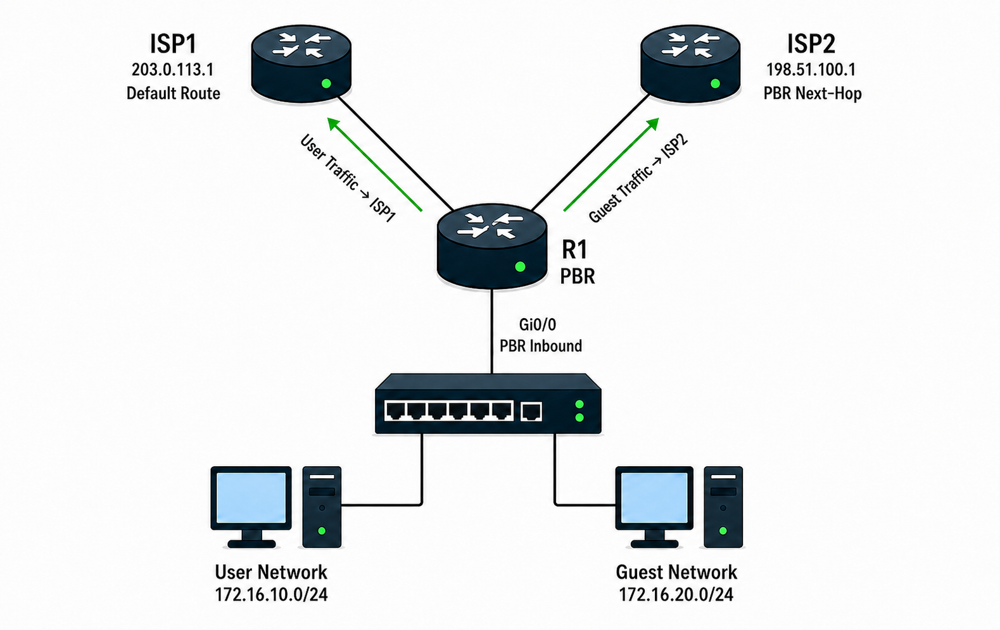

# PBR

## 개념

### PBR

PBR(Policy-Based Routing)은 일반적인 Routing Table의 경로가 아니라 관리자가 설정한 정책에 따라 Packet의 경로를 결정하는 기능이다.

일반적인 Routing은 Destination IP Address를 기준으로 경로를 선택하지만, PBR은 Source IP Address, Destination IP Address, Protocol 및 Port Number 등을 기준으로 경로를 선택할 수 있다.

예를 들어 일반 사용자의 Traffic은 ISP1로 전달하고 Guest Network의 Traffic은 ISP2로 전달할 수 있다.

### PBR 구성 요소

PBR은 ACL과 Route-Map을 사용하여 구성한다.
- ACL: PBR을 적용할 Packet을 선택한다.
- `match`: Packet이 ACL의 조건과 일치하는지 확인한다.
- `set`: 조건에 일치한 Packet을 전달할 Next-Hop이나 Interface를 지정한다.
- `ip policy route-map`: Route-Map을 Packet이 들어오는 Interface에 적용한다.

Standard ACL은 Source IP Address를 기준으로 Packet을 선택한다.

Extended ACL은 Source IP Address, Destination IP Address, Protocol 및 Port Number를 기준으로 Packet을 선택할 수 있다.

### PBR의 ACL

PBR의 `match`에 사용하는 ACL은 Packet을 차단하는 용도가 아니라 PBR을 적용할 Packet을 선택하는 용도이다.
- ACL `permit`: PBR 대상으로 선택한다.
- ACL `deny`: PBR 대상으로 선택하지 않고 다음 Route-Map Sequence를 확인한다.

ACL을 Interface에 직접 적용하면 Packet을 허용하거나 차단하지만, PBR의 `match`에 사용하면 Packet을 선택하는 용도로 사용한다.

### PBR의 Route-Map

PBR에서 Route-Map의 `deny`에 일치한 Packet은 차단되지 않는다.

PBR이 적용되지 않으면 해당 Packet은 Destination IP Address를 기준으로 일반 Routing Table을 사용하여 전달한다.  

Route-Map에서 따로 지정하지 않은 Packet은 Implicit Deny에 의해 PBR이 적용되지 않고 기존 Routing Table의 경로로 전달된다.
```
R1(config)# access-list 10 permit 172.16.20.0 0.0.0.255

R1(config)# route-map PBR permit 100
R1(config-route-map)# match ip address 10 
R1(config-route-map)# set ip next-hop 198.51.100.1
```
- 172.16.20.0/24에서 들어온 Packet은 Sequence 100과 일치하므로 Next-Hop 198.51.100.1을 사용한다.
- 반면 172.16.10.0/24에서 들어온 Packet은 어느 Sequence에도 일치하지 않으므로 Implicit Deny에 의해 PBR이 적용되지 않고 일반 Routing Table을 사용한다.

### PBR 적용 방향

PBR은 Packet이 Router로 들어오는 Inbound Interface에 적용한다.

ACL과 Route-Map만 생성하면 PBR 정책이 동작하지 않으며, Packet이 들어오는 Interface에 Route-Map을 적용해야 한다.
```
R1(config)# access-list 10 permit 172.16.20.0 0.0.0.255

R1(config)# route-map PBR permit 100
R1(config-route-map)# match ip address 10
R1(config-route-map)# set ip next-hop 198.51.100.1
```
```
R1(config)# interface gi0/0
R1(config-if)# ip policy route-map PBR
```
- `Gi0/0`으로 들어오는 Packet에 `PBR` Route-Map을 적용한다.

PBR 조건에 일치한 Packet도 지정한 Next-Hop이 Local Routing Table에서 도달 가능한 상태여야 PBR 경로로 전달된다.

하지만 PBR에서 지정한 Next-Hop에 도달할 수 없으면 일반 Routing Table의 경로를 사용한다.

### Local PBR

Interface로 들어오는 Packet이 아니라 Router 자신이 생성한 Packet에 PBR을 적용하려면 Local PBR을 사용한다.

```
R1(config)# ip access-list extended LOCAL-TRAFFIC
R1(config-ext-nacl)# permit icmp host 1.1.1.1 host 172.16.100.10

R1(config)# route-map LOCAL-PBR permit 100
R1(config-route-map)# match ip address LOCAL-TRAFFIC
R1(config-route-map)# set ip next-hop 10.0.12.2

R1(config)# ip local policy route-map LOCAL-PBR
```
- ACL: R1이 직접 생성한 Ping을 선택한다.
- Route-Map: 조건에 일치한 Packet의 Next-Hop을 `10.0.12.2`로 지정한다.
- `ip local policy`: Router가 직접 생성한 Packet에 Route-Map을 적용한다.

---

## 동작 원리

1\. Packet이 PBR이 설정된 Interface로 들어온다.

2\. Router는 일반 Routing Table을 확인하기 전에 Interface에 적용된 Route-Map을 확인한다.

3\. Route-Map을 Sequence 번호가 낮은 순서대로 확인한다.

4\. `match ip address`에 ACL이 설정되어 있으면 Packet의 Source IP Address, Destination IP Address, Protocol 및 Port Number 등을 확인한다.

5\. Packet이 ACL의 `permit` 조건과 일치하고 Route-Map도 `permit`이면 `set`에 설정된 Next-Hop으로 Packet을 전달한다.

6\. Packet이 현재 Sequence와 일치하지 않으면 다음 Sequence를 확인한다.

7\. 만약 Packet이 Route-Map의 `deny`에 일치하면 PBR을 적용하지 않고 일반 Routing Table을 사용한다.

8\. 또는 어떤 Sequence에도 일치하지 않으면 Implicit Deny에 의해 PBR을 적용하지 않고 일반 Routing Table을 사용한다.

9\. `set ip next-hop`에 지정한 Next-Hop을 사용할 수 없다면 일반 Routing Table을 사용하여 Packet을 전달한다.

---

## 예시 및 구성도

### Guest Network를 ISP2로 전달

회사에는 ISP1과 ISP2가 연결되어 있으며 R1의 Default Route는 ISP1을 사용하도록 설정되어 있다.

일반 사용자 Network인 `172.16.10.0/24`의 Traffic은 기존 Default Route를 사용하여 ISP1로 전달한다.

하지만 Guest Network인 `172.16.20.0/24`의 Traffic은 회사 Traffic과 분리하기 위해 ISP2로 전달하려고 한다.

- ISP1 Next-Hop: `203.0.113.1`
- ISP2 Next-Hop: `198.51.100.1`
- 일반 사용자 Network: `172.16.10.0/24`
- Guest Network: `172.16.20.0/24`
- PBR 적용 Interface: `Gi0/0`



(NAT 생략)

1\. R1은 ISP1을 기본 인터넷 경로로 사용한다.
```
R1(config)# ip route 0.0.0.0 0.0.0.0 203.0.113.1
```

2\. Guest Network을 Extended ACL로 선택한다.
```
R1(config)# ip access-list extended GUEST-TRAFFIC
R1(config-ext-nacl)# permit ip 172.16.20.0 0.0.0.255 any
```

3\. Route-Map에서 ACL과 일치한 Packet의 Next-Hop을 ISP2로 설정한다.
```
R1(config)# route-map GUEST-TO-ISP2 permit 10
R1(config-route-map)# match ip address GUEST-TRAFFIC
R1(config-route-map)# set ip next-hop 198.51.100.1
```

4\. Route-Map을 사용자 Traffic이 들어오는 `Gi0/0`의 Inbound 방향에 적용한다.
```
R1(config)# interface gi0/0
R1(config-if)# ip policy route-map GUEST-TO-ISP2
```

5\. 이후 Route-Map의 `set ip next-hop`에 따라 Guest Traffic은 ISP2의 `198.51.100.1`로 전달된다.

6\. `172.16.10.0/24` 일반 사용자 Traffic은 ACL과 일치하지 않는다.

7\. 일반 사용자 Traffic에는 PBR이 적용되지 않으며 Routing Table의 Default Route를 사용한다.

8\. 따라서 일반 사용자 Traffic은 ISP1로 전달되고 Guest Traffic은 ISP2로 전달된다.

---

## 명령어

### Default Next-Hop 설정

`set ip default next-hop`은 목적지에 대한 별도의 Route가 없을 때만 PBR에서 지정한 Next-Hop을 사용한다.
- 해당 명령어는 Local Routing Table에서 Default Route를 제외하고 목적지와 일치하는 Route가 없을 때 PBR에서 지정한 Next-Hop을 사용한다. 예를 들어 Local Routing Table에 `172.16.10.0/24` Route가 있다면 해당 대역으로 가는 Packet은 기존 내부 Route를 사용한다. 하지만 목적지가 별도의 Route가 없는 `8.8.8.8`과 같은 외부 Network라면 `set ip default next-hop`으로 지정한 Next-Hop으로 Packet을 전달한다.

```
R1(config)# ip route 0.0.0.0 0.0.0.0 203.0.113.1

R1(config)# ip access-list extended GUEST-TRAFFIC
R1(config-ext-nacl)# permit ip 172.16.20.0 0.0.0.255 any

R1(config)# route-map GUEST-TO-ISP2 permit 10
R1(config-route-map)# match ip address GUEST-TRAFFIC
R1(config-route-map)# set ip default next-hop 198.51.100.1

R1(config)# interface gi0/0
R1(config-if)# ip policy route-map GUEST-TO-ISP2
```

### PBR 적용 상태 확인

Interface에 적용된 PBR Route-Map을 확인한다.
```
R1# show ip policy
```

Router 자신이 생성한 Packet에 적용된 Local PBR을 확인한다.
```
R1# show ip local policy
```

### Route-Map 확인

Route-Map의 Sequence, `match`, `set` 설정 등을 확인한다.
```
R1# show route-map
```

PBR에서 사용하는 ACL 설정를 확인한다.
```
R1# show ip access-lists
```

---

## Troubleshooting

### PBR이 정상적으로 동작하지 않는 경우

1\. PBR이 Packet이 들어오는 Interface에 적용되어 있는지 확인한다.
```
R1# show ip policy
R1# show running-config interface gi0/0
```

2\. PBR을 적용한 Interface가 Packet의 Inbound Interface가 맞는지 확인한다.

3\. ACL의 Source IP Address, Destination IP Address, Protocol 및 Port Number가 실제 Packet과 일치하는지 확인한다.
```
R1# show access-lists GUEST-TRAFFIC
```

4\. Route-Map의 `match`와 `set` 설정 등을 확인한다.
```
R1# show route-map GUEST-TO-ISP2
```

5\. PBR에서 지정한 Next-Hop이 Routing Table에서 도달 가능한 상태인지 확인한다.

6\. Packet이 Route-Map의 `deny` 또는 Implicit Deny에 일치하고 있는지 확인한다.

7\. 기본 PBR은 Next-Hop까지 연결되어 있는지만 확인하고, 그 이후 ISP 외부 구간의 장애까지는 확인하지 못한다.  
- ISP의 외부 구간에 장애가 발생해도 Next-Hop이 연결된 Interface가 Up 상태이면 PBR이 계속 해당 Next-Hop을 사용한다.
- 필요한 경우 IP SLA와 Object Tracking을 연동한다.

---

## 주요 질문

PBR이란 무엇인가?
- Source IP Address, Destination IP Address, Protocol 및 Port Number 등의 조건에 따라 Packet의 전달 경로를 지정하는 기능이다.

일반 Routing과 PBR의 차이는 무엇인가?
- 일반 Routing은 Destination IP Address를 기준으로 경로를 선택하고, PBR은 관리자가 설정한 조건에 따라 경로를 선택한다.

PBR은 어느 Interface에 적용하는가?
- PBR을 적용할 Packet이 Router로 들어오는 Inbound Interface에 적용한다..

`set ip next-hop`과 `set ip default next-hop`의 차이는 무엇인가?
- `set ip next-hop`은 조건에 일치한 Packet을 지정한 Next-Hop으로 보내고, `set ip default next-hop`은 Routing Table에 목적지와 일치하는 Route가 없을 때 지정한 Next-Hop으로 보낸다.  

PBR의 Route-Map `deny`에 일치하면 Packet이 차단되는가?
- Packet은 차단되지 않으며 PBR만 적용하지 않고 일반 Routing Table을 사용하여 전달한다.

Prefix-List, Route-Map 및 PBR의 역할은 각각 무엇인가?
- Prefix-List는 Network Address와 Prefix Length를 기준으로 Route를 선택하고, Route-Map은 선택한 Route나 Packet을 어떻게 처리할지 결정하며, PBR은 Route-Map을 사용하여 Packet의 전달 경로를 변경한다.

Route Filtering과 PBR의 차이는 무엇인가?
- Route Filtering은 Route를 학습하거나 광고하는 것을 제한하고, PBR은 실제 Packet을 어떤 Next-Hop으로 전달할지 결정한다.

ACL → Packet 허용·차단

Route Filtering → 특정 Route가 학습·광고되지 않도록 차단

PBR → Packet의 전달 경로 변경
