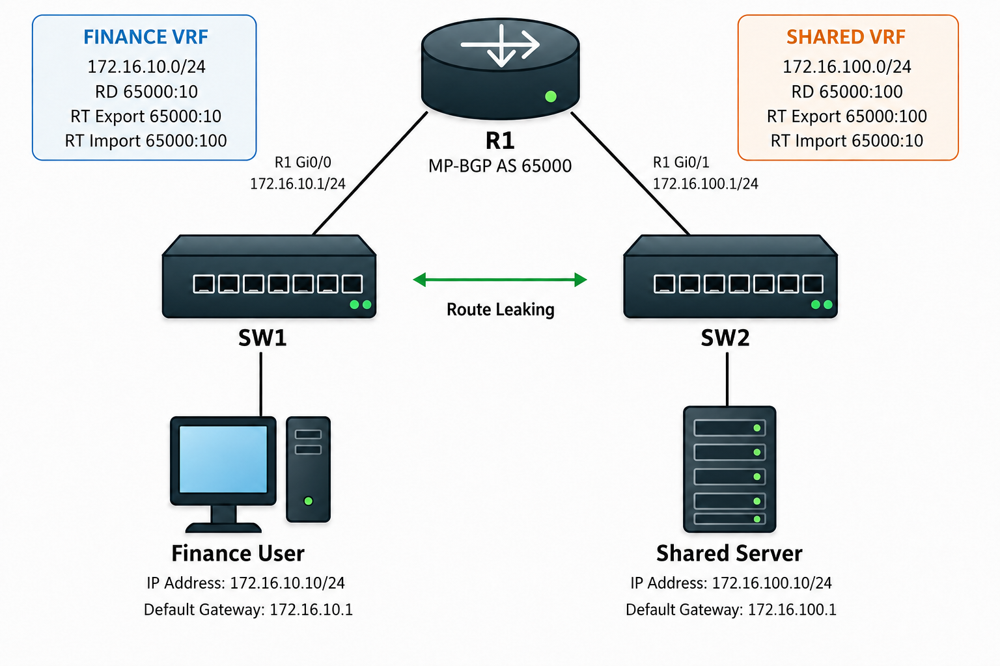

# VRF / VRF-Lite / Route Leaking

## 개념

### VRF

VRF(Virtual Routing and Forwarding)는 하나의 Router에서 여러 개의 독립적인 Routing Table을 사용하는 기술이다.

각 VRF는 자신의 Routing Table, CEF Table 및 ARP Table을 별도로 관리한다.

따라서 하나의 Router를 여러 개의 논리적인 Router처럼 사용할 수 있으며, 서로 다른 VRF에서는 같은 IP Address를 중복으로 사용할 수도 있다.

### Routing Table

Global Routing Table은 VRF가 적용되지 않은 Interface에서 사용하는 기본 Routing Table이다.
```
R1# show ip route
```

특정 VRF의 Routing Table은 VRF 이름을 지정하여 확인한다.
```
R1# show ip route vrf FINANCE
```
Global Routing Table과 각 VRF의 Routing Table은 서로 독립적이다.

### VRF Interface

VRF는 Layer 3 Interface에 적용한다.

하나의 Layer 3 Interface는 하나의 VRF에만 포함될 수 있다.

Router는 Packet이 들어온 Interface의 VRF를 확인하고 해당 VRF의 Routing Table에서 Destination Route를 검색한다.

### VRF-Lite

VRF-Lite는 MPLS 없이 하나의 Router나 Layer 3 Switch에서 여러 개의 VRF를 사용하는 방식이다.

일반적으로 회사 내부에서 부서, 고객, 관리 Network 및 Guest Network의 Routing Table을 분리할 때 사용한다.
- VRF-Lite: MPLS 없이 장비 내부에서 Routing Table을 분리한다.
- MPLS L3VPN: MPLS Label과 MP-BGP를 사용하여 서로 떨어져 있는 지점의 같은 VRF를 통신사망을 통해 하나처럼 연결하는 방식이다.

둘 다 VRF를 분리해서 사용한다는 점은 비슷하지만, VRF-Lite는 MPLS 없이 VRF를 연결하고 MPLS L3VPN은 통신사 MPLS망을 통해 여러 지점의 VRF를 연결한다.

### VRF 생성 방식

Cisco IOS에서는 VRF를 생성하는 방식에 따라 Interface에 적용하는 명령어가 다르다.

기존 IPv4 전용 방식은 `ip vrf`로 VRF를 생성하고 `ip vrf forwarding`으로 Interface에 적용한다.
```
R1(config)# ip vrf FINANCE
R1(config)# interface gi0/0
R1(config-if)# ip vrf forwarding FINANCE
```

Address-Family 방식은 `vrf definition`으로 VRF를 생성하고 `vrf forwarding`으로 Interface에 적용한다.
```
R1(config)# vrf definition FINANCE
R1(config-vrf)# address-family ipv4
R1(config-vrf-af)# exit-address-family

R1(config)# interface gi0/0
R1(config-if)# vrf forwarding FINANCE
```
- `ip vrf forwarding`: `ip vrf`로 생성한 기존 IPv4 전용 VRF에 사용한다.
- `vrf forwarding`: `vrf definition`으로 생성한 VRF에 사용하며 IPv4와 IPv6 Address-Family를 지원한다.

두 방식 모두 Interface에 VRF를 적용하면 기존 IP Address가 제거되므로 VRF를 적용한 후 IP Address를 다시 설정해야 한다.

### VRF별 Routing

각 VRF는 자신의 Static Route와 Routing Protocol을 가질 수 있다.
```
R1(config)# ip route vrf FINANCE 0.0.0.0 0.0.0.0 10.0.10.2
```
위 명령어는 `FINANCE` VRF의 Routing Table에만 Default Route를 등록한다.

OSPF도 VRF별로 별도의 Process를 구성할 수 있다.
```
R1(config)# router ospf 10 vrf FINANCE
```

VRF는 Global Routing Table과 분리된 별도의 Routing Table에서 Route 정보를 관리한다.  

### Route Leaking

Route Leaking은 서로 분리된 VRF 사이에서 필요한 Route만 공유하여 통신할 수 있도록 하는 기능이다.

기본적으로 VRF끼리는 서로의 Routing Table을 확인할 수 없기 때문에 직접 통신할 수 없다.

Route Leaking으로 통신하려면 요청 방향뿐만 아니라 응답 방향의 Route도 필요하다.

### Route Distinguisher

RD(Route Distinguisher)는 서로 다른 VRF에서 사용하는 동일한 IP Prefix를 MP-BGP에서 서로 다른 VPN Route로 구분하기 위한 값이다.
- MP-BGP는 서로 다른 VRF 사이에서 VPN Route 정보를 전달하는 기능이다.
- VPN Route는 특정 VRF에 속한 Route를 의미한다.  
- MP-BGP라는 별도의 명령어가 있는 것은 아니다. `router bgp`에서 VRF별 Address Family를 설정하면 MP-BGP로 동작한다.  

Route를 MP-BGP로 전달하면 여러 VRF의 Route가 VPN Routing Table에서 관리한다. 이때 VRF 이름은 MP-BGP로 전달되지 않으므로 같은 Prefix를 구분할 수 없다.  

예를 들어 두 VRF에서 모두 `192.168.10.0/24`를 사용하더라도 RD를 추가하면 서로 다른 VPN Route로 구분할 수 있다.
- `65000:10:192.168.10.0/24`
- `65000:20:192.168.10.0/24`

```
R1(config)# vrf definition FINANCE
R1(config-vrf)# rd 65000:10
```
단순히 VRF-Lite로 Routing Table만 분리할 때는 RD가 실제 Packet 전달에 사용되지 않지만, MP-BGP로 VRF Route를 교환하거나 Route Leaking을 구성할 때 사용한다.

### Route Target

RT(Route Target)는 MP-BGP에서 어떤 VRF Route를 내보내고 가져올지 결정하는 BGP Extended Community 값이다.
- `route-target export`: VRF Route에 RT 값을 설정하여 내보낸다.
- `route-target import`: 지정한 RT 값이 설정된 Route를 가져온다.

```
FINANCE
route-target export 65000:10
route-target import 65000:100

SHARED
route-target export 65000:100
route-target import 65000:10
```

위 설정은 자신의 Route를 RT `65000:10`으로 내보내고, RT `65000:100`이 설정된 Route를 가져온다.
각 VRF는 자신의 `Export` 값을 상대방 VRF의 `Import` 값과 맞춰야 한다.

### RD와 RT의 차이

RD는 동일한 IP Prefix를 서로 다른 VPN Route로 구분하고, RT는 어떤 VRF가 해당 Route를 가져올지 결정한다.

- RD: Route를 구분한다.
- RT: Route를 Import하거나 Export한다.

### MP-BGP를 이용한 VRF Route Leaking

#### RD와 RT 설정

각 VRF에 RD를 설정하고, Route를 공유할 수 있도록 자신의 `Export` 값을 상대방 VRF의 `Import` 값과 맞춘다.
```
R1(config)# vrf definition FINANCE
R1(config-vrf)# rd 65000:10
R1(config-vrf)# address-family ipv4
R1(config-vrf-af)# route-target export 65000:10
R1(config-vrf-af)# route-target import 65000:100
R1(config-vrf-af)# exit-address-family

R1(config)# vrf definition SHARED
R1(config-vrf)# rd 65000:100
R1(config-vrf)# address-family ipv4
R1(config-vrf-af)# route-target export 65000:100
R1(config-vrf-af)# route-target import 65000:10
R1(config-vrf-af)# exit-address-family
```
- `FINANCE`가 Export한 RT `65000:10`을 `SHARED`가 Import한다.
- `SHARED`가 Export한 RT `65000:100`을 `FINANCE`가 Import한다.

#### VRF Route를 MP-BGP에 등록

각 VRF의 Connected Route를 MP-BGP에 등록한다.
```
R1(config)# router bgp 65000

R1(config-router)# address-family ipv4 vrf FINANCE
R1(config-router-af)# redistribute connected
R1(config-router-af)# exit-address-family

R1(config-router)# address-family ipv4 vrf SHARED
R1(config-router-af)# redistribute connected
R1(config-router-af)# exit-address-family
```
- `address-family ipv4 vrf`: 각 VRF의 BGP Address Family로 들어간다.
- `redistribute connected`: VRF의 Connected Route를 MP-BGP에 등록한다.

---

## 동작 원리

### VRF 동작 과정

1\. Packet이 Layer 3 Interface로 들어온다.

2\. Router는 Packet이 들어온 Interface가 어떤 VRF에 포함되어 있는지 확인한다.

3\. 해당 VRF의 Routing Table에서 Destination Route를 검색한다.

4\. Destination Route가 있으면 Packet을 전달한다.

5\. Destination Route가 없으면 Packet을 Drop한다.

6\. 다른 VRF의 Network와 통신해야 한다면 Route Leaking을 구성해야 한다.

### Route Leaking 동작 과정

1\. `FINANCE` VRF와 `SHARED` VRF는 각각 별도의 Routing Table을 사용한다.

2\. 각 VRF는 자신의 Network만 알고 있으며 상대방 VRF의 Network는 알지 못한다.

3\. `FINANCE` VRF에는 RD `65000:10`을 설정하고, `SHARED` VRF에는 RD `65000:100`을 설정한다.

4\. MP-BGP는 RD를 사용하여 각 VRF의 Route를 서로 다른 VPN Route로 구분한다.

5\. `FINANCE` VRF는 자신의 Route를 RT `65000:10`으로 Export한다.

6\. `SHARED` VRF는 자신의 Route를 RT `65000:100`으로 Export한다.

7\. `FINANCE` VRF는 RT `65000:100`이 설정된 Route를 Import한다.

8\. `SHARED` VRF는 RT `65000:10`이 설정된 Route를 Import한다.

9\. MP-BGP가 Import된 Route를 각 VRF의 Routing Table에 등록한다.

10\. 양쪽 VRF에 서로의 Route가 등록되면서 양방향 통신이 가능해진다.

---

## 예시 및 구성도

### Finance Network와 Shared Server 연결

회사는 Finance Network와 Shared Server Network를 서로 다른 VRF로 분리하여 사용하고 있다.

Finance 사용자는 Shared Server에 접속해야 하지만 두 Network가 서로 다른 VRF에 포함되어 있어 기본적으로 통신할 수 없다.

관리자는 MP-BGP와 Route Target을 사용하여 두 VRF 사이에 필요한 Route를 공유하려고 한다.



1\. `FINANCE`와 `SHARED` VRF를 생성한다.
```
R1(config)# vrf definition FINANCE
R1(config-vrf)# rd 65000:10
R1(config-vrf)# address-family ipv4
R1(config-vrf-af)# exit-address-family

R1(config)# vrf definition SHARED
R1(config-vrf)# rd 65000:100
R1(config-vrf)# address-family ipv4
R1(config-vrf-af)# exit-address-family
```

2\. `Gi0/0`을 `FINANCE` VRF에 포함하고 IP Address를 설정한다.
```
R1(config)# interface gi0/0
R1(config-if)# vrf forwarding FINANCE
R1(config-if)# ip address 172.16.10.1 255.255.255.0
R1(config-if)# no shutdown
```

3\. `Gi0/1`을 `SHARED` VRF에 포함하고 IP Address를 설정한다.
```
R1(config)# interface gi0/1
R1(config-if)# vrf forwarding SHARED
R1(config-if)# ip address 172.16.100.1 255.255.255.0
R1(config-if)# no shutdown
```

4\. `FINANCE` VRF는 자신의 Route를 RT `65000:10`으로 Export하고 `SHARED` VRF의 RT `65000:100`을 Import한다.
```
R1(config)# vrf definition FINANCE
R1(config-vrf)# address-family ipv4
R1(config-vrf-af)# route-target export 65000:10
R1(config-vrf-af)# route-target import 65000:100
R1(config-vrf-af)# exit-address-family
```

6\. `SHARED` VRF는 자신의 Route를 RT `65000:100`으로 Export하고 `FINANCE` VRF의 RT `65000:10`을 Import한다.
```
R1(config)# vrf definition SHARED
R1(config-vrf)# address-family ipv4
R1(config-vrf-af)# route-target export 65000:100
R1(config-vrf-af)# route-target import 65000:10
R1(config-vrf-af)# exit-address-family
```

7\. 각 VRF의 Connected Route를 MP-BGP에 등록한다.
```
R1(config)# router bgp 65000
R1(config-router)# address-family ipv4 vrf FINANCE
R1(config-router-af)# redistribute connected
R1(config-router-af)# exit-address-family

R1(config-router)# address-family ipv4 vrf SHARED
R1(config-router-af)# redistribute connected
R1(config-router-af)# exit-address-family
```
8\. MP-BGP는 RD를 사용하여 각 VRF의 Route를 서로 다른 VPN Route로 구분한다.

9\. 이후 RT 값을 확인하여 각 Route를 상대방 VRF의 Routing Table에 등록한다.

9\. `FINANCE` VRF에는 `172.16.100.0/24` Route가 등록되고 `SHARED` VRF에는 `172.16.10.0/24` Route가 등록된다.

10\. Finance 사용자와 Shared Server 사이에 양방향 통신이 가능해진다.

---

## 명령어

### VRF 상태 확인

생성된 VRF와 RD를 확인한다.
```
R1# show vrf
```

각 Interface가 어떤 VRF에 포함되어 있는지 확인한다.
```
R1# show vrf interfaces
```

`FINANCE` VRF에 포함된 Interface의 IP Address와 상태를 확인한다.
```
R1# show ip interface brief vrf FINANCE
```

### VRF Table 확인

`FINANCE` VRF의 ARP Table을 확인한다.
```
R1# show ip arp vrf FINANCE
```

`FINANCE` VRF에서 동작하는 Routing Protocol을 확인한다.
```
R1# show ip protocols vrf FINANCE
```

### MP-BGP Route 확인

`FINANCE` VRF의 BGP Route를 확인한다.
```
R1# show bgp ipv4 unicast vrf FINANCE
```

MP-BGP가 관리하는 전체 VPNv4 Route와 RD를 확인한다.
```
R1# show bgp vpnv4 unicast all
```

### VRF 통신 확인

`FINANCE` VRF의 Routing Table을 사용하여 Ping을 전송한다.
```
R1# ping vrf FINANCE 172.16.100.10
```

`FINANCE` VRF의 경로를 확인한다.
```
R1# traceroute vrf FINANCE 172.16.100.10
```

---

## Troubleshooting

### VRF 통신이 정상적으로 동작하지 않는 경우

1\. VRF가 정상적으로 생성되어 있는지 확인한다.
```
R1# show vrf
```

2\. Interface가 올바른 VRF에 포함되어 있는지 확인한다.
```
R1# show vrf interfaces
```

3\. VRF를 생성한 방식과 Interface에 적용한 명령어가 일치하는지 확인한다.
- `ip vrf` → `ip vrf forwarding`
- `vrf definition` → `vrf forwarding`

4\. Destination Route가 Global Routing Table이 아니라 올바른 VRF의 Routing Table에 등록되어 있는지 확인한다.
```
R1# show ip route vrf FINANCE
```

5\. Static Route의 Next-Hop이 같은 VRF에서 도달 가능한지 확인한다.
```
R1# show ip route vrf FINANCE 10.0.10.2
```

6\. Route Leaking을 사용한다면 RD와 RT 설정을 확인한다.
```
R1# show vrf detail FINANCE
```

7\. Export RT와 상대방 VRF의 Import RT가 서로 일치하는지 확인한다.
- `FINANCE`의 Export RT가 `65000:10`이면 상대방 VRF에서 `65000:10`을 Import해야 한다.

8\. Connected Route나 Routing Protocol Route가 MP-BGP에 정상적으로 등록되어 있는지 확인한다.
```
R1# show bgp ipv4 unicast vrf FINANCE
```

9\. 요청 방향뿐만 아니라 응답 방향의 Route도 Leaking되어 있는지 확인한다.
- 한쪽 VRF에만 Route가 있으면 요청 Packet은 전달되더라도 응답 Packet이 돌아오지 못한다.

10\. Route Leaking 이후에도 ACL이나 Firewall에서 Traffic을 차단하고 있는지 확인한다.
- Route Leaking은 Route만 공유하며 Traffic을 자동으로 허용하지 않는다.

---

## 주요 질문

VRF란 무엇인가?
- 하나의 Router에서 여러 개의 독립적인 Routing Table을 사용하는 기술이다.

VRF를 사용하는 이유는 무엇인가?
- 하나의 장비에서 서로 다른 Network의 Routing 정보를 분리하고 Traffic을 격리하기 위해 사용한다.

VRF-Lite란 무엇인가?
- MPLS 없이 Router나 Layer 3 Switch 내부에서 여러 개의 VRF를 사용하는 방식이다.

서로 다른 VRF에서 같은 IP Address를 사용할 수 있는가?
- 각 VRF가 별도의 Routing Table을 사용하기 때문에 같은 IP Address와 Network를 사용할 수 있다.

Router는 Packet에 사용할 VRF를 어떻게 결정하는가?
- Packet이 들어온 Layer 3 Interface에 설정된 VRF를 기준으로 결정한다.

Route Leaking이란 무엇인가?
- 서로 분리된 VRF 사이에서 필요한 Route만 선택하여 공유하는 기능이다.

RD와 RT의 차이는 무엇인가?
- RD는 동일한 IP Prefix를 서로 다른 VPN Route로 구분하고, RT는 어떤 VRF가 해당 Route를 가져올지 결정한다.

Route Leaking을 한 방향에만 설정해도 통신할 수 있는가?
- 양방향 통신을 위해서는 요청 경로와 응답 경로가 모두 필요하다.
