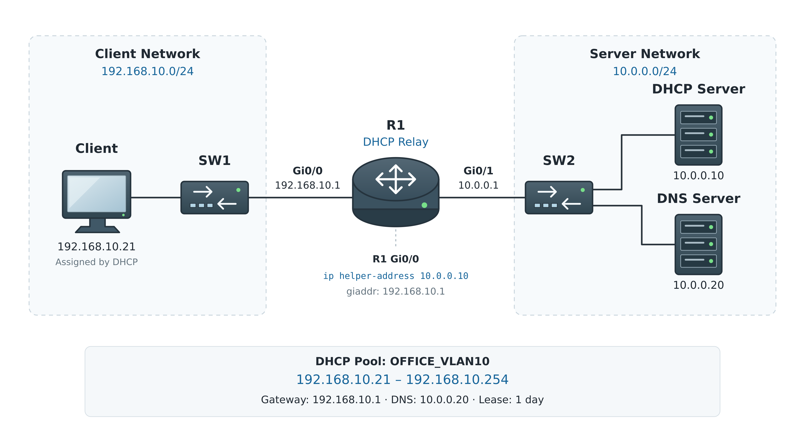

# DHCP / DHCP Relay

## 개념

### DHCP

DHCP(Dynamic Host Configuration Protocol)는 Client에게 IP Address와 Network 설정을 자동으로 할당하는 Protocol이다.

DHCP Server는 일반적으로 다음 정보를 Client에게 전달한다.
- IP Address
- Subnet Mask
- Default Gateway
- DNS Server
- Lease Time
- Domain Name

DHCP는 UDP를 사용한다.
- DHCP Server: UDP Port `67`
- DHCP Client: UDP Port `68`

Client는 처음에 네트워크에 연결되면 자신의 IP Address와 DHCP Server의 위치를 모르기 때문에 Broadcast를 사용하여 DHCP Server를 찾는다.

### Cisco IOS DHCP Server

Cisco IOS DHCP Server는 별도의 DHCP Server 장비를 사용하는 것이 아니라 Cisco Router나 Layer 3 Switch가 직접 DHCP Server 역할을 한다.

Windows Server나 전용 DHCP Server와 동일하게 DORA 과정을 통해 Client에게 IP Address와 Network 설정을 할당한다.

소규모 Network나 Lab에서는 Cisco 장비를 DHCP Server로 사용할 수 있지만, 규모가 큰 환경에서는 일반적으로 전용 DHCP Server를 사용하고 Cisco 장비는 DHCP Relay를 한다.


### DHCP DORA

DHCP Client는 `Discover → Offer → Request → ACK` 순서로 IP Address와 Network 설정을 할당받는다.


1\. DHCP Discover

Client는 자신의 IP Address와 DHCP Server의 위치를 모르기 때문에 Local Network에 Broadcast하여 DHCP Server를 찾는다.

2\. DHCP Offer

DHCP Server는 사용 가능한 IP Address를 제안하며, Client에게는 Broadcast Flag에 따라 Broadcast 또는 Unicast로 전달된다.
- Client가 DHCP Discover에 설정한 Broadcast Flag에 따라 DHCP Offer는 Client에게 Broadcast 또는 Unicast로 전달된다.

3\. DHCP Request

Client는 어떤 DHCP Server와 IP Address를 선택했는지 다른 DHCP Server들에게도 알리기 위해 Broadcast로 전송한다.
- 처음 IP Address를 할당받을 때는 DHCP Request를 Broadcast로 전송한다.
- Lease 갱신 시점인 T1에는 기존 DHCP Server에게 DHCP Request를 Unicast로 전송한다.

4\. DHCP ACK

DHCP Server는 IP Address 할당을 승인하며, Client에게는 Broadcast Flag에 따라 Broadcast 또는 Unicast로 전달된다.

### DHCP Relay

DHCP Discover는 Broadcast이기 때문에 Router를 통과하지 못한다.

DHCP Server가 Client와 다른 Network에 있다면 DHCP Relay를 Router에 사용하여 Client의 DHCP 메시지를 Server에게 전달해야 한다.

Cisco 장비에서는 Client의 DHCP Broadcast를 수신하는 Layer 3 Interface에 `ip helper-address`를 설정한다.

```
R1(config)# interface gi0/0
R1(config-if)# ip helper-address 10.0.0.10
```
- `10.0.0.10`은 DHCP Server의 IP Address이다.
- DHCP Server 방향이 아니라 Client가 연결된 Interface에 설정한다.
- Client Network가 여러 개라면 각 Client 방향 Layer 3 Interface 또는 SVI에 각각 설정한다. 
- 여러 Client Network를 VLAN으로 구분하고 Layer 3 Switch가 Gateway 역할을 하는 환경에서는 물리 Port가 아니라 각 Client VLAN의 SVI에 설정한다.

### GIADDR

DHCP Relay는 DHCP 요청을 전달할 때 `GIADDR(Gateway IP Address)`에 Client Network의 Gateway IP Address를 기록한다.

DHCP Server는 `GIADDR`을 확인하여 Client가 어느 Network에 있는지 판단하고 해당 Network의 DHCP Pool을 선택한다.

예를 들어 `GIADDR`이 `192.168.10.1`이라면 DHCP Server는 `192.168.10.0/24` Pool에서 IP Address를 할당한다.

### DHCP Pool

DHCP Pool은 Client에게 할당할 IP Address 대역과 Default Gateway, DNS Server, Lease Time 등의 정보를 설정한다.

DHCP Server는 Client의 요청을 받으면 Client가 속한 Network에 맞는 Pool을 선택하고, 그 안에서 사용 가능한 IP Address와 Network 설정을 전달한다.
- 일반적으로 Subnet마다 별도의 DHCP Pool을 구성한다.

```
R1(config)# ip dhcp pool VLAN10
R1(dhcp-config)# network 192.168.10.0 255.255.255.0
R1(dhcp-config)# default-router 192.168.10.1
R1(dhcp-config)# dns-server 8.8.8.8
```
- `network`: Client에게 할당할 Network를 지정한다.
- `default-router`: Client가 사용할 Default Gateway를 지정한다.
- `dns-server`: Client가 사용할 DNS Server를 지정한다.

### DHCP Option

DHCP Option은 Client가 동작하는 데 필요한 추가 정보를 전달한다.
- Option `3`: Default Gateway를 전달한다.
- Option `6`: DNS Server를 전달한다.
- Option `43`: Vendor 장비에 필요한 추가 정보를 전달한다. Cisco AP에서는 주로 WLC Address를 전달한다.
- Option `150`: Cisco IP Phone 등에 TFTP Server의 IP Address를 전달한다.

일반적으로 Option `3`과 `6`을 통해 Client에게 Default Gateway와 DNS Server 주소를 전달하고 Option `43`과 `150`은 AP나 IP Phone 등 특정 장비에 필요한 정보를 전달할 때 설정하여 사용한다.

### Excluded Address와 IP 충돌 확인

Excluded Address는 DHCP Server가 Client에게 할당하지 않도록 제외한 IP Address이다.

Default Gateway, Server 및 Network 장비처럼 고정 IP Address를 사용하는 주소는 DHCP 할당 범위에서 제외해야 한다.
```
R1(config)# ip dhcp excluded-address 192.168.10.1 192.168.10.20
```
Cisco IOS DHCP Server는 IP Address를 할당하는 과정에서 Ping과 Gratuitous ARP를 이용하여 해당 IP가 이미 사용 중인지 확인한다.

이미 사용 중인 IP라면 Conflict Table에 기록하고 다른 IP Address를 할당한다.

충돌 확인 기능이 있더라도 고정으로 사용하는 IP Address는 `excluded-address`로 미리 제외하는 것이 안전하다.

### Lease Time

DHCP로 할당된 IP Address는 영구적으로 사용하는 것이 아니라 Lease Time 동안만 사용할 수 있다.

Cisco IOS DHCP Server에서 Lease Time을 따로 설정하지 않으면 기본값은 1일인 `86,400초`이다.

Client가 IP Address를 반납하거나 Lease Time이 만료되면 DHCP Server는 해당 IP를 다른 Client에게 할당할 수 있다.

### DHCP Snooping

DHCP Snooping은 비정상적인 DHCP Server가 Client에게 잘못된 Network 설정을 전달하는 것을 방지하는 Switch 보안 기능이다.

DHCP Snooping이 설정되어 있다면 정상적인 DHCP Server 메시지가 들어오는 Port를 Trusted Port로 설정해야 한다.

DHCP Snooping은 관리자가 지정한 Trusted Port에서는 DHCP Server 메시지를 허용하고, Untrusted Port에서 들어오는 DHCP Server 메시지는 차단한다.

```
SW1(config)# interface gi0/24
SW1(config-if)# ip dhcp snooping trust
```
- DHCP Server가 연결되어 있다면 Server 방향 Port를 Trusted로 설정한다.
- DHCP Relay가 상단에 있다면 Relay 방향 Uplink Port를 Trusted로 설정한다.
- Client가 연결된 Access Port는 기본적으로 Untrusted 상태로 사용한다.

---

## 동작 원리

Client가 `192.168.10.0/24`, DHCP Server가 `10.0.0.10`에 있고 Router가 DHCP Relay 역할을 하는 경우이다.

1\. Client는 DHCP Discover를 Broadcast로 전송한다.

Client는 자신의 IP Address와 DHCP Server의 위치를 모르기 때문에 Local Network에 Broadcast한다.
```
Payload: DHCP Discover
Source IP: 0.0.0.0
Destination IP: 255.255.255.255
Source MAC: Client MAC
Destination MAC: FFFF.FFFF.FFFF
UDP Port: 68 → 67
```

2\. Router는 Client의 Broadcast DHCP Discover를 Server에게 Unicast로 전달한다.

Router는 `ip helper-address`가 설정되어 있으면 Client의 Broadcast DHCP 메시지를 새로운 IP Header로 캡슐화하고, Destination IP를 지정된 DHCP Server 주소로 변경하여 Unicast로 전달한다.

Router는 일반적인 Broadcast를 다른 Network로 전달하지 않지만, `ip helper-address`가 설정되어 있으면 DHCP Relay로 동작한다.

Router는 DHCP 메시지의 `giaddr`에 Client Network와 연결된 자신의 Interface IP Address를 넣고 DHCP Server에게 전달한다.
```
Destination IP: 10.0.0.10
giaddr: 192.168.10.1
UDP Port: 67 → 67
```
- `giaddr`: Client Network와 연결된 DHCP Relay Interface의 IP Address를 알려준다.

3\. DHCP Server는 Client에게 제안할 IP Address를 선택한다.

DHCP Server는 `giaddr`를 보고 Client가 속한 Network를 확인하고, 해당 DHCP Pool에서 사용 가능한 IP Address를 선택한다.
```
giaddr: 192.168.10.1
Client Network: 192.168.10.0/24
제안 IP Address: 192.168.10.100
```

4\. DHCP Server는 DHCP Offer를 Relay에게 Unicast로 전송한다.

DHCP Server는 제안할 IP Address와 Subnet Mask, Default Gateway, DNS Server 및 Lease Time을 DHCP Offer에 포함하여 `giaddr`의 주소로 전달한다.
```
Payload: DHCP Offer
Source IP: 10.0.0.10
Destination IP: 192.168.10.1
UDP Port: 67 → 67

yiaddr: 192.168.10.100
```
- `yiaddr`: DHCP Server가 Client에게 제안하는 IP Address가 들어가는 Your IP Address 필드이다.

5\. Router는 DHCP Offer를 Client에게 전달한다.

Router는 `giaddr`를 보고 Client Network와 연결된 Interface를 확인하고, Broadcast Flag에 따라 DHCP Offer를 Broadcast 또는 Unicast로 전달한다.

Client가 Broadcast Flag를 `1`로 설정한 경우에는 다음과 같이 Broadcast한다.
```
Payload: DHCP Offer
Source IP: 10.0.0.10
Destination IP: 255.255.255.255
Source MAC: Router Interface MAC
Destination MAC: FFFF.FFFF.FFFF
UDP Port: 67 → 68
```
- Broadcast Flag가 `0`이면 `yiaddr`의 IP Address와 `chaddr`의 Client MAC Address를 이용하여 Unicast로 전달할 수 있다.

6\. Client는 DHCP Request를 Broadcast로 전송한다.

Client는 사용할 DHCP Server와 제안받은 IP Address를 선택하고, 자신의 선택을 다른 DHCP Server들에게도 알리기 위해 Broadcast한다.
```
Payload: DHCP Request
Source IP: 0.0.0.0
Destination IP: 255.255.255.255
Source MAC: Client MAC
Destination MAC: FFFF.FFFF.FFFF
UDP Port: 68 → 67

Requested IP Address: 192.168.10.100
Server Identifier: 10.0.0.10
```
- 같은 Network에 있거나 Relay의 전달 대상으로 설정된 다른 DHCP Server들은 자신의 Offer가 선택되지 않았음을 확인할 수 있다.
- 선택되지 않은 DHCP Server는 자신이 제안했던 IP Address를 다른 Client에게 할당할 수 있다.

7\. Router는 DHCP Request를 Server에게 Unicast로 전달한다.

Router는 DHCP Request의 `giaddr`에 `192.168.10.1`을 넣고 `ip helper-address`에 설정된 DHCP Server에게 전달한다.
```
Payload: DHCP Request
Destination IP: 10.0.0.10
giaddr: 192.168.10.1
UDP Port: 67 → 67
```

8\. DHCP Server는 DHCP ACK를 Relay에게 Unicast로 전송한다.

DHCP Server는 Client가 요청한 IP Address의 할당을 승인하고 DHCP ACK를 `giaddr`의 주소로 전달한다.
```
Payload: DHCP ACK
Source IP: 10.0.0.10
Destination IP: 192.168.10.1
UDP Port: 67 → 67
```

9\. Router는 DHCP ACK를 Client에게 전달한다.

Router는 Broadcast Flag에 따라 DHCP ACK를 Broadcast 또는 Unicast로 전달한다.

Client는 DHCP ACK에 포함된 정보를 적용한 후 정상적인 통신을 시작한다.
```
IP Address: 192.168.10.100
Subnet Mask: 255.255.255.0
Default Gateway: 192.168.10.1
DNS Server: ...
Lease Time: ...
```

### DHCP Lease 갱신

1\. Lease Time의 약 `50%`가 지나면 Client는 기존 DHCP Server에 Lease 연장을 요청한다.

2\. DHCP Server가 DHCP ACK로 응답하면 Lease Time이 갱신된다.

3\. 기존 DHCP Server가 응답하지 않으면 Lease Time의 약 `87.5%`가 지난 시점에 Broadcast로 다른 DHCP Server에도 갱신을 요청한다.

4\. Lease가 만료될 때까지 갱신하지 못하면 기존 IP Address를 더 이상 사용할 수 없으며 DHCP Discover 과정부터 다시 시작한다.

---

## 예시 및 구성도

### 본사 사용자 Network에 DHCP Server 도입

회사는 직원 PC의 IP Address를 수동으로 설정하고 있었지만, 직원들이 늘어나면서 중복 IP Address와 잘못된 Default Gateway 설정이 자주 발생하였다.

관리자는 IP Address를 한 곳에서 관리하기 위해 Server Network에 전용 DHCP Server를 도입하였다.

사용자 Network와 Server Network는 서로 다른 대역이므로, R1에 DHCP Relay를 설정하여 Client의 DHCP 메시지를 Server까지 전달한다.

관리자는 Gateway, Printer 및 AP 등에 사용할 IP Address를 제외하고 `192.168.10.21`부터 Client에게 할당하도록 구성한다.



#### Network 구성
- Client Network: `192.168.10.0/24`
- Client Default Gateway: `192.168.10.1`
- R1 Client 방향 Interface: `Gi0/0`
- R1 Server 방향 Interface: `Gi0/1`
- Server Network: `10.0.0.0/24`
- DHCP Server: `10.0.0.10`
- DNS Server: `10.0.0.20`
- DHCP 할당 범위: `192.168.10.21`부터 `192.168.10.254`

#### DHCP Server 설정 정보

DHCP Server에는 Client Network에 맞는 DHCP Pool을 생성한다.
```
Network: 192.168.10.0/24
할당 범위: 192.168.10.21 - 192.168.10.254
Default Gateway: 192.168.10.1
DNS Server: 10.0.0.20
Lease Time: 1일
```

#### DHCP Relay 설정

R1의 Client 방향 Interface에 `ip helper-address`를 설정한다.
```
R1(config)# interface gi0/0
R1(config-if)# ip address 192.168.10.1 255.255.255.0
R1(config-if)# ip helper-address 10.0.0.10
R1(config-if)# no shutdown

R1(config)# interface gi0/1
R1(config-if)# ip address 10.0.0.1 255.255.255.0
R1(config-if)# no shutdown
```
- `ip helper-address`는 DHCP Server 방향이 아니라 Client의 DHCP Broadcast를 받는 Interface에 설정한다.
- Client Network가 여러 개라면 각 Client 방향 Layer 3 Interface 또는 SVI에 각각 설정한다.

#### DHCP Relay를 통한 IP Address 할당 과정

1\. Client는 DHCP Discover를 Broadcast로 전송한다.

Client는 자신의 IP Address와 DHCP Server의 위치를 모르기 때문에 Local Network에 DHCP Discover를 Broadcast한다.
```
Payload: DHCP Discover
Source IP: 0.0.0.0
Destination IP: 255.255.255.255
Source MAC: Client MAC
Destination MAC: FFFF.FFFF.FFFF
UDP Port: 68 → 67
```

2\. R1은 Client의 Broadcast DHCP Discover를 Server에게 Unicast로 전달한다.

R1은 `ip helper-address`가 설정되어 있으므로 Client의 DHCP Discover를 DHCP Relay로 처리한다.

R1은 DHCP 메시지의 `giaddr`에 Client 방향 Interface의 IP Address를 넣고, Destination IP를 DHCP Server 주소로 변경하여 Unicast로 전달한다.
```
Destination IP: 10.0.0.10
giaddr: 192.168.10.1
UDP Port: 67 → 67
```
- `giaddr`: `ip helper-address`가 설정된 Client 방향 Interface의 IP Address를 DHCP Server에게 알려준다.

3\. DHCP Server는 Client Network에 맞는 Pool을 선택한다.

DHCP Server는 `giaddr`의 `192.168.10.1`을 보고 Client가 `192.168.10.0/24` Network에 있다는 것을 확인한다.

DHCP Server는 해당 Pool에서 사용 가능한 `192.168.10.21`을 Client에게 제안한다.
```
giaddr: 192.168.10.1
Client Network: 192.168.10.0/24
제안 IP Address: 192.168.10.21
```

4\. DHCP Server는 DHCP Offer를 R1에게 Unicast로 전송한다.

DHCP Server는 `giaddr`에 들어 있는 R1의 IP Address로 DHCP Offer를 전달한다.
```
Payload: DHCP Offer
Source IP: 10.0.0.10
Destination IP: 192.168.10.1
UDP Port: 67 → 67

yiaddr: 192.168.10.21
```
- `yiaddr`: DHCP Server가 Client에게 제안하는 IP Address가 들어간다.

5\. R1은 DHCP Offer를 Client에게 전달한다.

R1은 `giaddr`를 보고 DHCP Offer를 `Gi0/0` 방향으로 전달한다.

Client가 Broadcast Flag를 `1`로 설정했다면 DHCP Offer를 Broadcast로 전달한다.
```
Payload: DHCP Offer
Destination IP: 255.255.255.255
Source MAC: R1 Gi0/0 MAC
Destination MAC: FFFF.FFFF.FFFF
UDP Port: 67 → 68
```
- Broadcast Flag가 `0`이면 `yiaddr`의 IP Address와 Client MAC Address를 이용하여 Unicast로 전달할 수 있다.

6\. Client는 DHCP Request를 Broadcast로 전송한다.

Client는 제안받은 `192.168.10.21`과 사용할 DHCP Server `10.0.0.10`을 선택한다.

Client는 자신의 선택을 다른 DHCP Server들에게도 알리기 위해 DHCP Request를 Broadcast한다.
```
Payload: DHCP Request
Source IP: 0.0.0.0
Destination IP: 255.255.255.255
Source MAC: Client MAC
Destination MAC: FFFF.FFFF.FFFF
UDP Port: 68 → 67

Requested IP Address: 192.168.10.21
Server Identifier: 10.0.0.10
```

7\. R1은 DHCP Request를 DHCP Server에게 Unicast로 전달한다.

R1은 DHCP Request의 `giaddr`에 `192.168.10.1`을 넣고, `ip helper-address`에 지정된 DHCP Server로 전달한다.
```
Payload: DHCP Request
Destination IP: 10.0.0.10
giaddr: 192.168.10.1
UDP Port: 67 → 67
```

8\. DHCP Server는 DHCP ACK를 R1에게 Unicast로 전송한다.

DHCP Server는 `192.168.10.21`의 할당을 승인하고, DHCP ACK를 `giaddr`의 주소인 `192.168.10.1`로 전달한다.
```
Payload: DHCP ACK
Source IP: 10.0.0.10
Destination IP: 192.168.10.1
UDP Port: 67 → 67
```

9\. R1은 DHCP ACK를 Client에게 전달한다.

R1은 Broadcast Flag에 따라 DHCP ACK를 Broadcast 또는 Unicast로 전달한다.

Client는 DHCP ACK에 포함된 Network 설정을 적용하고 정상적인 통신을 시작한다.
```
IP Address: 192.168.10.21
Subnet Mask: 255.255.255.0
Default Gateway: 192.168.10.1
DNS Server: 10.0.0.20
Lease Time: 1일
```

---

## 명령어

### Domain Name과 Lease Time 설정

기존 DHCP Pool에 Domain Name과 Lease Time을 설정한다.
```
R1(config)# ip dhcp pool VLAN10
R1(dhcp-config)# domain-name company.local
R1(dhcp-config)# lease 7
```
- `domain-name company.local`: Client에게 DNS Suffix로 사용할 Domain Name을 전달한다.
- `lease 7`: Lease Time을 7일로 설정한다.
- `lease 0 12`: Lease Time을 12시간으로 설정한다.
- `lease infinite`: Lease Time을 무제한으로 설정한다.

### SVI에서 DHCP Relay 설정

Layer 3 Switch의 SVI가 Client VLAN의 Gateway라면 해당 SVI에 설정한다.
```
SW1(config)# interface vlan 10
SW1(config-if)# ip helper-address 10.0.0.10
```

### Cisco Router를 DHCP Client로 설정

Router Interface가 DHCP Server로부터 IP Address를 할당받도록 설정한다.
```
R3(config)# interface gi0/0
R3(config-if)# ip address dhcp
R3(config-if)# no shutdown
```
- Network 장비는 Gateway나 관리용 IP Address가 변경되지 않도록 일반적으로 고정 IP Address를 사용한다.

### DHCP Server 상태 확인

아래 명령어는 Cisco 장비가 DHCP Server로 동작하는 경우에 사용한다.
```
R1# show ip dhcp binding
R1# show ip dhcp pool
R1# show ip dhcp conflict
R1# show ip dhcp server statistics
R1# show dhcp lease
```
- `show ip dhcp binding`: Client에게 할당한 IP Address와 Lease 정보를 확인한다.
- `show ip dhcp pool`: DHCP Pool의 주소 사용 현황을 확인한다.
- `show ip dhcp conflict`: 충돌로 기록된 IP Address를 확인한다.
- `show ip dhcp server statistics`: DHCP 메시지의 송수신 횟수와 Server 통계를 확인한다.

### DHCP Debug

DHCP Server의 주요 동작과 처리하는 Packet을 확인한다.
```
R1# debug ip dhcp server events
R1# debug ip dhcp server packet
```
- `events`: IP Address 할당 등 DHCP Server의 주요 동작을 확인한다.
- `packet`: DHCP Packet 처리 내용을 확인한다.

확인이 끝나면 Debug를 종료한다.
```
R1# undebug all
```

---

## Troubleshooting

### DHCP IP Address를 할당받지 못하는 경우

1\. Client가 DHCP를 사용하도록 설정되어 있는지 확인한다.
```
C:\> ipconfig /all
```

2\. DHCP Server에 Client Network와 일치하는 DHCP Pool이 존재하는지 확인한다.
```
R1# show ip dhcp pool
```

3\. DHCP Pool에 할당 가능한 IP Address가 남아 있는지 확인한다.

4\. IP 충돌이 발생한 Address가 있는지 확인한다.
```
R1# show ip dhcp conflict
```

5\. Client와 DHCP Server가 다른 Network에 있다면 Client 방향 Interface에 `ip helper-address`가 설정되어 있는지 확인한다.
```
R1# show running-config interface gi0/0
```

6\. DHCP Relay에서 DHCP Server까지 Route가 존재하고 DHCP Server에도 Client Network로 돌아오는 Return Route가 있는지 확인한다.
```
R1# show ip route 10.0.0.10
R2# show ip route 192.168.10.0
```

7\. DHCP Snooping이 설정되어 있다면 DHCP Server 또는 Relay 방향 Port가 Trusted인지 확인한다.
```
SW1# show ip dhcp snooping
```

8\. ACL이나 Firewall에서 UDP Port `67`, `68`이 차단되고 있지 않은지 확인한다.

9\. DHCP Server가 Client 요청을 실제로 수신하고 있는지 확인한다.
```
R1# show ip dhcp server statistics
R1# debug ip dhcp server events
R1# debug ip dhcp server packet
R1# undebug all
```
- Statistics와 Debug에 요청이 확인되지 않는다면 DHCP Relay, Routing, VLAN 또는 DHCP Snooping 구간에서 요청이 차단되고 있을 가능성이 있다.

10\. Client가 `169.254.0.0/16`의 IP Address를 사용하고 있다면  DHCP Server로부터 정상적인 IP Address를 할당받지 못한 상태이다.

---

## 주요 질문

DHCP란 무엇인가?
- Client에게 IP Address, Subnet Mask, Default Gateway 및 DNS Server 등의 Network 설정을 자동으로 할당하는 Protocol이다.

DHCP DORA 과정은 무엇인가?
- `Discover → Offer → Request → ACK` 순서로 Client에게 IP Address와 Network 설정을 할당하는 과정이다.

DHCP Relay를 사용하는 이유는 무엇인가?
- Router는 DHCP Broadcast를 다른 Network로 전달하지 않으므로, Client와 다른 Network에 있는 DHCP Server에게 DHCP 메시지를 중계하기 위해 사용한다.

`ip helper-address`는 어디에 설정하는가?
- Client의 DHCP Broadcast를 수신하는 Layer 3 Interface 또는 SVI에 설정한다.

DHCP Server는 Relay를 통해 들어온 요청의 Pool을 어떻게 선택하는가?
- DHCP Relay를 통해 들어온 메시지의 `giaddr`에 기록된 IP Address를 확인하여 Client Network에 맞는 Pool을 선택한다.
