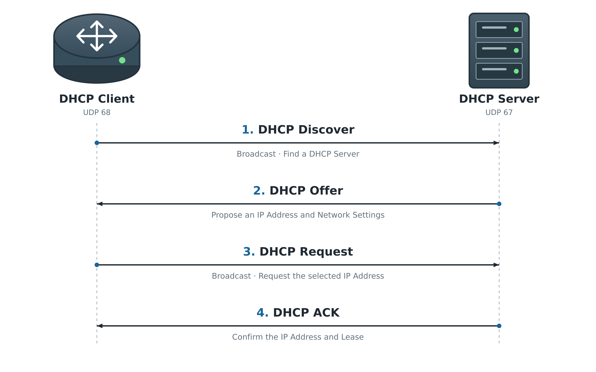

# DHCP / DHCP Relay

## 개념

### DHCP

DHCP(Dynamic Host Configuration Protocol)는 Client에게 IP Address와 Network 설정을 자동으로 할당하는 Protocol이다.

DHCP Server는 일반적으로 다음 정보를 Client에게 전달한다.
- IP Address
- Subnet Mask
- Default Gateway
- DNS Server
- Lease Time
- Domain Name

DHCP는 UDP를 사용한다.
- DHCP Server: UDP Port `67`
- DHCP Client: UDP Port `68`

Client는 처음에 네트워크에 연결되면 자신의 IP Address와 DHCP Server의 위치를 모르기 때문에 Broadcast를 사용하여 DHCP Server를 찾는다.

### Cisco IOS DHCP Server

Cisco IOS DHCP Server는 별도의 DHCP Server 장비를 사용하는 것이 아니라 Cisco Router나 Layer 3 Switch가 직접 DHCP Server 역할을 한다.

Windows Server나 전용 DHCP Server와 동일하게 DORA 과정을 통해 Client에게 IP Address와 Network 설정을 할당한다.

소규모 Network나 Lab에서는 Cisco 장비를 DHCP Server로 사용할 수 있지만, 규모가 큰 환경에서는 일반적으로 전용 DHCP Server를 사용하고 Cisco 장비는 DHCP Relay를 한다.


### DHCP DORA

DHCP Client는 `Discover → Offer → Request → ACK` 순서로 IP Address와 Network 설정을 할당받는다.



1\. DHCP Discover

Client는 자신의 IP Address와 DHCP Server의 위치를 모르기 때문에 Local Network에 Broadcast하여 DHCP Server를 찾는다.

2\. DHCP Offer

DHCP Server는 사용 가능한 IP Address를 제안하며, Client에게는 Broadcast Flag에 따라 Broadcast 또는 Unicast로 전달된다.
- Client가 DHCP Discover에 설정한 Broadcast Flag에 따라 DHCP Offer는 Client에게 Broadcast 또는 Unicast로 전달된다.

3\. DHCP Request

Client는 어떤 DHCP Server와 IP Address를 선택했는지 다른 DHCP Server들에게도 알리기 위해 Broadcast로 전송한다.
- 처음 IP Address를 할당받을 때는 DHCP Request를 Broadcast로 전송한다.
- Lease 갱신 시점인 T1에는 기존 DHCP Server에게 DHCP Request를 Unicast로 전송한다.

4\. DHCP ACK

DHCP Server는 IP Address 할당을 승인하며, Client에게는 Broadcast Flag에 따라 Broadcast 또는 Unicast로 전달된다.

### DHCP Relay

DHCP Discover는 Broadcast이기 때문에 Router를 통과하지 못한다.

DHCP Server가 Client와 다른 Network에 있다면 DHCP Relay를 Router에 사용하여 Client의 DHCP 메시지를 Server에게 전달해야 한다.

Cisco 장비에서는 Client의 DHCP Broadcast를 수신하는 Layer 3 Interface에 `ip helper-address`를 설정한다.

```
R1(config)# interface gi0/0
R1(config-if)# ip helper-address 10.0.0.10
```
- `10.0.0.10`은 DHCP Server의 IP Address이다.
- DHCP Server 방향이 아니라 Client가 연결된 Interface에 설정한다.
- Client Network가 여러 개라면 각 Client 방향 Layer 3 Interface 또는 SVI에 각각 설정한다. 
- 여러 Client Network를 VLAN으로 구분하고 Layer 3 Switch가 Gateway 역할을 하는 환경에서는 물리 Port가 아니라 각 Client VLAN의 SVI에 설정한다.

### GIADDR

DHCP Relay는 DHCP 요청을 전달할 때 `GIADDR(Gateway IP Address)`에 Client Network의 Gateway IP Address를 기록한다.

DHCP Server는 `GIADDR`을 확인하여 Client가 어느 Network에 있는지 판단하고 해당 Network의 DHCP Pool을 선택한다.

예를 들어 `GIADDR`이 `192.168.10.1`이라면 DHCP Server는 `192.168.10.0/24` Pool에서 IP Address를 할당한다.

### DHCP Pool

DHCP Pool은 Client에게 할당할 IP Address 대역과 Default Gateway, DNS Server, Lease Time 등의 정보를 설정한다.

DHCP Server는 Client의 요청을 받으면 Client가 속한 Network에 맞는 Pool을 선택하고, 그 안에서 사용 가능한 IP Address와 Network 설정을 전달한다.
- 일반적으로 Subnet마다 별도의 DHCP Pool을 구성한다.

```
R1(config)# ip dhcp pool VLAN10
R1(dhcp-config)# network 192.168.10.0 255.255.255.0
R1(dhcp-config)# default-router 192.168.10.1
R1(dhcp-config)# dns-server 8.8.8.8
```
- `network`: Client에게 할당할 Network를 지정한다.
- `default-router`: Client가 사용할 Default Gateway를 지정한다.
- `dns-server`: Client가 사용할 DNS Server를 지정한다.

### DHCP Option

DHCP Option은 Client가 동작하는 데 필요한 추가 정보를 전달한다.
- Option `3`: Default Gateway를 전달한다.
- Option `6`: DNS Server를 전달한다.
- Option `43`: Vendor 장비에 필요한 추가 정보를 전달한다. Cisco AP에서는 주로 WLC Address를 전달한다.
- Option `150`: Cisco IP Phone 등에 TFTP Server의 IP Address를 전달한다.

일반적으로 Option `3`과 `6`을 통해 Client에게 Default Gateway와 DNS Server 주소를 전달하고 Option `43`과 `150`은 AP나 IP Phone 등 특정 장비에 필요한 정보를 전달할 때 설정하여 사용한다.

### Excluded Address와 IP 충돌 확인

Excluded Address는 DHCP Server가 Client에게 할당하지 않도록 제외한 IP Address이다.

Default Gateway, Server 및 Network 장비처럼 고정 IP Address를 사용하는 주소는 DHCP 할당 범위에서 제외해야 한다.
```
R1(config)# ip dhcp excluded-address 192.168.10.1 192.168.10.20
```
Cisco IOS DHCP Server는 IP Address를 할당하는 과정에서 Ping과 Gratuitous ARP를 이용하여 해당 IP가 이미 사용 중인지 확인한다.

이미 사용 중인 IP라면 Conflict Table에 기록하고 다른 IP Address를 할당한다.

충돌 확인 기능이 있더라도 고정으로 사용하는 IP Address는 `excluded-address`로 미리 제외하는 것이 안전하다.

### Lease Time

DHCP로 할당된 IP Address는 영구적으로 사용하는 것이 아니라 Lease Time 동안만 사용할 수 있다.

Cisco IOS DHCP Server에서 Lease Time을 따로 설정하지 않으면 기본값은 1일인 `86,400초`이다.

Client가 IP Address를 반납하거나 Lease Time이 만료되면 DHCP Server는 해당 IP를 다른 Client에게 할당할 수 있다.

### DHCP Snooping

DHCP Snooping은 비정상적인 DHCP Server가 Client에게 잘못된 Network 설정을 전달하는 것을 방지하는 Switch 보안 기능이다.

DHCP Snooping이 설정되어 있다면 정상적인 DHCP Server 메시지가 들어오는 Port를 Trusted Port로 설정해야 한다.

```
SW1(config)# interface gi0/24
SW1(config-if)# ip dhcp snooping trust
```
- DHCP Server가 연결되어 있다면 Server 방향 Port를 Trusted로 설정한다.
- DHCP Relay가 상단에 있다면 Relay 방향 Uplink Port를 Trusted로 설정한다.
- Client가 연결된 Access Port는 기본적으로 Untrusted 상태로 사용한다.

---

