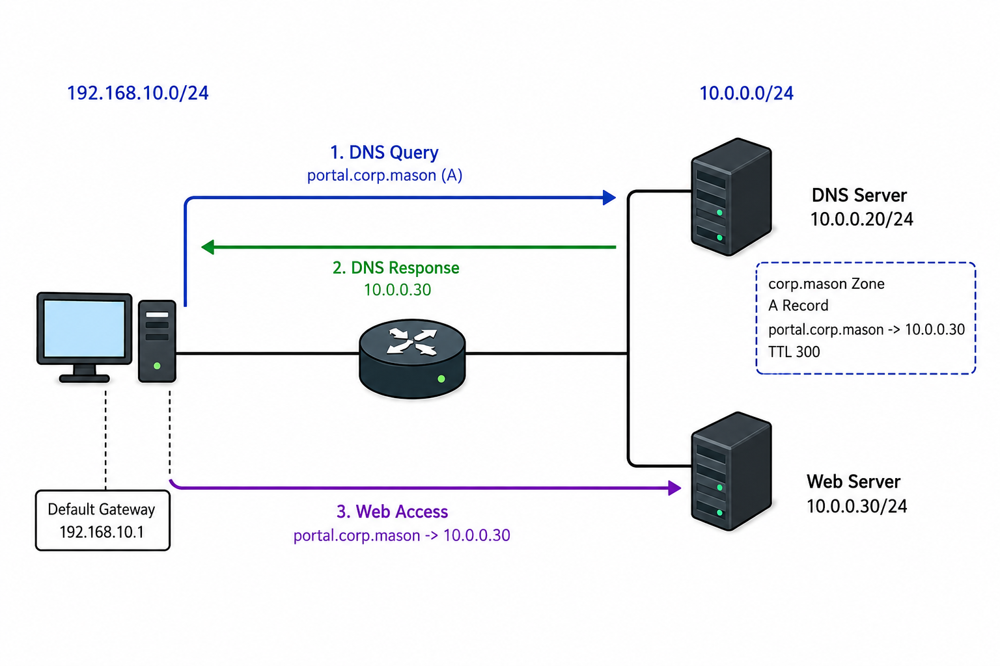

# DNS

## 개념

### DNS

DNS(Domain Name System)는 Domain Name에 해당하는 IP Address 등의 정보를 조회하는 시스템이다.

사용자는 Server의 IP Address를 직접 입력하지 않고 Domain Name으로 접속할 수 있다.

예를 들어 `www.google.com`에 접속하면 DNS로 해당 `Domain Name`의 `IP Address`를 확인한 후, 해당 IP Address를 사용하여 Server와 통신한다.

### A Record

A Record는 Domain Name과 IPv4 Address를 Mapping하여 저장하는 DNS Record이다.

DNS Server는 여러 개의 A Record를 가지고 있을 수 있으며, 같은 Domain에 속한 이름이라도 각각 별도의 A Record로 저장한다.
```
www.google.com     A    192.0.2.10
mail.google.com    A    192.0.2.20
maps.google.com    A    192.0.2.30
www.youtube.com    A    192.0.2.40
```
- 각 줄이 하나의 A Record이므로 위 예시는 총 4개의 A Record이다.
- `www.google.com`, `mail.google.com`, `maps.google.com`은 모두 `google.com`에 속하지만 각각 별도의 A Record이다.

### DNS Port

일반적인 DNS는 UDP와 TCP Port `53`을 사용한다.
- UDP `53`: 일반적인 DNS Query와 Response에 사용한다.
- TCP `53`: UDP 응답이 잘려 다시 조회하거나, DNS Server 사이에서 전체 Zone 정보를 전달하는 Zone Transfer 등에 사용한다.

### Zone Transfer

Zone Transfer는 Primary DNS Server가 관리하는 Zone의 DNS Record를 Secondary DNS Server에 복사하여 같은 정보를 유지하는 과정이다.

예를 들어 Primary DNS Server에서 관리하는 `www.google.com`, `mail.google.com` 등의 DNS Record를 Secondary DNS Server에 복사한다.
- 전체 Zone 정보를 전달할 때는 TCP Port `53`을 사용한다.
- 두 DNS Server 자체의 IP Address는 다르지만, 복사한 A Record에 저장된 IP Address 정보는 동일하다.
- Secondary DNS Server는 Primary에 장애가 발생해도 DNS 조회를 처리할 수 있으며, 평상시에도 DNS 요청에 응답할 수 있다.

### Domain Name과 FQDN

Domain Name은 DNS에서 사용하는 이름이며, 점으로 구분된 계층 구조를 가진다.

`www.example.com`은 다음과 같이 구분할 수 있다.
- `com`: Top-Level Domain(TLD)이다.
- `example.com`: Domain Name이다.
- `www`: Domain 안에서 웹 서비스를 나타내기 위해 사용하는 Host 이름이다.

FQDN(Fully Qualified Domain Name)은 Host부터 상위 Domain까지 포함한 전체 이름이다.

### DNS Server의 역할

Client가 `www.google.com`의 IP Address를 조회하는 경우이다.

1\. Recursive DNS Server
- Client를 대신하여 IP Address를 찾아주는 Server이다.
- Client가 `www.google.com`의 IP Address를 요청하면, 다른 DNS Server들을 조회하여 결과를 알려준다.

2\. Root DNS Server
- TLD DNS Server의 위치를 알려주는 Server이다.
- `www.google.com`을 조회하면 `.com`을 담당하는 TLD DNS Server 정보를 알려준다.

3\. TLD DNS Server
- 조회한 Domain을 담당하는 Authoritative DNS Server가 어디인지 알려주는 Server이다.
- `.com` TLD DNS Server는 `google.com`을 담당하는 Authoritative DNS Server 정보를 알려준다.

4\. Authoritative DNS Server
- 해당 Domain의 DNS Record를 직접 가지고 있는 Server이다.
- `google.com`을 담당하는 Authoritative DNS Server는 자신의 Record를 확인하고 `www.google.com`의 IP Address를 응답한다.

이렇게 찾은 IP Address를 Recursive DNS Server가 Client에게 전달한다.
- Client가 Root와 TLD DNS Server에 직접 물어보는 것이 아니라 Recursive DNS Server가 대신 조회한다.
- Recursive DNS Server에 이전 조회 결과가 유효한 Cache로 저장되어 있다면 위 과정을 반복하지 않고 바로 응답할 수 있다.

### DNS 조회 예시

Client와 회사 DNS Server에 필요한 Cache가 없는 경우이다.

1\. PC → 회사 DNS: “`www.google.com`의 IP Address를 알려줘.”
- 내부 DNS를 사용하는 경우: 내부 DNS 주소인 10.0.0.20으로 DNS Query를 보낸다. 
- 외부 DNS를 사용하는 경우: 외부 DNS 주소인 8.8.8.8 등으로 DNS Query를 보낸다.

2\. 회사 DNS → Root DNS: `.com` DNS Server의 위치를 받는다.

3\. 회사 DNS → `.com` DNS: `google.com` 담당 DNS Server의 위치를 받는다.

4\. 회사 DNS → `google.com` 담당 DNS: `www.google.com`의 IP Address를 받는다.

5\. 회사 DNS → PC: 찾은 IP Address를 알려준다.

6\. PC → Google Web Server: 받은 IP Address로 접속한다.

### Recursive Query와 Iterative Query

Recursive Query는 요청받은 DNS Server가 필요한 정보를 대신 조회하여 최종 결과나 오류를 반환하도록 요청하는 방식이다.
- Client → Recursive DNS Server: 일반적으로 Recursive Query를 사용한다.

Iterative Query는 DNS Server가 답을 알고 있으면 바로 응답하고, 답을 모르면 다른 DNS Server에 물어보라고 알려주는 방식이다.   	
- Recursive DNS Server → Root / TLD DNS Server: 일반적으로 Iterative Query를 사용한다.

### DNS Record

`A`: 이름에 해당하는 IPv4 Address를 지정한다.

`AAAA`: 이름에 해당하는 IPv6 Address를 지정한다.

`CNAME`: 별칭이 가리키는 다른 Domain Name을 지정한다.

`MX`: 해당 Domain의 Mail을 수신할 Server를 지정한다.

`NS`: 해당 Zone을 담당하는 Authoritative DNS Server를 지정한다.

`PTR`: IP Address에 해당하는 이름을 지정하며 Reverse Lookup에 사용한다.

`SOA`: Zone의 관리 정보와 Serial Number 등을 저장한다.

`TXT`: Domain 소유권 확인이나 Mail 인증 등에 사용하는 Text 정보를 저장한다.

`SRV`: 특정 서비스를 제공하는 Server와 Port 등의 정보를 지정한다.

```
www.example.com     A        192.0.2.10
portal.example.com  CNAME    www.example.com
```
- `www.example.com`은 `192.0.2.10`으로 조회된다.
- `portal.example.com`은 `www.example.com`을 가리키는 별칭이다.
- CNAME은 IP Address가 아니라 다른 Domain Name을 지정한다.

### Forward Lookup과 Reverse Lookup

Forward Lookup은 이름으로 IP Address를 조회하고, Reverse Lookup은 IP Address로 이름을 조회한다.
- Forward Lookup: `www.example.com → 192.0.2.10`
- Reverse Lookup: `192.0.2.10 → www.example.com`

Forward Lookup에는 A 또는 AAAA Record를 사용하고, Reverse Lookup에는 PTR Record를 사용한다.

A Record가 있다고 해서 PTR Record도 반드시 존재하는 것은 아니다.

### DNS Cache와 TTL

DNS Cache는 조회한 결과를 임시로 저장하여 같은 정보를 다시 조회할 때 사용하는 기능이다.
- PC에 Cache가 있으면 DNS Server에 다시 물어보지 않고 사용한다.

DNS의 TTL(Time to Live)은 Record를 Cache에 보관할 수 있는 시간을 초 단위로 지정한다.

예를 들어 TTL이 `300`이면 해당 정보를 최대 300초 동안 Cache에서 사용할 수 있다.
- DNS의 TTL은 IP Packet의 Hop 수를 제한하는 TTL과 다른 값이다.

### DNS Forwarder

DNS Forwarder는 DNS Server가 직접 해결하지 못한 조회 요청을 대신 처리하도록 지정한 다른 DNS Server이다.

PC는 내부 회사 DNS Server에 조회하며, 회사 DNS Server는 내부 Domain에는 직접 응답하고 외부 Domain은 Cache가 없으면 Forwarder로 지정된 DNS Server에 물어본 후 결과를 전달한다. 
```
PC가 사용하는 DNS Server: 10.0.0.20 
회사 DNS Server의 Forwarder: 8.8.8.8
```

특정 Domain의 요청만 지정한 DNS Server로 전달하는 방식은 Conditional Forwarding이라고 한다.

---

## 동작 원리

### DNS 조회 과정

Client가 `www.example.com`의 IPv4 Address를 조회하는 경우이다.

Client와 Recursive DNS Server에 `example.com`에 대한 Cache가 없으며, Forwarder를 사용하지 않는 환경이다.

1\. Client는 설정된 Recursive DNS Server로 `www.example.com`의 A Record를 요청하는 Query를 전송한다.
```
Source IP: Client IP
Destination IP: Recursive DNS Server IP
Protocol: UDP
Source Port: Random Port
Destination Port: 53
```

2\. Recursive DNS Server는 Cache에 정보가 없기 때문에 Root DNS Server로 DNS Query를 전송한다.  
```
Source IP: Recursive DNS Server IP
Destination IP: Root DNS Server IP
Protocol: UDP
Destination Port: 53
```

3\. Root DNS Server는 `.com`을 담당하는 TLD DNS Server 정보를 Recursive DNS Server에게 응답한다.

4\. Recursive DNS Server는 전달받은 `.com` TLD DNS Server로 DNS Query를 전송한다.
```
Source IP: Recursive DNS Server IP
Destination IP: TLD DNS Server IP
Protocol: UDP
Destination Port: 53
```
5\. TLD DNS Server는 `google.com`을 담당하는 Authoritative DNS Server 정보를 Recursive DNS Server에게 응답한다.

6\. Recursive DNS Server는 Authoritative DNS Server로 `www.google.com`의 A Record를 요청하는 DNS Query를 전송한다.
```
Source IP: Recursive DNS Server IP
Destination IP: Authoritative DNS Server IP
Protocol: UDP
Destination Port: 53
```

7\. Authoritative DNS Server는 `www.google.com`에 등록된 IPv4 Address를 응답한다.
```
www.google.com
A Record: 93.184.216.34
```

8\. Recursive DNS Server는 조회 결과를 Cache에 저장하고 Client에게 응답한다.
```
Source IP: Recursive DNS Server IP
Destination IP: Client IP
Protocol: UDP
Source Port: 53
Destination Port: Client의 Random Port
```

9\. Client는 전달받은 IP Address를 이용하여 Web Server와 통신을 시작한다.
- Client가 Root, TLD, Authoritative DNS Server에 직접 조회하는 것이 아니라 Recursive DNS Server가 대신 조회한다.
- DNS Query는 일반적으로 UDP `53`번 Port를 사용한다.
- 응답이 크거나 Zone Transfer가 필요한 경우 TCP `53`번 Port를 사용할 수 있다.

---

## 예시 및 구성도

### 사내 업무 Portal을 Domain Name으로 접속

`MASON` 회사는 직원들이 사내 업무 시스템, 파일 공유 시스템 등에 접속할 수 있도록 내부 Web Portal을 운영하고 있다.  
 
기존에는 직원들이 Web Browser에 `10.0.0.30`을 직접 입력하여 Portal에 접속하고 있었지만, 신규 직원이 늘어나면서 IP Address를 기억하기 어렵다는 문의가 계속 발생하였다.

관리자는 Web Server 접속 방법이 바뀌지 않도록 내부 DNS Server에 `portal.corp.mason`을 등록하기로 하였다.  

이후 직원들은 Web Server의 IP Address를 직접 입력하지 않고 `portal.corp.mason`을 이용하여 사내 Portal에 접속할 수 있다.



Network 구성
- Client: `192.168.10.100/24`
- Client Default Gateway: `192.168.10.1`
- DNS Server: `10.0.0.20/24`
- Web Server: `10.0.0.30/24`
- 내부 Domain: `corp.mason`

#### DNS 설정 정보

DNS Server의 `corp.mason` Zone에 다음 A Record를 등록한다.
```
Name: portal.corp.mason
Record Type: A
IP Address: 10.0.0.30
TTL: 300
```

Client가 사용할 DNS Server를 `10.0.0.20`으로 설정한다.

#### 접속 과정

1\. 직원이 Web Browser에 `portal.corp.mason`을 입력한다.

2\. Client는 `portal.corp.mason`의 IP Address를 확인하기 위해 DNS Server에 Query를 전송한다.
```
Payload: DNS Query
Source IP: 192.168.10.100
Destination IP: 10.0.0.20
UDP Port: Random Port → 53

Query Name: portal.corp.mason
Query Type: A
```

3\. DNS Server는 자신이 관리하는 `corp.mason` Zone에서 `portal.corp.mason`의 A Record를 확인한다.

4\. DNS Server는 Client에게 `10.0.0.30`을 응답한다.
```
Payload: DNS Response
Source IP: 10.0.0.20
Destination IP: 192.168.10.100
UDP Port: 53 → Client의 Random Port

Answer: 10.0.0.30
```

5\. 이후 직원들은 Web Server의 IP Address를 직접 입력하지 않고 `portal.corp.mason`을 통해 Web Server에 접속한다.  
---

## 명령어

### Client의 DNS Server 확인

Windows Client에 설정된 DNS Server를 확인한다.
```
C:> ipconfig /all
```

### DNS 조회

Client에 설정된 DNS Server 및 IP Address를 조회한다.  
```
C:> nslookup portal.corp.mason
```

IP Address에 해당하는 이름을 Reverse Lookup으로 조회한다.
```
C:> nslookup 10.0.0.30
```

### DNS Cache 확인 및 삭제

Windows Client의 DNS Cache를 확인한다.
```
C:> ipconfig /displaydns
```

기존 DNS Cache를 삭제한다.
```
C:> ipconfig /flushdns
```

### Cisco Router의 DNS 조회 설정

Router가 Domain Name을 이용하여 Ping이나 Traceroute를 실행할 수 있도록 DNS 조회 기능을 활성화한다.
```
R1(config)# ip domain lookup
R1(config)# ip name-server 10.0.0.20
```
- `ip domain lookup`: Router의 DNS 조회 기능을 활성화한다.
- `ip name-server`: Router가 사용할 DNS Server를 지정한다.
- `no ip domain lookup`은 Router가 잘못 입력한 명령어를 Domain Name으로 인식하여 DNS 조회를 시도하는 것을 막기 위해 사용한다.

---

## Troubleshooting

### DNS 조회가 정상적으로 동작하지 않는 경우  

1\. Client에 올바른 DNS Server가 설정되어 있는지 확인한다.
```
C:\> ipconfig /all
```

2\. DNS Server를 직접 지정하여 정상적으로 응답하는지 확인한다.
```
C:\> nslookup portal.corp.example 10.0.0.20
```

3\. DNS Server까지의 Routing과 ACL 또는 Firewall 설정을 확인한다.
- 일반적인 DNS 통신에 필요한 UDP와 TCP Port `53`이 차단되어 있지 않은지 확인한다.

4\. DNS Server에 올바른 Zone과 Record가 존재하는지 확인한다.
- 이름의 오타와 A / AAAA / CNAME Record 값을 확인한다.

5\. DNS Server에서 Domain Name의 IP Address를 변경했는데도 이전 IP Address가 계속 조회되면 Cache와 TTL을 확인한다.
```
C:\> ipconfig /displaydns
C:\> ipconfig /flushdns
```
- Client의 DNS Cache를 Flush하여 변경된 DNS 정보를 다시 조회한다.  

6\. 내부 Domain은 조회되지만 외부 Domain만 실패하면 Forwarder 설정과 외부 DNS Server까지의 통신을 확인한다.

---

## 주요 질문

DNS란 무엇인가?
- Domain Name에 해당하는 IP Address 등의 정보를 조회하는 시스템이다.

DNS는 어떤 Port를 사용하는가?
- 일반적인 DNS는 UDP와 TCP Port `53`을 사용한다.

A Record와 CNAME Record의 차이는 무엇인가?
- A Record는 이름에 IPv4 Address를 매핑하고, CNAME Record는 별칭에 다른 Domain Name을 매핑한다.

Recursive DNS Server의 역할은 무엇인가?
- Client를 대신하여 다른 DNS Server에 조회하고 최종 결과를 Client에게 전달한다.

Authoritative DNS Server의 역할은 무엇인가?
- 자신이 직접 가지고 있는 Zone의 DNS Record를 확인하여 요청받은 정보를 응답한다.

DNS Cache와 TTL을 사용하는 이유는 무엇인가?
- 같은 DNS 정보를 매번 다시 조회하지 않고 저장된 정보를 사용하여 더 빠르게 조회하기 위해 사용한다.  

DNS Record를 변경했는데 이전 IP Address가 조회되는 이유는 무엇인가?
- Client에 기존 DNS Server의 Cache가 남아 있을 수 있기 때문이다.
