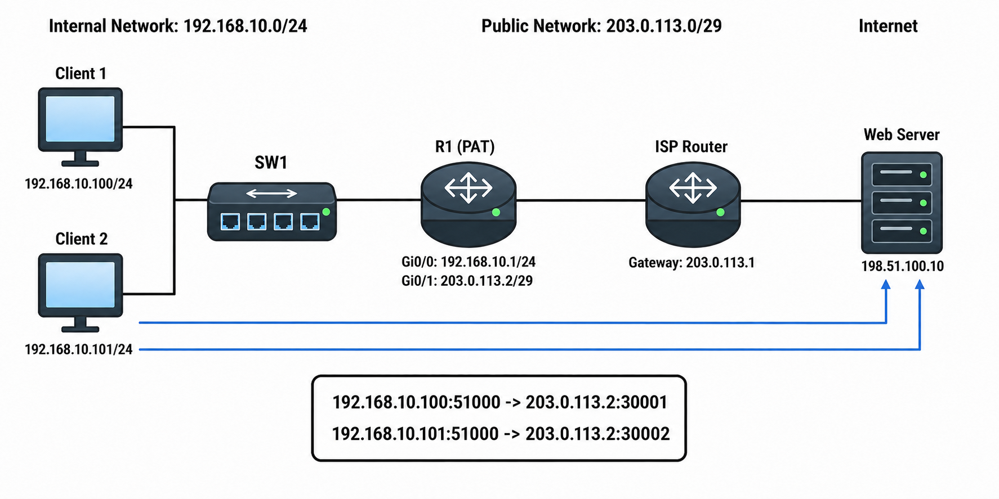

# NAT / PAT

## 개념

### NAT

NAT(Network Address Translation)는 Router가 Packet의 IP Address를 다른 IP Address로 변경하는 기능이다.

주로 내부 Private IP Address를 Public IP Address로 변환하여 Internet과 통신할 수 있도록 사용한다.
- 내부 Interface에는 `ip nat inside`를 설정한다.
- 외부 Interface에는 `ip nat outside`를 설정한다.

### Source and Destination NAT

Source NAT는 Packet의 Source IP Address를 변환하는 방식이다.
- 내부 Client가 외부 Network로 나갈 때 Private IP Address를 Public IP Address로 변환하기 위해 사용한다.
```
192.168.10.100 → 203.0.113.2
```

Destination NAT는 Packet의 Destination IP Address를 변환하는 방식이다.
- 주로 외부 사용자가 Public IP Address로 내부 Server에 접속할 때 사용한다.
```
203.0.113.6 → 192.168.20.10
```

### NAT 용어

Inside Local: 내부 장비의 Private IP Address
- `192.168.10.100`
Inside Global: NAT 변환 후 외부에서 보이는 IP Address
- `203.0.113.2`
Outside Local: 내부에서 바라보는 외부 장비의 IP Address
- `8.8.8.8`
Outside Global: 외부 장비가 실제로 사용하는 IP Address
- `8.8.8.8`

### Static NAT

Static NAT는 하나의 Private IP Address와 하나의 Public IP Address를 `1:1`로 고정하여 매핑하는 방식이다.
```
192.168.20.10 ↔ 203.0.113.6
```
Static NAT는 내부 장비마다 Public IP Address가 하나씩 필요하기 때문에 Public IP Address 절약 효과가 적다.

### Dynamic NAT

Dynamic NAT는 내부 장비가 외부로 통신할 때 Public IP Address Pool에서 사용 가능한 주소를 임시로 할당하는 방식이다.

Public IP Address가 10개라면 동시에 최대 10개의 내부 IP Address에 NAT를 적용할 수 있다.

Pool의 Public IP Address가 모두 사용 중이면 새로운 NAT Translation을 생성할 수 없다.


### PAT

PAT(Port Address Translation)는 여러 내부 장비가 하나의 Public IP Address를 함께 사용할 수 있도록 IP Address와 Port Number를 함께 변환하는 방식이다.

Cisco에서는 PAT를 `NAT Overload`라고도 한다.
```
192.168.10.100:51000 → 203.0.113.2:30001
192.168.10.101:51000 → 203.0.113.2:30002
```

같은 Public IP Address를 사용하지만 변환된 Port Number가 다르기 때문에 각각의 통신을 구분할 수 있다.
- ICMP는 Port Number가 없으므로 ICMP Identifier 등을 이용하여 구분한다.
- 일반적인 회사와 가정에서는 PAT를 가장 많이 사용한다.

### Static PAT

Static PAT는 특정 Public IP Address와 Port로 들어오는 Traffic을 내부 Server의 특정 Port로 전달하는 방식이다.

내부 장비가 먼저 통신을 시작해야 Router에 Translation 정보가 생성되며, 외부에서 먼저 내부 Server에 접속하도록 하려면 Public IP Address와 Port를 내부 Server에 미리 연결하는 Static PAT를 설정해야 한다.  
```
203.0.113.6:443 → 192.168.20.10:443
```
- Static PAT 설정이 없으면 외부 사용자가 Public IP Address `203.0.113.6`의 TCP Port `443`으로 접속했을 때 Router는 해당 Traffic을 어떤 내부 Server로 전달해야 하는지 모른다. 따라서 `203.0.113.6:443 → 192.168.20.10:443`과 같이 Static PAT를 설정하여 외부에서 들어온 Traffic을 내부 Web Server로 전달할 수 있도록 한다.

### Static Outside PAT

Static Outside PAT는 내부 사용자에게 외부 Server를 다른 IP Address와 Port로 보이게 하는 방식이다.

예를 들어 실제 외부 Web Server가 `198.51.100.10:80`이지만 내부 사용자는 `10.0.6.100:6783`으로 접속할 수 있다.
```
내부에서 보이는 주소: 10.0.6.100:6783
실제 외부 Server: 198.51.100.10:80
```

내부 사용자가 `10.0.6.100:6783`으로 접속하면 Router가 Destination 정보를 실제 외부 Server인 `198.51.100.10:80`으로 변환한다.

응답 Packet이 돌아오면 Source 정보를 다시 `10.0.6.100:6783`으로 변환하여 내부 사용자에게 전달한다.
- 일반적인 Static PAT는 외부 사용자가 내부 Server에 접속할 때 사용한다.
- Static Outside PAT는 내부 사용자가 외부 Server를 다른 주소로 보이게 할 때 사용한다.

### Dynamic PAT using Outside Interface

Router의 외부 Interface에 설정된 IP Address를 여러 내부 장비가 함께 사용하는 방식이다.
```
R1 Gi0/1 IP Address: 203.0.113.2
```

모든 내부 사용자는 `203.0.113.2`를 공유하고 Port Number를 통해 각각의 통신을 구분한다.

가장 일반적으로 사용하는 PAT 방식이다.

### Dynamic PAT with Pool

여러 내부 장비가 여러 개의 Public IP Address를 Port Number로 나누어 사용하는 방식이다.

```
Public IP Pool: 203.0.113.3 ~ 203.0.113.5
```

서로 다른 내부 장비가 같은 Public IP Address를 사용하더라도 변환된 Port Number가 다르기 때문에 각각의 통신을 구분할 수 있다.

```
192.168.10.100:51000 → 203.0.113.3:30001
192.168.10.101:52000 → 203.0.113.3:30002
192.168.10.102:53000 → 203.0.113.4:30003
192.168.10.103:54000 → 203.0.113.4:30004
192.168.10.104:55000 → 203.0.113.5:30005
192.168.10.105:56000 → 203.0.113.5:30006
```
Dynamic NAT와 Dynamic PAT의 차이는 `overload` 사용 여부이다.
- `overload` 없음: 하나의 내부 IP Address가 Public IP Address 하나를 사용한다.
- `overload` 있음: 여러 내부 IP Address가 Public IP Address를 공유하며, Port Number로 각각의 통신을 구분한다.

### Two-Way NAT

A 회사와 B 회사가 Router를 통해 연결되어 있지만, 두 회사 모두 `10.16.0.0/24`를 사용하면 IP Address가 서로 겹치는 문제가 발생한다.

이를 해결하기 위해 상대방의 장비를 실제 IP Address가 아닌 다른 IP Address로 보이게 한다.
- A Client 실제 IP: `10.16.0.10`
- A 회사에서 보이는 B Server: `10.16.6.100`
- B Server 실제 IP: `10.16.0.100`
- B 회사에서 보이는 A Client: `10.16.7.10`

A Client는 B Server의 실제 IP Address를 모르고 `10.16.6.100`으로 접속한다.
```
Source IP: 10.16.0.10
Destination IP: 10.16.6.100
```

Router는 Source와 Destination IP Address를 모두 변환한다.
```
Source IP: 10.16.7.10
Destination IP: 10.16.0.100
```

B Server는 요청을 자신의 실제 IP Address인 `10.16.0.100`으로 받으며, A Client를 `10.16.7.10`으로 인식한다.

응답 Traffic은 Router에서 반대로 변환된다.
```
Source IP: 10.16.0.100
Destination IP: 10.16.7.10
```
```
Source IP: 10.16.6.100
Destination IP: 10.16.0.10
```
즉, 두 회사는 실제로 같은 IP Address 대역을 사용하지만 상대방의 장비를 다른 대역으로 보이게 하여 Address 충돌 없이 통신할 수 있다.

### NAT ACL

PAT와 Dynamic NAT에서 ACL은 NAT를 적용할 내부 Source IP Address를 선택한다.
```
R1(config)# access-list 10 permit 192.168.10.0 0.0.0.255
```
- ACL의 `permit`: 해당 Source IP Address에 NAT를 적용한다.
- ACL의 `deny`: Traffic을 차단하는 것이 아니라 NAT 적용 대상에서 제외한다.

---

## 동작 원리

### PAT 동작 과정

Client `192.168.10.100`이 외부 Web Server `198.51.100.10:443`으로 접속하는 경우이다.

1\. Client는 다음 Packet을 Default Gateway인 R1으로 전송한다.
```
Source: 192.168.10.100:51000
Destination: 198.51.100.10:443
```

2\. R1은 Packet을 `ip nat inside`가 설정된 Interface에서 수신한다.

3\. R1은 NAT ACL을 확인하여 Source IP Address가 NAT 적용 대상인지 확인한다.

4\. PAT 적용 대상이면 Source IP Address와 Source Port를 변환한다.
```
192.168.10.100:51000 → 203.0.113.2:30001
```

5\. R1은 변환 정보를 NAT Translation Table에 저장하고 Packet을 외부로 전달한다.

6\. 외부 Web Server는 `203.0.113.2:30001`로 응답한다.

7\. R1은 NAT Translation Table을 확인하여 Destination 정보를 원래 Client 정보로 변환한다.
```
203.0.113.2:30001 → 192.168.10.100:51000
```

8\. 변환된 응답 Packet을 내부 Client에게 전달한다.

### Static PAT 동작 과정

1\. 외부 사용자가 `203.0.113.6:443`으로 접속한다.

2\. R1은 Static PAT 설정을 확인한다.

3\. Destination 정보를 내부 Web Server 주소로 변환한다.
```
203.0.113.6:443 → 192.168.20.10:443
```

4\. 내부 Web Server의 응답은 R1에서 다시 Public IP Address로 변환된다.

5\. 외부 사용자는 내부 Server의 실제 IP Address를 알 수 없으며, 자신이 접속한 `203.0.113.6:443`에서 응답이 돌아온 것으로 인식한다.

### Static Outside PAT 동작 과정

1\. 내부 사용자는 외부 Server의 변환된 주소인 `10.0.6.100:6783`으로 접속한다.

2\. R1은 Static Outside PAT 설정을 확인한다.

3\. R1은 Destination 정보를 실제 외부 Server 주소로 변환한다.
```
10.0.6.100:6783 → 198.51.100.10:80
```

4\. 외부 Server는 R1으로 응답한다.

5\. R1은 응답 Packet의 Source 정보를 내부에서 사용하는 주소로 변환한다.
```
198.51.100.10:80 → 10.0.6.100:6783
```

6\. 내부 사용자에게는 `10.0.6.100:6783`에서 응답한 것으로 보인다.

### Two-Way NAT 동작 과정

1\. A 회사 Client는 B 회사 Server의 변환된 주소인 `10.16.6.100`으로 Packet을 전송한다.

2\. Packet은 NAT가 설정된 R1으로 전달된다.

3\. R1은 Source IP Address를 `10.16.0.10`에서 `10.16.7.10`으로 변환한다.

4\. R1은 Destination IP Address를 `10.16.6.100`에서 실제 B 회사 Server 주소인 `10.16.0.100`으로 변환한다.

5\. R1은 변환된 Packet을 R2로 전달하고, R2는 B 회사 Server로 Routing한다.

6\. B 회사 Server는 A Client를 `10.16.7.10`으로 인식하고 응답한다.

7\. 응답 Packet은 R2를 거쳐 R1으로 전달된다.

8\. R1은 응답 Packet의 Source를 `10.16.6.100`으로, Destination을 A Client의 실제 주소인 `10.16.0.10`으로 변환하여 전달한다.

---

## 예시 및 구성도

### 사내 사용자의 Internet 접속

`MASON` 회사는 직원들의 업무용 PC에 `192.168.10.0/24` 대역의 Private IP Address를 할당하고 있다.

회사 직원들은 업무 Portal, Cloud Service 및 외부 Web Server를 이용하기 위해 Internet에 접속해야 하지만, Private IP Address는 Internet에서 직접 사용할 수 없다.

따라서 관리자는 모든 직원의 Private IP Address를 R1의 외부 Interface IP Address인 `203.0.113.2`로 변환하여 Internet에 접속할 수 있도록 Dynamic PAT를 구성하였다.

ISP는 `MASON` 회사에 `203.0.113.0/29` 대역을 제공하였다.
- ISP Gateway는 `203.0.113.1`을 사용한다.
- R1의 외부 Interface는 `203.0.113.2`를 사용한다.



1\. Client 1과 Client 2는 외부 Web Server인 `198.51.100.10:443`에 접속하기 위한 Packet을 전송한다.

Client 1
```
Source: 192.168.10.100:51000
Destination: 198.51.100.10:443
```
Client 2
```
Source: 192.168.10.101:51000
Destination: 198.51.100.10:443
```

2\. Packet은 SW1을 거쳐 R1의 내부 Interface인 `Gi0/0`으로 전달된다.

3\. R1은 NAT 설정에 연결된 ACL을 확인하여 Source IP Address가 `192.168.10.0/24`에 포함되는지 확인한다.

4\. R1은 두 Client의 Private IP Address를 외부 Interface IP Address인 `203.0.113.2`로 변환한다.
- 같은 Public IP Address를 사용하므로 변환된 Source Port Number를 다르게 지정하여 각각의 통신을 구분한다.

Client 1
```
192.168.10.100:51000 → 203.0.113.2:30001
```
Client 2
```
192.168.10.101:51000 → 203.0.113.2:30002
```

5\. R1은 변환한 정보를 NAT Translation Table에 저장하고 Packet을 ISP Router로 전달한다.

6\. 외부 Web Server는 두 Packet의 Source IP Address를 모두 `203.0.113.2`로 확인한다.
- Source Port Number가 다르기 때문에 서로 다른 통신으로 구분할 수 있다.

7\. Web Server의 응답이 R1으로 돌아오면 R1은 Destination Port Number와 NAT Translation Table을 확인한다.
```
203.0.113.2:30001 → 192.168.10.100:51000
203.0.113.2:30002 → 192.168.10.101:51000
```

8\. R1은 응답 Packet을 원래 Client의 Private IP Address와 Port Number로 변환하여 전달한다.

---

## 명령어

### NAT Inside와 Outside 설정

내부 Network와 연결된 Interface를 NAT Inside로 설정한다.
```
R1(config)# interface gi0/0
R1(config-if)# ip address 192.168.10.1 255.255.255.0
R1(config-if)# ip nat inside
R1(config-if)# no shutdown
```

외부 Network와 연결된 Interface를 NAT Outside로 설정한다.
```
R1(config)# interface gi0/1
R1(config-if)# ip address 203.0.113.2 255.255.255.248
R1(config-if)# ip nat outside
R1(config-if)# no shutdown
```

Internet으로 향하는 Default Route를 설정한다.
```
R1(config)# ip route 0.0.0.0 0.0.0.0 203.0.113.1
```

### Static NAT 구성

하나의 Private IP Address와 하나의 Public IP Address를 `1:1`로 고정하여 매핑한다.
```
R1(config)# ip nat inside source static 192.168.10.100 203.0.113.3
```
```
192.168.10.100 ↔ 203.0.113.3
```
- `192.168.10.100`: 내부 장비의 실제 Private IP Address이다.
- `203.0.113.3`: 외부에서 내부 장비를 나타내는 Public IP Address이다.
- Static NAT는 항상 같은 주소로 변환된다.

### Dynamic NAT 구성

내부 장비가 Internet에 접속할 때 Public IP Address Pool에서 사용 가능한 주소를 임시로 할당한다.

NAT를 적용할 내부 Network를 ACL로 지정한다.
```
R1(config)# ip access-list standard NAT-LIST
R1(config-std-nacl)# permit 192.168.10.0 0.0.0.255
R1(config-std-nacl)# exit
```

Public IP Address Pool을 생성한다.
```
R1(config)# ip nat pool PUBLIC-POOL 203.0.113.3 203.0.113.5 prefix-length 29
```

ACL과 Public IP Address Pool을 연결한다.
```
R1(config)# ip nat inside source list NAT-LIST pool PUBLIC-POOL
```
- `NAT-LIST`: Dynamic NAT를 적용할 내부 Source IP Address를 선택한다.
- `PUBLIC-POOL`: 변환에 사용할 Public IP Address 범위를 지정한다.
- Public IP Address가 모두 사용 중이면 새로운 NAT Translation을 생성할 수 없다.

### Dynamic PAT with Pool 구성

```
R1(config)# interface gi0/0
R1(config-if)# ip address 192.168.10.1 255.255.255.0
R1(config-if)# ip nat inside
R1(config-if)# no shutdown
R1(config-if)# exit

R1(config)# interface gi0/1
R1(config-if)# ip address 203.0.113.2 255.255.255.248
R1(config-if)# ip nat outside
R1(config-if)# no shutdown
R1(config-if)# exit

R1(config)# ip access-list standard NAT-LIST
R1(config-std-nacl)# permit 192.168.10.0 0.0.0.255
R1(config-std-nacl)# exit

R1(config)# ip nat pool PUBLIC-POOL 203.0.113.3 203.0.113.5 prefix-length 29

R1(config)# ip nat inside source list NAT-LIST pool PUBLIC-POOL overload

R1(config)# ip route 0.0.0.0 0.0.0.0 203.0.113.1
```
- `overload`: 여러 내부 장비가 Pool의 Public IP Address를 Port Number로 공유하도록 한다.


### Static PAT 설정

Public IP Address `203.0.113.6`의 TCP Port `443`을 내부 Web Server로 전달한다.
```
R1(config)# ip nat inside source static tcp 192.168.20.10 443 203.0.113.6 443
```

### Static Outside PAT 설정

외부 Server `198.51.100.10:80`을 내부에서 `10.0.6.100:6783`으로 보이게 한다.
```
R1(config)# ip nat outside source static tcp 198.51.100.10 80 10.0.6.100 6783 add-route
```
- `198.51.100.10:80`: 실제 외부 Server의 주소와 Port이다.
- `10.0.6.100:6783`: 내부 사용자가 접속할 변환된 주소와 Port이다.
- `add-route`: 변환된 Outside Local Address로 전달하기 위한 Route를 Routing Table에 추가한다.

### Two-Way NAT 설정

A 회사 Client의 실제 IP Address를 B 회사에서 사용할 주소로 변환한다.
```
R1(config)# ip nat inside source static 10.16.0.10 10.16.7.10
```

B 회사 Server의 실제 IP Address를 A 회사에서 사용할 주소로 변환한다.
```
R1(config)# ip nat outside source static 10.16.0.100 10.16.6.100 add-route
```

A 회사 Client는 실제 B 회사 Server 주소가 아니라 `10.16.6.100`으로 접속한다.
```
10.16.0.10 → 10.16.7.10
10.16.6.100 → 10.16.0.100
```


### NAT 상태 확인

현재 NAT Translation Table을 확인한다.

```
R1# show ip nat translations

Pro  Inside Global          Inside Local             Outside Local          Outside Global
tcp  203.0.113.2:30001      192.168.10.100:51000     198.51.100.10:443     198.51.100.10:443
tcp  203.0.113.2:30002      192.168.10.101:51000     198.51.100.10:443     198.51.100.10:443
```
- `Inside Local`: 내부 Client의 실제 Private IP Address와 Port Number이다.
- `Inside Global`: NAT 변환 후 Internet에서 보이는 Public IP Address와 Port Number이다.
- `Outside Local`: 내부에서 바라보는 외부 Web Server의 주소이다.
- `Outside Global`: 외부 Web Server가 실제로 사용하는 주소이다.

NAT Inside/Outside Interface, NAT Pool 및 Translation 통계를 확인한다.
```
R1# show ip nat statistics
```

NAT ACL에 Packet이 Match되고 있는지 확인한다.
```
R1# show access-lists
```

모든 동적 NAT Translation을 삭제한다.

```
R1# clear ip nat translation *
```
- 기존 NAT Session이 삭제되므로 통신 중인 Traffic에 영향을 줄 수 있다.

---

## Troubleshooting

### NAT 설정 후 통신되지 않는 경우

1\. 내부와 외부 Interface에 NAT 방향이 올바르게 설정되어 있는지 확인한다.
```
R1# show ip nat statistics
R1# show running-config interface gi0/0
R1# show running-config interface gi0/1
```

2\. NAT ACL이 내부 Source IP Address를 올바르게 선택하고 있는지 확인한다.
```
R1# show access-lists
```

3\. Traffic을 발생시킨 후 NAT Translation이 생성되는지 확인한다.
```
R1# show ip nat translations
```

4\. Default Route와 목적지 Route가 있는지 확인한다.
```
R1# show ip route
```

5\. Dynamic NAT를 사용하는 경우 Public IP Address Pool이 모두 사용 중인지 확인한다.
```
R1# show ip nat statistics
```

6\. Static NAT나 Static PAT에 사용하는 IP Address와 Port가 다른 NAT 설정과 중복되지 않았는지 확인한다.

7\. 외부 Interface의 ACL이나 Firewall 정책에서 해당 Traffic을 허용하고 있는지 확인한다.

---

## 주요 질문

NAT를 사용하는 이유는 무엇인가?
- Private IP Address를 다른 IP Address로 변환하여 외부 Network와 통신할 수 있도록 하고, Public IPv4 Address를 절약하기 위해 사용한다.

Source NAT와 Destination NAT의 차이는 무엇인가?
- Source NAT는 Packet의 Source IP Address를 변환하고, Destination NAT는 Packet의 Destination IP Address를 변환한다.

NAT와 PAT의 차이는 무엇인가?
- NAT는 IP Address를 변환하고, PAT는 IP Address와 Port Number를 함께 변환한다.

Static NAT와 Dynamic NAT의 차이는 무엇인가?
- Static NAT는 내부 IP와 외부 IP를 고정으로 매핑하고, Dynamic NAT는 통신이 발생할 때 Public IP Address Pool에서 주소를 임시로 할당한다.

Dynamic NAT와 Dynamic PAT with Pool의 차이는 무엇인가?
- Dynamic NAT는 내부 IP Address마다 Public IP Address 하나를 할당하고, Dynamic PAT는 `overload`를 사용하여 Pool의 Public IP Address를 여러 내부 장비가 공유한다.

`overload`는 어떤 역할을 하는가?
- Port Number를 변환하여 여러 내부 장비가 하나 또는 여러 개의 Public IP Address를 공유할 수 있도록 한다.

Static PAT는 언제 사용하는가?
- 외부 사용자가 Public IP Address의 특정 Port를 이용하여 내부 Server에 접속하도록 할 때 사용한다.

Static Outside PAT는 언제 사용하는가?
- 내부 사용자가 실제 외부 Server를 다른 IP Address와 Port로 보이게 하여 접속해야 할 때 사용한다.
