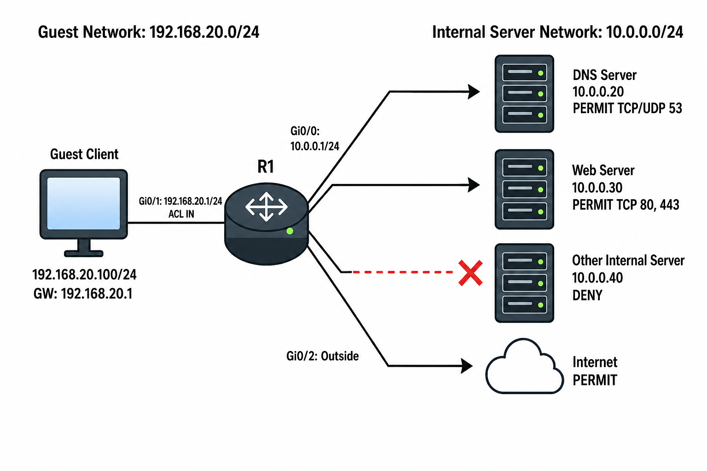

# ACL

## 개념

### ACL

ACL(Access Control List)은 Router나 Switch에서 Traffic을 허용하거나 차단하고, 특정 기능을 적용할 Traffic을 선택하기 위해 사용한다.
- `permit`: 조건과 일치하는 Packet을 허용하거나 특정 기능의 적용 대상으로 선택한다.
- `deny`: 조건과 일치하는 Packet을 차단하거나 특정 기능의 적용 대상에서 제외한다.

ACL의 대표적인 용도는 다음과 같다.
- Packet Filtering: Interface로 들어오거나 나가는 Traffic을 허용하거나 차단한다.
- NAT: NAT를 적용할 내부 Network를 선택한다.
- PBR: Route-Map에서 경로를 변경할 Traffic을 선택한다.
- QoS: Class-Map에서 우선순위나 대역폭 정책을 적용할 Traffic을 선택한다.
- Route Filtering: Routing Table에 등록하거나 Neighbor에게 광고할 Route를 선택한다.

### ACL 처리 순서

ACL은 Packet을 Top-Down 방식으로 동작한다.
```
10 permit tcp any host 10.0.0.30 eq 443
20 deny ip any any
```

HTTPS Packet이 Sequence `10`에 Match되면 허용하고 ACL 확인을 종료한다.

하나의 Entry에 Match되면 아래에 있는 Entry는 더 이상 확인하지 않는다.

### Implicit Deny

모든 ACL의 마지막에는 보이지 않는 Implicit Deny가 존재한다.

Standard ACL에서는 다음과 같은 의미이다.

어떤 Entry에도 Match되지 않은 Traffic은 마지막 Implicit Deny에 의해 차단된다.

특정 Traffic만 차단하고 나머지는 모두 허용하려면 마지막에 `permit any any`를 추가해야 한다.
```
permit ip any any
```

### Standard ACL

Standard ACL은 Packet의 Source IP Address만 확인한다.
```
access-list 10 permit 192.168.10.0 0.0.0.255
```
- Destination IP Address, Protocol 및 Port Number는 확인할 수 없다.

Standard ACL은 Source에서 발생한 모든 Traffic에 영향을 줄 수 있으므로 일반적으로 목적지와 가까운 Interface에 적용한다.

### Extended ACL

Extended ACL은 다음 정보를 기준으로 Traffic을 선택할 수 있다.
- Source IP Address
- Destination IP Address
- IP Protocol
- TCP/UDP Source Port
- TCP/UDP Destination Port

```
permit tcp 192.168.10.0 0.0.0.255 host 10.0.0.30 eq 443
```
`192.168.10.0/24`에서 Web Server `10.0.0.30`의 TCP Port `443`으로 전달되는 Traffic만 허용한다.

Extended ACL은 Traffic을 자세하게 선택할 수 있으므로 일반적으로 출발지와 가까운 Interface에 적용한다.

### Numbered ACL과 Named ACL

Numbered ACL은 ACL을 Number로 구분한다.
```
access-list 10 permit 192.168.10.0 0.0.0.255
```

Named ACL은 ACL을 Name으로 구분한다.
```
ip access-list extended GUEST-IN
```

Named ACL은 ACL의 용도를 쉽게 확인할 수 있으며 Sequence Number를 이용하여 중간에 Entry를 추가하거나 삭제하기 쉽다.

Numbered ACL도 Sequence Number를 이용하여 중간에 Sequence를 추가하거나 수정할 수 있다.
```
R1(config)# ip access-list standard 5
```

### Sequence Number

Sequence Number는 ACL을 확인하는 순서를 나타낸다.
```
10 permit tcp any host 10.0.0.30 eq 443
20 deny ip any any
```
- 기존 Sequence `10`과 `20` 사이에 ACE를 추가하려면 `15`와 같은 중간 Number를 사용할 수 있다.


### Wildcard Mask

ACL에서는 Subnet Mask가 아니라 Wildcard Mask를 사용한다.
- `0`: 해당 Bit가 정확히 일치해야 한다.
- `1`: 해당 Bit는 확인하지 않는다.

Subnet Mask의 Bit를 반대로 바꾸면 Wildcard Mask를 계산할 수 있다.

`192.168.1.10 255.255.255.0`은 Wildcard Mask로 표현하면 `192.168.1.10 0.0.0.255`이다.

### Host와 Any

특정 IP Address 하나를 선택할 때 `host`를 사용한다.
```
host 192.168.10.100
```

다음 설정과 같은 의미이다.
```
192.168.10.100 0.0.0.0
```
```
192.168.10.100/32
```

모든 IP Address를 선택할 때 `any`를 사용한다.

다음 설정과 같은 의미이다.
```
0.0.0.0 255.255.255.255
```

### Protocol과 Port Number

Extended ACL에서는 Protocol과 Port Number를 지정할 수 있다.

```
permit tcp any host 10.0.0.30 eq 443
permit udp any host 10.0.0.20 eq 53
permit icmp any any
permit ip any any
```
- `tcp`: TCP Traffic을 선택한다.
- `udp`: UDP Traffic을 선택한다.
- `icmp`: ICMP Traffic을 선택한다.
- `ip`: 모든 IP Traffic을 선택한다.
- `eq`: 지정한 Port Number와 같은 Port를 선택한다.
- `range`: 지정한 Port 범위를 선택한다.
- `lt`: 지정한 Port보다 작은 Port를 선택한다.
- `gt`: 지정한 Port보다 큰 Port를 선택한다.
- `neq`: 지정한 Port를 제외한다.

### Inbound ACL

Inbound ACL은 Packet이 Interface로 들어올 때 적용한다.
```
R1(config-if)# ip access-group GUEST-IN in
```
- Router는 Packet을 수신한 후 Routing Table을 확인하기 전에 Inbound ACL을 확인한다.

### Outbound ACL

Outbound ACL은 Packet이 Interface를 통해 나갈 때 적용한다.
```
R1(config-if)# ip access-group SERVER-OUT out
```
- Router가 Routing Table을 통해 나갈 Interface를 결정한 후 Outbound ACL을 확인한다.

### Router가 직접 생성한 Traffic

기본적으로 Interface에 적용된 Outbound ACL은 Router가 직접 생성한 Traffic은 필터링하지 않는다.
- 예를 들어 Router가 직접 전송하는 Ping이나 관리 Traffic은 Outbound ACL의 영향을 받지 않는다.

일부 Cisco IOS XE에서는 다음 명령어를 사용하여 Router가 직접 생성한 Traffic도 Outbound ACL의 적용을 받도록 설정할 수 있다.
```
R1(config)# ip access-list match-local-traffic
```

---

## 동작 원리

### Inbound ACL 동작 과정

1\. Packet이 Router의 Interface로 들어온다.

2\. Router는 해당 Interface에 Inbound ACL이 적용되어 있는지 확인한다.

3\. ACL이 있으면 Sequence Number가 낮은 Entry부터 Packet을 비교한다.

4\. 처음 Match된 Entry가 `permit`이면 Packet을 허용하고 ACL 확인을 종료한다.

5\. 처음 Match된 Entry가 `deny`이면 Packet을 차단하고 ACL 확인을 종료한다.

6\. 어떤 Entry에도 Match되지 않으면 Implicit Deny에 의해 Packet이 차단된다.

7\. Packet이 허용되면 Routing Table을 확인하여 나갈 경로를 결정한다.

### Outbound ACL 동작 과정

1\. Router는 Routing Table을 확인하여 Packet이 나갈 Interface를 결정한다.

2\. 해당 Interface에 Outbound ACL이 적용되어 있는지 확인한다.

3\. ACL을 Sequence Number가 낮은 Entry부터 확인한다.

4\. 처음 Match된 Entry가 `permit`이면 Packet을 전달한다.

5\. 처음 Match된 Entry가 `deny`이거나 어떤 ACE에도 Match되지 않으면 Packet을 차단한다.

---

## 예시 및 구성도

### Guest Network의 Server 접근 제한

`MASON` 회사는 직원 Network와 Guest Network를 분리하여 사용하고 있다.

Guest 사용자는 내부 DNS Server와 Web Portal에는 접속할 수 있지만 다른 내부 Server에는 접속하지 못하도록 제한한다. Internet Traffic은 정상적으로 허용한다.



#### ACL 정책

1\. Guest Network에서 DNS Server의 UDP와 TCP Port `53`을 허용한다.

2\. Guest Network에서 Web Server의 TCP Port `80`과 `443`을 허용한다.

3\. Guest Network에서 나머지 내부 Server Network로 전달되는 Traffic을 차단한다.

4\. Internet으로 전달되는 나머지 Traffic은 허용한다.

#### ACL 처리 순서

```
10 DNS UDP 허용
20 DNS TCP 허용
30 HTTP 허용
40 HTTPS 허용
50 나머지 내부 Server Network 차단
60 그 외 Traffic 허용
```

1\. Extended Named ACL 설정

Guest Network의 Server 접근을 제한한다.
```
R1(config)# ip access-list extended GUEST-IN
R1(config-ext-nacl)# 10 permit udp 192.168.20.0 0.0.0.255 host 10.0.0.20 eq 53
R1(config-ext-nacl)# 20 permit tcp 192.168.20.0 0.0.0.255 host 10.0.0.20 eq 53
R1(config-ext-nacl)# 30 permit tcp 192.168.20.0 0.0.0.255 host 10.0.0.30 eq 80
R1(config-ext-nacl)# 40 permit tcp 192.168.20.0 0.0.0.255 host 10.0.0.30 eq 443
R1(config-ext-nacl)# 50 deny ip 192.168.20.0 0.0.0.255 10.0.0.0 0.0.0.255
R1(config-ext-nacl)# 60 permit ip 192.168.20.0 0.0.0.255 any
```

2\. Inbound ACL 적용

Guest Network에서 들어오는 Packet에 ACL을 적용한다.
```
R1(config)# interface gi0/1
R1(config-if)# ip access-group GUEST-IN in
```

---

