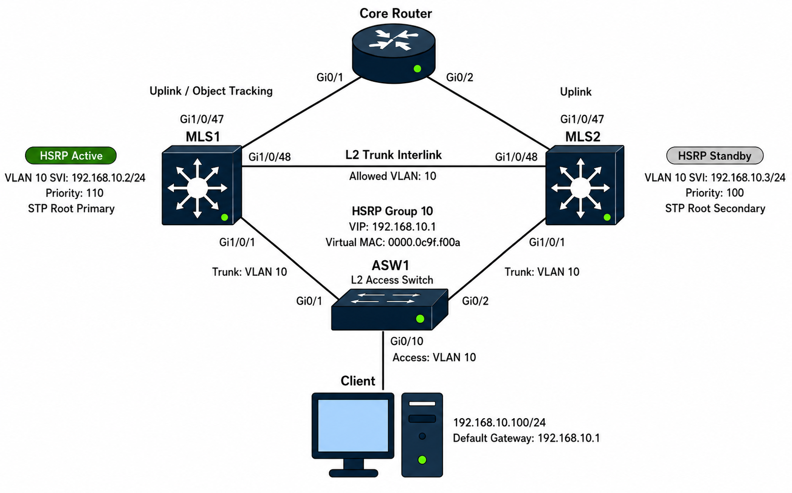

# HSRP / VRRP

## 개념

### HA, Redundancy 및 Fault Tolerance

HA(High Availability)는 장비에 장애가 발생해도 서비스를 계속 제공할 수 있도록 구성하는 것이다.

Redundancy는 같은 역할을 수행하는 장비나 Link를 여러 개 구성하는 것이며, Fault Tolerance는 하나의 장비에 장애가 발생해도 다른 장비가 그 역할을 이어받도록 하는 것이다.

FHRP(First Hop Redundancy Protocol)는 Default Gateway를 이중화하여 Network의 가용성을 높이는 Protocol이다.

### FHRP

FHRP(First Hop Redundancy Protocol)는 여러 Gateway 장비가 하나의 Virtual IP Address를 공유하여 Client의 Default Gateway를 이중화하는 Protocol이다.

Client는 Virtual IP Address를 Default Gateway로 사용한다.

Active Router 또는 Link에 장애가 발생하면 Backup Router가 Virtual IP Address와 Virtual MAC Address를 이어받아 Traffic을 전달한다.

대표적인 FHRP는 다음과 같다.
- HSRP: Cisco 전용 Protocol이다.
- VRRP: 표준 Protocol이다.
- GLBP: Cisco 전용 Protocol이며 Gateway Load Balancing을 제공한다.

### Virtual IP Address

Virtual IP Address는 Client가 Default Gateway로 사용하는 가상의 IP Address이다.
```
R1 실제 IP Address: 192.168.10.2
R2 실제 IP Address: 192.168.10.3
Virtual IP Address: 192.168.10.1  
```
Client는 R1이나 R2의 실제 IP Address가 아니라 Virtual IP Address인 `192.168.10.1`을 Default Gateway로 사용한다.

### Virtual MAC Address

Client가 Virtual IP Address에 대해 ARP Request를 전송하면 HSRP의 Active Router 또는 VRRP의 Master Router가 Virtual MAC Address로 응답한다.
```
192.168.10.1 → Virtual MAC Address
```
새로운 Active Router는 Gratuitous ARP를 전송하고, Switch들은 Virtual MAC Address를 새로운 Active Router 방향의 Interface로 다시 학습한다.

### HSRP

HSRP(Hot Standby Router Protocol)는 Cisco에서 만든 Default Gateway 이중화 Protocol이다.

HSRP Group에서 Active 장비가 Traffic을 전달하고 Standby 장비는 Active 장비의 상태를 확인하면서 대기하다가 장애 발생 시 Active 역할을 이어받는다. 
- Active: 현재 Default Gateway 역할을 수행한다.
- Standby: Active 장비에 장애가 발생하면 역할을 이어받는다.
- Listen: Active나 Standby는 아니지만 HSRP Hello Message를 수신한다.

### HSRP State

HSRP는 다음 상태를 거쳐 Active 또는 Standby 장비를 결정한다.

1\. Initial: HSRP가 아직 시작되지 않은 상태이다.

2\. Learn: Virtual IP Address와 현재 Active 장비의 정보를 확인하는 상태이다.

3\. Listen: Active나 Standby가 되지 않고 다른 HSRP 장비의 Hello Message를 듣고 있는 상태이다.

4\. Speak: Hello Message를 주고받으며 Active와 Standby 장비를 선출하는 상태이다.

5\. Standby: Active 장비에 장애가 발생하면 대신 Active가 되기 위해 대기하는 상태이다.

6\. Active: Virtual IP Address와 Virtual MAC Address를 사용하여 실제 Traffic을 전달하는 상태이다.

### HSRP Version

HSRP Version 1은 Group Number `0~255`를 사용하며 IPv4 Multicast Address `224.0.0.2`로 Hello Message를 전송한다.
- HSRP Version 1 Virtual MAC: `0000.0c07.acXX`

HSRP Version 2는 Group Number `0~4095`를 사용하며 IPv4 Multicast Address `224.0.0.102`로 Hello Message를 전송한다.
- HSRP Version 2 Virtual MAC: `0000.0c9f.fXXX`

두 Version 모두 HSRP Control Message를 주고받을 때 UDP Port `1985`를 사용한다.

HSRP Version 1과 Version 2는 서로 호환되지 않으므로 같은 Group의 장비는 동일한 Version을 사용해야 한다.

### VRRP

VRRP(Virtual Router Redundancy Protocol)는 여러 Vendor의 장비에서 사용할 수 있는 표준 Default Gateway 이중화 Protocol이다.

하나의 VRRP Group에서 Master 장비가 Traffic을 전달하고 Backup 장비는 Master 장비의 장애에 대비한다.

### VRRP State

VRRP는 다음 세 가지 State를 사용한다.

1\. Initialize: VRRP가 시작되지 않았거나 Interface가 Down 상태이다.

2\. Backup: Master가 주기적으로 보내는 Advertisement Message를 수신하면서 대기하며, 일정 시간 동안 Message가 수신되지 않으면 Master로 전환된다.

3\. Master: Virtual IP Address와 Virtual MAC Address를 사용하여 Traffic을 전달한다.

### VRRP Advertisement

VRRP Master는 Advertisement Message를 전송하여 자신이 정상적으로 동작하고 있음을 Backup 장비에 알린다.
- IPv4 Multicast Address: `224.0.0.18`
- IP Protocol Number: `112`
- Virtual MAC Address: `0000.5e00.01XX`
- 기본 Advertisement Interval: `1초`

VRRP는 TCP나 UDP를 사용하지 않고 IP Protocol Number `112`를 직접 사용한다.

### Priority

HSRP와 VRRP는 Priority가 높은 장비를 Gateway 역할로 선출한다.

두 장비의 Priority가 같으면 일반적으로 Interface IP Address가 높은 장비가 선출된다.

#### HSRP Priority

HSRP의 기본 Priority는 `100`이다.
```
R1 Priority: 110
R2 Priority: 100
```
R1의 Priority가 더 높으므로 Active 장비로 선출된다.

#### VRRP Priority

VRRP의 기본 Priority도 `100`이다.

Virtual IP Address를 자신의 실제 Interface IP Address로 사용할 수 있다. 

사용하는 IP Address Owner는 Priority `255`를 사용하며 VRRP Group에서 Master가 된다.  

Virtual IP Address를 실제 Interface IP Address로 가지고 있는 장비를 IP Address Owner라고 한다.  
```
R1 실제 IP Address: 192.168.10.1
R2 실제 IP Address: 192.168.10.2
Virtual IP Address: 192.168.10.1  
```  
- R1에 장애가 발생하면 R2가 Virtual IP Address를 이어받아 Master가 된다.
- IP Address Owner인 R1이 복구되면 Priority `255`로 Master 역할을 다시 가져온다.
- VRRP는 preempt가 기본적으로 활성화되어 있다.  

### Preempt

Preempt는 더 높은 Priority를 가진 장비가 현재 Gateway 역할을 가져오는 기능이다.

Priority `110`인 R1이 장애 후 복구되어도 Preempt가 없으면 Priority `100`인 R2가 계속 Active 역할을 수행할 수 있다.
- HSRP: Preempt가 기본적으로 비활성화되어 있으므로 직접 설정한다.
- VRRP: Preempt가 기본적으로 활성화되어 있다.

### HSRP Timer

HSRP의 기본 Timer는 다음과 같다.
- Hello Time: `3초`
- Hold Time: `10초`

Active 장비는 기본적으로 3초마다 Hello Message를 전송한다.

Standby 장비가 Hold Time 동안 Hello Message를 받지 못하면 Active 장비에 장애가 발생한 것으로 판단하고 Active 역할을 이어받는다.

### VRRP Timer

VRRP Master는 기본적으로 1초마다 Advertisement Message를 전송한다.

Backup 장비가 Master Down Interval 동안 Advertisement Message를 받지 못하면 Master 장비에 장애가 발생한 것으로 판단하고 새로운 Master를 선출한다.

실제 Master Down Interval은 Advertisement Interval과 Priority를 기준으로 계산한다.

### Object Tracking

HSRP와 VRRP는 Interface나 IP SLA 등의 상태를 추적하여 Priority를 자동으로 낮출 수 있다.
- Interface Tracking: Uplink Interface의 Up/Down 상태를 추적한다.
- IP SLA Tracking: 특정 IP Address까지 정상적으로 통신할 수 있는지 추적한다.

Gateway 장비의 Client 연결 Interface가 정상이어도 외부 Uplink에 장애가 발생하면 Traffic을 외부로 전달할 수 없다.

Object Tracking을 사용하면 Uplink 장애 시 Priority를 낮추어 정상적인 Uplink를 가진 Backup 장비가 Gateway 역할을 가져가도록 할 수 있다.
```
R1 기본 Priority: 110
Uplink 장애 시 감소 값: 20
R1 변경 Priority: 90
R2 Priority: 100
```
R1의 Priority가 `90`으로 낮아지면 Priority `100`인 R2가 Gateway 역할을 가져간다.

### GLBP

GLBP(Gateway Load Balancing Protocol)는 여러 Gateway 장비가 하나의 Virtual IP Address를 공유하면서 Traffic을 분산하여 전달하는 Cisco 전용 FHRP이다.

HSRP와 VRRP는 하나의 Group에서 Active 또는 Master 장비만 Traffic을 전달하지만, GLBP는 여러 장비가 동시에 Traffic 전달에 참여할 수 있다.

GLBP는 하나의 Virtual IP Address에 여러 개의 Virtual MAC Address를 사용한다.

### AVG와 AVF

GLBP는 AVG와 AVF 역할을 사용한다.
- AVG(Active Virtual Gateway): Virtual IP Address에 대한 Client의 ARP Request에 응답하고, 여러 AVF의 Virtual MAC Address 중 하나를 Client에게 알려준다.
- AVF(Active Virtual Forwarder): 자신에게 할당된 Virtual MAC Address로 들어오는 Traffic을 실제로 전달한다.
- 하나의 GLBP Group에는 하나의 AVG와 여러 AVF가 존재할 수 있다.
- AVG 역할을 수행하는 장비도 AVF로서 Traffic 전달에 참여할 수 있다.

### VLAN별 Gateway 분산

HSRP와 VRRP도 VLAN마다 Active 또는 Master 장비를 다르게 지정하여 Traffic을 분산할 수 있다.
```
VLAN 10: R1 Active, R2 Standby
VLAN 20: R2 Active, R1 Standby
```

STP를 함께 사용한다면 각 VLAN의 STP Root Bridge와 Active Gateway를 같은 Switch로 맞추는 것이 좋다.
```
VLAN 10: SW1 STP Root + HSRP Active
VLAN 20: SW2 STP Root + HSRP Active
```
기존 Standby Multi-layer Switch를 특정 VLAN의 Active Gateway로 설정한다면, 해당 VLAN의 STP Root Bridge도 같은 Switch로 지정하는 것이 좋다. 이렇게 하면 단말 Traffic이 다른 Switch를 불필요하게 거치지 않고 Active Gateway로 전달될 수 있다.

---

## 동작 원리

### HSRP 동작 과정

1\. MLS1과 MLS2는 같은 VLAN에서 동일한 HSRP Group과 Virtual IP Address를 설정한다.
```
MLS1(config)# ip routing
MLS1(config)# vlan 10
MLS1(config-vlan)# exit

MLS1(config)# interface vlan 10
MLS1(config-if)# ip address 192.168.10.1 255.255.255.0
MLS1(config-if)# standby version 2
MLS1(config-if)# standby 10 ip 192.168.10.254
MLS1(config-if)# standby 10 priority 110
MLS1(config-if)# standby 10 preempt
MLS1(config-if)# no shutdown
```

```
MLS2(config)# ip routing
MLS2(config)# vlan 10
MLS2(config-vlan)# exit

MLS2(config)# interface vlan 10
MLS2(config-if)# ip address 192.168.10.2 255.255.255.0
MLS2(config-if)# standby version 2
MLS2(config-if)# standby 10 ip 192.168.10.254
MLS2(config-if)# standby 10 priority 100
MLS2(config-if)# standby 10 preempt
MLS2(config-if)# no shutdown
```

2\. 두 장비는 VLAN `10`을 통해 HSRP Hello Message를 교환한다.

3\. Priority를 비교하여 더 높은 Priority `110`을 가진 MLS1이 Active 장비로 선출된다.

4\. MLS2는 Priority `100`으로 Standby 장비가 되어 MLS1의 Hello Message를 확인한다.
```
MLS1: Active
MLS2: Standby
Virtual IP Address: 192.168.10.254
```

5\. Client는 Virtual IP Address를 Default Gateway로 설정한다.

6\. Client가 Virtual IP Address에 대해 ARP Request를 전송하면 MLS1이 Virtual MAC Address로 응답한다.

7\. Client의 Traffic은 Virtual MAC Address를 사용하는 MLS1으로 전달된다.


### Active 장비 장애 발생

1\. MLS1에 장애가 발생하여 Hello Message를 전송하지 못한다.

2\. MLS2는 Hold Time 동안 MLS1의 Hello Message를 받지 못한다.

3\. MLS2는 MLS1에 장애가 발생한 것으로 판단하고 Active 상태로 전환된다.

4\. MLS2는 기존 Virtual IP Address와 Virtual MAC Address를 이어받는다.

5\. MLS2는 Gratuitous ARP를 전송하고, 다른 Switch들은 Virtual MAC Address를 MLS2 방향의 Interface로 다시 학습하도록 한다.

6\. Client는 Default Gateway 설정을 변경하지 않고 MLS2를 통해 통신한다.

### Uplink 장애 발생

MLS1의 Client 연결 Interface는 정상이지만 외부 Uplink에만 장애가 발생할 수 있다.

Uplink의 상태를 추적하도록 Object Tracking을 설정한다.

```
MLS1(config)# track 1 interface gi1/0/47 line-protocol

MLS1(config)# interface vlan 10
MLS1(config-if)# standby 10 track 1 decrement 20
```
- `track 1`: `Gi1/0/47`의 Line Protocol 상태를 추적한다.
- `decrement 20`: Uplink에 장애가 발생하면 HSRP Priority를 `20`만큼 낮춘다.

1\. MLS1의 Client 연결 Interface는 정상 상태이지만 외부 Uplink에 장애가 발생한다.

2\. Object Tracking이 Uplink 장애를 감지한다.

3\. MLS1의 HSRP Priority가 `110`에서 `90`으로 감소한다.

4\. Priority가 `100`인 MLS2가 MLS1보다 높은 Priority를 가지게 된다.

5\. `preempt`가 설정된 MLS2가 Active 역할을 가져간다.

6\. Client Traffic은 정상적인 Uplink를 가진 MLS2를 통해 전달된다.

### VRRP 동작 과정

1\. MLS1과 MLS2는 같은 VLAN에서 동일한 VRRP Group과 Virtual IP Address를 설정한다.
```
MLS1(config)# interface vlan 10
MLS1(config-if)# vrrp 10 ip 192.168.10.254
MLS1(config-if)# vrrp 10 priority 110
```

```
MLS2(config)# interface vlan 10
MLS2(config-if)# vrrp 10 ip 192.168.10.254
MLS2(config-if)# vrrp 10 priority 100
```
- VRRP는 Preempt가 기본적으로 활성화되어 있다.

2\. Priority가 높은 MLS1이 Master 장비로 선출된다.

3\. MLS1은 Advertisement Message를 주기적으로 전송하여 정상 상태임을 알린다.

4\. MLS2는 Backup 상태에서 Advertisement Message를 수신한다.

5\. MLS1의 Advertisement Message가 중단되면 MLS2는 Master Down Interval이 지날 때까지 기다린다.

6\. MLS2는 Master 상태로 전환되어 Virtual IP Address와 Virtual MAC Address를 이어받는다.

7\. MLS2는 Gratuitous ARP를 전송하여 L2 Switch가 Virtual MAC Address를 MLS2 방향의 Interface로 다시 학습하도록 한다.

8\. Client는 Default Gateway 설정을 변경하지 않고 MLS2를 통해 통신한다.

---

## 예시 및 구성도

### 사내 Default Gateway 이중화

`MASON` 회사의 VLAN `10` Client 대역은 MLS1이 단독으로 Default Gateway 역할을 수행하고 있다. 따라서 MLS1 장비나 Uplink에 장애가 발생하면 Client들의 외부 Network 접속이 중단되어 업무에 문제가 발생할 수 있다.

관리자는 이러한 장애에 대비하여 MLS2를 추가하고, Default Gateway를 이중화하기 위해 두 장비에 HSRP를 구성하였다.

Client는 Virtual IP Address `192.168.10.1`을 Default Gateway로 사용한다. 정상 상태에서는 MLS1이 Active Gateway 역할을 수행하며, MLS1 또는 Uplink에 장애가 발생하면 MLS2가 Active 역할을 이어받는다.



### HSRP 구성 및 동작 과정

1\. MLS1과 MLS2 사이의 `Gi1/0/48`을 L2 Trunk로 설정한다.

MLS1 설정:
```
MLS1(config)# vlan 10

MLS1(config)# interface gi1/0/48
MLS1(config-if)# description L2_TRUNK_TO_MLS2
MLS1(config-if)# switchport
MLS1(config-if)# switchport mode trunk
MLS1(config-if)# switchport trunk allowed vlan 10
MLS1(config-if)# no shutdown
```

MLS2 설정:
```
MLS2(config)# vlan 10

MLS2(config)# interface gi1/0/48
MLS2(config-if)# description L2_TRUNK_TO_MLS1
MLS2(config-if)# switchport
MLS2(config-if)# switchport mode trunk
MLS2(config-if)# switchport trunk allowed vlan 10
MLS2(config-if)# no shutdown
```

2\. MLS1과 MLS2에서 ASW1 방향의 Interface를 Trunk로 설정한다.

MLS1의 `Gi1/0/1`을 설정한다.
```
MLS1(config)# interface gi1/0/1
MLS1(config-if)# description TRUNK_TO_ASW1
MLS1(config-if)# switchport
MLS1(config-if)# switchport mode trunk
MLS1(config-if)# switchport trunk allowed vlan 10
MLS1(config-if)# no shutdown
```

MLS2의 `Gi1/0/1`을 설정한다.
```
MLS2(config)# interface gi1/0/1
MLS2(config-if)# description TRUNK_TO_ASW1
MLS2(config-if)# switchport
MLS2(config-if)# switchport mode trunk
MLS2(config-if)# switchport trunk allowed vlan 10
MLS2(config-if)# no shutdown
```

3\. ASW1의 Uplink와 Client Interface를 설정한다.

```
ASW1(config)# vlan 10

ASW1(config)# interface gi0/1
ASW1(config-if)# description TRUNK_TO_MLS1
ASW1(config-if)# switchport mode trunk
ASW1(config-if)# switchport trunk allowed vlan 10
ASW1(config-if)# no shutdown

ASW1(config)# interface gi0/2
ASW1(config-if)# description TRUNK_TO_MLS2
ASW1(config-if)# switchport mode trunk
ASW1(config-if)# switchport trunk allowed vlan 10
ASW1(config-if)# no shutdown

ASW1(config)# interface gi0/10
ASW1(config-if)# description VLAN10_CLIENT
ASW1(config-if)# switchport mode access
ASW1(config-if)# switchport access vlan 10
ASW1(config-if)# spanning-tree portfast
ASW1(config-if)# no shutdown
```

4\. MLS1과 MLS2에 VLAN `10`의 SVI와 HSRP를 설정한다.

MLS1 설정:
```
MLS1(config)# ip routing

MLS1(config)# interface vlan 10
MLS1(config-if)# ip address 192.168.10.2 255.255.255.0
MLS1(config-if)# standby version 2
MLS1(config-if)# standby 10 ip 192.168.10.1
MLS1(config-if)# standby 10 priority 110
MLS1(config-if)# standby 10 preempt delay minimum 60
MLS1(config-if)# no shutdown
```

MLS2 설정:
```
MLS2(config)# ip routing

MLS2(config)# interface vlan 10
MLS2(config-if)# ip address 192.168.10.3 255.255.255.0
MLS2(config-if)# standby version 2
MLS2(config-if)# standby 10 ip 192.168.10.1
MLS2(config-if)# standby 10 priority 100
MLS2(config-if)# standby 10 preempt
MLS2(config-if)# no shutdown
```

5\. L2 Loop를 방지하기 위해 STP Root Bridge를 지정한다.
- MLS1, MLS2 및 ASW1이 L2 Trunk로 삼각형을 구성하므로 STP가 중복 Link 중 하나를 Blocking 상태로 전환한다.

HSRP Active인 MLS1을 VLAN `10`의 STP Root Primary로 설정한다.
```
MLS1(config)# spanning-tree vlan 10 root primary
MLS2(config)# spanning-tree vlan 10 root secondary
```

상태를 확인한다.
```
MLS1# show spanning-tree vlan 10
MLS2# show spanning-tree vlan 10
ASW1# show spanning-tree vlan 10
```

6\. Priority가 높은 MLS1이 Active 장비로 선출된다.

7\. Client는 Virtual IP Address를 Default Gateway로 사용한다.
```
Client IP Address: 192.168.10.100
Subnet Mask: 255.255.255.0
Default Gateway: 192.168.10.1
```

통신과 ARP 정보를 확인한다.
```
Client> ping 192.168.10.1
Client> arp -a
```

8\. MLS1의 `Gi1/0/47` Uplink 상태를 Object Tracking으로 확인한다.

```
MLS1(config)# track 1 interface gi1/0/47 line-protocol

MLS1(config)# interface vlan 10
MLS1(config-if)# standby 10 track 1 decrement 20
```

9\. Priority가 더 높아진 MLS2가 Active 상태로 전환된다.
- MLS2는 Virtual IP Address와 Virtual MAC Address를 사용하여 Traffic을 전달한다.
- Gratuitous ARP가 전송되면 ASW1은 Virtual MAC Address를 현재 STP Forwarding 경로 방향으로 다시 학습한다.

10\. Client는 Default Gateway 설정을 변경하지 않고 MLS2를 통해 통신한다.
```
Client> ping 10.0.0.20 -t
```

11\. MLS1의 Uplink가 복구되면 MLS1이 다시 Active 역할을 가져온다.

---

## 명령어

### HSRP Object Tracking 설정

SW1과 SW2에서 자신의 Uplink Interface 상태를 추적한다.
```
SW1(config)# track 1 interface gi0/1 line-protocol
```

### HSRP 설정

SW1을 Active 장비로 사용하도록 Priority를 `110`으로 설정한다.
```
SW1(config)# interface vlan 10
SW1(config-if)# ip address 192.168.10.2 255.255.255.0
SW1(config-if)# standby version 2
SW1(config-if)# standby 10 ip 192.168.10.1
SW1(config-if)# standby 10 priority 110
SW1(config-if)# standby 10 preempt delay minimum 30
SW1(config-if)# standby 10 track 1 decrement 20
```
- `standby version 2`: HSRP Version 2를 사용한다.
- `standby 10 ip`: Group `10`의 Virtual IP Address를 설정한다.
- `priority 110`: SW1의 Priority를 `110`으로 설정한다.
- `preempt`: 더 높은 Priority를 가지면 Active 역할을 가져온다.
- `delay minimum 30`: 장비 복구 후 30초 동안 기다린 후 Preempt한다.
- `track 1 decrement 20`: Track `1`이 Down되면 Priority를 `20`만큼 낮춘다.

SW2를 Standby 장비로 설정한다.
```
SW2(config)# interface vlan 10
SW2(config-if)# ip address 192.168.10.3 255.255.255.0
SW2(config-if)# standby version 2
SW2(config-if)# standby 10 ip 192.168.10.1
SW2(config-if)# standby 10 priority 100
SW2(config-if)# standby 10 preempt
SW2(config-if)# standby 10 track 1 decrement 20
```

SW1의 Uplink 장애로 Priority가 `90`까지 감소하면 SW2가 Active 역할을 가져간다.

### HSRP Timer 설정

Hello Time을 `1초`, Hold Time을 `3초`로 설정한다.
```
SW1(config-if)# standby 10 timers 1 3
SW2(config-if)# standby 10 timers 1 3
```

Timer를 너무 짧게 설정하면 순간적인 Packet Loss나 장비 부하로 인해 불필요한 Failover가 발생할 수 있다.

### HSRP 상태 확인

```
SW1# show standby
SW1# show standby brief
SW1# show standby vlan 10
SW1# show track 1
```
- `show standby`: HSRP Group의 상세 정보를 확인한다.
 확인한다.
- `show standby brief`: Active, Standby, Priority 및 Virtual IP Address를 간략하게 확인한다.
- `show track 1`: Tracking Object의 상태를 확인한다.

---

## Troubleshooting

### HSRP 또는 VRRP가 정상적으로 형성되지 않는 경우

1.\ HSRP가 설정된 VLAN Interface와 두 장비 사이의 Trunk Link가 Up 상태인지 확인한다.  

2\. 두 장비 사이의 Trunk Link에서 HSRP가 설정된 VLAN이 정상적으로 전달되는지 확인한다.

3\. Group Number와 Virtual IP Address가 동일한지 확인한다.

4\. HSRP를 사용한다면 Version이 동일한지 확인한다.

5\. HSRP 또는 VRRP Message가 ACL에서 차단되고 있는지 확인한다.
- HSRP Version 2: Multicast `224.0.0.102`, UDP Port `1985`
- VRRP: Multicast `224.0.0.18`, IP Protocol `112`

6\. 높은 Priority의 장비가 Gateway 역할을 가져오지 못하면 Preempt 설정을 확인한다.

7\. Uplink 장애에도 Failover되지 않으면 Object Tracking과 감소된 Priority를 확인한다.
```
SW1# show track 1
SW1# show standby
SW1# show vrrp
```

8\. Client의 Default Gateway가 실제 장비의 IP Address가 아니라 Virtual IP Address로 설정되어 있는지 확인한다.

---

## 주요 질문

FHRP를 사용하는 이유는 무엇인가?
- Client의 Default Gateway를 이중화하여 하나의 Gateway 장비에 장애가 발생해도 다른 장비를 통해 통신을 유지하기 위해 사용한다.

HA, Redundancy 및 Fault Tolerance의 차이는 무엇인가?
- Redundancy는 장비나 Link를 여러 개 구성하는 것이고, Fault Tolerance는 장애 발생 시 다른 장비가 역할을 이어받는 것이며, HA는 이러한 구성을 통해 서비스 가용성을 높이는 것이다.

Client의 Default Gateway에는 어떤 IP Address를 설정하는가?
- HSRP 또는 VRRP에서 사용하는 Virtual IP Address를 설정한다.

Virtual IP Address와 Virtual MAC Address를 사용하는 이유는 무엇인가?
- Gateway 역할이 다른 장비로 전환되어도 Client가 Default Gateway와 ARP 정보를 변경하지 않고 계속 통신할 수 있도록 사용한다.

Priority는 어떤 역할을 하는가?
- HSRP의 Active 또는 VRRP의 Master 장비를 선출하며 값이 높을수록 우선한다.

Preempt는 어떤 역할을 하는가?
- 더 높은 Priority를 가진 장비가 현재 Active 또는 Master 역할을 가져올 수 있도록 한다.

Object Tracking을 사용하는 이유는 무엇인가?
- Uplink에 장애가 발생했을 때 Priority를 낮추어 정상적인 Uplink를 가진 Backup 장비로 Traffic을 전환하기 위해 사용한다.

GLBP는 HSRP 및 VRRP와 어떤 차이가 있는가?
- HSRP와 VRRP는 하나의 Group에서 하나의 장비가 주로 Traffic을 전달하지만, GLBP는 여러 AVF가 Traffic 전달에 참여하여 Gateway Load Balancing을 제공한다.

Gateway 장애가 발생하면 통신이 완전히 중단되지 않는가?
- 장애를 감지하고 Backup 장비가 역할을 이어받는 동안 짧은 통신 중단이 발생할 수 있다.
