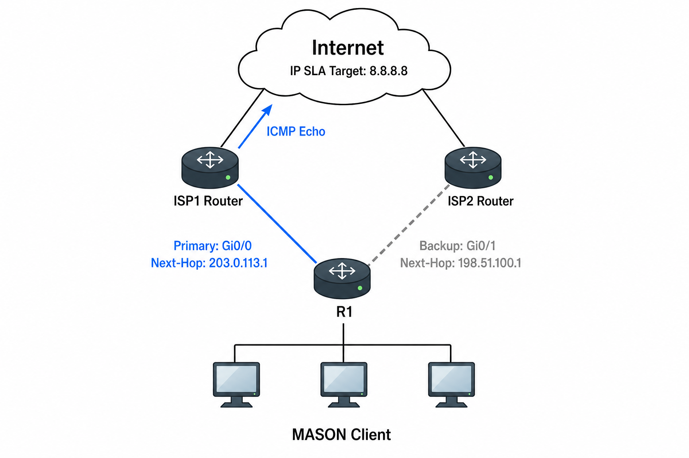

# IP SLA / Object Tracking

## 개념

### IP SLA

IP SLA(IP Service Level Agreement)는 Cisco 장비가 지정한 목적지로 Test Packet을 주기적으로 전송하여 Network의 연결 상태와 성능을 측정하는 Cisco 전용 기능이다.

단순히 Interface의 Up/Down 상태만 확인하는 것이 아니라 실제 목적지까지 Packet이 정상적으로 전달되는지 확인할 수 있다.

```
R1(config)# ip sla 1
R1(config-ip-sla)# icmp-echo 8.8.8.8 source-interface gi0/0
R1(config-ip-sla-echo)# frequency 5
R1(config-ip-sla-echo)# timeout 1000
R1(config-ip-sla-echo)# exit
```
- `ip sla` 1: IP SLA Operation Number 1을 생성한다.
- `icmp-echo 8.8.8.8`: 8.8.8.8로 ICMP Echo Packet을 전송한다.
- `source-interface gi0/0`: Test Packet을 Gi0/0에서 전송한다.
- `frequency 5`: 5초마다 Test Packet을 전송한다.
- `timeout 1000`: 1000ms 동안 응답이 없으면 실패로 판단한다.

IP SLA로 다음 정보를 확인할 수 있다.
- 목적지 도달 가능 여부
- RTT(Round Trip Time)
- Delay
- Jitter
- Packet Loss
- DNS 및 TCP Service 응답 시간

### IP SLA Operation 활성화

생성한 IP SLA Operation은 `ip sla schedule` 명령어를 사용하여 활성화해야 한다.
```
R1(config)# ip sla schedule 1 life forever start-time now
```
- `ip sla schedule 1`: IP SLA Operation `1`의 실행 일정을 설정한다.
- `life forever`: IP SLA Operation을 계속 실행한다.
- `start-time now`: IP SLA Operation을 즉시 시작한다.

`ip sla schedule`을 설정하지 않으면 IP SLA Operation은 생성만 되고 Test Packet을 전송하지 않는다.


### Object Tracking

Object Tracking은 Interface, Route 또는 IP SLA의 상태를 `Up`과 `Down`으로 관리하는 기능이다.
- `Up`: 연결된 경로나 장비를 정상적으로 사용할 수 있다는 신호를 전달한다.
- `Down`: 연결된 경로나 장비에 장애가 발생했다는 신호를 전달한다.

Tracking 결과를 Static Route, HSRP, VRRP 및 PBR 등의 기능과 연결하여 Network 상태에 따라 동작을 자동으로 변경할 수 있다.
```
R1(config)# track 1 ip sla 1 reachability
R1(config-track)# delay down 10 up 20
```
- 첫 번째 `1`: Object Tracking을 구분하는 Track Number이다.
- 두 번째 `1`: 상태를 확인할 IP SLA Operation Number이다.
- `reachability`: IP SLA 목적지까지 통신 가능한지 추적한다.
- `delay down 10`: 장애가 `10초` 동안 지속되면 Track을 Down으로 변경한다.
- `delay up 20`: 통신이 복구된 후 `20초` 동안 정상 상태가 유지되면 Track을 Up으로 변경한다.

`track`을 설정하지 않으면 IP SLA는 Test Packet을 전송하고 측정 결과만 저장하며, 해당 결과를 Static Route나 FHRP에서 사용할 수 없다.

또한 Object Tracking을 생성하더라도 Static Route나 FHRP에 Track을 연결하지 않으면 상태만 확인할 수 있으며 실제 Network 동작은 변경되지 않는다.

### Interface Tracking

Interface Tracking은 자신의 Interface 상태만 확인한다.
```
R1(config)# track 1 interface gi0/0 line-protocol
```
Interface가 물리적으로 연결되어 있어도 ISP 내부나 목적지까지의 경로에 장애가 발생할 수 있다. 이 경우 Interface는 `Up`이지만 실제 외부 통신은 불가능할 수 있다.

### IP SLA Tracking

IP SLA Tracking은 Test Packet을 목적지까지 전송하여 실제 통신 가능 여부를 확인한다.

IP SLA는 목적에 따라 여러 Operation을 사용할 수 있다.

#### ICMP Echo

ICMP Echo Request와 Reply를 사용하여 목적지 도달 가능 여부와 RTT를 측정한다.

일반적인 경로 이중화에서 가장 많이 사용한다.
```
R1(config)# ip sla 1
R1(config-ip-sla)# icmp-echo 8.8.8.8 source-interface gi0/0
R1(config-ip-sla-echo)# frequency 5
R1(config-ip-sla-echo)# timeout 1000
R1(config-ip-sla-echo)# threshold 500
R1(config-ip-sla-echo)# exit

R1(config)# ip sla schedule 1 life forever start-time now
```
`Gi0/0`을 통해 `8.8.8.8`로 `5초`마다 ICMP Echo Packet을 전송한다. 응답 시간이 `500ms`를 초과하면 느린 응답으로 기록하고, `1초` 동안 응답이 없으면 실패로 판단한다.

#### UDP Jitter

UDP Packet을 사용하여 Delay, Jitter 및 Packet Loss를 측정한다.

Voice나 Video Traffic의 품질을 확인할 때 사용할 수 있다.
```
R1(config)# ip sla 2
R1(config-ip-sla)# udp-jitter 192.0.2.10 5000 num-packets 10 interval 20
R1(config-ip-sla-jitter)# frequency 30
R1(config-ip-sla-jitter)# timeout 5000
R1(config-ip-sla-jitter)# exit

R1(config)# ip sla schedule 2 life forever start-time now
```
`30`초마다 `192.0.2.10`의 UDP Port `5000`으로 UDP Packet `10개`를 `20ms` 간격으로 전송하여 응답 시간, Jitter 및 Packet Loss를 측정한다. `5초` 안에 응답이 없으면 실패로 판단한다.

#### TCP Connect

지정한 TCP Port로 연결을 시도하여 Server의 Service가 정상적으로 동작하는지 확인한다.
```
R1(config)# ip sla 3
R1(config-ip-sla)# tcp-connect 192.0.2.20 443 control disable
R1(config-ip-sla-tcp)# frequency 30
R1(config-ip-sla-tcp)# timeout 3000
R1(config-ip-sla-tcp)# exit

R1(config)# ip sla schedule 3 life forever start-time now```
```
- `control disable`: 지정한 TCP Port에 바로 접속하여 Service가 정상인지 확인한다.

`30초`마다 Web Server `192.0.2.20`의 TCP Port `443`으로 연결을 시도하여 HTTPS Service가 정상적으로 동작하는지 확인한다. 만약 `3초` 동안 연결되지 않으면 실패로 판단한다.   


#### DNS

DNS Query를 전송하여 DNS Server의 응답 여부와 응답 시간을 측정한다.
```
R1(config)# ip sla 4
R1(config-ip-sla)# dns www.google.com name-server 8.8.8.8
R1(config-ip-sla-dns)# frequency 30
R1(config-ip-sla-dns)# timeout 3000
R1(config-ip-sla-dns)# threshold 1000
R1(config-ip-sla-dns)# exit
```
`30초`마다 DNS Server `8.8.8.8`에 `www.google.com`의 `IP Address`를 물어본다. `3`초 안에 응답이 없으면 실패로 판단하고, 응답에 `1초`가 넘게 걸리는지도 확인한다.

### Delay Up과 Delay Down

Object Tracking의 상태가 너무 빠르게 변경되는 것을 방지하기 위해 Delay를 설정할 수 있다.
```
delay down 10 up 20
```
- `delay down 10`: 장애가 감지되어도 `10초` 동안 기다린 후 Track을 Down으로 변경한다.
- `delay up 20`: 통신이 복구된 후 20초 동안 정상 상태가 유지되면 Track을 Up으로 변경한다.

---

## 동작 원리

### IP SLA와 Object Tracking 동작 과정

1\. R1은 IP SLA에 설정된 목적지로 Test Packet을 주기적으로 전송한다.

2\. 목적지에서 정상적으로 응답하면 IP SLA Operation은 성공 상태가 된다.

3\. Object Tracking은 IP SLA의 결과를 확인하고 `Up` 상태를 유지한다.

4\. 만약 일정 시간 동안 목적지로부터 Test Packet에 대한 응답을 받지 못하면 IP SLA Operation이 실패한다.

5\. Object Tracking은 `delay down` 시간이 지난 후 `Down` 상태로 변경된다.

6\. Track과 연결된 Primary Static Route가 Routing Table에서 제거된다.

7\. AD 값이 높은 Floating Static Route가 Routing Table에 등록되어 Backup 경로로 Traffic을 전달한다.

8\. Primary 경로가 복구되면 IP SLA가 다시 응답을 받는다.

9\. `delay up` 시간이 지난 후 Track이 `Up`으로 변경되고 Primary Route가 다시 등록된다.

---

## 예시 및 구성도

### 사내 Internet 회선 장애 감지

`MASON` 회사는 ISP1을 Primary Internet 회선으로 사용하고 ISP2를 Backup 회선으로 사용하고 있다.

기존 Floating Static Route는 ISP1과 연결된 Interface가 Down되어야 Backup Route로 전환된다.

하지만 R1과 ISP1 Router 사이의 Interface는 정상이고 ISP1 내부 Network에 장애가 발생하면 R1은 장애를 확인하지 못하고 계속 ISP1으로 Traffic을 전송할 수 있다.

관리자는 ISP1을 통해 외부 IP Address `8.8.8.8`까지 통신되는지 확인하려고 IP SLA를 설정한다.



### 정상 상태

1\. R1은 ISP1을 통해 `8.8.8.8`로 ICMP Echo Request를 전송한다.
```
R1(config)# ip sla 1
R1(config-ip-sla)# icmp-echo 8.8.8.8 source-interface gi0/0
R1(config-ip-sla-echo)# frequency 5
R1(config-ip-sla-echo)# timeout 1000
R1(config-ip-sla-echo)# threshold 500
R1(config-ip-sla-echo)# exit
```

2\. IP SLA Packet이 ISP2로 전달되지 않도록 `8.8.8.8`의 경로를 ISP1으로 지정한다.
```
R1(config)# ip route 8.8.8.8 255.255.255.255 203.0.113.1
```

3\. IP SLA Operation을 즉시 시작하고 계속 실행한다.
```
R1(config)# ip sla schedule 1 life forever start-time now
```

4\. IP SLA Operation `1`의 결과를 확인하는 Track `1`을 생성한다.
```
R1(config)# track 1 ip sla 1 reachability
R1(config-track)# delay down 10 up 20
R1(config-track)# exit
```

5\. Track `1`과 연결된 ISP1의 Primary Default Route와 ISP2의 Floating Static Route를 설정한다.
```
R1(config)# ip route 0.0.0.0 0.0.0.0 203.0.113.1 track 1
R1(config)# ip route 0.0.0.0 0.0.0.0 198.51.100.1 200
```

6\. 정상적으로 Echo Reply를 받으면 Track `1`은 `Up` 상태를 유지한다.

7\. ISP1을 사용하는 Primary Default Route가 Routing Table에 등록된다.

8\. 사용자 Traffic은 ISP1을 통해 Internet으로 전달된다.

### ISP1 장애 발생

1\. ISP1 경로에 장애가 발생하여 R1이 `8.8.8.8`의 Echo Reply를 받지 못한다.

2\. IP SLA Operation이 실패하고 Track `1`이 `Down` 상태로 변경된다.

3\. Track `1`과 연결된 Primary Default Route가 Routing Table에서 제거된다.

4\. AD가 `200`인 ISP2의 Floating Static Route가 Routing Table에 등록된다.

5\. 사용자 Traffic은 ISP2를 통해 Internet으로 전달된다.

### ISP1 복구

1\. R1은 계속 ISP1을 통해 `8.8.8.8`로 ICMP Echo Request를 전송한다.

2\. 다시 Echo Reply를 받으면 IP SLA Operation이 성공하고 Track `1`이 `Up` 상태로 변경된다.

3\. Track `1`과 연결된 Primary Default Route가 Routing Table에 다시 등록된다.

4\. 사용자 Traffic은 다시 ISP1을 통해 Internet으로 전달된다.

---

## 명령어

### UDP Jitter Responder 설정

UDP Jitter를 측정하려면 목적지 Cisco 장비가 UDP Test Packet에 응답하도록 IP SLA Responder를 활성화해야 한다.
```
R2(config)# ip sla responder
```
- R1이 전송한 UDP Test Packet에 R2가 응답한다.
- ICMP Echo와 DNS Operation에는 일반적으로 Responder가 필요하지 않다.

### HSRP 연동

Track `1`의 상태에 따라 HSRP Priority를 변경한다.
```
R1(config)# ip sla 1
R1(config-ip-sla)# icmp-echo 8.8.8.8 source-interface gi0/0
R1(config-ip-sla-echo)# frequency 5
R1(config-ip-sla-echo)# timeout 1000
R1(config-ip-sla-echo)# exit

R1(config)# ip route 8.8.8.8 255.255.255.255 203.0.113.1
R1(config)# ip sla schedule 1 life forever start-time now

R1(config)# track 1 ip sla 1 reachability
R1(config-track)# delay down 10 up 20
R1(config-track)# exit

R1(config)# interface vlan 10
R1(config-if)# standby 10 ip 192.168.10.1
R1(config-if)# standby 10 priority 110
R1(config-if)# standby 10 preempt
R1(config-if)# standby 10 track 1 decrement 20
R1(config-if)# exit

R2(config)# interface vlan 10
R2(config-if)# standby 10 ip 192.168.10.1
R2(config-if)# standby 10 priority 100
R2(config-if)# standby 10 preempt
R2(config-if)# exit
```
- IP SLA Operation 1: ISP1을 통한 8.8.8.8의 응답을 확인한다.
- Track 1: IP SLA Operation 1의 성공과 실패 상태를 추적한다.
- `standby 10 track 1 decrement 20`: Track 1이 Down이면 R1의 HSRP Priority를 110에서 90으로 낮춘다.
- R1의 Priority가 낮아지면 Priority가 100인 R2가 Active 역할을 이어받는다.


### PBR 연동

Track `1`이 `Up` 상태일 때만 지정한 Next-Hop을 PBR 경로로 사용한다.
```
R1(config)# ip sla 1
R1(config-ip-sla)# icmp-echo 8.8.8.8 source-interface gi0/0
R1(config-ip-sla-echo)# frequency 5
R1(config-ip-sla-echo)# timeout 1000
R1(config-ip-sla-echo)# exit

R1(config)# ip route 8.8.8.8 255.255.255.255 203.0.113.1
R1(config)# ip sla schedule 1 life forever start-time now

R1(config)# track 1 ip sla 1 reachability
R1(config-track)# delay down 10 up 20
R1(config-track)# exit

R1(config)# ip access-list extended PBR-TRAFFIC
R1(config-ext-nacl)# permit ip 192.168.10.0 0.0.0.255 any
R1(config-ext-nacl)# exit

R1(config)# route-map ISP-PBR permit 10
R1(config-route-map)# match ip address PBR-TRAFFIC
R1(config-route-map)# set ip next-hop verify-availability 203.0.113.1 1 track 1
R1(config-route-map)# exit

R1(config)# interface gi0/2
R1(config-if)# ip policy route-map ISP-PBR
R1(config-if)# exit
```

### IP SLA 상태 확인

설정된 모든 IP SLA Operation의 실행 상태를 간단하게 확인한다.
```
R1# show ip sla summary
```

IP SLA Operation `1`의 상세 설정을 확인한다.
```
R1# show ip sla configuration 1
```

IP SLA Operation `1`의 성공 여부와 응답 시간을 확인한다.
```
R1# show ip sla statistics 1
```

### Object Tracking 상태 확인

설정된 모든 Track의 상태를 간단하게 확인한다.
```
R1# show track brief
```

Track `1`의 상세 상태와 상태가 변경된 횟수를 확인한다.
```
R1# show track 1
```

---

## Troubleshooting

### IP SLA 장애 발생 시 Backup Route로 전환되지 않는 경우

1\. IP SLA Operation이 올바르게 설정되어 있는지 확인한다.
```
R1# show ip sla configuration 1
```

2\. IP SLA Operation이 실행 중인지 확인한다.
```
R1# show ip sla statistics 1
```
- Test 결과가 확인되지 않으면 `ip sla schedule`이 설정되어 있는지 확인하고 IP SLA를 활성화한다.
```
R1(config)# ip sla schedule 1 life forever start-time now
```

3\. IP SLA Target까지의 Route가 존재하고 올바른 Source Interface로 통신할 수 있는지 확인한다.
```
R1# show ip route 8.8.8.8
R1# ping 8.8.8.8 source gi0/0

R1(config)# ip route 8.8.8.8 255.255.255.255 203.0.113.1
```

4\. Interface에 적용된 ACL이나 중간 Firewall에서 IP SLA Traffic을 차단하고 있지 않은지 확인한다.
```
R1# show ip interface gi0/0
R1# show access-lists
```

5\. Object Tracking이 올바른 IP SLA Operation Number를 확인하고 있는지 확인한다.
```
R1# show track 1
R1# show running-config | section track
```

6\. Primary Static Route에 Object Tracking이 연결되어 있는지 확인한다.
```
R1# show running-config | include ^ip route
R1# show ip route 0.0.0.0

R1(config)# no ip route 0.0.0.0 0.0.0.0 203.0.113.1
R1(config)# ip route 0.0.0.0 0.0.0.0 203.0.113.1 track 1
```

7\. 순간적인 Packet Loss로 Primary Route와 Backup Route가 계속 변경된다면 Delay를 설정한다.
```
R1(config)# track 1 ip sla 1 reachability
R1(config-track)# delay down 10 up 20
```
- `delay down 10`: 장애가 `10초` 동안 지속되면 Track을 Down으로 변경한다.
- `delay up 20`: 통신이 복구된 후 `20초` 동안 정상 상태가 유지되면 Track을 Up으로 변경한다.

---

## 주요 질문

IP SLA란 무엇인가?
- Cisco 장비가 Test Packet을 주기적으로 전송하여 목적지 도달 가능 여부와 Network 성능을 측정하는 기능이다.

IP SLA와 Object Tracking의 차이는 무엇인가?
- IP SLA는 Network 상태를 측정하고, Object Tracking은 측정 결과를 `Up` 또는 `Down` 상태로 관리한다.

Interface Tracking과 IP SLA Tracking의 차이는 무엇인가?
- Interface Tracking은 자신의 Link 상태를 확인하고, IP SLA Tracking은 실제 목적지까지 통신되는지 확인한다.

IP SLA만 설정하면 Route가 자동으로 변경되는가?
- 아니다, IP SLA를 Object Tracking과 연결하고 Static Route나 FHRP에서 해당 Track을 사용해야 한다.

`delay down`과 `delay up`을 사용하는 이유는 무엇인가?
- 순간적인 Packet Loss로 Track 상태와 Route가 계속 변경되는 것을 방지하기 위해 사용한다.
- delay down: 장애가 발생해도 지정한 시간 동안 기다린 후 Track을 Down으로 변경한다.
- delay up: 통신이 복구되어도 지정한 시간 동안 기다린 후 Track을 Up으로 변경한다.

IP SLA → 통신 상태 측정

Track → 결과를 Up/Down으로 표시

Static Route·HSRP·PBR → Track 상태에 따라 동작 변경
