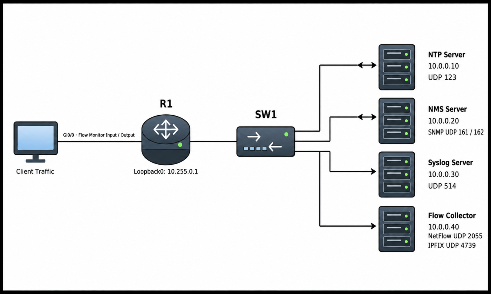

# Network Management / Monitoring

## 개념

Network Management와 Monitoring은 Network 장비의 상태, 장애, 성능 및 Traffic 사용량을 확인하고 관리하는 기능이다.
- NTP: 장비들의 시간을 동기화한다.
- SNMP: 장비의 CPU, Memory 및 Interface 상태를 수집한다.
- Syslog: 장비에서 발생한 Event와 오류 Message를 기록한다.
- NetFlow/IPFIX: 어떤 장비가 어디와 얼마나 통신했는지 수집한다.

### NTP

NTP(Network Time Protocol)는 Network 장비의 시간을 NTP Server와 동기화하는 Protocol이다.

장비들의 시간이 일치해야 Syslog, SNMP Trap 및 장애 발생 시간을 정확하게 비교할 수 있다.

#### Stratum

Stratum은 NTP Server가 기준 시간과 얼마나 가까운지 나타내는 값이다.
- Stratum `0`: GPS나 원자시계와 같은 기준 시간 장비이다.
- Stratum `1`: Stratum 0과 직접 연된결 NTP Server이다.
- Stratum `2`: Stratum 1 NTP Server로부터 시간을 직접 동기화하는 NTP Server이다.
- Stratum `16`: 시간을 동기화하지 못한 상태이다.

Stratum 값이 낮을수록 기준 시간에 가까운 Server이다.

### SNMP

SNMP(Simple Network Management Protocol)는 NMS가 Network 장비의 상태와 성능 정보를 수집하는 Protocol이다.
```
NMS Manager ↔ SNMP Agent → MIB/OID
```
- NMS Manager: Network 장비의 정보를 수집하여 관리자가 확인할 수 있도록 Web 화면에 표시하는 Monitoring Server이다.
- SNMP Agent: Router나 Switch에서 장비 정보를 NMS에 제공하는 기능이다.
- MIB: SNMP로 확인할 수 있는 장비 정보들을 정리한 데이터 구조이다.
- OID: MIB에서 확인하려는 장비 정보를 찾을 때 사용하는 고유 번호이다.


#### SNMP Trap과 Inform

Trap과 Inform은 장애나 Interface Down 같은 Event가 발생하면 SNMP Agent가 NMS Manager로 알림을 보내는 방식이다.  

Trap은 NMS의 응답을 기다리지 않고, Message가 전달되지 않아도 다시 확인하지 않는다.

Inform은 NMS가 Message를 받았다는 응답을 보내며, 응답이 없으면 장비가 다시 전송할 수 있다.

#### SNMP Version

SNMPv1은 오래된 Version으로 인증과 보안 기능이 약하다.

SNMPv2c는 Community String을 사용하며 성능이 개선되었지만 인증 정보와 수집 내용이 암호화되지 않는다.

SNMPv3는 사용자 인증과 암호화를 지원하므로 운영 환경에서 사용하는 것이 좋다.

관리자가 SNMPv3 사용자를 생성할 때 사용할 보안 수준을 설정한다  
- `noAuthNoPriv`: 인증과 암호화를 사용하지 않는다.
- `authNoPriv`: 사용자 인증만 사용한다.
- `authPriv`: 사용자 인증과 암호화를 모두 사용한다.

### Syslog

Syslog는 Router, Switch 및 Firewall에서 발생한 Event와 오류 Message를 기록하고 Syslog Server로 전달하는 기능이다.
```
Sep 2 10:30:15: %LINK-3-UPDOWN: Interface GigabitEthernet0/1, changed state to down
```
Syslog Message에는 발생 시간, Facility, Severity, Message 이름 및 내용이 포함된다.

#### Syslog Severity

```
0 Emergencies: 장비를 사용할 수 없는 심각한 상태
1 Alerts: 즉시 조치가 필요한 상태
2 Critical: 중요한 기능에 문제가 발생한 상태
3 Errors: 오류가 발생한 상태
4 Warnings: 장애가 발생할 가능성이 있는 경고 상태
5 Notifications: 정상적이지만 확인할 필요가 있는 상태
6 Informational: 일반적인 동작 정보
7 Debugging: 장애 분석을 위한 상세 정보
```
Severity Number가 낮을수록 더 심각한 Message이다.


### NetFlow

NetFlow는 Cisco가 개발한 Traffic Monitoring 기술로, Network를 통과하는 Traffic 정보를 Flow 단위로 수집한다.
```
Source/Destination IP Address
Source/Destination Port
Protocol
Interface
Packet/Byte 수
통신 시작 및 종료 시간
```
- 출발지와 목적지 등이 같은 여러 Packet을 하나의 Flow라고 한다.  

NetFlow는 일반적으로 Packet의 전체 내용을 저장하지 않고, 누가 어디로 얼마나 통신했는지에 대한 정보만 수집한다.

#### Flexible NetFlow 구성 요소

Flow Record: 어떤 Traffic 정보를 수집할지 지정한다. 

Flow Monitor: Flow Record에 따라 Traffic 정보를 수집하고 Cache에 저장한다. 

Flow Exporter: 수집한 정보를 어느 Flow Collector로 전송할지 지정한다. 

Flow Collector: 장비가 전송한 Flow 정보를 수신하고 분석하는 Server이다.

```
192.168.10.100:51000 → 198.51.100.10:443
                       ↓
Gi0/0에 적용된 Flow Monitor가 Traffic 확인
                       ↓
Flow Monitor가 Flow Record에 지정된
IP Address, Port 및 전송량을 Cache에 저장
                       ↓
Flow Exporter가 수집한 정보를 10.0.0.50으로 전송
                       ↓
Flow Collector가 Flow 정보를 분석하고 화면에 표시
```

### IPFIX

IPFIX(IP Flow Information Export)는 NetFlow Version 9를 기반으로 만들어진 IETF 표준 Flow Export Protocol이다.

IPFIX는 NetFlow와 같은 목적으로 사용하며, 여러 제조사의 장비에서 사용할 수 있는 표준 Protocol이다.

---

## 동작 원리

### NTP 동작 과정

1\. Network 장비는 설정된 NTP Server로 시간 정보를 요청한다.

2\. NTP Server는 자신의 시간과 Stratum 정보를 응답한다.

3\. Network 장비는 자신의 시간을 조정한다.

4\. 이후 장비는 주기적으로 NTP Server와 통신하여 시간을 계속 동기화한다.

### SNMP 동작 과정

1\. NMS는 SNMP Agent가 실행 중인 Network 장비로 정보를 요청한다.

2\. Network 장비는 해당 OID의 정보를 확인한다.

3\. 장비는 CPU, Memory 및 Interface Traffic 등의 정보를 NMS에 응답한다.

4\. 장애가 발생하면 장비는 NMS의 요청을 기다리지 않고 Trap 또는 Inform을 전송할 수 있다.

### Syslog 동작 과정

1\. Network 장비에서 Interface Down, Login 실패 또는 Configuration 변경과 같은 Event가 발생한다.

2\. 장비는 Event에 맞는 Severity Level의 Syslog Message를 생성한다.

3\. 설정된 Severity 범위에 포함되면 Syslog Server로 Message를 전송한다.

4\. 관리자는 Syslog Server에서 장비들의 Message를 확인한다.

### NetFlow/IPFIX 동작 과정

1\. Interface를 통과하는 Packet은 Flow Monitor를 통해서 확인된다.

2\. Source/Destination IP Address, Port 및 Protocol 등이 같으면 하나의 Flow로 수집된다.

3\. Packet 수, Byte 수 및 통신 시간 등의 정보가 Flow Cache에 저장된다.

4\. Flow Exporter는 수집한 정보를 NetFlow 또는 IPFIX 형식으로 Collector에 전송한다.

5\. Collector는 Flow 정보를 분석하여 Traffic 사용량과 비정상적인 통신을 확인한다.

---

## 예시 및 구성

### 사내 Network 통합 Monitoring

`MASON` 회사는 Router와 Switch의 시간, 장애 Message 및 Traffic 사용량을 하나의 Monitoring 환경에서 확인하려고 한다.

관리자는 NTP Server, NMS, Syslog Server 및 Flow Collector를 구성하고 R1이 각 Server로 정보를 전송하도록 설정하였다.



### NTP 설정

R1의 표시 시간을 한국 시간으로 설정하고 NTP Server와 시간을 동기화한다.
```
R1(config)# clock timezone KST 9 0
R1(config)# ntp server 10.0.0.10 source loopback0 prefer
```
- `clock timezone KST 9 0`: 장비의 표시 시간을 한국 시간으로 설정한다.
- `source loopback0`: NTP Packet의 Source IP Address로 Loopback0을 사용한다.
- `prefer`: 여러 NTP Server가 있을 때 해당 Server를 우선 사용한다.

### SNMPv3 설정

NMS Server `10.0.0.20`만 R1의 SNMP 정보에 접근할 수 있도록 설정한다.
```
R1(config)# ip access-list standard SNMP-MANAGER
R1(config-std-nacl)# permit host 10.0.0.20
R1(config-std-nacl)# exit

R1(config)# snmp-server group NMS-GROUP v3 priv access SNMP-MANAGER
R1(config)# snmp-server user NMS-USER NMS-GROUP v3 auth sha AUTH-PASSWORD priv aes 128 PRIV-PASSWORD
R1(config)# snmp-server host 10.0.0.20 version 3 priv NMS-USER
R1(config)# snmp-server enable traps
R1(config)# snmp-server trap-source loopback0
```
- `v3 priv`: 사용자 인증과 암호화를 모두 사용한다.
- `auth sha`: SHA를 사용하여 사용자를 인증한다.
- `priv aes 128`: AES 128을 사용하여 SNMP 정보를 암호화한다.
- `snmp-server host`: Trap을 전송할 NMS Server를 지정한다.
- `snmp-server enable traps`: SNMP Trap 전송을 활성화한다.
- 실제 환경에서는 안전한 인증 및 암호화 Password를 사용한다.

### Syslog 설정

R1의 Syslog Message를 Syslog Server `10.0.0.30`으로 전송한다.
```
R1(config)# service timestamps log datetime msec localtime show-timezone
R1(config)# logging host 10.0.0.30
R1(config)# logging source-interface loopback0
R1(config)# logging trap warnings
```
- `service timestamps`: Syslog Message에 날짜, 시간 및 Millisecond를 표시한다.
- `logging host`: Syslog Server의 IP Address를 지정한다.
- `logging source-interface`: Syslog Packet의 Source Interface를 지정한다.
- `logging trap warnings`: Severity Level `0~4`의 Message를 Syslog Server로 전송한다.

### Flexible NetFlow 설정

Traffic에서 수집할 정보를 Flow Record로 설정한다.
```
R1(config)# flow record TRAFFIC-RECORD
R1(config-flow-record)# match ipv4 source address
R1(config-flow-record)# match ipv4 destination address
R1(config-flow-record)# match ip protocol
R1(config-flow-record)# match transport source-port
R1(config-flow-record)# match transport destination-port
R1(config-flow-record)# collect counter packets long
R1(config-flow-record)# collect counter bytes long
R1(config-flow-record)# exit
```

Flow Collector와 NetFlow Export 형식을 설정한다.
```
R1(config)# flow exporter NETFLOW-EXPORTER
R1(config-flow-exporter)# destination 10.0.0.40
R1(config-flow-exporter)# source loopback0
R1(config-flow-exporter)# transport udp 2055
R1(config-flow-exporter)# export-protocol netflow-v9
R1(config-flow-exporter)# template data timeout 60
R1(config-flow-exporter)# exit
```

Flow Record와 Flow Exporter를 Flow Monitor에 연결한다.
```
R1(config)# flow monitor TRAFFIC-MONITOR
R1(config-flow-monitor)# record TRAFFIC-RECORD
R1(config-flow-monitor)# exporter NETFLOW-EXPORTER
R1(config-flow-monitor)# cache timeout active 60
R1(config-flow-monitor)# exit
```

Traffic을 확인할 Interface에 Flow Monitor를 적용한다.
```
R1(config)# interface gi0/0
R1(config-if)# ip flow monitor TRAFFIC-MONITOR input
R1(config-if)# ip flow monitor TRAFFIC-MONITOR output
```
- `input`: Interface로 들어오는 Traffic을 수집한다.
- `output`: Interface에서 나가는 Traffic을 수집한다.

--- 

## Troubleshooting

### Monitoring Server에서 Network 장비의 정보가 확인되지 않는 경우

1\. Network 장비에서 Monitoring Server까지 Route가 존재하는지 확인한다.
```
R1# show ip route 10.0.0.20
R1# ping 10.0.0.20 source loopback0
```

2\. Source Interface가 Up 상태이며 올바른 IP Address를 사용하고 있는지 확인한다.
```
R1# show ip interface brief
R1# show interfaces loopback0
```

3\. NTP 시간이 동기화되지 않는다면 NTP Server와 Association 상태를 확인한다.
```
R1# show ntp status
R1# show ntp associations
```
- `show ntp associations`에서 `*`가 없다면 현재 시간을 동기화하고 있는 NTP Server가 없는 상태이다.

4\. NMS에서 SNMP 정보를 수집하지 못한다면 SNMP Version, 사용자 및 ACL 설정을 확인한다.
```
R1# show snmp
R1# show snmp user
R1# show snmp group
R1# show access-lists SNMP-MANAGER
```
- NMS와 Network 장비의 SNMP Version, Username, 인증 방식 및 Password가 일치해야 한다.

5\. Syslog Server에서 Message가 확인되지 않는다면 Server IP Address와 Severity 설정을 확인한다.
```
R1# show logging
R1# show running-config | include logging
```
- `logging trap`에 설정된 Severity보다 높은 Number의 Message는 Syslog Server로 전송되지 않는다.

6\. Flow Collector에서 NetFlow 정보가 확인되지 않는다면 Flow Monitor가 Interface에 적용되어 있는지 확인한다.
```
R1# show flow interface
R1# show flow monitor TRAFFIC-MONITOR cache
R1# show flow exporter NETFLOW-EXPORTER
```

7\. ACL이나 Firewall에서 Management Traffic을 차단하고 있지 않은지 확인한다.
```
R1# show access-lists
R1# show ip interface
```
- NTP UDP Port `123`
- SNMP UDP Port `161`, `162`
- Syslog UDP Port `514`
- NetFlow Collector에서 사용하는 UDP Port
- IPFIX UDP Port `4739`

---

## 주요 질문

NTP를 사용하는 이유는 무엇인가?
- Network 장비들의 시간을 동기화하여 Syslog, SNMP Trap 및 장애 발생 시간을 정확하게 비교하기 위해 사용한다.

SNMP Polling과 Trap의 차이는 무엇인가?
- Polling은 NMS가 장비에 주기적으로 정보를 요청하는 방식이고, Trap은 Event가 발생했을 때 장비가 NMS로 알림을 보내는 방식이다.

SNMP Trap과 Inform의 차이는 무엇인가?
- Trap은 NMS의 수신 응답을 기다리지 않지만 Inform은 NMS의 응답을 확인하고 응답이 없으면 다시 전송할 수 있다.

SNMPv2c와 SNMPv3의 차이는 무엇인가?
- SNMPv2c는 Community String을 사용하며 암호화를 지원하지 않고, SNMPv3는 사용자 인증과 암호화를 지원한다.

Syslog Severity Number가 낮다는 것은 무엇을 의미하는가?
- Number가 낮을수록 더 심각한 Message이며, `0`이 가장 심각하고 `7`이 가장 상세한 Debugging Level이다.

`logging trap warnings`는 Warning Message만 전송하는가?
- 아니다, Warning Level인 `4`와 더 심각한 Level `0~3`의 Message를 모두 전송한다.

Flow Record, Exporter 및 Monitor의 역할은 무엇인가?
- Flow Record는 수집할 Traffic 정보를 지정하고, Monitor는 해당 정보를 Flow Cache에 저장하며, Exporter는 저장된 정보를 지정한 Flow Collector로 전송한다.
