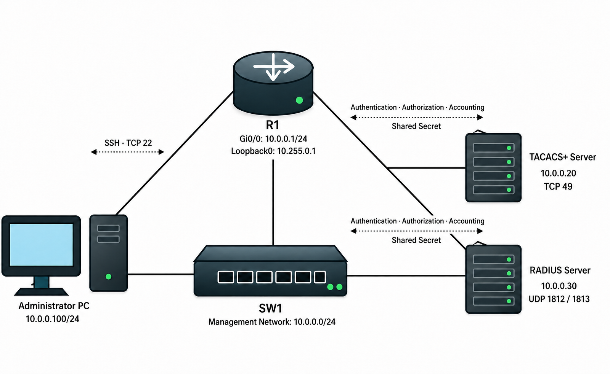

# Device Access / Authentication

## 개념

### Console

Console은 장비의 Console Port에 직접 연결하여 관리하는 방식이다.

Network 연결이 없어도 장비에 접속할 수 있으므로 초기 설정이나 장애가 발생했을 때 사용한다.

### VTY

VTY(Virtual Teletype)는 SSH나 Telnet을 이용하여 Network를 통해 장비에 원격 접속할 때 사용하는 가상의 Line이다.
```
R1(config)# line vty 0 4
```
- `0 4`: 동시에 사용할 수 있는 VTY Line `5개`를 설정한다.
- 장비에 따라 지원하는 VTY Line의 개수가 다를 수 있다.

## SSH

SSH(Secure Shell)는 Network 장비에 안전하게 원격 접속하기 위한 Protocol이다.

사용자 계정, Password 및 원격 접속 중 주고받는 내용을 암호화하므로 중간에서 Packet을 확인해도 내용을 쉽게 확인할 수 없다.

SSH는 TCP Port `22`를 사용한다.

### SSH Key

Cisco 장비에서 SSH를 사용하려면 장비 확인에 사용할 RSA Key Pair를 생성해야 한다.
```
R1(config)# crypto key generate rsa modulus 2048
```
장비에 SSH로 로그인하려면 Username과 Password를 사용하거나, Username과 PC의 Private Key를 사용하여 인증하며 해당 Public Key는 장비에 등록되어 있어야 한다.

### Telnet

Telnet은 Network 장비에 원격 접속하기 위한 Protocol이다.

Telnet은 TCP Port `23`를 사용한다.

Username, Password 및 원격 접속 중 주고받는 내용을 암호화하지 않고 Plaintext로 전송한다.

공격자가 중간에서 Packet을 수집하면 로그인 정보와 입력한 명령어를 그대로 확인할 수 있으며, 탈취한 계정으로 장비에 접속하여 설정을 변경할 수 있다.

따라서 실제 운영 환경에서는 Telnet 대신 SSH를 사용하며, Telnet은 주로 Lab 환경에서 사용한다.

### AAA

AAA는 장비에 접속하는 사용자를 확인하고, 사용할 수 있는 명령어를 제한하며, 사용 기록을 저장하는 기능이다.

#### Authentication

Authentication은 장비에 접속하려는 사용자가 누구인지 확인한다.

#### Authorization

Authorization은 인증된 사용자가 어떤 기능과 명령어를 사용할 수 있는지 결정한다.

#### Accounting

Accounting은 사용자가 장비에 접속한 시간과 실행한 명령어 등의 기록을 AAA Server에 전송하는 기능이다.

### Local Authentication

Local Authentication은 Router나 Switch에 관리자가 직접 Username과 Password를 생성하고, 해당 계정으로 장비에 접속하는 인증 방식이다.
```
R1(config)# username LOCAL-ADMIN privilege 15 secret <LOCAL-PASSWORD>

R1(config)# line vty 0 4
R1(config-line)# login local
R1(config-line)# transport input ssh
```
관리자가 `LOCAL-ADMIN` 계정으로 접속하면 R1은 장비 내부에 저장된 Username과 Password를 확인하고 접속을 허용한다.

장비마다 계정을 따로 관리하므로 계정을 추가하거나 삭제하고 Password를 변경할 때마다 각 장비에 직접 설정해야 한다.

### Centralized Authentication

Centralized Authentication은 RADIUS 또는 TACACS+ Server에 관리자 계정을 만들고, Router와 Switch를 AAA Client로 등록하여 여러 장비의 계정을 통합 관리하는 방식이다.

관리자가 Router나 Switch에 로그인하면 장비는 입력된 사용자 정보를 RADIUS 또는 TACACS+ Server로 보내고, Server의 인증 결과에 따라 접속을 허용하거나 거부한다.

### RADIUS

RADIUS(Remote Authentication Dial-In User Service)는 Network에 접속하려는 사용자나 단말을 인증하고 접근 권한을 관리하는 Protocol이다.

RADIUS는 주로 사용자가 Wi-Fi, VPN 및 사내 Network에 접속할 수 있는지 관리한다.

RADIUS는 Authentication과 Authorization에 UDP Port `1812`를 사용하고, Accounting에 UDP Port `1813`을 사용한다.

사용자가 누구인지 확인한 후 사용할 수 있는 Network 권한을 하나의 결과로 전달한다.

사용자의 Password는 보호하지만 RADIUS Packet의 모든 내용이 암호화되는 것은 아니다.

### TACACS+

TACACS+(Terminal Access Controller Access-Control System Plus)는 Router, Switch 및 Firewall에 로그인하는 관리자를 인증하고 권한을 관리하는 Protocol이다.

TACACS+는 TCP Port `49`를 사용한다.

Authentication, Authorization 및 Accounting을 각각 분리하여 처리할 수 있다.

관리자가 로그인할 수 있는지 확인하고, 사용할 수 있는 명령어를 제한하며, 실행한 명령어를 기록할 수 있다.

TACACS+는 Packet 전달에 필요한 기본 정보는 그대로 보내지만, Username, Password 및 명령어 같은 중요한 내용은 `Shared Secret`을 이용하여 암호화한다.

---

## 동작 원리

### SSH 접속 과정

1\. 관리자가 Network 장비의 TCP Port `22`로 접속한다.

2\. 장비와 관리자는 SSH 암호화 통신을 설정한다.

3\. 장비는 Local Database 또는 AAA Server를 통해 Username과 Password를 확인한다.

4\. 인증에 성공하면 사용자에게 CLI 접속을 허용한다.

5\. Authorization이 설정되어 있다면 사용자가 실행할 수 있는 명령어를 확인한다.

6\. Accounting이 설정되어 있다면 접속 시간과 실행한 명령어를 AAA Server에 기록한다.

### RADIUS 인증 과정

1\. 일반 사용자가 Wi-Fi, VPN 또는 사내 Network에 접속한다.

2\. Switch, WLC 또는 VPN 장비는 사용자가 입력한 인증 정보를 RADIUS Server로 보낸다.

3\. RADIUS Server는 사용자 계정과 접속 권한을 확인한다.

4\. 인증에 성공하면 RADIUS Server는 접속 허용 Message를 장비에 보낸다.

5\. Network 장비는 사용자의 Network 접속을 허용하고 전달받은 권한을 적용한다.

6\. 인증에 실패하면 RADIUS Server는 접속 거부 Message를 보내고 Network 장비는 사용자의 접속을 차단한다.

7\. Accounting이 설정되어 있다면 사용자의 접속 시작과 종료 시간을 RADIUS Server에 기록한다.

### TACACS+ 인증 과정

1\. 관리자가 SSH를 사용하여 R1에 접속한다.

2\. R1은 관리자가 입력한 Username과 Password를 TACACS+ Server에 전달한다.

3\. TACACS+ Server는 사용자 정보를 확인하고 인증 결과를 R1에 전달한다.

4\. 인증에 성공하면 R1은 관리자에게 CLI 접속을 허용한다.

5\. 관리자가 명령어를 입력하면 R1은 TACACS+ Server에 해당 명령어를 실행할 수 있는지 확인한다.

6\. Accounting이 설정되어 있다면 접속 시간과 실행한 명령어가 TACACS+ Server에 저장된다.

7\. 관리자가 R1에 로그인할 때 TACACS+ Server로부터 응답을 받지 못하면, R1은 Local Database에 저장된 Username과 Password로 관리자를 인증한다.

---

## 예시 및 구성

### Network 장비의 관리자 인증

`MASON` 회사는 Router와 Switch의 관리자 계정을 각 장비에서 관리하고 있다.

장비가 늘어나면서 사용자 계정과 권한을 장비마다 관리하기 어려워졌다.

관리자는 TACACS+ Server를 구성하여 Network 장비의 관리자 계정과 명령어 권한을 중앙에서 관리한다.

TACACS+ Server에 장애가 발생할 경우를 대비하여 각 장비에는 비상용 Local 관리자 계정도 생성한다.



## SSH 구성

1\. 장비의 Hostname과 Domain Name을 설정한다.
```
Router(config)# hostname R1
R1(config)# ip domain name corp.mason
```
RSA Key를 생성하려면 Hostname과 Domain Name이 먼저 설정되어 있어야 한다.

2\. 비상시에 사용할 Local 관리자 계정을 생성한다.
```
R1(config)# username LOCAL-ADMIN privilege 15 secret <LOCAL-PASSWORD>
R1(config)# enable secret <ENABLE-PASSWORD>
```
- Privilege Level `0`: `exit`, `logout`, `enable` 등 매우 제한된 명령어만 사용할 수 있다.
- Privilege Level `1`: 일반 사용자 권한으로 기본적인 상태 확인 명령어만 사용할 수 있다.
- Privilege Level `15`: 모든 상태 확인과 Configuration 변경 명령어를 사용할 수 있는 최고 관리자 권한이다.
- Privilege Level `2~14`는 관리자가 사용할 수 있는 명령어를 직접 지정할 때 사용한다.
- `secret`: Password를 암호화된 형태로 저장한다.

3\. SSH에서 사용할 RSA Key를 생성하고 SSH Version 2를 사용한다.
```
R1(config)# crypto key generate rsa modulus 2048
R1(config)# ip ssh version 2
R1(config)# ip ssh time-out 60
R1(config)# ip ssh authentication-retries 3
```
- `modulus 2048`: RSA Key의 크기를 `2048bit`로 설정한다.
- `ip ssh version 2`: SSH Version 2를 사용한다.
- `ip ssh time-out 60`: SSH 로그인 정보를 입력할 수 있는 시간을 `60초`로 설정한다.
- `authentication-retries 3`: 인증을 최대 `3번` 시도하도록 설정한다.

4\. 관리자가 사용하는 Network만 원격 접속을 허용한다.
```
R1(config)# ip access-list standard MGMT-ACCESS
R1(config-std-nacl)# permit 10.0.0.0 0.0.0.255
R1(config-std-nacl)# exit
```

5\. VTY Line에서 SSH와 Local Authentication을 사용한다.
```
R1(config)# line vty 0 4
R1(config-line)# login local
R1(config-line)# transport input ssh
R1(config-line)# access-class MGMT-ACCESS in
R1(config-line)# exec-timeout 10 0
R1(config-line)# exit
```
- `login local`: 장비에 생성된 Local 사용자 계정으로 인증한다.
- `transport input ssh`: SSH 접속만 허용하고 Telnet 접속은 차단한다.
- `access-class MGMT-ACCESS in`: 관리 Network에서 시작된 접속만 허용한다.
- `exec-timeout 10 0`: 입력 없이 `10분`이 지나면 접속을 종료한다.

## Telnet 구성

Lab 환경에서 Telnet을 사용하는 경우이다.
```
R1(config)# line vty 0 4
R1(config-line)# login local
R1(config-line)# transport input telnet
R1(config-line)# exit
```

## AAA Local Authentication 구성

1\. AAA 기능을 활성화한다.
```
R1(config)# aaa new-model
```
- `aaa new-model`을 설정하면 기존의 단순한 Line Password 방식 대신 AAA 인증 방식을 사용할 수 있다.

2\. Local 사용자 계정을 사용하는 Login Method List를 생성한다.
```
R1(config)# aaa authentication login VTY-LOGIN local
```
- `VTY-LOGIN`: Login Method List의 이름이다.
- `local`: 장비에 생성된 Local 사용자 계정을 확인한다.

3\. VTY Line에 Login Method List를 적용한다.
```
R1(config)# line vty 0 4
R1(config-line)# login authentication VTY-LOGIN
R1(config-line)# transport input ssh
R1(config-line)# exit
```
- `login local`: 별도의 AAA Method List 없이 Local Database를 사용한다.
- `login authentication VTY-LOGIN`: VTY Line에 `VTY-LOGIN` AAA Method List를 적용하여, 해당 List에 설정된 방식으로 SSH 사용자를 인증한다.  

## TACACS+ 구성

1\. 비상시에 사용할 Local 관리자 계정을 먼저 생성한다.
```
R1(config)# username LOCAL-ADMIN privilege 15 secret <LOCAL-PASSWORD>
```

2\. AAA 기능을 활성화한다.
```
R1(config)# aaa new-model
```

3\. TACACS+ Server를 등록한다.
```
R1(config)# tacacs server TACACS1
R1(config-server-tacacs)# address ipv4 10.0.0.20
R1(config-server-tacacs)# key <SHARED-SECRET>
R1(config-server-tacacs)# exit
```

- `TACACS1`: 장비에서 TACACS+ Server를 구분하기 위한 이름이다.
- `10.0.0.20`: TACACS+ Server의 IP Address이다.
- `key`: R1과 TACACS+ Server가 함께 사용하는 Shared Secret이다.

양쪽 장비에 설정한 Shared Secret이 일치해야 한다.

4\. TACACS+ Server Group을 생성한다.
```
R1(config)# aaa group server tacacs+ TACACS-GROUP
R1(config-sg-tacacs+)# server name TACACS1
R1(config-sg-tacacs+)# exit
```

5\. TACACS+ Packet의 Source Interface를 지정한다.
```
R1(config)# ip tacacs source-interface loopback0
```

Loopback Interface를 사용하면 TACACS+ Server에서 각 Network 장비를 일정한 Source IP Address로 구분할 수 있다.

6\. Authentication, Authorization 및 Accounting Method List를 생성한다.
```
R1(config)# aaa authentication login VTY-LOGIN group TACACS-GROUP local
R1(config)# aaa authorization exec VTY-EXEC group TACACS-GROUP local
R1(config)# aaa authorization commands 15 VTY-COMMAND group TACACS-GROUP local
R1(config)# aaa accounting exec VTY-ACCOUNT start-stop group TACACS-GROUP
R1(config)# aaa accounting commands 15 VTY-COMMAND-ACCOUNT start-stop group TACACS-GROUP
```
- `group TACACS-GROUP local`: TACACS+ Server를 먼저 사용하고 Server가 응답하지 않으면 Local Database를 사용한다.
- `authorization exec`: 사용자가 CLI에 접속할 수 있는지 확인한다.
- `authorization commands 15`: Privilege Level `15`의 명령어를 실행할 수 있는지 확인한다.
- `accounting exec`: 사용자의 접속 시작과 종료를 기록한다.
- `accounting commands 15`: 사용자가 실행한 Privilege Level `15`의 명령어를 기록한다.
- `start-stop`: Session이 시작될 때와 종료될 때 Accounting 정보를 전송한다.

7\. VTY Line에 AAA Method List를 적용한다.
```
R1(config)# line vty 0 4
R1(config-line)# login authentication VTY-LOGIN
R1(config-line)# authorization exec VTY-EXEC
R1(config-line)# authorization commands 15 VTY-COMMAND
R1(config-line)# accounting exec VTY-ACCOUNT
R1(config-line)# accounting commands 15 VTY-COMMAND-ACCOUNT
R1(config-line)# transport input ssh
R1(config-line)# access-class MGMT-ACCESS in
R1(config-line)# exec-timeout 10 0
R1(config-line)# exit
```

## RADIUS 구성

RADIUS Server를 이용하여 관리자 인증을 구성하는 예시이다.

1\. RADIUS Server를 등록한다.
```
R1(config)# radius server RADIUS1
R1(config-radius-server)# address ipv4 10.0.0.30 auth-port 1812 acct-port 1813
R1(config-radius-server)# key <SHARED-SECRET>
R1(config-radius-server)# exit
```

2\. RADIUS Server Group을 생성한다.
```
R1(config)# aaa group server radius RADIUS-GROUP
R1(config-sg-radius)# server name RADIUS1
R1(config-sg-radius)# exit
```

3\. RADIUS Packet의 Source Interface를 지정한다.
```
R1(config)# ip radius source-interface loopback0
```

4\. RADIUS Server와 Local Database를 사용하는 Method List를 생성한다.
```
R1(config)# aaa authentication login VTY-LOGIN group RADIUS-GROUP local
R1(config)# aaa authorization exec VTY-EXEC group RADIUS-GROUP local
R1(config)# aaa accounting exec VTY-ACCOUNT start-stop group RADIUS-GROUP
```

5\. VTY Line에 Method List를 적용한다.
```
R1(config)# line vty 0 4
R1(config-line)# login authentication VTY-LOGIN
R1(config-line)# authorization exec VTY-EXEC
R1(config-line)# accounting exec VTY-ACCOUNT
R1(config-line)# transport input ssh
R1(config-line)# exit
```

Network 장비의 관리자 명령어를 세부적으로 제어해야 한다면 RADIUS보다 TACACS+를 사용하는 것이 낫다.


## 명령어

SSH Server의 활성화 상태와 Version을 확인한다.
```
R1# show ip ssh
```

현재 SSH Session을 확인한다.
```
R1# show ssh
R1# show users
```

RSA Key가 생성되어 있는지 확인한다.
```
R1# show crypto key mypubkey rsa
```

AAA Method List를 확인한다.
```
R1# show running-config | section aaa
```

VTY Line에 적용된 설정을 확인한다.
```
R1# show running-config | section line vty
```

AAA Server의 상태를 확인한다.
```
R1# show aaa servers
```

TACACS+ 상태를 확인한다
```
R1# show tacacs
```

RADIUS 상태를 확인한다.
```
R1# show radius statistics
```
---

## Troubleshooting

### SSH 접속 또는 RADIUS/TACACS+ 인증이 되지 않는 경우

1\. 관리자의 PC에서 Network 장비까지 통신할 수 있는지 확인한다.
```
R1# show ip interface brief
R1# show ip route 10.0.0.100
```

2\. SSH가 활성화되어 있는지 확인한다.
```
R1# show ip ssh
R1# show crypto key mypubkey rsa
```
- RSA Key가 없다면 SSH가 정상적으로 활성화되지 않는다.

```
R1(config)# hostname R1
R1(config)# ip domain name corp.mason
R1(config)# crypto key generate rsa modulus 2048
R1(config)# ip ssh version 2
```

3\. VTY Line에서 SSH 접속을 허용하고 있는지 확인한다.
```
R1# show running-config | section line vty
```

다음 설정이 적용되어 있는지 확인한다.
```
R1(config)# line vty 0 4
R1(config-line)# transport input ssh
R1(config-line)# login authentication VTY-LOGIN
```

4\. VTY Line에 적용된 Access Class가 관리자 PC의 IP Address를 차단하고 있지 않은지 확인한다.
```
R1# show access-lists MGMT-ACCESS
```
- ACL에 관리자 Network가 없다면 허용 규칙을 추가한다.


5\. VTY Line에 적용한 AAA Method List가 실제로 존재하는지 확인한다.
```
R1# show running-config | section aaa
R1# show running-config | section line vty
```
- VTY Line의 `login authentication VTY-LOGIN`과 AAA 설정의 Method List 이름이 일치해야 한다.

6\. Network 장비에서 AAA Server까지 통신할 수 있는지 확인한다.
```
R1# show ip route 10.0.0.20
R1# ping 10.0.0.20 source loopback0
```

7\. Network 장비와 AAA Server의 Shared Secret이 동일한지 확인한다.
- Shared Secret이 다르면 AAA Server까지 Packet이 전달되어도 인증에 실패한다.

---

## 주요 질문

SSH와 Telnet의 차이는 무엇인가?
- SSH는 사용자 계정, Password 및 전송 내용을 암호화하지만 Telnet은 암호화하지 않는다.

`login local`은 무엇인가?
- 장비에 직접 생성한 Local 사용자 계정으로 인증하도록 설정하는 명령어이다.

`login authentication`은 무엇인가?
- VTY Line에서 사용할 AAA Login Method List를 지정하는 명령어이다.

`transport input ssh`는 무엇인가?
- VTY Line으로 들어오는 원격 접속 중 SSH만 허용하고 Telnet은 차단하는 명령어이다.

RADIUS와 TACACS+ 중 어떤 것을 사용해야 하는가?
- 사용자나 단말의 Network 접근 인증에는 RADIUS를 많이 사용한다. Router, Switch 및 Firewall에 접속하는 관리자의 인증과 명령어 권한 관리에는 TACACS+를 많이 사용한다.

Method List의 `local`은 언제 사용하는가?
- RADIUS 또는 TACACS+ Server가 응답하지 않을 때 장비에 생성된 Local 계정으로 인증하기 위해 사용한다.

Source Interface를 지정하는 이유는 무엇인가?
- AAA Packet이 항상 동일한 Source IP Address를 사용하도록 하기 위해 설정한다. Loopback Interface를 Source로 사용하면 물리 Interface 상태가 변경되어도 AAA Server에서 장비를 일정한 IP Address로 구분할 수 있다.
