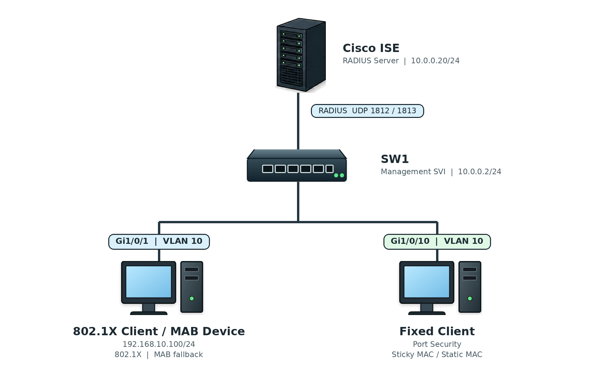

# Network Access Security

## 개념

### 802.1X

802.1X는 Switch Port에 연결된 사용자나 장비를 인증한 후 Network 접근을 허용하는 인증 방식이다.

인증에 성공하기 전에는 일반 Traffic을 차단하고 인증에 필요한 EAPOL Traffic만 허용한다.
- `EAPOL Traffic`은 PC와 Switch가 802.1x 인증 정보를 주고 받을때 사용하는 Traffic이다.

Supplicant
- Supplicant는 Network에 접속하기 위해 인증을 요청하는 Client이다.

Authenticator
- Authenticator는 Client가 연결된 Switch 또는 Wireless Access Point이다.
- Client의 인증 정보를 직접 확인하지 않고 RADIUS Server로 전달한다.

Authentication Server
- Authentication Server는 사용자의 계정이나 인증서를 확인하고 인증 결과를 전달한다.
- 일반적으로 RADIUS Protocol을 사용하는 Cisco ISE, Windows NPS 및 FreeRADIUS 등이 있다.
- 802.1X 인증에는 TACACS+가 아니라 RADIUS를 사용한다.
```
RADIUS Authentication: UDP Port 1812
RADIUS Accounting: UDP Port 1813
```

### EAP와 EAPOL

EAP(Extensible Authentication Protocol)는 802.1X 인증 과정에서 사용자나 장비의 인증 정보를 주고받을 때 사용하는 Protocol이다.

Client와 Switch 사이에서는 EAPOL(EAP over LAN)을 사용한다.

Client가 Switch Port에 연결되면 EAP 인증 정보를 EAPOL에 담아 Switch로 전달한다. Switch는 받은 EAP 인증 정보를 RADIUS Message에 담아 RADIUS Server로 전달한다  

### EAP-TLS

EAP-TLS는 Client와 Authentication Server가 Certificate를 사용하여 서로를 인증하는 방식이다.

Password만 사용하는 방식보다 안전하지만 Client와 Server에 Certificate를 배포하고 관리해야 한다.

기업의 업무용 PC 인증에 많이 사용한다.

### PEAP

PEAP는 Server Certificate로 암호화 Tunnel을 만든 후 Username과 Password를 확인하는 방식이다.

EAP-TLS보다 구성이 간단하지만 사용자 계정과 Password를 관리해야 한다.

### MAB

MAB(MAC Authentication Bypass)는 802.1X 인증을 사용할 수 없는 장비를 MAC Address로 확인하여 Network 접근을 허용하는 방식이다.

관리자는 MAB 인증을 허용할 단말의 MAC Address를 RADIUS Server에 미리 등록해야 한다.
- Printer
- IP Phone
- Camera
- IoT 장비

일부 Printer, IP Phone 및 Camera는 802.1X 인증 기능이 없어서 Certificate를 Switch에 보낼 수 없다.

MAC Address는 위조할 수 있으므로 MAB는 802.1X보다 보안 수준이 낮다.

### NAC

NAC(Network Access Control)는 Network에 접속하는 사용자와 장비를 확인하고, 보안 정책에 따라 접근 권한을 결정한다. 

802.1X는 인증을 Client를 인증하고, NAC는 인증 결과를 이용하여 실제 Network 접근 정책을 적용한다.

NAC는 먼저 802.1X 또는 MAB를 통해 사용자와 장비를 인증하고, 장비의 보안 상태를 확인한 후 결과에 따라 VLAN이나 ACL을 적용한다.  
- Cisco에서는 ISE(Identity Services Engine)를 NAC Server로 사용할 수 있다.

### Port Security

Port Security는 Switch Port에서 허용할 MAC Address와 개수를 제한하는 기능이다.

허용하지 않은 MAC Address가 연결되면 Packet을 차단하거나 Interface를 Error-Disabled 상태로 변경할 수 있다.
```
SW1(config)# interface gi1/0/10
SW1(config-if)# switchport mode access
SW1(config-if)# switchport port-security
SW1(config-if)# switchport port-security maximum 1
SW1(config-if)# switchport port-security mac-address aaaa.bbbb.cccc
SW1(config-if)# switchport port-security violation shutdown
```

### Static Secure MAC Address

관리자가 허용할 MAC Address를 직접 설정하는 방식이다.
```
SW1(config-if)# switchport port-security mac-address aaaa.bbbb.cccc
```

#### Dynamic Secure MAC Address

Switch가 연결된 장비의 MAC Address를 자동으로 학습한다.

설정된 Maximum 개수까지 자동으로 학습하며, 허용 개수를 초과한 다른 MAC Address가 연결되면 Violation이 발생한다.

Dynamic Secure MAC Address는 Running Configuration에 저장되지 않으므로 Switch를 Reload하면 사라진다.

### Sticky Secure MAC Address

Switch가 MAC Address를 자동으로 학습하고 Running Configuration에 추가하는 방식이다.
```
SW1(config-if)# switchport port-security mac-address sticky
```
Switch가 Reload된 후에도 사용하려면 설정을 Startup Configuration에 저장해야 한다.

### Port Security Violation Mode

Protect
- 허용되지 않은 MAC Address의 Packet을 차단하지만 Log를 남기지 않는다.
- Interface는 계속 Up 상태를 유지한다.

Restrict
- 허용되지 않은 MAC Address의 Packet을 차단하고 Syslog, SNMP Trap 및 Violation Counter를 남긴다.
- Interface는 계속 Up 상태를 유지한다.

Shutdown
- Violation이 발생하면 Interface를 Error-Disabled 상태로 변경한다.
- Port Security의 기본 Violation Mode이다.

### 802.1X와 Port Security의 차이

802.1X
- 사용자 계정이나 PC에 미리 설치한 Certificate를 이용하여 사용자와 장비를 인증한다.
- Switch는 Client의 계정이나 Certificate 인증 정보를 RADIUS Server로 전달하고, RADIUS Server가 Network 접근 허용 여부를 결정한다.  
- 인증 결과에 따라 사용자나 장비별로 VLAN과 ACL을 다르게 적용할 수 있다.
- 많은 사용자와 장비의 접근 권한을 중앙에서 관리할 수 있어 기업 환경에 적합하다. 

Port Security
- Switch가 연결된 장비의 MAC Address를 확인한다.
- Switch 자체에서 MAC Address를 확인하므로 별도의 인증 Server가 필요하지 않다.
- 프린터나 고정 PC처럼 각 Port에 연결되는 장비가 정해져 있는 환경이나 소규모 환경에서 사용하기 적합하다.

---

## 동작 원리

### 802.1X 동작 과정

1\. Client가 802.1X가 설정된 Switch Port에 연결된다.

2\. Switch Port는 Unauthorized 상태이며 일반 Traffic을 차단한다.

3\. Client와 Switch는 EAPOL Message를 교환한다.

4\. Client는 사용자 계정이나 Certificate 등의 인증 정보를 전송한다.

5\. Switch는 인증 정보를 RADIUS Access-Request Message에 넣어 Authentication Server로 전달한다.

6\. Authentication Server는 사용자 계정, Certificate 및 정책을 확인한다.

7\. 인증에 성공하면 RADIUS Access-Accept Message를 Switch로 전달한다.

8\. Switch Port는 Authorized 상태로 변경되고 Client의 Network 접근을 허용한다.

9\. 인증에 실패하면 RADIUS Access-Reject Message가 전달되고 Traffic은 차단된다.

### MAB 동작 과정

1\. Printer나 Camera가 MAB가 설정된 Switch Port에 연결된다.

2\. Switch는 먼저 Client에게 802.1X 인증을 요청한다.

3\. Printer나 Camera가 802.1X를 지원하지 않아 EAPOL Message에 응답하지 않는다.

4\. Client가 EAPOL Message에 응답하지 않으면 Switch는 MAB 인증을 시작한다.

5\. Switch는 Client의 Source MAC Address를 확인하고 RADIUS Server로 전달한다.

6\. RADIUS Server는 전달받은 MAC Address가 미리 등록되어 있는지 확인한다.

7\. 등록된 MAC Address라면 Network 접근을 허용하고, 등록되지 않았다면 접근을 차단한다.

### NAC 동작 과정

1\. Client가 Switch Port 또는 Wireless Network에 연결된다.

2\. Switch나 Wireless AP는 802.1X, MAB 또는 Web Authentication을 통해 Client의 인증 정보를 NAC Server로 전달한다.

3\. NAC Server는 사용자 계정, Certificate 또는 MAC Address를 확인하여 사용자와 장비를 인증한다.

4\. NAC Server는 인증 결과와 보안 상태에 따라 Client에게 적용할 접근 정책을 결정한다.

5\. 인증에 성공하면 NAC Server가 정책을 Switch에 전달하고, Switch는 해당 정책을 Client Session에 적용하여 Network 접근을 허용한다.

6\. 인증에 실패하거나 보안 정책을 만족하지 못하면 Network 접근을 차단하거나 제한된 격리 VLAN에 배치한다.

### Port Security 동작 과정

1\. Client가 Port Security가 설정된 Switch Port에 연결된다.

2\. Switch는 Client의 Source MAC Address를 확인한다.

3\. MAC Address가 허용되어 있거나 최대 허용 개수를 넘지 않으면 Traffic을 전달한다.

4\. 허용되지 않은 MAC Address가 연결되거나 최대 개수를 초과하면 Violation이 발생한다.

5\. 설정된 Violation Mode에 따라 Packet을 차단하거나 Interface를 Error-Disabled 상태로 변경한다.

---

## 예시 및 구성

### 사내 Client의 802.1X 인증

`MASON` 회사는 사내 Access Port에 개인 PC가 연결되는 것을 방지하려고 한다.

관리자는 업무용 PC가 Switch Port에 연결되면 Cisco ISE에서 Certificate를 확인하고, 인증에 성공한 장비만 업무 Network에 접속할 수 있도록 802.1X를 구성한다.

802.1X를 지원하지 않는 Printer와 IP Phone은 MAB를 이용하여 인증한다.



### RADIUS 및 AAA 설정

1\. Cisco ISE를 RADIUS Server로 등록한다.
```
SW1(config)# radius server ISE1
SW1(config-radius-server)# address ipv4 10.0.0.20 auth-port 1812 acct-port 1813
SW1(config-radius-server)# key <SHARED-SECRET>
SW1(config-radius-server)# exit
```
- `10.0.0.20`: Cisco ISE의 IP Address이다.
- `1812`: RADIUS Authentication Port이다.
- `1813`: RADIUS Accounting Port이다.
- `key`: SW1과 Cisco ISE가 함께 사용하는 Shared Secret이다.

2\. RADIUS Server Group을 생성한다.
```
SW1(config)# aaa group server radius ISE-GROUP
SW1(config-sg-radius)# server name ISE1
SW1(config-sg-radius)# exit
```

3\. AAA와 802.1X 인증 방식을 설정한다.
```
SW1(config)# aaa new-model
SW1(config)# aaa authentication dot1x default group ISE-GROUP
SW1(config)# aaa authorization network default group ISE-GROUP
SW1(config)# aaa accounting dot1x default start-stop group ISE-GROUP
```
- `authentication dot1x`: 802.1X 인증을 RADIUS Server에 요청한다.
- `authorization network`: 인증 결과에 따라 VLAN이나 dACL 등의 Network 정책을 적용한다.
- `accounting dot1x`: Client Session의 시작과 종료 정보를 RADIUS Server에 기록한다.

4\. Switch에서 802.1X를 전역으로 활성화한다.
```
SW1(config)# dot1x system-auth-control
```

### 802.1X Access Port 설정

Client가 연결된 Interface에 802.1X를 설정한다.
```
SW1(config)# interface gi1/0/1
SW1(config-if)# description VLAN10_CLIENT
SW1(config-if)# switchport mode access
SW1(config-if)# switchport access vlan 10
SW1(config-if)# authentication host-mode single-host
SW1(config-if)# authentication port-control auto
SW1(config-if)# dot1x pae authenticator
SW1(config-if)# spanning-tree portfast
SW1(config-if)# no shutdown
```
- `single-host`: 하나의 Data Client만 인증하도록 설정한다.
- `port-control auto`: 802.1X 인증 결과에 따라 Port를 Authorized 또는 Unauthorized 상태로 변경한다.
- `dot1x pae authenticator`: SW1이 Client의 인증을 중계하는 Authenticator 역할을 수행하도록 한다.

### 802.1X와 MAB 설정

802.1X를 먼저 시도하고, Client가 응답하지 않으면 MAB를 사용한다.
```
SW1(config)# interface gi1/0/1
SW1(config-if)# authentication order dot1x mab
SW1(config-if)# authentication priority dot1x mab
SW1(config-if)# authentication port-control auto
SW1(config-if)# mab
SW1(config-if)# dot1x pae authenticator
```
- `authentication order dot1x mab`: 802.1X를 먼저 시도하고 이후 MAB를 시도한다.
- `authentication priority dot1x mab`: 두 방식이 모두 가능하면 802.1X를 우선한다.
- `mab`: MAC Address를 이용한 RADIUS 인증을 허용한다.

### Sticky MAC Address 설정

```
SW1(config)# interface gi1/0/10
SW1(config-if)# description FIXED_CLIENT
SW1(config-if)# switchport mode access
SW1(config-if)# switchport access vlan 10
SW1(config-if)# switchport port-security
SW1(config-if)# switchport port-security maximum 1
SW1(config-if)# switchport port-security mac-address sticky
SW1(config-if)# switchport port-security violation restrict
SW1(config-if)# spanning-tree portfast
SW1(config-if)# no shutdown
```
- `switchport port-security`: Port Security를 활성화한다.
- `maximum 1`: MAC Address를 최대 `1개`까지 허용한다.
- `mac-address sticky`: 처음 연결된 장비의 MAC Address를 자동으로 학습한다.
- `violation restrict`: 다른 MAC Address의 Packet을 차단하고 Log와 Counter를 남긴다.


### Static MAC Address 설정

```
SW1(config)# interface gi1/0/10
SW1(config-if)# switchport port-security
SW1(config-if)# switchport port-security maximum 1
SW1(config-if)# switchport port-security mac-address aaaa.bbbb.cccc
SW1(config-if)# switchport port-security violation shutdown
```
- 다른 MAC Address가 연결되면 Interface가 Error-Disabled 상태로 변경된다.

---

## 확인 명령어

802.1X와 MAB 인증 상태를 확인한다.
```
SW1# show authentication sessions
SW1# show authentication sessions interface gi1/0/1 details
```

802.1X Interface 상태를 확인한다.
```
SW1# show dot1x interface gi1/0/1 details
```

RADIUS Server 상태와 통계를 확인한다.
```
SW1# show aaa servers
SW1# show radius statistics
```

Port Security 상태를 확인한다.
```
SW1# show port-security
SW1# show port-security interface gi1/0/10
SW1# show port-security address
```

Error-Disabled Interface를 확인한다.
```
SW1# show interfaces status err-disabled
```

---

## Troubleshooting

### 802.1X 인증 후 Network에 접속하지 못하는 경우

1\. Interface의 Authentication 상태를 확인한다.
```
SW1# show authentication sessions interface gi1/0/1 details
SW1# show dot1x interface gi1/0/1 details
```

2\. Client에서 802.1X Supplicant가 실행되고 있는지 확인한다.

3\. SW1에서 RADIUS Server까지 통신할 수 있는지 확인한다.
```
SW1# show ip route 10.0.0.20
SW1# ping 10.0.0.20 source vlan 99
SW1# show aaa servers
```

4\. SW1과 RADIUS Server의 Shared Secret이 일치하는지 확인한다.
- RADIUS Server에는 SW1의 Source IP Address가 Network Device로 등록되어 있어야 한다.

5\. AAA와 802.1X 전역 설정을 확인한다.
```
SW1# show running-config | section aaa
SW1# show running-config | include dot1x system-auth-control
```

6\. Access Port에 802.1X 설정이 적용되어 있는지 확인한다.
```
SW1# show running-config interface gi1/0/1
```

다음 설정이 있는지 확인한다.
```
authentication port-control auto
dot1x pae authenticator
```

7\. 802.1X를 지원하지 않는 장비라면 MAB가 설정되어 있는지 확인한다.
```
SW1# show authentication sessions interface gi1/0/1 details
SW1# show running-config interface gi1/0/1
```
```
SW1(config-if)# authentication order dot1x mab
SW1(config-if)# mab
```

8\. 인증에 성공했지만 통신할 수 없다면 할당된 VLAN과 dACL을 확인한다.
- dACL(Downloadable ACL)은 RADIUS Server가 인증 결과에 따라 Switch로 전달하는 ACL이다.
```
SW1# show authentication sessions interface gi1/0/1 details
SW1# show vlan brief
SW1# show access-lists
```
- 할당된 VLAN이 Switch에 생성되어 있는지 확인한다.
- 해당 VLAN의 DHCP Server와 Default Gateway가 정상인지 확인한다.
- dACL이 필요한 Traffic을 차단하고 있지 않은지 확인한다.

### Port Security Violation이 발생한 경우

1\. Port Security 상태와 Violation Counter를 확인한다.
```
SW1# show port-security interface gi1/0/10
SW1# show port-security address
```

2\. Interface가 Error-Disabled 상태인지 확인한다.
```
SW1# show interfaces status err-disabled
```

3\. 허용된 MAC Address와 실제 연결된 장비의 MAC Address가 일치하는지 확인한다.
```
SW1# show mac address-table interface gi1/0/10
SW1# show running-config interface gi1/0/10
```

4\. 잘못 학습된 Sticky MAC Address가 있다면 해당 설정을 삭제한다.
```
SW1(config)# interface gi1/0/10
SW1(config-if)# no switchport port-security mac-address sticky aaaa.bbbb.cccc
```

5\. Violation 원인을 해결한 후 Interface를 복구한다.
```
SW1(config)# interface gi1/0/10
SW1(config-if)# shutdown
SW1(config-if)# no shutdown
```

---

## 주요 질문

802.1X는 무엇인가?
- 802.1X는 사용자 계정이나 장비의 Certificate를 확인한 후 Network 사용을 허용하는 인증 방식이다.  

802.1X에서 Switch는 사용자의 계정을 직접 확인하는가?
- Switch는 Client의 인증 정보를 RADIUS Server로 전달하는 Authenticator 역할을 수행한다.

802.1X와 NAC는 같은 것인가?
- 802.1X는 인증 방식이고 NAC는 인증 결과에 따라 VLAN, ACL 및 격리 정책 등을 적용하는 전체 시스템이다.

MAB를 사용하는 이유는 무엇인가?
- Printer, IP Phone 및 Camera처럼 802.1X를 지원하지 않는 장비를 MAC Address로 인증하기 위해 사용한다.

Sticky MAC Address는 자동으로 저장되는가?
- Running Configuration에는 추가되지만 Startup Configuration에는 자동으로 저장되지 않는다. Reload 후에도 유지하려면 설정을 저장해야 한다.
