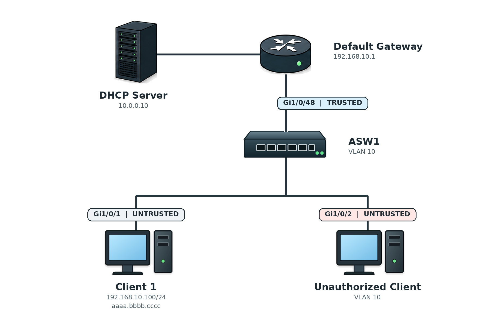

# DHCP Snooping / DAI / IP Source Guard

## 개념

DHCP Snooping, DAI(Dynamic ARP Inspection)및 IP Source Guard는 Access Switch에 연결된 사용자가 IP Address를 위조하거나 다른 사용자의 통신을 가로채는 것을 방지하는 Layer 2 보안 기능이다.

### DHCP Snooping

DHCP Snooping은 DHCP Packet을 확인하여 허가되지 않은 DHCP Server가 Client에게 잘못된 IP Address를 할당하지 못하도록 차단하는 기능이다.

DHCP Server 또는 DHCP Relay 방향의 Interface는 Trusted Port로 설정하고, Client가 연결된 Interface는 Untrusted Port로 사용한다.

Client Port에서 들어오는 DHCP Offer와 ACK 같은 DHCP Server Message는 차단하고, 정상적인 DHCP Server 방향에서 들어오는 Message만 허용한다.

### Rogue DHCP Server

Rogue DHCP Server는 관리자가 허가하지 않은 DHCP Server이다.

공격자가 Rogue DHCP Server를 연결하면 Client에게 공격자의 IP Address를 Default Gateway나 DNS Server로 전달할 수 있다.
```
정상 Default Gateway: 192.168.10.1
공격자가 전달한 Gateway: 192.168.10.200
```

### Trusted Port와 Untrusted Port

DHCP Snooping은 Global Mode에서 활성화한 후 적용할 VLAN을 지정해야 동작한다. DHCP Snooping이 적용된 VLAN의 모든 Port는 기본적으로 Untrusted 상태이며, 정상적인 DHCP Server 방향의 Port에는 Trusted 설정을 해야 한다. 
```
SW1(config)# ip dhcp snooping
SW1(config)# ip dhcp snooping vlan 10
```

Trusted Port
- 정상적인 DHCP Server나 DHCP Relay 방향의 Interface이다.
- DHCP Server가 보내는 Offer, ACK 및 NAK Message를 허용한다.
```
SW1(config-if)# ip dhcp snooping trust
```

Untrusted Port
- Client가 연결된 Interface이다.
- 별도의 명령어를 설정하지 않아도 기본적으로 Untrusted 상태이다.
- Untrusted Port에서 DHCP Server Message가 들어오면 차단한다.

### DHCP Rate Limit

DHCP Rate Limit은 Client Port에서 너무 많은 DHCP Packet이 들어오는 것을 제한하는 기능이다.

공격자가 많은 DHCP Request를 전송하여 DHCP Pool의 IP Address를 소진시키는 DHCP Starvation 공격을 막을 수 있다.
```
SW1(config-if)# ip dhcp snooping limit rate 15
```
- `15`: 해당 Interface에서 초당 DHCP Packet을 최대 `15개`까지 허용한다.
- 설정한 Rate를 초과하면 Interface가 Error-Disabled 상태가 될 수 있다.

### ARP Spoofing

ARP Spoofing은 공격자가 다른 장비의 IP Address를 자신의 MAC Address로 속이는 공격이다.
```
정상 Gateway
192.168.10.1 → 1111.2222.3333
```

```
공격자가 보낸 거짓 ARP 정보
192.168.10.1 → dddd.eeee.ffff
```
Client가 거짓 정보를 학습하면 Gateway로 보내야 할 Traffic을 공격자에게 전달할 수 있다.

### DAI

DAI(Dynamic ARP Inspection)는 ARP Packet의 IP Address와 MAC Address가 올바르게 연결되어 있는지 확인하는 기능이다.

DHCP Snooping Binding Table과 ARP Packet의 정보를 비교한다.
```
ARP Packet: 192.168.10.100 = aaaa.bbbb.cccc
Binding Table: 192.168.10.100 = aaaa.bbbb.cccc
결과: 허용
```

정보가 일치하지 않으면 ARP Packet을 차단한다.
```
ARP Packet: 192.168.10.1 = dddd.eeee.ffff
Binding Table: 192.168.10.1 = 1111.2222.3333
결과: 차단
```
공격자는 자신이 Gateway인 것처럼 속이는 가짜 ARP Reply를 사용자에게 전송한다. 이때 Gateway의 MAC Address 대신 공격자의 MAC Address를 알려준다. 사용자의 PC가 잘못된 정보를 ARP Table에 저장하면 Gateway로 보낼 Traffic을 공격자에게 전달한다. 공격자는 이 Traffic을 확인하거나 변경한 후 실제 Gateway로 다시 전달하여 사용자의 통신을 몰래 가로챌 수 있다. 

DAI는 Untrusted Port로 들어오는 ARP Packet의 IP Address와 MAC Address를 DHCP Snooping Binding Table의 정보와 비교하고, 일치하지 않으면 해당 ARP Packet을 차단하여 ARP Spoofing을 이용한 Man-in-the-Middle 공격을 방지한다. Trusted Port로 들어오는 ARP Packet은 검사하지 않는다.  

### IP Source Guard

IP Source Guard는 Client가 보내는 IP Packet의 Source IP Address가 DHCP Snooping Binding Table의 정보와 일치하는지 확인하는 기능이다.
- DHCP Snooping Binding Table은 DHCP Snooping이 설정된 Switch가 가지고 있다.

DHCP Snooping은 DHCP Server가 Client에게 IP Address를 할당하는 과정을 확인하고, IP Address, MAC Address, VLAN 및 Interface 정보를 Binding Table에 자동으로 기록한다. 
```
DHCP Snooping Binding Table

IP Address: 192.168.10.100
MAC Address: aaaa.bbbb.cccc
VLAN: 10
Interface: Gi1/0/1
```

IP Source Guard가 설정된 `Gi1/0/1`에서는 Binding Table에 등록된 `192.168.10.100`을 Source IP Address로 사용하는 Packet만 허용한다.
```
Gi1/0/1에서 들어온 Packet

Source IP: 192.168.10.100
결과: 허용
```

다른 Client의 IP Address를 Source IP Address로 사용하면 Binding Table의 정보와 일치하지 않으므로 차단한다.
```
Gi1/0/1에서 들어온 Packet

Source IP: 192.168.10.200
결과: 차단
```

Client가 Static IP Address를 사용하면 DHCP 할당 기록이 없으므로 관리자가 Binding 정보를 직접 설정해야 한다.
```
SW1(config)# ip source binding aaaa.bbbb.cccc vlan 10 192.168.10.100 interface gi1/0/1
```

Client가 연결된 Interface에서 IP Source Guard를 활성화한다.
```
SW1(config)# interface gi1/0/1
SW1(config-if)# ip verify source
```
IP Source Guard는 Layer 2 Switch Port에서 동작하지만, 보안 검사를 위해 IP Header의 Source IP Address를 확인할 수 있다.

IP Source Guard는 공격자는 다른 Client의 IP Address를 자신의 Source IP Address로 사용하는 IP Spoofing 공격을 방지한다.
- 예를 들어 Server가 `192.168.10.100`의 접근만 허용한다면 공격자는 자신의 Source IP Address를 `192.168.10.100`으로 변경하여 Server에 접근을 시도할 수 있다. 또한 같은 IP Address를 사용하여 IP 충돌을 발생시키고 정상 Client의 통신을 방해할 수도 있다.  

### 세 기능의 차이

DHCP Snooping
- 검사 대상: DHCP Packet
- 방지하는 공격: Rogue DHCP Server 및 DHCP Starvation
- 주요 역할: Binding Table 생성

DAI
- 검사 대상: ARP Packet
- 방지하는 공격: ARP Spoofing 및 ARP Poisoning
- 확인 정보: IP Address와 MAC Address

IP Source Guard
- 검사 대상: IP Packet
- 방지하는 공격: IP Spoofing
- 확인 정보: Source IP Address, MAC Address, VLAN 및 Interface

---

## 동작 원리

### DHCP Snooping 동작 과정

1\. Client가 DHCP Discover Message를 전송한다.

2\. SW1은 Client Port가 Untrusted Port인지 확인한다.

3\. DHCP Discover는 Client가 보내는 Message이므로 정상적으로 전달한다.

4\. 정상 DHCP Server가 DHCP Offer Message를 전송한다.

5\. DHCP Offer가 Trusted Port로 들어오면 Client에게 전달한다.

6\. Client가 IP Address를 할당받으면 SW1은 IP Address, MAC Address, VLAN 및 Interface 정보를 Binding Table에 저장한다.

7\. Untrusted Port에서 DHCP Offer나 ACK가 들어오면 Rogue DHCP Server가 보낸 Message로 판단하여 차단한다.

### DAI 동작 과정

1\. Client가 ARP Request 또는 ARP Reply를 Switch로 전송한다.

2\. SW1은 ARP Packet이 들어온 Interface가 Trusted Port인지 Untrusted Port인지 확인한다.

3\. Trusted Port에서 들어온 ARP Packet은 검사하지 않고 전달한다.

4\. Untrusted Port에서 들어온 ARP Packet은 SW1에 저장된 DHCP Snooping Binding Table과 비교한다.
```
ARP Packet

IP Address: 192.168.10.100
MAC Address: aaaa.bbbb.cccc
VLAN: 10
Interface: Gi1/0/1
```
5\. ARP Packet의 IP Address, MAC Address, VLAN 및 Interface가 Binding Table의 정보와 일치하면 정상적인 ARP Packet으로 판단하여 전달한다.

6\. 정보가 일치하지 않으면 ARP Spoofing으로 판단하여 해당 ARP Packet을 차단하고 Log를 남긴다.

### IP Source Guard 동작 과정

1\. Client가 DHCP Server에서 IP Address를 할당받는다.

2\. DHCP Snooping이 DHCP 할당 과정을 확인하고 Client 정보를 SW1의 Binding Table에 저장한다.
```
DHCP Snooping Binding Table

IP Address: 192.168.10.100
MAC Address: aaaa.bbbb.cccc
VLAN: 10
Interface: Gi1/0/1
```
3\. Client가 `Gi1/0/1`을 통해 IP Packet을 전송한다.

4\. IP Source Guard는 Packet의 Source IP Address가 `Gi1/0/1`과 VLAN 10에 등록된 Binding 정보와 일치하는지 확인한다.

5\. Source IP Address가 `192.168.10.100`이면 정상적인 Client의 Packet으로 판단하여 전달한다.

6\. Packet의 Source IP Address가 Packet이 들어온 Interface에 등록된 Binding 정보와 일치하지 않으면 해당 Packet을 차단한다.  

---

## 예시 및 구성

### 사내 Client Network 보호

`MASON` 회사는 VLAN `10`을 업무용 Client Network로 사용하고 있다.

공격자가 허가되지 않은 DHCP Server를 연결하거나 Gateway의 IP Address를 위조하면 Client의 통신이 중단되거나 Traffic이 공격자에게 전달될 수 있다.

관리자는 ASW1에 DHCP Snooping, DAI 및 IP Source Guard를 설정하여 Client Network를 보호한다.



### DHCP Snooping 구성

1\. DHCP Snooping을 활성화하고 VLAN `10`에 적용한다.
```
ASW1(config)# ip dhcp snooping
ASW1(config)# ip dhcp snooping vlan 10
```
- `ip dhcp snooping`: DHCP Snooping 기능을 활성화한다.
- `ip dhcp snooping vlan 10`: VLAN `10`의 DHCP Packet을 검사한다.

2\. 정상 DHCP Server 방향의 Uplink를 Trusted Port로 설정한다.
```
ASW1(config)# interface gi1/0/48
ASW1(config-if)# description UPLINK_TO_DHCP_SERVER
ASW1(config-if)# ip dhcp snooping trust
ASW1(config-if)# exit
```

3\. Client Interface에 DHCP Rate Limit을 설정한다.
```
ASW1(config)# interface range gi1/0/1-2
ASW1(config-if-range)# ip dhcp snooping limit rate 15
ASW1(config-if-range)# exit
```

### DAI 구성

1\. VLAN `10`에 DAI를 활성화한다.
```
ASW1(config)# ip arp inspection vlan 10
```

2\. 정상적인 Switch와 Gateway 방향의 Uplink를 DAI Trusted Port로 설정한다.
```
ASW1(config)# interface gi1/0/48
ASW1(config-if)# ip arp inspection trust
ASW1(config-if)# exit
```

### IP Source Guard 구성

Client Interface에 IP Source Guard를 설정한다.
```
ASW1(config)# interface range gi1/0/1-2
ASW1(config-if-range)# ip verify source
ASW1(config-if-range)# exit
```

Source IP Address와 MAC Address를 모두 검사하려면 다음과 같이 설정한다.
```
ASW1(config-if)# ip verify source mac-check
```

### Static IP Address를 사용하는 Client

Static IP Address를 사용하는 Client는 DHCP 과정을 거치지 않으므로 DHCP Snooping Binding Table에 정보가 자동으로 생성되지 않는다.

IP Source Guard를 사용한다면 Static Binding을 직접 설정한다.
```
ASW1(config)# ip source binding aaaa.bbbb.cccc vlan 10 192.168.10.10 interface gi1/0/10
```


DAI에서 Static IP Address를 사용하는 Client의 ARP Packet을 허용하려면 ARP ACL을 설정할 수 있다.
```
ASW1(config)# arp access-list STATIC-ARP
ASW1(config-arp-nacl)# permit ip host 192.168.10.10 mac host aaaa.bbbb.cccc
ASW1(config-arp-nacl)# exit

ASW1(config)# ip arp inspection filter STATIC-ARP vlan 10
```

## 확인 명령어

DHCP Snooping 설정을 확인한다.
```
ASW1# show ip dhcp snooping
```

DHCP Snooping Binding Table을 확인한다.
```
ASW1# show ip dhcp snooping binding
```

DHCP Snooping Packet 통계를 확인한다.
```
ASW1# show ip dhcp snooping statistics
```

DAI 설정과 상태를 확인한다.
```
ASW1# show ip arp inspection vlan 10
ASW1# show ip arp inspection interfaces
ASW1# show ip arp inspection statistics vlan 10
```

IP Source Guard 설정을 확인한다.
```
ASW1# show ip verify source
ASW1# show ip verify source interface gi1/0/1
```

Static Binding을 포함한 IP Source Binding Table을 확인한다.
```
ASW1# show ip source binding
```

## Troubleshooting

### DHCP Snooping, DAI 또는 IP Source Guard 적용 후 Client가 통신하지 못하는 경우

1\. DHCP Snooping이 전역과 Client VLAN에 모두 활성화되어 있는지 확인한다.
```
ASW1# show ip dhcp snooping
```

다음 두 설정이 모두 필요하다.
```
ASW1(config)# ip dhcp snooping
ASW1(config)# ip dhcp snooping vlan 10
```

2\. 정상 DHCP Server 방향의 Interface가 Trusted Port인지 확인한다.
```
ASW1# show ip dhcp snooping
ASW1# show running-config interface gi1/0/48
```

Trusted 설정이 없다면 DHCP Server의 Offer와 ACK가 차단될 수 있다.
```
ASW1(config)# interface gi1/0/48
ASW1(config-if)# ip dhcp snooping trust
```

3\. Client의 DHCP Snooping Binding이 생성되어 있는지 확인한다.
```
ASW1# show ip dhcp snooping binding
```

Binding이 없다면 DAI와 IP Source Guard가 Client Traffic을 차단할 수 있다.

Client에서 IP Address를 다시 할당받아 Binding을 생성한다.
```
C:\> ipconfig /release
C:\> ipconfig /renew
```

4\. Static IP Address를 사용하는 Client인지 확인한다.

5\. DAI가 정상적인 ARP Packet을 차단하고 있는지 확인한다.
```
ASW1# show ip arp inspection statistics vlan 10
ASW1# show logging
```
- DHCP Snooping Binding이 없는지 확인한다.
- Client의 IP Address와 MAC Address가 Binding Table과 일치하는지 확인한다.
- Uplink에 필요한 DAI Trust 설정이 있는지 확인한다.

6\. IP Source Guard가 Client Interface에 적용되어 있는지 확인한다.
```
ASW1# show ip verify source interface gi1/0/1
ASW1# show ip source binding
```
Client의 IP Address, MAC Address, VLAN 및 Interface가 Binding 정보와 일치해야 한다.

7\. DHCP 또는 ARP Rate Limit을 초과하여 Interface가 Error-Disabled 상태인지 확인한다.
```
ASW1# show interfaces status err-disabled
ASW1# show errdisable recovery
```

## 주요 질문

DHCP Snooping은 무엇을 차단하는가?
- Untrusted Port에서 들어오는 허가되지 않은 DHCP Server의 Offer, ACK 및 NAK Message를 차단한다.

Trusted Port는 어디에 설정하는가?
- 정상 DHCP Server나 DHCP Relay로 향하는 Interface에 설정한다.

DAI는 무엇을 방지하는가?
- IP Address와 MAC Address를 속이는 ARP Spoofing과 ARP Poisoning을 방지한다.

IP Source Guard는 무엇을 방지하는가?
- Client가 다른 장비의 IP Address를 Source IP Address로 사용하는 IP Spoofing을 방지한다.
