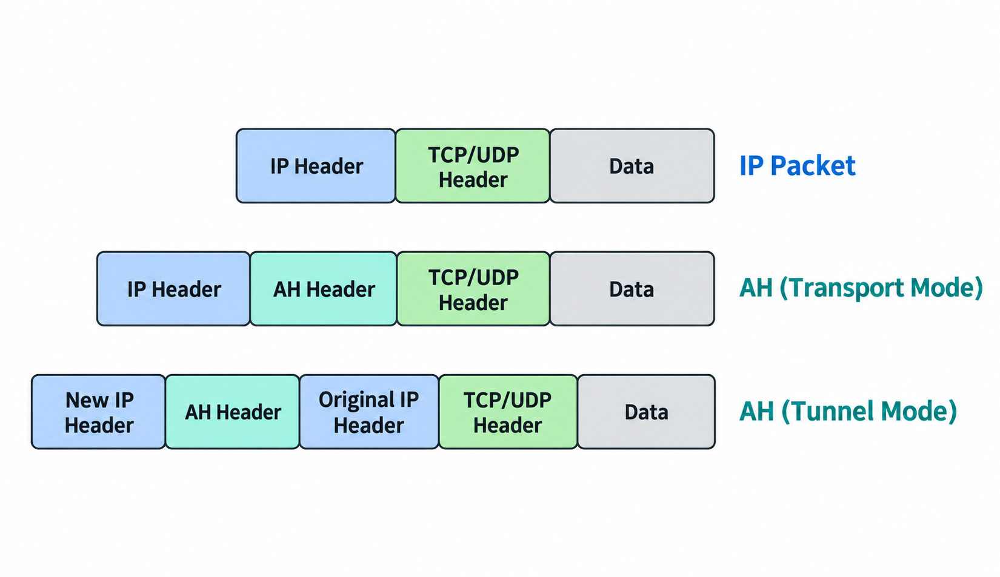
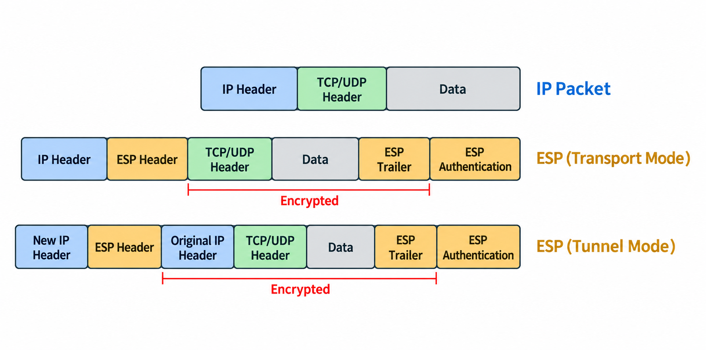
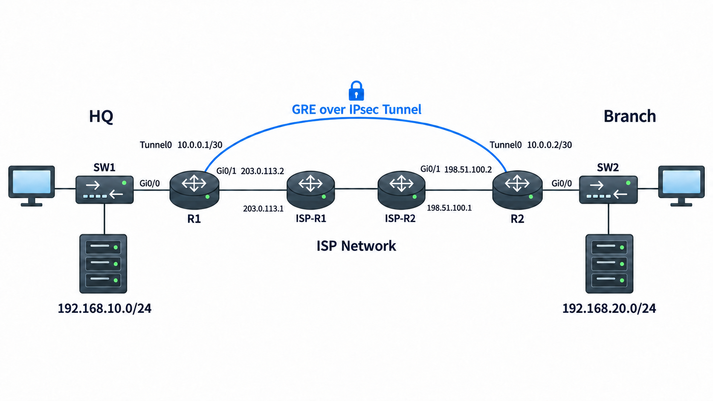

# GRE Tunnel / IPsec / Site-to-Site VPN

## 개념

### VPN

VPN(Virtual Private Network)은 Internet과 같은 공용 Network를 통해 멀리 떨어진 Network를 안전하게 연결하는 기술이다.

### Site-to-Site VPN

Site-to-Site VPN은 ISP가 제공하는 Internet을 통해 본사와 지사처럼 서로 떨어진 두 Network를 Router나 Firewall로 안전하게 연결하는 방식이다.

일반적인 IPsec Tunnel Mode에서는 VPN 장비가 원본 Packet을 암호화하고 새로운 Outer IP Header를 추가한다.
- 기업에서는 일반적으로 Firewall이나 Router가 VPN 장비 역할을 수행하며, Site-to-Site VPN은 주로 Firewall에 구성한다.

ISP Router는 Outer Destination IP Address를 기준으로 Packet을 상대방 VPN 장비까지 Forwarding한다. 원본 Packet의 내부 IP Address, Port Number 및 Data는 ESP로 암호화되어 있기 때문에 확인할 수 없다.

### GRE Tunnel

GRE(Generic Routing Encapsulation)는 원본 Packet에 GRE Header와 새로운 IP Header를 추가하여 다른 Network로 전달하는 Tunneling Protocol이다.
```
New IP Header | GRE Header | Original IP Packet
```
GRE Tunnel을 생성하면 물리적으로 떨어진 두 Router의 Tunnel Interface를 하나의 가상 Point-to-Point Link로 연결할 수 있다.

물리적으로 Packet은 여러 ISP Router를 통해 전달된다. ISP Router는 새로운 Outer IP Header의 Destination IP Address만 확인하여 GRE Packet을 상대방 Router까지 Forwarding한다.

상대방 Router는 Outer IP Header의 Source와 Destination IP Address, GRE Protocol Number를 자신의 Tunnel 설정과 비교한다. 정보가 일치하면 Outer IP Header와 GRE Header를 제거하고, 내부의 원본 Packet을 Tunnel Interface에서 수신한 것으로 처리한다.
- 따라서 실제로는 ISP Network를 통과하지만, 원본 Packet을 처리하는 Overlay Network에서는 두 Router의 Tunnel Interface가 직접 연결된 것처럼 동작한다.

GRE Tunnel은 물리적으로 멀리 떨어진 두 Router를 가상의 Point-to-Point Link로 연결하고 Routing Protocol의 Hello Message를 전달할 수 있기 때문에, 두 Router는 OSPF나 EIGRP Neighbor를 형성할 수 있다.  

GRE 자체는 Packet을 암호화하지 않기 때문에 보안이 필요한 경우 GRE over IPsec을 구성한다. IPsec Tunnel Mode에서는 GRE Packet을 암호화하고 새로운 Outer IP Header를 추가한다. ISP Router들은 Outer IP Header를 확인하여 Packet을 Forwarding하며, 내부 IP Address, Routing Protocol Message 및 Data는 암호화되어 있기 때문에 확인할 수 없다.
- GRE는 IP Protocol Number `47`을 사용한다.

### Underlay와 Overlay

Underlay Network는 GRE Packet을 실제로 전달하는 물리적인 Network이다.

Overlay Network는 GRE Tunnel을 통해 논리적으로 연결된 가상의 Network이다.
```
Underlay: R1과 R2의 Public IP Address를 연결하는 Internet 경로
Overlay: R1과 R2의 Tunnel Interface를 연결하는 가상 경로
```
GRE Tunnel이 동작하려면 먼저 Underlay Network를 통해 상대방 Tunnel Destination까지 통신할 수 있어야 하며, 이후 그 위에 Overlay Network를 구축할 수 있다.

### GRE Overhead와 MTU

기본 GRE Encapsulation은 새로운 IP Header `20 Byte`와 GRE Header `4 Byte`를 추가한다.

따라서 기본적으로 총 `24Byte`의 Overhead가 발생한다.
```
Original Packet: 1500Byte
GRE Overhead: 24Byte
최종 Packet: 1524Byte
```
Ethernet을 사용하는 Underlay Network의 MTU는 일반적으로 `1500 Byte`이다. 원본 Packet에 GRE Header와 새로운 IP Header를 포함한 `24 Byte`가 추가되면 Ethernet MTU를 초과하여 Fragmentation이 발생할 수 있다. 따라서 GRE Tunnel Interface의 MTU를 `1476 Byte`로 조정하여 Fragmentation을 줄일 수 있다.
```
R1(config-if)# ip mtu 1476
R1(config-if)# ip tcp adjust-mss 1436
```
- `ip mtu 1476`: Ethernet MTU `1500 Byte`에서 GRE Encapsulation으로 추가되는 새로운 IP Header `20 Byte`와 GRE Header `4 Byte`를 제외한 값이다.
- `ip tcp adjust-mss 1436`: Tunnel MTU `1476 Byte`에서 기본 IPv4 Header `20 Byte`와 TCP Header `20 Byte`를 제외한 값이다.
```
Data 1436 Byte
→ TCP Header 20 Byte 추가
= TCP Segment 1456 Byte

→ Original IP Header 20 Byte 추가
= Original IP Packet 1476 Byte

→ GRE Header 4 Byte + New Outer IP Header 20 Byte 추가
= Total GRE Packet 1500 Byte
```

### Recursive Routing

Recursive Routing은 GRE Tunnel Destination으로 가는 경로가 다시 GRE Tunnel Interface를 가리키는 문제이다.

여기서 Tunnel Destination은 상대방 Router의 Tunnel Interface IP Address가 아니라, GRE Packet을 실제로 전달할 상대방 Router의 WAN IP Address이다.

예를 들어 R1의 Tunnel Destination이 `198.51.100.2`인 경우, R1은 해당 IP Address로 가는 경로를 Routing Table에서 확인한다. 정상적인 경우에는 물리적인 WAN Interface를 통해 ISP로 Packet을 전달해야 한다.

그러나 Dynamic Routing Protocol을 통해 `198.51.100.2`로 가는 경로를 `Tunnel0`으로 학습하면, GRE Tunnel을 생성하기 위해 다시 GRE Tunnel을 사용하려는 문제가 발생한다.

이를 방지하기 위해 Tunnel 내부에서는 본사와 지사의 내부 LAN Network만 광고하고, Tunnel Destination의 Public IP Address와 Underlay Network는 광고하지 않아야 한다.

가장 확실한 방법은 Tunnel Destination에 대한 `/32` Static Route를 설정하여 해당 Traffic이 물리적인 WAN Interface를 통해 전달되도록 하는 것이다.

### IPsec

IPsec(Internet Protocol Security)은 IP Packet을 암호화하고 인증하여 안전하게 전달하는 기술이다.

IPsec은 다음 보안 기능을 제공한다.
- Authentication(인증): 신뢰할 수 있는 VPN Peer인지 확인한다.
- Integrity(무결성): 전송 중 Packet이 변경되거나 조작되지 않았는지 확인한다.
- Confidentiality(기밀성): Packet 내용을 암호화하여 다른 장비가 확인하지 못하도록 한다.
- Anti-Replay(재전송 공격 방지): 공격자가 이전 Packet을 다시 전송하는 것을 방지한다.

### AH

AH(Authentication Header)는 Packet의 인증과 무결성을 제공하지만 암호화는 제공하지 않는다.
- 무결성은 Packet이 전송되는 중간에 변경되거나 조작되지 않았는지 확인하는 기능이다.
- Packet을 암호화하지 않기 때문에 TCP/UDP Header와 Data의 내용을 확인할 수 있다.


- AH Transport Mode에서는 기존 IP Header와 TCP/UDP Header 사이에 AH Header가 추가된다.
- AH Tunnel Mode에서는 원본 IP Packet 앞에 AH Header와 새로운 IP Header가 추가된다.
- AH는 IP Protocol Number `51`을 사용한다.

AH는 Data와 IP Header 일부의 무결성을 확인한다. 하지만 NAT 장비가 Source 또는 Destination IP Address를 변경하면 AH의 무결성 확인에 실패할 수 있기 때문에 NAT와 함께 사용하기 어렵다.

### ESP

ESP(Encapsulating Security Payload)는 Packet의 암호화, 인증 및 무결성을 제공한다.


- ESP Header는 암호화된 Data 앞에 추가되고, ESP Trailer와 ESP Authentication 정보는 뒤에 추가된다.
- ESP Transport Mode에서는 기존 IP Header를 유지하고 TCP/UDP Header와 Data를 암호화한다.
- ESP Tunnel Mode에서는 원본 IP Packet 전체를 암호화하고 새로운 IP Header를 추가한다.
- ESP는 IP Protocol Number `50`을 사용한다.

일반적인 IPsec VPN에서는 암호화를 제공하지 않는 AH보다 암호화와 무결성을 함께 제공하는 ESP를 사용한다.

### Transport Mode

Transport Mode는 기존 IP Header를 유지하고 IP Packet의 Payload를 보호하는 방식이다.

기존 IP Header는 암호화되지 않기 때문에 Router는 Source와 Destination IP Address를 확인하여 Packet을 Forwarding할 수 있다.

### Tunnel Mode

Tunnel Mode는 원본 IP Packet 전체를 보호하고 새로운 Outer IP Header를 추가하는 방식이다.

새로운 Outer IP Header에는 VPN 장비의 Public IP Address가 Source와 Destination으로 설정된다.

ISP Router는 새로운 Outer IP Header의 Destination IP Address를 확인하여 상대방 VPN 장비까지 Packet을 Forwarding한다. 원본 IP Address, TCP/UDP Header 및 Data는 ESP로 암호화되어 있기 때문에 확인할 수 없다.

일반적인 Site-to-Site IPsec VPN에서는 서로 다른 Network의 원본 IP Packet 전체를 보호하기 위해 주로 Tunnel Mode를 사용한다.

### IKE

IKE(Internet Key Exchange)는 본사와 지사의 Router 또는 Firewall 같은 두 VPN Peer가 서로를 인증하고, IPsec에서 사용할 암호화 방식과 Key를 협상하는 Protocol이다.

IKE가 실제 Data Traffic을 직접 암호화하는 것은 아니다. IKE는 안전한 통신에 필요한 SA와 Key를 생성하고 이후 ESP가 실제 Data Traffic을 보호한다.
- SA(Security Association): VPN Peer 사이에서 사용할 암호화 방식, Key 및 Lifetime 등을 정한 정보이다.

IKE는 IPsec VPN을 구성하기 위해 VPN Peer를 인증하고 암호화 방식과 Key를 협상하는 Protocol이다. 실제 Data Traffic은 IKE가 생성한 IPsec SA를 사용하여 ESP가 암호화하고 보호한다.

IKE
- 어떤 암호화 방식을 사용할지 협상
- VPN Peer를 인증
- 암호화에 사용할 Key와 SA를 생성
- IKE 협상 Message를 보호
```
Encryption: AES-256
Integrity: SHA-256
DH Group: 14
Authentication: Pre-Shared Key
```

ESP
- IKE가 협상한 암호화 방식과 Key를 사용
- 실제 사용자의 Data Packet을 암호화

### IKEv1

IKEv1은 Phase 1과 Phase 2 두 단계로 동작한다.

1\. Phase 1에서는 VPN Peer가 서로를 인증하고 IKE SA를 생성한다.

Phase 1에서는 다음 정보를 협상한다.
- Encryption: IKE Message를 암호화할 방식을 결정한다.
- Hash: IKE Message가 변경되었는지 확인할 방식을 결정한다.
- Authentication: PSK 또는 Certificate를 사용하여 VPN Peer를 인증한다.
- DH Group: VPN Peer가 안전하게 Key를 생성할 방식을 결정한다.
- Lifetime: IKE SA를 유지할 시간을 결정한다.

2\. Phase 2에서는 실제 Data Traffic을 보호하는 IPsec SA를 생성한다.

Phase 2에서는 Phase 1에서 생성한 안전한 연결을 통해 다음 정보를 협상한다.
- Crypto ACL: IPsec으로 보호할 Traffic을 결정한다.
- Transform Set: ESP에서 사용할 암호화 및 무결성 확인 방식을 결정한다.
- PFS: 새로운 DH Key를 생성하여 기존 Key와 독립된 Key를 사용한다.
- Lifetime: IPsec SA를 유지할 시간을 결정한다.

### IKEv2

IKEv2는 IKEv1보다 적은 메시지를 사용하여 SA를 생성하며 안정성과 보안 기능이 향상된 Version이다.

IKEv1의 Phase 1과 Phase 2 구조를 그대로 사용하지 않으며 IKEv1과 호환되지 않는다.

따라서 양쪽 VPN Peer는 같은 IKE Version을 사용해야 한다.

최신 환경에서는 일반적으로 IKEv2 사용을 권장한다.

### Pre-Shared Key

Pre-Shared Key는 양쪽 VPN 장비에 동일하게 설정하여 VPN Peer를 인증하는 Password이다.

### Certificate

Certificate는 CA(Certificate Authority)가 발급한 인증서를 사용하여 VPN Peer를 인증하는 방식이다.

### PFS

PFS(Perfect Forward Secrecy)는 IKE Phase 2에서 새로운 DH Key를 생성하는 기능이다.

PFS는 IPsec SA마다 서로 다른 Key를 생성하여 하나의 Key가 노출되어도 다른 IPsec SA의 암호화된 Traffic을 확인하지 못하도록 한다.

### Transform Set

Transform Set은 IPsec에서 사용할 Protocol, 암호화 방식, 무결성 방식 및 Mode를 지정한다.
```
R1(config)# crypto ipsec transform-set GRE-SET esp-aes 256 esp-sha256-hmac
R1(cfg-crypto-trans)# mode transport
```
양쪽 VPN Peer의 Transform Set은 서로 호환되어야 한다.

### Crypto ACL

Crypto ACL은 IPsec으로 보호할 Traffic을 선택한다.

Crypto ACL에서 선택된 Traffic을 Interesting Traffic이라고 한다.

일반적인 Site-to-Site IPsec VPN에서는 내부 Data Traffic을 보호한다.
```
R1(config)# access-list 110 permit ip 192.168.10.0 0.0.0.255 192.168.20.0 0.0.0.255
```

GRE over IPsec에서는 원본 Data Traffic을 GRE로 Encapsulation한 후, 두 VPN Peer의 Public IP Address 사이에서 전달되는 GRE Traffic을 IPsec으로 보호한다.  
```
R1(config)# access-list 110 permit gre host 203.0.113.2 host 198.51.100.2
```

### Policy-Based VPN

Policy-Based VPN은 Crypto ACL로 IPsec으로 보호할 Traffic을 선택하고 Crypto Map을 WAN Interface에 적용하는 방식이다.

내부 Network가 추가되면 Crypto ACL과 상대방 VPN 설정도 함께 수정해야 한다.

### Route-Based VPN

Route-Based VPN은 VTI(Virtual Tunnel Interface)와 같은 Tunnel Interface를 생성하고 Routing Table을 이용하여 VPN으로 보낼 Traffic을 결정한다.
```
Policy-Based VPN: Crypto ACL로 VPN Traffic 선택
Route-Based VPN: Routing Table로 Tunnel Interface 선택
```

### NAT-T

NAT-T(NAT Traversal)는 두 VPN Peer 사이에 NAT 장비가 있을 때 ESP Packet을 UDP로 Encapsulation하여 전달하는 기능이다.

IKE는 UDP Port `500`으로 통신을 시작하고, 중간에 NAT 장비가 확인되면 일반적으로 UDP Port `4500`을 사용한다.
```
일반 IPsec
IP Header | ESP | 암호화된 Packet

NAT-T
IP Header | UDP 4500 | ESP | 암호화된 Packet
```
NAT-T는 ESP Packet을 UDP Port `4500`으로 Encapsulation하여 VPN Peer 사이에 NAT 장비가 있어도 IPsec Traffic을 정상적으로 구분하고 전달할 수 있게 해준다.

### NAT Exemption

NAT Exemption은 VPN으로 전달할 내부 Traffic이 일반 NAT/PAT로 변환되지 않도록 제외하는 설정이다.

예를 들어 Crypto ACL이 다음 Traffic을 선택한다고 가정한다.
```
192.168.10.0/24 → 192.168.20.0/24
```
PAT로 Source IP Address가 Public IP Address로 변경되면 Crypto ACL 또는 상대방 VPN 설정과 일치하지 않을 수 있다.

따라서 일반적인 Policy-Based Site-to-Site VPN에서는 내부 VPN Traffic을 NAT/PAT 대상에서 제외해야 한다.
```
NAT-T: VPN Peer 사이의 NAT 장비를 통과하기 위해 사용한다.
NAT Exemption: 내부 VPN Traffic이 NAT되지 않도록 제외한다.
```

### GRE over IPsec

GRE over IPsec은 GRE의 Tunneling 기능과 IPsec의 보안 기능을 함께 사용하는 방식이다.
- GRE는 가상의 Tunnel Interface를 생성하고 Multicast와 Routing Protocol Traffic을 전달한다.
- IPsec은 GRE Packet을 암호화하고 인증한다.

Packet은 다음 순서로 처리된다.
```
Original Packet
→ GRE Encapsulation
→ IPsec Encryption
→ Internet 전송
```

---

## 동작 원리

### GRE Tunnel 동작 과정

1\. R1은 Routing Table을 확인하고 지사 Network로 가는 Packet을 `Tunnel0`으로 전달한다.

2\. R1은 원본 Packet에 GRE Header와 새로운 IP Header를 추가한다.

3\. 새로운 IP Header에는 R1과 R2의 Public IP Address가 사용된다.

4\. Underlay Network는 새로운 IP Header를 확인하여 GRE Packet을 R2로 전달한다.

5\. R2는 GRE Header를 제거하여 원본 Packet을 확인한다.

6\. R2는 원본 Packet을 지사 내부 Network로 전달한다.

### Site-to-Site IPsec 동작 과정

1\. 본사 사용자가 지사 Network로 Packet을 전송한다.

2\. R1은 Crypto ACL을 확인하여 해당 Packet이 Interesting Traffic인지 확인한다.

3\. IKE SA가 없다면 R1과 R2가 IKE Negotiation을 시작한다.

4\. IKEv1 Phase 1에서 VPN Peer를 인증하고 IKE SA를 생성한다.

5\. IKEv1 Phase 2에서 Transform Set과 Crypto ACL을 협상하고 IPsec SA를 생성한다.

6\. R1은 Packet을 ESP로 암호화하여 Internet으로 전송한다.

7\. R2는 Packet을 Decryption하고 원본 Packet을 지사 Network로 전달한다.

### GRE over IPsec 동작 과정

1\. 본사 PC가 지사 Network로 Packet을 전송한다.

2\. R1은 Packet을 `Tunnel0`으로 전달한다.

3\. 원본 Packet에 GRE Header와 새로운 IP Header를 추가한다.

4\. Crypto ACL이 R1과 R2 사이의 GRE Traffic을 선택한다.

5\. IPsec SA가 없다면 IKE Negotiation을 진행한다.

6\. IKE SA와 IPsec SA가 생성되면 GRE Packet을 ESP로 암호화한다.

7\. 암호화된 Packet을 Underlay Network인 Internet을 통해 R2로 전송한다.

8\. R2는 IPsec을 Decryption하고 GRE Header를 제거한다.

9\. R2는 원본 Packet을 지사 내부 Network로 전달한다.

---

## 예시 및 구성

### 본사와 지사 GRE over IPsec 연결

`MASON` 회사는 본사와 지사 사이의 Network를 ISP를 통해 연결하려고 한다.

관리자는 GRE Tunnel을 사용하여 두 Router 사이에 가상의 Point-to-Point Link를 생성하고, GRE Traffic을 IPsec으로 암호화한다.



### Underlay Route 구성

R1에서 R2의 Tunnel Destination으로 가는 Route를 설정한다.
```
R1(config)# ip route 198.51.100.2 255.255.255.255 203.0.113.1
```

R2에서 R1의 Tunnel Destination으로 가는 Route를 설정한다.
```
R2(config)# ip route 203.0.113.2 255.255.255.255 198.51.100.1
```

해당 Route는 Tunnel Destination이 다시 `Tunnel0`을 사용하는 Recursive Routing을 방지한다.

### R1 GRE Tunnel 구성

```
R1(config)# interface tunnel 0
R1(config-if)# ip address 10.0.0.1 255.255.255.252
R1(config-if)# tunnel source gi0/1
R1(config-if)# tunnel destination 198.51.100.2
R1(config-if)# keepalive 10 3
R1(config-if)# ip mtu 1400
R1(config-if)# ip tcp adjust-mss 1360
R1(config-if)# no shutdown
```

지사 Network로 향하는 Route를 설정한다.
```
R1(config)# ip route 192.168.20.0 255.255.255.0 10.0.0.2
```

### R2 GRE Tunnel 구성
```
R2(config)# interface tunnel 0
R2(config-if)# ip address 10.0.0.2 255.255.255.252
R2(config-if)# tunnel source gi0/1
R2(config-if)# tunnel destination 203.0.113.2
R2(config-if)# keepalive 10 3
R2(config-if)# ip mtu 1400
R2(config-if)# ip tcp adjust-mss 1360
R2(config-if)# no shutdown
```

본사 Network로 향하는 Route를 설정한다.
```
R2(config)# ip route 192.168.10.0 255.255.255.0 10.0.0.1
```

### R1 IKE Phase 1 구성
```
R1(config)# crypto isakmp policy 10
R1(config-isakmp)# encryption aes 256
R1(config-isakmp)# hash sha256
R1(config-isakmp)# authentication pre-share
R1(config-isakmp)# group 14
R1(config-isakmp)# lifetime 86400
R1(config-isakmp)# exit

R1(config)# crypto isakmp key MASON-VPN-KEY address 198.51.100.2
```

### R2 IKE Phase 1 구성

```
R2(config)# crypto isakmp policy 10
R2(config-isakmp)# encryption aes 256
R2(config-isakmp)# hash sha256
R2(config-isakmp)# authentication pre-share
R2(config-isakmp)# group 14
R2(config-isakmp)# lifetime 86400
R2(config-isakmp)# exit

R2(config)# crypto isakmp key MASON-VPN-KEY address 203.0.113.2
```

### R1 IPsec Phase 2 구성

GRE Traffic을 선택하는 Crypto ACL을 생성한다.
```
R1(config)# access-list 110 permit gre host 203.0.113.2 host 198.51.100.2
```

Transform Set과 Crypto Map을 설정한다.
```
R1(config)# crypto ipsec transform-set GRE-SET esp-aes 256 esp-sha256-hmac
R1(cfg-crypto-trans)# mode transport
R1(cfg-crypto-trans)# exit

R1(config)# crypto map GRE-MAP 10 ipsec-isakmp
R1(config-crypto-map)# set peer 198.51.100.2
R1(config-crypto-map)# set transform-set GRE-SET
R1(config-crypto-map)# set pfs group14
R1(config-crypto-map)# match address 110
```

Public Interface에 Crypto Map을 적용한다.
```
R1(config)# interface gi0/1
R1(config-if)# crypto map GRE-MAP
```

### R2 IPsec Phase 2 구성

R2의 Crypto ACL은 R1과 Source 및 Destination이 반대 방향이어야 한다.
```
R2(config)# access-list 110 permit gre host 198.51.100.2 host 203.0.113.2
```

```
R2(config)# crypto ipsec transform-set GRE-SET esp-aes 256 esp-sha256-hmac
R2(cfg-crypto-trans)# mode transport
R2(cfg-crypto-trans)# exit

R2(config)# crypto map GRE-MAP 10 ipsec-isakmp
R2(config-crypto-map)# set peer 203.0.113.2
R2(config-crypto-map)# set transform-set GRE-SET
R2(config-crypto-map)# set pfs group14
R2(config-crypto-map)# match address 110
```

```
R2(config)# interface gi0/1
R2(config-if)# crypto map GRE-MAP
```

---

## 확인 명령어

GRE Tunnel Interface의 상태를 확인한다.
```
R1# show interfaces tunnel 0
R1# show ip interface brief
```

Tunnel Destination이 물리적인 Underlay 경로를 사용하는지 확인한다.
```
R1# show ip route 198.51.100.2
```

IKEv1 SA 상태를 확인한다.
```
R1# show crypto isakmp sa
```

IKEv1 SA가 정상적으로 생성되면 일반적으로 `QM_IDLE` 상태를 확인할 수 있다.

IPsec SA와 암호화 및 복호화 Counter를 확인한다.
```
R1# show crypto ipsec sa
```
- `encaps`: IPsec으로 Encapsulation한 Packet
- `decaps`: IPsec을 Decapsulation한 Packet
- `encrypt`: 암호화한 Packet 
- `decrypt`: 복호화한 Packet

Crypto Map과 Crypto ACL을 확인한다.
```
R1# show crypto map
R1# show access-lists 110
```

---

## Troubleshooting

### GRE over IPsec 통신이 정상적으로 동작하지 않는 경우

1\. 상대방 VPN Peer의 Public IP Address까지 통신할 수 있는지 확인한다.
```
R1# ping 198.51.100.2 source 203.0.113.2
R1# show ip route 198.51.100.2
```

2\. Tunnel Destination으로 가는 Route가 `Tunnel0`이 아닌 물리적인 WAN 경로를 사용하는지 확인한다.
- Tunnel Destination Route가 `Tunnel0`을 사용하면 Recursive Routing이 발생할 수 있다.

3\. GRE Tunnel의 Source와 Destination이 올바르게 설정되어 있는지 확인한다.
```
R1# show running-config interface tunnel 0
R1# show interfaces tunnel 0
```

4\. 상대방 Tunnel IP Address로 통신할 수 있는지 확인한다.
```
R1# ping 10.0.0.2
```

5\. 양쪽 Router의 IKE Version과 IKE Phase 1 설정이 서로 호환되는지 확인한다.
- Encryption
- Hash
- Authentication
- DH Group
- Lifetime
- Pre-Shared Key
```
R1# show crypto isakmp policy
R1# show crypto isakmp sa
```

6\. 양쪽 Router의 Transform Set, IPsec Mode 및 PFS 설정이 서로 호환되는지 확인한다.
```
R1# show crypto ipsec transform-set
```

7\. Crypto ACL의 Source와 Destination이 양쪽에서 서로 반대 방향으로 설정되어 있는지 확인한다.
```
R1# show access-lists 110
```

8\. Crypto Map이 Public Interface에 적용되어 있는지 확인한다.
```
R1# show crypto map
R1# show running-config interface gi0/1
```

9\. 실제 Traffic을 발생시킨 후 IPsec Counter가 증가하는지 확인한다.
```
R1# ping 192.168.20.1 source 192.168.10.1
R1# show crypto ipsec sa
```

10\. 일반적인 Policy-Based Site-to-Site VPN이라면 VPN Traffic이 NAT/PAT 대상에서 제외되어 있는지 확인한다.

11\. VPN Peer 사이에 NAT 장비가 있다면 NAT-T가 동작하는지 확인한다.

12\. 중간 Firewall에서 필요한 Protocol과 Port를 허용하는지 확인한다.
- IKE: UDP Port `500`
- NAT-T: UDP Port `4500`
- ESP: IP Protocol Number `50`

---

## 주요 질문

GRE란 무엇인가?
- 원본 Packet에 GRE Header와 새로운 IP Header를 추가하여 서로 떨어진 Router를 가상의 Point-to-Point Link로 연결하는 Tunneling Protocol이다.

Underlay와 Overlay의 차이는 무엇인가?
- Underlay는 GRE Packet을 실제로 전달하는 물리 Network이고, Overlay는 GRE Tunnel을 통해 생성된 논리적인 Network이다.

GRE는 Traffic을 암호화하는가?
- GRE는 암호화와 인증 기능을 제공하지 않으므로 보안이 필요하면 IPsec과 함께 사용해야 한다.

GRE에서 Recursive Routing이 발생하는 이유는 무엇인가?
- Tunnel Destination으로 가는 Route가 다시 Tunnel Interface를 가리키기 때문에 발생한다.

GRE와 IPsec을 함께 사용하는 이유는 무엇인가?
- GRE를 통해 Multicast와 Routing Protocol Traffic을 전달하고 IPsec을 통해 GRE Traffic을 암호화하기 위해 사용한다.

IPsec은 어떤 보안 기능을 제공하는가?
- VPN Peer 인증, Packet 무결성, 기밀성 및 Anti-Replay 기능을 제공한다.

AH와 ESP의 차이는 무엇인가?
- AH는 인증과 무결성을 제공하지만 암호화하지 않으며, ESP는 인증, 무결성 및 암호화를 제공한다.

Transport Mode와 Tunnel Mode의 차이는 무엇인가?
- Transport Mode는 기존 IP Header를 유지하고 Payload를 보호하며, Tunnel Mode는 원본 IP Packet 전체를 보호하고 새로운 IP Header를 추가한다.

GRE over IPsec에서 MTU와 MSS를 조정하는 이유는 무엇인가?
- GRE와 IPsec Header가 추가되어 Packet 크기가 증가하므로 Fragmentation이나 Packet Drop을 줄이기 위해 조정한다.
