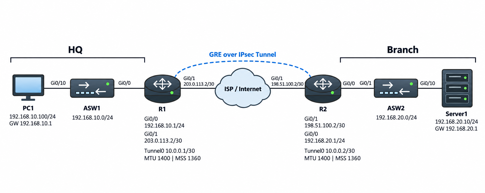

# MTU / MSS / Fragmentation / PMTUD

## 개념

### MTU

MTU(Maximum Transmission Unit)는 Interface가 Fragmentation 없이 한 번에 전송할 수 있는 최대 Packet 크기이다.

일반적인 Ethernet Network의 기본 MTU는 `1500 Byte`이다.

### Ethernet MTU

Ethernet MTU는 Ethernet Frame에 포함할 수 있는 최대 Payload 크기이다.

Ethernet Header와 FCS는 Ethernet MTU에 포함되지 않지만, Ethernet Payload에 들어가는 IP Header, TCP/UDP Header 및 Data는 포함된다.
```
Ethernet Frame = Ethernet Header + Ethernet Payload(IP Header + TCP/UDP Header + Data) + FCS
```
기본 Ethernet MTU가 `1500 Byte`인 경우 실제 Frame 크기는 다음과 같다.
```
일반 Ethernet Frame: 1518 Byte
802.1Q VLAN Tag 포함: 1522 Byte
```
- Ethernet Header: `14 Byte`
- Ethernet Payload: `1500 Byte`
- FCS: `4 Byte`
- 802.1Q VLAN Tag: `4 Byte`

### IP MTU

IP MTU는 Fragmentation 없이 전송할 수 있는 최대 IP Packet 크기이다.

IP MTU에는 IP Header와 IP Payload가 포함된다.
```
IP Packet = IP Header + IP Payload
```

IP MTU가 `1500 Byte`이고 IPv4 Header가 `20 Byte`인 경우 IP Payload는 최대 `1480 Byte`이다.
```
IP MTU: 1500 Byte
IPv4 Header: 20 Byte
IP Payload: 1480 Byte
```

IP Packet은 Ethernet Frame의 Payload로 Encapsulation되므로 실제로 전송하려면 IP MTU가 Ethernet MTU를 초과하지 않아야 한다.

### MTU 크기의 장점과 단점

MTU를 크게 설정하면 하나의 Frame에 더 많은 Data를 포함할 수 있다.

따라서 전송해야 하는 Frame 수와 Header Overhead가 줄어들어 Network를 효율적으로 사용할 수 있다.

하지만 다음과 같은 단점도 있다.
- 큰 Packet을 전송하는 동안 다른 Packet이 Queue에서 더 오래 기다릴 수 있다.
- 큰 Packet이 손실되면 더 많은 Data를 다시 전송해야 한다.
- 경로에 MTU가 작은 장비가 있으면 Packet Drop이나 Fragmentation이 발생할 수 있다.
- 경로의 모든 장비가 같은 크기의 MTU를 지원해야 한다.

### Jumbo Frame

Jumbo Frame은 일반적인 Ethernet MTU인 `1500 Byte`보다 큰 Frame을 의미하며, 보통 `9000 Byte` 또는 `9216 Byte` 정도의 MTU를 사용한다.
- Jumbo Frame: 일반적으로 `9000~9216 Byte` 정도의 MTU를 사용하는 Frame이다.
- Super Jumbo Frame: 일반적인 Jumbo Frame보다 더 큰 Frame을 의미한다.
- Baby Giant Frame: `1500 Byte`보다 크지만 일반적인 Jumbo Frame보다 작은 Frame을 의미한다.

Jumbo Frame을 사용하려면 Source부터 Destination까지 경로에 있는 모든 Switch, Router 및 Server가 해당 MTU를 지원해야 한다.

### Path MTU

Path MTU는 Source에서 Destination까지의 전체 경로에서 가장 작은 MTU이다.
```
Client → MTU 1500 → MTU 1400 → MTU 1500 → Server
Path MTU: 1400 Byte
```
Source가 Fragmentation 없이 Packet을 전송하려면 가장 작은 MTU에 맞춰 Packet 크기를 최대 `1400 Byte`로 줄여야 한다.

`1500 Byte` Packet을 보내면 `DF` Bit에 따라 다음과 같이 처리된다.
```
DF = 0 → Router가 Fragmentation하여 전달
DF = 1 → Packet을 Drop하고 ICMP Message 전송
```
PMTUD는 ICMP Message를 이용하여 Path MTU를 확인하고 Source가 Packet 크기를 줄이도록 한다.

### MSS

MSS(Maximum Segment Size)는 하나의 TCP Segment에 포함할 수 있는 최대 TCP Data 크기이다.

MSS는 TCP 3-Way Handshake의 `SYN` Packet에 있는 TCP Option을 통해 상대방에게 전달한다.

상대방은 전달받은 MSS에 맞춰 TCP Data의 크기를 조정한다.

Ethernet MTU가 `1500 Byte`이고 기본 IPv4 Header와 TCP Header가 각각 `20 Byte`인 경우 일반적인 MSS는 `1460 Byte`이다.
```
TCP Data: 1460 Byte
TCP Header: 20 Byte
IP Header: 20 Byte
Total IP Packet: 1500 Byte
```
MSS는 TCP Traffic에만 적용되며 UDP와 ICMP Traffic에는 적용되지 않는다.

TCP 연결 과정에서 상대방에게 MSS Option을 받지 못하면 다음 기본 MSS를 사용한다.
```
IPv4 기본 MSS: 536 Byte
IPv6 기본 MSS: 1220 Byte
```

### Tunnel Overhead

GRE, IPsec 및 PPPoE와 같은 Encapsulation을 사용하면 기존 Packet에 새로운 Header가 추가된다.

물리적인 Interface의 MTU가 `1500 Byte`이더라도 Tunnel에서 실제로 사용할 수 있는 MTU는 더 작아진다.
```
Original IP Packet → Tunnel Header 추가 → 최종 Packet 크기 증가
```

기본 GRE는 새로운 IP Header `20 Byte`와 GRE Header `4 Byte`를 추가한다.
```
TCP Data: 1436 Byte
TCP Header: 20 Byte
Original IP Header: 20 Byte
Original IP Packet: 1476 Byte
GRE Header: 4 Byte
New IP Header: 20 Byte
Total GRE Packet: 1500 Byte
```
GRE over IPsec은 GRE Header뿐만 아니라 IPsec Header도 추가되므로 실제 Tunnel MTU와 MSS를 더 낮게 설정해야 할 수 있다.

IPsec Overhead는 사용하는 Mode, 암호화 방식, NAT-T 및 기타 Option에 따라 달라질 수 있다.

### Fragmentation

Fragmentation은 Packet이 나가는 Interface의 IP MTU보다 클 때 Packet을 여러 개의 작은 Fragment로 나누어 전송하는 것이다.

IPv4에서 `DF` Bit가 설정되지 않은 Packet은 Source 장비 또는 중간 Router에서 Fragmentation될 수 있다.

각 Fragment는 다음 정보를 사용하여 같은 원본 Packet에서 분리되었다는 것을 구분한다.
- Identification
- MF(More Fragments) Bit
- Fragment Offset

중간 Router는 Fragment를 다시 합치지 않으며, 최종 Destination이 Fragment를 원본 Packet으로 Reassembly한다.

Fragmentation은 다음과 같은 문제를 발생시킬 수 있다.
- 각 Fragment에 IP Header가 추가되어 Overhead가 증가한다.
- Fragment 하나가 손실되면 원본 Packet을 정상적으로 복원할 수 없다.
- 장비의 처리 부하가 증가할 수 있다.

따라서 가능하면 MTU와 MSS를 조정하여 Fragmentation을 줄이는 것이 좋다.

### DF Bit

DF(Don't Fragment) Bit는 IPv4 Packet의 Fragmentation 허용 여부를 나타낸다.
```
DF = 0: Fragmentation 허용
DF = 1: Fragmentation 금지
```
Router가 자신의 MTU보다 큰 IPv4 Packet을 수신했는데 `DF` Bit가 `1`이면 Packet을 Fragmentation하지 않고 Drop한다.

이후 Source 장비에 ICMP Fragmentation Needed Message를 전송하여 더 작은 Packet을 사용하도록 알린다.
- ICMP Type `3`
- ICMP Code `4`

### IPv6 Fragmentation

IPv6에서는 중간 Router가 Packet을 Fragmentation하지 않는다.

Packet이 나가는 Interface의 MTU보다 크면 Router는 Packet을 Drop하고 Source 장비에 ICMPv6 Packet Too Big Message를 전송한다.
- ICMPv6 Type `2`

Source 장비는 전달받은 MTU에 맞게 Packet 크기를 줄이거나 Fragment Extension Header를 추가하여 Fragmentation한다.

### PMTUD

PMTUD(Path MTU Discovery)는 Source 장비가 Destination까지의 Path MTU를 확인하여 Fragmentation이 발생하지 않는 Packet 크기를 사용하는 기능이다.

Source가 큰 Packet을 전송하면, 경로의 Router는 자신의 MTU보다 큰 Packet을 Drop하고 ICMP Message로 MTU 값을 알려준다. Source는 전달받은 MTU에 맞춰 Packet 크기를 줄여 다시 전송한다.

IPv4 PMTUD는 `DF` Bit와 ICMP Fragmentation Needed Message를 사용한다.

IPv6 PMTUD는 ICMPv6 Packet Too Big Message를 사용한다.

### PMTUD Black Hole

PMTUD Black Hole은 중간 Router가 큰 Packet을 Drop하지만 ICMP Message가 Source 장비까지 전달되지 않는 문제이다.

Firewall이 ICMP Fragmentation Needed 또는 ICMPv6 Packet Too Big Message를 차단하면 Source 장비는 Packet 크기를 줄여야 한다는 사실을 알 수 없다.

이 경우 다음과 같은 현상이 발생할 수 있다.
- 작은 Ping은 성공하지만 큰 Ping은 실패한다.
- TCP 3-Way Handshake는 성공하지만 실제 Data 전송이 중단된다.
- Web Page의 일부만 표시되거나 접속이 지연된다.
- VPN 연결 후 파일 전송이나 특정 Application만 동작하지 않는다.

PMTUD가 정상적으로 동작하려면 필요한 ICMP Message를 허용해야 한다.

---

## 동작 원리

### GRE Tunnel Packet Encapsulation 과정

1\. 사용자가 `1436 Byte`의 TCP Data를 전송한다.

2\. TCP Header `20 Byte`가 추가되어 TCP Segment가 생성된다.
```
TCP Data 1436 Byte
+ TCP Header 20 Byte
= TCP Segment 1456 Byte
```

3\. 원본 IP Header `20 Byte`가 추가되어 IP Packet이 생성된다.
```
TCP Segment 1456 Byte
+ Original IP Header 20 Byte
= Original IP Packet 1476 Byte
```

4\. R1은 Original IP Packet에 GRE Header와 새로운 IP Header를 추가한다.
```
Original IP Packet 1476 Byte
+ GRE Header 4 Byte
+ New IP Header 20 Byte
= GRE Packet 1500 Byte
```

5\. GRE Packet은 Ethernet Frame의 Payload에 포함되어 전송된다.
```
Ethernet Header 14 Byte
+ Ethernet Payload 1500 Byte
+ FCS 4 Byte
= Ethernet Frame 1518 Byte
```
- Ethernet MTU `1500 Byte`는 전체 Ethernet Frame이 아니라 Ethernet Payload의 최대 크기이다.

6\. R2는 New IP Header와 GRE Header를 제거하고 Original IP Packet을 Destination으로 전달한다.

### IPv4 Fragmentation 과정

1\. Client가 `1500 Byte` 크기의 IPv4 Packet을 전송한다.

2\. 중간 Router가 MTU `1400 Byte`인 Interface로 Packet을 전달하려고 한다.

3\. Router는 Packet의 `DF` Bit를 확인한다.

4\. `DF` Bit가 `0`이면 Router는 Packet을 MTU에 맞는 여러 Fragment로 나눈다.

5\. 각 Fragment는 독립적으로 Destination까지 전달된다.

6\. Destination은 Identification과 Fragment Offset 정보를 확인하여 Fragment를 원본 Packet으로 Reassembly한다.

### DF Bit가 설정된 경우

1\. Client가 `DF` Bit가 설정된 `1500 Byte` Packet을 전송한다.

2\. 중간 Router는 MTU `1400 Byte`인 Interface로 Packet을 전달할 수 없다.

3\. `DF` Bit가 `1`이므로 Packet을 Fragmentation하지 않고 Drop한다.

4\. Router는 Client에게 ICMP Fragmentation Needed Message를 전송한다.

5\. Client는 더 작은 Packet을 생성하여 다시 전송한다.

### PMTUD 동작 과정

1\. Source 장비는 IPv4 Packet에 `DF` Bit를 설정하여 전송한다.

2\. 중간 Router의 MTU보다 Packet이 크면 Router가 Packet을 Drop한다.

3\. Router는 자신이 전송할 수 있는 MTU 정보가 포함된 ICMP Fragmentation Needed Message를 Source 장비에 전송한다.

4\. Source 장비는 전달받은 MTU에 맞게 Packet 크기를 줄인다.

5\. Source 장비는 더 작은 Packet을 다시 전송한다.

6\. 이 과정을 통해 Destination까지 Fragmentation 없이 전송할 수 있는 Path MTU를 확인한다.

---

## 예시 및 구성

### GRE over IPsec 환경의 MTU와 MSS 조정

`MASON` 회사는 본사와 지사를 GRE over IPsec으로 연결하고 있다.

물리적인 WAN Interface의 MTU는 `1500 Byte`이지만 GRE와 IPsec Header가 추가되면서 최종 Packet 크기가 MTU를 초과하고 있다.

작은 Ping은 성공하지만 HTTPS 접속과 파일 전송이 중간에 멈추는 문제가 발생하였다.

관리자는 Fragmentation과 Packet Drop을 줄이기 위해 Tunnel Interface의 MTU와 TCP MSS를 조정한다.




### R1 Tunnel 설정

```
R1(config)# interface tunnel 0
R1(config-if)# ip mtu 1400
R1(config-if)# ip tcp adjust-mss 1360
R1(config-if)# tunnel path-mtu-discovery
```

### R2 Tunnel 설정

```
R2(config)# interface tunnel 0
R2(config-if)# ip mtu 1400
R2(config-if)# ip tcp adjust-mss 1360
R2(config-if)# tunnel path-mtu-discovery
```

Tunnel PMTUD를 사용하려면 중간 Router나 Firewall에서 전달하는 ICMP Message를 VPN 장비가 수신할 수 있어야 한다.

---

## 확인 명령어

Interface의 MTU를 확인한다.
```
R1# show interfaces gi0/0
R1# show ip interface gi0/0
```

Tunnel Interface의 MTU와 PMTUD 상태를 확인한다.
```
R1# show interfaces tunnel 0
R1# show ip interface tunnel 0
```

MTU 및 MSS 설정을 확인한다.
```
R1# show running-config interface tunnel 0
```

지원되는 Switch에서 System MTU를 확인한다.
```
SW1# show system mtu
```

IPv4 Fragmentation 관련 통계를 확인한다.
```
R1# show ip traffic
```

Cisco Router에서 `DF` Bit가 설정된 Ping을 전송한다.
```
R1# ping 192.168.20.10 size 1500 df-bit
```
- Packet 크기를 조금씩 줄이면서 Fragmentation 없이 통신할 수 있는 최대 크기를 확인한다.

---

## Troubleshooting

### 특정 Traffic만 정상적으로 동작하지 않는 경우

1\. Source부터 Destination까지 각 Interface와 Tunnel의 MTU를 확인한다.
```
R1# show interfaces
R1# show interfaces tunnel 0
```

2\. `DF` Bit가 설정된 Ping을 전송하고 Packet 크기를 줄이면서 Path MTU를 확인한다.
```
R1# ping 192.168.20.10 size 1500 df-bit
R1# ping 192.168.20.10 size 1400 df-bit
```

3\. Firewall이나 ACL에서 PMTUD에 필요한 ICMP Message를 차단하고 있는지 확인한다.
- IPv4: ICMP Type `3`, Code `4`
- IPv6: ICMPv6 Type `2`

4\. GRE, IPsec 및 PPPoE 등의 Header Overhead가 MTU 계산에 포함되어 있는지 확인한다.

5\. TCP Traffic만 문제가 발생한다면 TCP `SYN` Packet의 MSS와 `ip tcp adjust-mss` 설정을 확인한다.

6\. `ip tcp adjust-mss`는 UDP와 ICMP Traffic에는 적용되지 않으므로 필요한 경우 Interface MTU나 Application의 Packet 크기를 조정한다.

---

## 주요 질문

MTU란 무엇인가?
- Interface가 Fragmentation 없이 한 번에 전송할 수 있는 최대 Packet 크기이다.

Ethernet MTU와 IP MTU의 차이는 무엇인가?
- Ethernet MTU는 Ethernet Frame의 최대 Payload 크기이고, IP MTU는 Fragmentation 없이 전송할 수 있는 최대 IP Packet 크기이다.

Jumbo Frame이란 무엇인가?
- 기본 Ethernet MTU인 `1500 Byte`보다 큰 Frame이며 일반적으로 `9000 Byte` 또는 `9216 Byte` 정도의 MTU를 사용한다.

MSS란 무엇인가?
- 하나의 TCP Segment에 포함할 수 있는 최대 TCP Data 크기이다.

Fragmentation은 언제 발생하는가?
- Packet이 나가는 Interface의 IP MTU보다 크고 IPv4 `DF` Bit가 설정되지 않았을 때 발생할 수 있다.

PMTUD란 무엇인가?
- Source에서 Destination까지의 경로에서 Fragmentation 없이 전송할 수 있는 최대 Packet 크기를 확인하는 기능이다.

`ip tcp mss`와 `ip tcp adjust-mss`의 차이는 무엇인가?
- `ip tcp mss`는 Router가 직접 생성하거나 종료하는 TCP 연결에 적용되고, `ip tcp adjust-mss`는 Router를 통과하는 TCP 연결의 `SYN` Packet에 적용된다.

`ip tcp adjust-mss`를 설정하면 모든 Traffic의 크기가 조정되는가?
- TCP Traffic에만 적용되며 UDP와 ICMP Traffic에는 적용되지 않는다.
