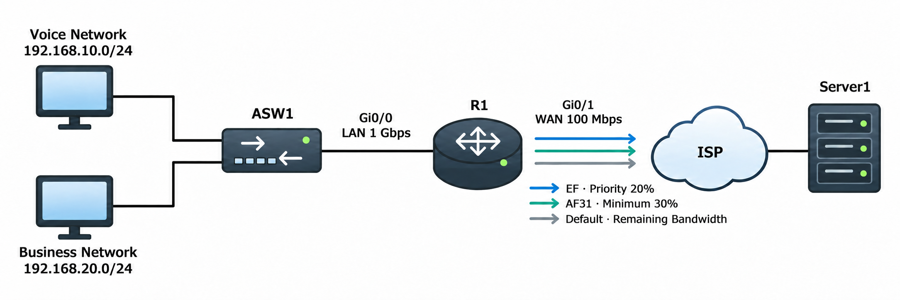

# QoS Fundamentals

## 개념

### QoS

QoS(Quality of Service)는 Network에 Congestion이 발생했을 때 Traffic의 중요도에 따라 처리 순서와 사용할 수 있는 Bandwidth를 결정하는 기술이다.

QoS는 제한된 Bandwidth 안에서 Voice, Video 및 중요 업무 Traffic에 우선순위를 제공한다.

QoS는 주로 WAN Link처럼 Bandwidth가 제한되거나 혼잡이 발생하는 구간에 적용한다.

### QoS가 필요한 이유

내부 Network는 `1 Gbps` 또는 `10 Gbps`를 사용하지만, 외부 WAN Link는 회선 비용이 높기 때문에 상대적으로 낮은 `100 Mbps` 정도를 사용할 수 있다.

이 경우 WAN Interface로 들어오는 Traffic이 내보낼 수 있는 양보다 많아지면서 전송되지 못한 Packet이 Output Queue에서 대기한다.

Queue가 가득 차면 새로 들어오는 Packet을 저장할 수 없어 Tail Drop이 발생한다.

QoS를 적용하면 Voice와 중요 업무 Traffic을 우선 처리하고, 일반 Traffic은 남은 Bandwidth를 사용하도록 구성할 수 있다.

### Network 품질 요소

QoS는 다음 요소를 관리한다.
- Bandwidth: 일정 시간 동안 Network가 전송할 수 있는 Data의 양이다.  
- Delay: Packet이 Source에서 Destination까지 전달되는 데 걸리는 시간이다.
- Jitter: Packet마다 전달되는 시간이 일정하지 않고 달라지는 현상이다.
- Packet Loss: Congestion으로 Queue가 가득 차면서 Packet이 Drop되는 현상이다.  

### Delay와 Jitter

Voice Traffic은 Delay와 Jitter에 민감하다.

일반적으로 VoIP의 One-Way Delay는 `150ms 이하`로 유지하는 것이 좋다.

Jitter가 발생하면 Voice Packet이 일정한 간격으로 도착하지 않는다.
```
정상: 10ms → 10ms → 10ms → 10ms
Jitter 발생: 10ms → 15ms → 130ms → 12ms
```
IP Phone이나 Voice 장비는 De-jitter Buffer에 Packet을 잠시 저장한 후 일정한 간격으로 재생한다.

하지만 Packet이 재생 시간보다 너무 늦게 도착하면 사용할 수 없으므로 Drop된 것처럼 처리될 수 있다.

QoS는 Voice Packet을 우선 전송하여 Delay, Jitter 및 Packet Loss를 줄일 수 있지만 완전히 제거하는 것은 아니다.

### QoS Service Model

QoS에는 다음과 같은 Service Model이 있다.

1\. Best Effort는 모든 Traffic을 별도의 우선순위 없이 처리한다.
- Bandwidth 보장이나 우선순위를 제공하지 않는다.
- Congestion이 발생하면 Delay와 Packet Loss가 발생할 수 있다.

2\. IntServ(Integrated Services)는 Application이 Traffic을 전송하기 전에 필요한 Bandwidth를 미리 확보하는 방식이다.
- Voice나 Video 통신을 시작하기 전에 경로상의 Router에 필요한 Bandwidth를 요청한다.
- 각 Traffic Flow의 예약 정보를 Router가 개별적으로 관리해야 하므로 규모가 큰 Network에서는 사용하기 어렵다.  

3\. DiffServ(Differentiated Services)는 Traffic을 여러 Class로 분류하고 DSCP 값에 따라 서로 다르게 처리한다.
- 각각의 Traffic Flow마다 Bandwidth를 따로 예약하지 않고, 비슷한 Traffic을 Class로 분류하여 우선순위와 Bandwidth를 적용한다.  
- Traffic을 Class 단위로 관리하므로 규모가 큰 Network에서도 사용하기 쉬우며, 일반적인 기업 Network에서 주로 사용한다.  

### QoS 동작 단계

QoS는 일반적으로 다음 과정으로 동작한다.

1\. Classification: Traffic을 종류별로 분류한다.

2\. Marking: 분류한 Traffic에 QoS 값을 표시한다.

3\. Queuing: Traffic을 Class별 Queue에 저장한다.

4\. Scheduling: 어떤 Queue의 Packet을 먼저 전송할지 결정한다.

5\. Congestion Avoidance: Queue가 가득 차기 전에 일부 Packet을 미리 Drop한다.

6\. Policing 또는 Shaping: Traffic의 전송 속도를 제한하거나 조정한다.

### Classification

Classification은 Traffic을 종류별 Class로 분류하는 과정이다.
```
Voice Traffic → VOICE Class
업무 Traffic → BUSINESS Class
일반 Traffic → class-default
```
Traffic은 여러 Layer의 정보를 기준으로 분류할 수 있다.

#### Layer 1 Classification

Packet이 들어온 Physical Interface를 기준으로 분류한다.
```
Gi0/0으로 들어온 Traffic
→ 특정 Class로 분류
```

#### Layer 2 Classification

다음 Layer 2 정보를 기준으로 분류한다.
- Source 및 Destination MAC Address
- VLAN
- CoS

#### Layer 3 Classification

다음 Layer 3 정보를 기준으로 분류한다.
- Source 및 Destination IP Address
- IP Precedence
- DSCP

#### Layer 4 Classification

TCP 또는 UDP Port Number를 기준으로 Traffic을 분류한다.
```
TCP Port 80: HTTP
TCP Port 443: HTTPS
TCP Port 25: SMTP
```

#### Layer 7 Classification

NBAR(Network-Based Application Recognition)를 사용하여 Application의 특징이나 Signature를 확인하고 Traffic을 분류한다.
```
R1(config)# class-map match-any WEB
R1(config-cmap)# match protocol http
```
NBAR는 단순한 Port Number뿐만 아니라 Application의 특징을 확인하여 Traffic을 분류할 수 있다.

인식할 수 있는 Application은 장비 Model, IOS Version 및 NBAR Protocol Pack에 따라 달라질 수 있다.

### Marking

Marking은 분류한 Traffic의 Header에 QoS 값을 표시하는 과정이다.

Marking은 상자에 Label을 붙이는 것과 비슷하다. Network 장비는 Packet의 Marking 값을 확인하여 Traffic을 어떻게 처리할지 결정한다.
```
Voice Traffic → DSCP EF
업무 Traffic → DSCP AF31
일반 Traffic → DSCP CS0
```
- Marking 자체가 Bandwidth를 보장하거나 Packet을 먼저 전송하는 것은 아니다.
- 각 장비에 Marking 값을 처리하는 Queuing Policy가 설정되어 있어야 실제 우선순위가 적용된다.

### Layer별 Marking

Network에서는 다음과 같은 QoS Marking을 사용할 수 있다.
```
Layer 2: CoS
MPLS: MPLS TC
Layer 3: IP Precedence 또는 DSCP
```

### CoS

CoS(Class of Service)는 Ethernet `802.1Q VLAN Tag`의 PCP Field를 사용하여 Layer 2 Traffic에 우선순위를 표시한다.

CoS는 `3 Bit`를 사용하므로 `0~7` 값을 사용할 수 있다.
```
CoS 0: 일반 Traffic
CoS 5: Voice Traffic에 일반적으로 사용
```
CoS는 `802.1Q VLAN Tag` 안에 있으므로 VLAN Tag가 없는 일반 Ethernet Frame에는 CoS 값을 표시할 수 없다.

### MPLS TC

MPLS TC(Traffic Class)는 MPLS Header의 `3 Bit` Field를 사용하여 MPLS Network 안에서 Traffic을 구분한다.

과거에는 MPLS EXP(Experimental) Bit라고 불렀다.
```
MPLS TC
→ 3 Bit
→ 0~7
```
Service Provider는 MPLS TC 값을 사용하여 MPLS Network 안에서 Voice, Video 및 Data Traffic을 서로 다르게 처리할 수 있다.

### IP Precedence

IP Precedence는 IPv4 Header의 ToS Field에서 상위 `3 Bit`를 사용하여 Traffic을 표시하는 오래된 방식이다.
```
IP Precedence
→ 3 Bit
→ 0~7
```
IP Precedence는 사용할 수 있는 값이 8개뿐이므로 현대 Network에서는 더 많은 Class를 제공하는 DSCP를 주로 사용한다.

### DS Field와 DSCP

IP Header에는 QoS와 Congestion 정보를 표시하는 `8 Bit` 크기의 DS Field가 있다.

기존 IPv4의 ToS Field가 현재 DS Field로 사용되며, IPv6에서는 Traffic Class Field에 같은 정보가 포함된다.
```
DS Field: 8 Bit

DSCP: 6 Bit
ECN: 2 Bit
```
- DSCP(Differentiated Services Code Point): Traffic의 Class와 우선순위를 표시한다.
- ECN(Explicit Congestion Notification): Packet을 바로 Drop하지 않고 송신 장비에 Congestion이 발생했음을 알린다.

DSCP는 `6 Bit`이므로 `0~63` 값을 사용할 수 있으며, Router와 Switch는 이 값을 확인하여 Traffic의 처리 순서와 적용할 QoS 정책을 결정한다.

### DSCP Per-Hop Behavior

DSCP 값은 Network 장비가 해당 Packet을 어떻게 처리할지 결정할 때 사용한다.

대표적인 DSCP 값은 다음과 같다.
```
CS0  : 0  → Best Effort
CS1  : 8  → Scavenger Traffic에 사용 가능
AF31 : 26 → 중요 업무 Traffic
AF41 : 34 → Video Traffic
EF   : 46 → Voice Traffic
CS6  : 48 → Network Control Traffic
```
DSCP 값이 높다고 무조건 먼저 전송되는 것은 아니다. 실제 Bandwidth와 전송 순서는 각 장비에 설정된 QoS Policy가 결정한다.

### CS

CS(Class Selector)는 기존 IP Precedence와 호환되는 DSCP 값이다.
```
CS0: DSCP 0
CS1: DSCP 8
CS2: DSCP 16
CS3: DSCP 24
CS4: DSCP 32
CS5: DSCP 40
CS6: DSCP 48
CS7: DSCP 56
```

### AF

AF(Assured Forwarding)는 Traffic을 Class로 나누고, Congestion이 발생했을 때 어떤 Packet을 먼저 Drop할지 표시하는 DSCP 값이다.

AF는 다음 값을 사용한다.
```
AF11  AF12  AF13
AF21  AF22  AF23
AF31  AF32  AF33
AF41  AF42  AF43
```

같은 AF Class에서는 Drop Precedence가 높을수록 Congestion 발생 시 먼저 Drop될 가능성이 높다.
```
AF31 → Drop 가능성 낮음
AF32 → Drop 가능성 중간
AF33 → Drop 가능성 높음
```

### EF

EF(Expedited Forwarding)는 낮은 Delay, Jitter 및 Packet Loss가 필요한 실시간 Traffic에 사용한다.
```
EF: DSCP 46
```
EF는 일반적으로 Voice Traffic에 사용한다.

EF로 Marking하는 것만으로 품질이 보장되는 것은 아니며, Network 장비에서 LLQ와 같은 Queuing Policy를 함께 적용해야 한다.

### Trust Boundary

Trust Boundary는 단말이 설정한 QoS Marking을 신뢰할지 결정하는 Network 경계이다.

모든 단말의 DSCP 값을 신뢰하면 일반 사용자가 자신의 Traffic을 `EF`로 설정하여 높은 우선순위를 사용할 수 있다.

따라서 일반적으로 Access Layer에서 다음과 같이 처리한다.
- 일반 PC가 직접 설정한 QoS 값은 신뢰하지 않고, Switch의 QoS Policy에 따라 다시 설정한다.
- 신뢰할 수 있는 IP Phone이나 Network 장비가 설정한 QoS 값은 그대로 유지한다.
- 설정된 속도보다 많은 Traffic을 전송하면 초과한 Traffic을 Drop하거나 낮은 우선순위로 변경한다.

### Queuing

Queuing은 Interface가 즉시 전송하지 못한 Packet을 Buffer에 저장하여 대기시키는 기능이다.

Output Interface가 전송할 수 있는 속도보다 많은 Traffic이 들어오면 Output Queue에 Packet이 쌓인다.
```
수신 Traffic: 150 Mbps
Output Interface: 100 Mbps
초과 Traffic: Output Queue에서 대기
```

### FIFO

FIFO(First In First Out)는 먼저 들어온 Packet을 먼저 전송하는 방식이다.
```
먼저 들어온 Packet → 먼저 전송
```
구성이 간단하지만 중요한 Traffic과 일반 Traffic을 구분하지 않는다.

### WFQ

WFQ(Weighted Fair Queueing)는 Traffic을 Flow별로 구분하고 Bandwidth를 공정하게 나누는 방식이다.

하나의 대용량 File 전송이 전체 Queue를 차지하지 않도록 하고, SSH나 Telnet과 같은 작은 대화형 Flow가 오랫동안 기다리지 않게 한다.
```
대용량 File 전송 Flow
SSH Flow
Web Flow
→ Flow별로 공정하게 처리
```

### CBWFQ

CBWFQ(Class-Based Weighted Fair Queueing)는 관리자가 Traffic Class를 직접 생성하고 Class마다 일정한 Bandwidth를 보장하는 방식이다.
```
VOICE Class: 20%
BUSINESS Class: 30%
class-default: 나머지 Bandwidth
```
`bandwidth percent`로 설정한 값은 혼잡이 발생했을 때 해당 Class에 보장되는 최소 Bandwidth이다.

### PQ

PQ(Priority Queuing)는 높은 Priority Queue의 Packet을 다른 Queue보다 먼저 전송하는 방식이다.
```
High Priority Queue → 먼저 전송
Low Priority Queue → 이후 전송
```
높은 Priority Traffic이 계속 들어오면 낮은 Priority Traffic이 오랫동안 전송되지 못하는 Starvation이 발생할 수 있다.

### LLQ

LLQ(Low Latency Queueing)는 CBWFQ에 Priority Queue를 추가한 방식이다.

Voice Traffic은 Priority Queue에서 먼저 전송하고, 다른 Traffic에는 CBWFQ를 통해 Bandwidth를 제공한다.
```
Voice → Priority Queue
업무 Traffic → 보장된 Bandwidth
일반 Traffic → 남은 Bandwidth
```
LLQ는 Priority Traffic이 모든 Bandwidth를 사용하는 것을 방지하기 위해 Priority Traffic의 최대 사용량을 제한한다.

### Tail Drop

Tail Drop은 Queue가 가득 찬 후 새로 들어오는 Packet을 Drop하는 방식이다.

### TCP Global Synchronization

TCP Global Synchronization은 Tail Drop으로 여러 TCP Session의 Packet이 동시에 손실되면서 모든 Sender가 비슷한 시점에 전송 속도를 낮추는 현상이다.

이후 Sender들이 다시 전송 속도를 높이면서 Network가 다시 혼잡해지는 과정이 반복될 수 있다.
```
여러 TCP Sender가 동시에 전송
- Queue 가득 참
- 여러 Packet 동시 Drop
- Sender들이 동시에 속도 감소
- 다시 동시에 속도 증가
```

### WRED

WRED(Weighted Random Early Detection)는 Queue가 완전히 가득 차기 전에 일부 Packet을 미리 Drop하여 혼잡을 줄이는 기능이다.

WRED는 모든 TCP Session의 Packet을 동시에 Drop하지 않고 일부 Packet을 미리 Drop하여 TCP Global Synchronization을 줄일 수 있다.

DSCP나 Drop Precedence가 낮은 Traffic을 먼저 Drop하도록 구성할 수 있다.

### Policing

Policing은 Traffic이 설정된 속도를 초과하면 초과 Packet을 바로 Drop하거나 낮은 DSCP 값으로 변경하는 기능이다.  

Policing은 설정 속도를 초과한 Packet을 Queue에 저장하지 않고 즉시 Drop하거나 Re-marking한다.

따라서 Traffic 속도를 강하게 제한할 수 있지만 Packet Loss가 발생할 수 있다.

### Shaping

Shaping은 설정된 속도를 초과한 Packet을 Queue에 저장한 후 나중에 전송하여 Traffic 속도를 부드럽게 조정하는 기능이다.

Shaping은 Packet Drop을 줄일 수 있지만 Packet을 Queue에서 대기시키므로 Delay가 증가할 수 있다.

### MQC

MQC(Modular QoS CLI)는 Cisco 장비에서 QoS를 구성하는 방식이다.

MQC는 다음 세 단계로 구성한다.

1\. `class-map`으로 Traffic을 분류한다.

2\. `policy-map`으로 각 Class에 적용할 QoS Action을 설정한다.

3\. `service-policy`로 Policy를 Interface에 적용한다.

---

## 동작 원리

### QoS 동작 과정

1\. Client와 IP Phone의 Traffic이 Router로 전달된다.

2\. Router는 Interface, MAC Address, VLAN, IP Address, Port Number, Application 또는 기존 DSCP 값을 확인하여 Traffic을 분류한다.

3\. 분류한 Traffic에 DSCP 값을 설정하거나 기존 DSCP 값을 유지한다.
```
Voice → EF
업무 Traffic → AF31
일반 Traffic → CS0
```

4\. Router는 Traffic을 Class별 Output Queue에 저장한다.

5\. WAN Interface에 혼잡이 발생하면 LLQ가 Voice Traffic을 먼저 전송한다.

6\. CBWFQ는 업무 Traffic에 설정된 최소 Bandwidth를 제공한다.

7\. 일반 Traffic은 남은 Bandwidth를 사용한다.

8\. Queue가 가득 차기 전에 WRED가 일부 TCP Packet을 미리 Drop할 수 있다.

9\. Queue가 완전히 가득 차면 Tail Drop이 발생한다.

### Policing 동작 과정

1\. Router는 Traffic의 전송 속도를 측정한다.

2\. Traffic이 설정된 속도 이하이면 정상적으로 전송한다.

3\. 설정된 속도를 초과하면 초과 Packet을 Drop하거나 DSCP 값을 낮춘다.

4\. 초과 Packet을 Queue에 저장하지 않으므로 Traffic 속도를 즉시 제한한다.

### Shaping 동작 과정

1\. Router는 Outbound Traffic의 전송 속도를 측정한다.

2\. Traffic이 설정된 속도 이하이면 바로 전송한다.

3\. 설정된 속도를 초과하면 Packet을 Shaping Queue에 저장한다.

4\. Router는 저장한 Packet을 설정된 속도에 맞춰 나중에 전송한다.

---

## 예시 및 구성

### 사내 Voice와 업무 Traffic QoS 적용

`MASON` 회사는 본사 Router를 통해 `100 Mbps`의 WAN 회선을 사용하고 있다.

내부 Interface는 `1 Gbps`이지만 ISP와 계약한 실제 WAN Bandwidth는 `100 Mbps`이다.

파일 전송 Traffic이 증가하면 WAN Interface에 혼잡이 발생하여 Voice Traffic의 Delay와 Jitter가 증가한다.

관리자는 Voice Traffic을 `EF`, 중요 업무 Traffic을 `AF31`로 Marking하고 다음 QoS Policy를 적용한다.
```
Voice Traffic: Priority Bandwidth 20%
업무 Traffic: Minimum Bandwidth 30%
일반 Traffic: 남은 Bandwidth 사용
전체 Traffic: 100 Mbps로 Shaping
```



### Traffic Marking 구성

Voice와 업무 Traffic을 분류하는 ACL을 생성한다.
```
R1(config)# ip access-list extended VOICE-ACL
R1(config-ext-nacl)# permit ip 192.168.10.0 0.0.0.255 any
R1(config-ext-nacl)# exit

R1(config)# ip access-list extended BUSINESS-ACL
R1(config-ext-nacl)# permit ip 192.168.20.0 0.0.0.255 any
R1(config-ext-nacl)# exit
```

ACL을 사용하는 Class Map을 생성한다.
```
R1(config)# class-map match-any VOICE-SOURCE
R1(config-cmap)# match access-group name VOICE-ACL
R1(config-cmap)# exit

R1(config)# class-map match-any BUSINESS-SOURCE
R1(config-cmap)# match access-group name BUSINESS-ACL
R1(config-cmap)# exit
```

Traffic에 DSCP 값을 설정한다.
```
R1(config)# policy-map LAN-MARKING
R1(config-pmap)# class VOICE-SOURCE
R1(config-pmap-c)# set dscp ef
R1(config-pmap-c)# exit
R1(config-pmap)# class BUSINESS-SOURCE
R1(config-pmap-c)# set dscp af31
R1(config-pmap-c)# exit
```

LAN Interface의 Inbound 방향에 Marking Policy를 적용한다.
```
R1(config)# interface gi0/0
R1(config-if)# service-policy input LAN-MARKING
```

### WAN Queuing 구성

DSCP 값을 기준으로 Traffic을 분류한다.
```
R1(config)# class-map match-any VOICE
R1(config-cmap)# match dscp ef
R1(config-cmap)# exit

R1(config)# class-map match-any BUSINESS
R1(config-cmap)# match dscp af31
R1(config-cmap)# exit
```

Voice와 업무 Traffic의 Queue를 설정한다.
```
R1(config)# policy-map WAN-CHILD
R1(config-pmap)# class VOICE
R1(config-pmap-c)# priority percent 20
R1(config-pmap-c)# exit
R1(config-pmap)# class BUSINESS
R1(config-pmap-c)# bandwidth percent 30
R1(config-pmap-c)# exit
R1(config-pmap)# class class-default
R1(config-pmap-c)# fair-queue
```
- `priority percent 20`: Voice Traffic을 Priority Queue에 저장하고 혼잡 시 먼저 전송한다.
- `bandwidth percent 30`: 혼잡 시 업무 Traffic에 최소 `30%`의 Bandwidth를 제공한다.
- `class-default`: 다른 Class에 포함되지 않은 Traffic을 처리한다.
- `fair-queue`: 일반 Traffic을 Flow별로 구분하여 공정하게 처리한다.

### WAN Shaping 구성

전체 Outbound Traffic을 ISP의 실제 계약 속도인 `100 Mbps`로 조정한다.
```
R1(config)# policy-map WAN-PARENT
R1(config-pmap)# class class-default
R1(config-pmap-c)# shape average 100000000
R1(config-pmap-c)# service-policy WAN-CHILD
```
- `shape average 100000000`: 전체 Traffic을 평균 `100 Mbps`로 조정한다.
- `service-policy WAN-CHILD`: Shaping된 Traffic 안에서 Voice와 업무 Traffic의 Queue를 구분한다.

WAN Interface의 Outbound 방향에 Parent Policy를 적용한다.
```
R1(config)# interface gi0/1
R1(config-if)# service-policy output WAN-PARENT
```

---

## 확인 명령어

Class Map을 확인한다.
```
R1# show class-map
```

Policy Map을 확인한다.
```
R1# show policy-map
```

Interface에 적용된 QoS Policy와 Counter를 확인한다.
```
R1# show policy-map interface gi0/0
R1# show policy-map interface gi0/1
```
다음 정보를 확인한다.
- Class별 Packet Counter
- DSCP Marking Counter
- Queue에 저장된 Packet
- Drop된 Packet
- Policing 및 Shaping Rate

ACL Counter를 확인한다.
```
R1# show access-lists VOICE-ACL
R1# show access-lists BUSINESS-ACL
```

---

## Troubleshooting

### QoS가 정상적으로 동작하지 않는 경우

1\. QoS Policy가 올바른 Interface와 방향에 적용되어 있는지 확인한다.
```
R1# show running-config interface gi0/0
R1# show running-config interface gi0/1
```

2\. Class Map의 Packet Counter가 증가하는지 확인한다.
```
R1# show policy-map interface
```
- Counter가 증가하지 않으면 ACL, DSCP, Port Number 또는 Class Map의 Match 조건을 확인한다.

3\. Packet에 DSCP 값이 정상적으로 Marking되어 있는지 확인한다.

4\. QoS를 적용한 Interface가 실제 Congestion 구간인지 확인한다.
- 혼잡이 없다면 모든 Traffic을 바로 전송할 수 있으므로 QoS 효과가 크게 나타나지 않을 수 있다.

5\. 물리적인 Interface 속도와 ISP의 CIR이 다른지 확인한다.
- 물리 Interface는 `1 Gbps`이지만 CIR이 `100 Mbps`라면 `100 Mbps`에 맞게 Shaping해야 할 수 있다.

6\. Priority Queue에 너무 많은 Traffic이 포함되어 있는지 확인한다.
- Voice가 아닌 Traffic까지 `EF`로 분류하면 다른 Traffic의 품질이 낮아질 수 있다.

---

## 주요 질문

QoS란 무엇인가?
- Network에 Congestion이 발생했을 때 중요한 Traffic을 먼저 처리하고 Traffic 종류에 따라 Bandwidth와 Packet Drop을 관리하는 기술이다.

QoS는 언제 효과가 발생하는가?
- 주로 Output Interface에 Congestion이 발생하여 Packet이 Queue에서 대기할 때 효과가 나타난다.

Jitter란 무엇인가?
- Packet마다 전달 시간이 달라져 일정한 간격으로 도착하지 않는 현상이다.

De-jitter Buffer란 무엇인가?
- Voice Packet을 잠시 저장한 후 일정한 간격으로 재생하여 Jitter의 영향을 줄이는 Buffer이다.

Classification과 Marking의 차이는 무엇인가?
- Classification은 Traffic을 종류별로 분류하고, Marking은 분류한 Traffic에 DSCP나 CoS 값을 설정한다.

NBAR란 무엇인가?
- Port Number뿐만 아니라 Application의 특징이나 Signature를 확인하여 Traffic을 분류하는 Cisco 기능이다.

CoS와 DSCP의 차이는 무엇인가?
- CoS는 Layer 2의 802.1Q VLAN Tag에서 사용하고, DSCP는 Layer 3의 IP Header에서 사용한다.

IP Precedence와 DSCP의 차이는 무엇인가?
- IP Precedence는 `3 Bit`로 8개의 값을 사용하고, DSCP는 `6 Bit`로 64개의 값을 사용한다.

AF에서 Drop Precedence는 무엇인가?
- 같은 AF Class에서 Congestion발생 시 어떤 Traffic을 먼저 Drop할지 나타내며 값이 높을수록 먼저 Drop될 가능성이 높다.

Policing과 Shaping의 차이는 무엇인가?
- Policing은 설정 속도를 초과한 Packet을 Drop하거나 Re-marking하고, Shaping은 초과 Packet을 Queue에 저장한 후 나중에 전송한다.

Internet에서도 DSCP 값이 계속 유지되는가?
- ISP나 중간 Network의 Policy에 따라 DSCP 값이 변경되거나 무시될 수 있다.
