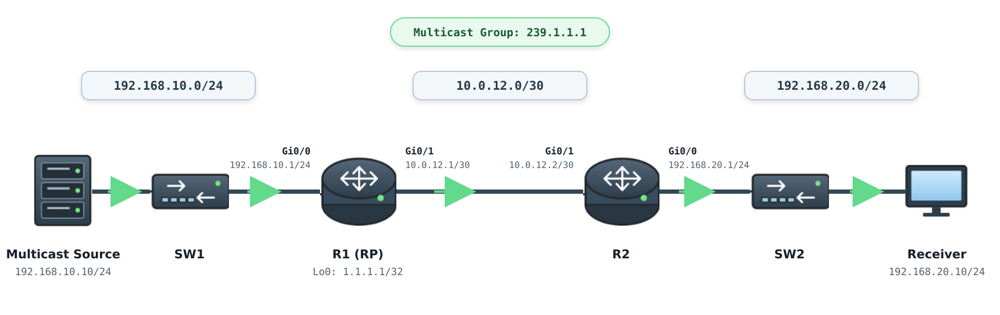

# Multicast / IGMP / PIM 기본

## 개념

### Multicast

Multicast는 하나의 Source가 동일한 Data를 특정 Multicast Group에 가입한 여러 Receiver에게 전달하는 방식이다.

Source는 각 Receiver에게 Packet을 따로 전송하지 않고 Multicast Group Address를 Destination IP Address로 설정하여 전송한다.

### Multicast Address

IPv4 Multicast는 `224.0.0.0/4` 범위의 IP Address를 사용한다.
```
224.0.0.0 ~ 239.255.255.255
```

주요 Address 범위는 다음과 같다.
- `224.0.0.0/24`: 같은 Local Network 내의 Protocol Message에 사용하며, 해당 Multicast Traffic은 다른 Network로 전달되지 않는다.
- `232.0.0.0/8`: SSM(Source-Specific Multicast)에 사용하며, Receiver가 Traffic을 받을 Source를 직접 지정한다.
- `239.0.0.0/8`: 사내 Network처럼 제한된 범위에서 사용하는 Multicast Address이다. 예를 들어 사내 방송을 `239.1.1.1`로 전송하고, 해당 Traffic이 회사 외부로 전달되지 않도록 범위를 제한할 때 사용한다.

### IGMP

IGMP(Internet Group Management Protocol)는 Receiver가 같은 Network에 있는 Multicast Router에게 특정 Multicast Group의 Traffic을 받고 싶다고 알릴 때 사용하는 Protocol이다.

Receiver는 IGMP Membership Report를 전송하여 특정 Multicast Group의 Traffic을 수신하겠다고 Router에 알린다.

Multicast Router는 같은 Network에 있는 Receiver들에게 IGMP Query를 주기적으로 전송하여, Multicast Group에 가입한 Receiver가 계속 존재하는지 확인한다.

IGMP는 IP Protocol Number `2`를 사용한다.

### IGMP Version

#### IGMPv1

IGMPv1은 Multicast Group 가입 기능을 제공하지만 Group에서 즉시 탈퇴하는 Leave Message가 없다.

어떤 Receiver도 응답하지 않으면 Multicast Router는 Timer가 만료된 후 해당 Network의 Multicast Group 가입 정보를 삭제한다.

#### IGMPv2

IGMPv2는 Leave Group Message를 지원한다.

Receiver가 Multicast Group에서 탈퇴하면 Multicast Router는 해당 Group Address로 Group-Specific Query를 전송하여 다른 Receiver가 남아 있는지 확인한다.

#### IGMPv3

IGMPv3는 Receiver가 수신할 Multicast Group과 해당 Traffic을 전송하는 Source를 함께 지정할 수 있다.
```
IGMPv2: Group만 선택
239.1.1.1

IGMPv3: Source와 Group을 함께 선택
192.168.10.10 → 232.1.1.1
```

### IGMP Snooping

IGMP Snooping은 L2 Switch가 Receiver와 Router 사이의 IGMP Message를 확인하여 Multicast Group에 가입한 Port를 학습하는 기능이다.

IGMP Snooping이 없으면 Switch는 Multicast Group에 가입한 Receiver의 위치를 알 수 없으므로, Multicast Traffic을 같은 VLAN의 모든 Port로 Flooding할 수 있다.

IGMP Snooping을 사용하면 Multicast Traffic을 다음 Port에만 전달한다.
- 해당 Multicast Group에 가입한 Receiver Port
- Multicast Router가 연결된 Mrouter Port

### PIM

PIM(Protocol Independent Multicast)은 Router 사이에서 Multicast 전달 경로를 생성하는 Multicast Routing Protocol이다.

PIM은 Unicast Routing Table을 확인하여 Multicast Traffic이 Source 또는 RP 방향의 올바른 Interface로 들어왔는지 확인한다.

PIM은 특정 Routing Protocol만 사용하는 것이 아니라 Static Route, OSPF 및 EIGRP 등으로 생성된 Routing Table을 모두 사용할 수 있기 때문에 Protocol Independent라고 한다.
- PIM은 IP Protocol Number `103`을 사용한다.
- PIM Router는 `224.0.0.13`으로 PIM Message를 전송한다.

### PIM Dense Mode

PIM-DM(Dense Mode)은 Network의 여러 곳에 Receiver가 존재한다고 가정한다.

처음에는 Multicast Traffic을 모든 PIM Interface로 Flooding하고, Receiver가 없는 경로에 Prune Message를 전송하여 Traffic을 차단한다.
- Prune은 Multicast Traffic을 받을 Receiver가 없는 경로로 Traffic이 전달되지 않도록 차단하는 기능이다.

### PIM Sparse Mode

PIM-SM(Sparse Mode)은 Receiver가 Multicast Group에 가입하면, Receiver와 연결된 Router가 PIM Join Message를 전송하여 요청한 경로로만 Multicast Traffic이 전달되도록 한다.

PIM-SM에서는 Source의 Multicast Traffic과 Receiver의 가입 요청이 만나는 지점으로 RP(Rendezvous Point)를 사용한다.
- Multicast Traffic을 보내는 Source와 연결된 Router는 RP에게 Multicast Traffic이 발생한 것을 알리고, Receiver와 연결된 Router는 RP 방향으로 PIM Join Message를 전송한다. 
```
Source → R1 → R2(RP) → R3 → Receiver
```

### PIM SSM

PIM-SSM(Source-Specific Multicast)은 Receiver가 Multicast Group과 Source를 함께 지정하는 방식이다.

예를 들어 Receiver가 Source `192.168.10.10`이 `232.1.1.1` Group으로 전송하는 Traffic을 받으려는 경우 다음과 같이 표시한다.
```
(S,G): (192.168.10.10, 232.1.1.1)

S: Source IP Address
G: Multicast Group Address
```
SSM은 Receiver가 Source를 직접 지정하므로 RP가 필요하지 않다.

### PIM Register와 Register-Stop

First-Hop Router가 Source로부터 최초 Multicast Packet을 수신하면 해당 Packet을 PIM Register Message 안에 Encapsulation한다.

First-Hop Router는 PIM Register Message를 RP에 Unicast로 전송하여 새로운 Multicast Source가 있다는 것을 알린다.

RP는 PIM Register 안의 Multicast Packet을 Receiver 방향의 Shared Tree로 전달하고, Source 방향으로 PIM `(S,G)` Join Message를 전송한다.

RP가 Source로부터 Multicast Packet을 수신하면 First-Hop Router에 Register-Stop Message를 전송한다.

First-Hop Router는 Register-Stop을 수신하면 Multicast Packet을 PIM Register로 Encapsulation하는 것을 중단한다.

### Shared Tree

Shared Tree는 RP를 중심으로 생성되는 공통 Multicast 전달 경로이다.

Multicast Routing Table에서는 `(*,G)`로 표시한다.

```
(*, 239.1.1.1)
```
- `*`는 특정 Source를 지정하지 않았다는 의미이며, `G`는 Multicast Group을 의미한다.

### Source Tree

Source Tree 또는 SPT(Shortest Path Tree)는 RP를 거치지 않고 Receiver 방향 Router가 Source까지 생성한 최단 경로이다.

Multicast Routing Table에서는 `(S,G)`로 표시한다.
```
(192.168.10.10, 239.1.1.1)
```

### SPT Cutover

Last-Hop Router는 처음에 RP를 기준으로 생성된 Shared Tree를 통해 Multicast Traffic을 수신한다.

Last-Hop Router는 Packet의 Source IP Address를 확인한 후 Source 방향으로 PIM `(S,G)` Join Message를 전송하여 더 짧은 SPT를 생성한다.

SPT를 통해 Traffic을 수신하기 시작하면 기존 RP 방향의 경로를 Prune하고, 이후에는 Source에서 Receiver까지 더 효율적인 경로인 SPT를 사용한다.
```
Shared Tree: Source → RP → Receiver
SPT: Source → Receiver 최단 경로
```

### RPF

RPF(Reverse Path Forwarding)는 Multicast Packet이 올바른 Interface로 들어왔는지 확인하는 기능이다.

Router는 Unicast Routing Table을 조회하여 Source 또는 RP로 가는 경로를 확인한다.

Packet이 해당 경로의 Interface로 들어오면 전달하고, 다른 Interface로 들어오면 폐기한다.

---

## 동작 원리

### IGMP와 PIM 동작 과정

1\. Multicast Source가 Group Address `239.1.1.1`을 Destination으로 Traffic을 전송한다.

2\. Receiver의 Application이 `239.1.1.1` Group에 가입한다.

3\. Receiver는 Last-Hop Router에 IGMP Membership Report를 전송한다.

4\. Last-Hop Router는 Receiver가 존재하는 Interface를 IGMP Group Table에 등록한다.

5\. Last-Hop Router는 RP 방향으로 PIM `(*,G)` Join Message를 전송한다.

6\. Router들은 RP를 중심으로 `(*,239.1.1.1)` Shared Tree를 생성한다.

7\. First-Hop Router는 Source가 전송한 최초 Multicast Packet을 PIM Register Message 안에 Encapsulation한다.

8\. First-Hop Router는 PIM Register Message를 RP에 Unicast로 전송한다.

9\. RP는 PIM Register 안의 Multicast Packet을 Shared Tree를 통해 Receiver 방향으로 전달한다.

10\. RP는 Source 방향으로 PIM `(S,G)` Join Message를 전송한다.

11\. RP가 Source로부터 Multicast Traffic을 직접 수신하면 First-Hop Router에 Register-Stop Message를 전송한다.

12\. Last-Hop Router는 Source 방향으로 PIM `(S,G)` Join Message를 전송하여 SPT를 생성한다.

13\. Last-Hop Router가 SPT를 통해 Traffic을 수신하기 시작하면 기존 RP 방향의 Shared Tree를 Prune한다.

14\. 이후 Multicast Traffic은 Source에서 Receiver까지 최단 경로로 전달된다.

---

## 예시 및 구성

### 사내 Multicast 방송 구성

`MASON` 회사는 본사의 방송 Server가 전송하는 Multicast Traffic을 다른 Network의 Client가 수신하도록 구성하려고 한다.



R1은 Source와 연결된 First-Hop Router이며 RP 역할도 수행한다.

R2는 Receiver와 연결된 Last-Hop Router이다.

### R1 구성

Multicast Routing을 활성화한다.
```
R1(config)# ip multicast-routing
```

RP로 사용할 Loopback Interface를 생성한다.
```
R1(config)# interface loopback 0
R1(config-if)# ip address 1.1.1.1 255.255.255.255
R1(config-if)# ip pim sparse-mode
```

Source와 Transit Interface에서 PIM Sparse Mode를 활성화한다.
```
R1(config)# interface gi0/0
R1(config-if)# ip address 192.168.10.1 255.255.255.0
R1(config-if)# ip pim sparse-mode
R1(config-if)# no shutdown

R1(config)# interface gi0/1
R1(config-if)# ip address 10.0.12.1 255.255.255.252
R1(config-if)# ip pim sparse-mode
R1(config-if)# no shutdown
```

Static RP와 Receiver Network Route를 설정한다.
```
R1(config)# ip pim rp-address 1.1.1.1
R1(config)# ip route 192.168.20.0 255.255.255.0 10.0.12.2
```

### R2 구성

Multicast Routing을 활성화한다.
```
R2(config)# ip multicast-routing
```

R1과 Receiver 방향의 Interface에서 PIM Sparse Mode를 활성화한다.
```
R2(config)# interface gi0/1
R2(config-if)# ip address 10.0.12.2 255.255.255.252
R2(config-if)# ip pim sparse-mode
R2(config-if)# no shutdown

R2(config)# interface gi0/0
R2(config-if)# ip address 192.168.20.1 255.255.255.0
R2(config-if)# ip pim sparse-mode
R2(config-if)# ip igmp version 2
R2(config-if)# no shutdown
```

Static RP와 Source Network Route를 설정한다.

```
R2(config)# ip pim rp-address 1.1.1.1
R2(config)# ip route 1.1.1.1 255.255.255.255 10.0.12.1
R2(config)# ip route 192.168.10.0 255.255.255.0 10.0.12.1
```
- Server는 `239.1.1.1`을 Destination으로 Multicast Traffic을 전송하고 Receiver는 Application을 통해 해당 Group에 가입한다.


---

## 명령어

### SSM 설정

기본 SSM Address 범위인 `232.0.0.0/8`을 모든 Multicast Router에서 활성화한다.
```
R1(config)# ip pim ssm default
R2(config)# ip pim ssm default
```

Receiver 방향 Interface에서 IGMPv3를 사용한다.
```
R2(config)# interface gi0/0
R2(config-if)# ip igmp version 3
```

### IGMP Snooping 설정

L2 Switch에서 IGMP Snooping을 Global로 활성화한다.
```
SW1(config)# ip igmp snooping
```

VLAN `20`에서 IGMP Snooping을 활성화한다.
```
SW1(config)# ip igmp snooping vlan 20
```
- IGMP Snooping을 사용하면 VLAN `20`의 모든 Port가 아니라 Multicast Group에 가입한 Receiver Port와 Mrouter Port에만 Traffic을 전달한다.


Multicast Routing과 PIM이 활성화된 Interface를 확인한다.
```
R1# show ip pim interface
```

PIM Neighbor가 정상적으로 형성되었는지 확인한다.
```
R1# show ip pim neighbor
```

PIM Sparse Mode에서 사용하는 RP를 확인한다.
```
R1# show ip pim rp mapping
```

Receiver가 가입한 Multicast Group을 확인한다.
```
R2# show ip igmp groups
R2# show ip igmp interface gi0/0
```

Multicast Routing Table의 `(*,G)`와 `(S,G)` Entry를 확인한다.
```
R1# show ip mroute
R2# show ip mroute 239.1.1.1
```

Multicast Source에 대한 RPF Interface를 확인한다.
```
R2# show ip rpf 192.168.10.10
```

L2 Switch에서 IGMP Snooping으로 학습한 Group과 Receiver Port를 확인한다.
```
SW1# show ip igmp snooping
SW1# show ip igmp snooping groups
SW1# show ip igmp snooping mrouter
```

---

## Troubleshooting

### Multicast Traffic을 수신할 수 없는 경우

1\. Multicast Routing이 활성화되어 있는지 확인한다.

```
R1# show running-config | include ip multicast-routing
```

2\. Source, Transit 및 Receiver 방향의 L3 Interface에 PIM이 설정되어 있는지 확인한다.

```
R1# show ip pim interface
R2# show ip pim interface
```

3\. Router 사이에 PIM Neighbor가 정상적으로 형성되었는지 확인한다.

```
R1# show ip pim neighbor
R2# show ip pim neighbor
```
- PIM Neighbor가 없으면 Interface 상태, IP Address, Subnet 및 PIM 설정을 확인한다.

4\. Receiver가 실제로 Multicast Group에 가입했는지 확인한다.

```
R2# show ip igmp groups
```
- Group이 보이지 않으면 Receiver Application, IGMP Version 및 Receiver와 Router 사이의 연결을 확인한다.

5\. PIM Sparse Mode에서 모든 Router가 동일한 RP를 알고 있는지 확인한다.

```
R1# show ip pim rp mapping
R2# show ip pim rp mapping
R2# show ip route 1.1.1.1
```

6\. Multicast Source 방향의 RPF가 정상인지 확인한다.

```
R2# show ip route 192.168.10.10
R2# show ip rpf 192.168.10.10
```
- RPF Interface와 실제 Multicast Packet이 들어오는 Interface가 다르면 Packet이 Drop된다.

7\. Multicast Routing Table을 확인한다.

```
R1# show ip mroute 239.1.1.1
R2# show ip mroute 239.1.1.1
```
- Incoming Interface: Multicast Packet이 들어오는 Interface
- Outgoing Interface List: Receiver 방향으로 Packet을 전달하는 Interface
- `(*,G)`: RP를 사용하는 Shared Tree
- `(S,G)`: Source를 사용하는 Source Tree

8\. Source가 실제 Multicast Traffic을 전송하고 있는지 확인하고 Source Application의 TTL이 너무 낮지 않은지 확인한다.

9\. ACL이나 Firewall에서 다음 Traffic을 차단하고 있지 않은지 확인한다.
- IGMP: IP Protocol Number `2`
- PIM: IP Protocol Number `103`
- 실제 Multicast Group으로 전송되는 Data Traffic

10\. SSM을 사용한다면 SSM과 IGMPv3 설정을 확인한다.

```
R1# show running-config | include ip pim ssm
R2# show ip igmp interface gi0/0
R2# show ip mroute 232.1.1.1
```
- 모든 Multicast Router에서 SSM이 활성화되어 있는지 확인한다.
- Receiver 방향 Interface가 IGMPv3를 사용하는지 확인한다.
- Multicast Routing Table에 `(S,G)` Entry가 생성되는지 확인한다.

---

## 주요 질문

Multicast란 무엇인가?
- 하나의 Source가 같은 Data를 특정 Multicast Group에 가입한 여러 Receiver에게 전달하는 방식이다.

IGMP와 PIM의 차이는 무엇인가?
- IGMP는 Receiver가 Router에 Multicast Group 가입 정보를 전달하고, PIM은 Router 사이에서 Multicast 전달 경로를 생성한다.

IGMP Snooping을 사용하는 이유는 무엇인가?
- L2 Switch가 Multicast Group에 가입한 Receiver Port를 학습하고 해당 Port에만 Traffic을 전달하기 위해 사용한다.

PIM Sparse Mode에서 RP를 사용하는 이유는 무엇인가?
- Multicast Source와 Receiver가 처음 서로를 찾고 Shared Tree를 생성할 수 있도록 사용한다.

PIM Register는 어떤 역할을 하는가?
- First-Hop Router가 최초 Multicast Packet을 Encapsulation하여 RP에 전달하고 새로운 Source가 있다는 것을 알린다.

SPT Cutover란 무엇인가?
- Last-Hop Router가 RP를 사용하는 Shared Tree에서 Source까지의 최단 경로인 SPT로 Multicast 전달 경로를 전환하는 것이다.
