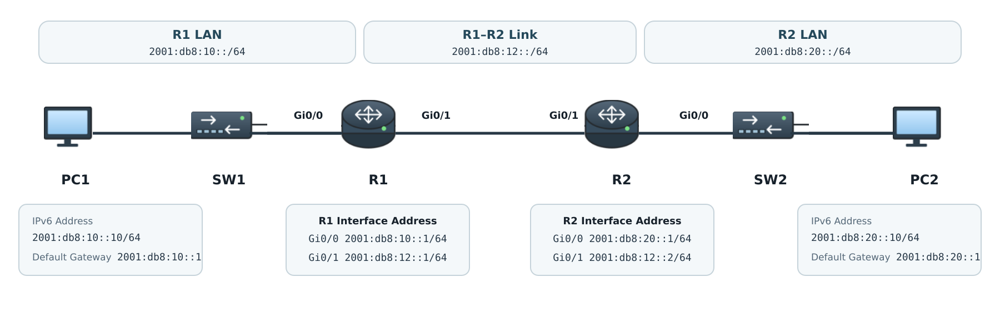

# IPv6 Fundamentals

## 개념

### IPv6

IPv6(Internet Protocol Version 6)는 IPv4 Address 부족 문제를 해결하기 위해 만들어진 Network Layer Protocol이다.

IPv4는 `32bit` Address를 사용하지만 IPv6는 `128bit` Address를 사용한다.

```
IPv4: 192.168.10.10
IPv6: 2001:db8:10::10
```

IPv6는 다음 특징을 가진다.
- Broadcast를 사용하지 않고 Multicast를 사용한다.
- NDP를 사용하여 Neighbor와 Default Gateway를 확인한다.
- SLAAC를 사용하면 DHCP Server 없이 Address를 자동으로 생성할 수 있다.
- IPv4와 별도의 IPv6 Routing Table을 사용한다.

### IPv6 Address 표기법

IPv6 Address는 `16bit`씩 8개의 영역으로 나누어 16진수로 표시한다.
```
2001:0db8:0000:0000:0000:0000:0000:0010
```

각 영역 앞의 `0`은 생략할 수 있다.
```
2001:db8:0:0:0:0:0:10
```

연속된 `0` 영역은 `::`로 한 번만 줄일 수 있다.
```
2001:db8::10
```
- 하나의 IPv6 Address에서 `::`는 한 번만 사용할 수 있다.

### Prefix Length

IPv6는 IPv4의 Subnet Mask 대신 Prefix Length를 사용한다.
```
2001:db8:10::1/64
```

일반적인 LAN Network에서는 `/64` Prefix를 사용한다.
```
Network Prefix: 처음 64bit
Interface ID: 나머지 64bit
```

### IPv6 Address Type

#### Global Unicast Address

Global Unicast Address는 IPv4의 Public IP Address와 비슷하게 Internet이나 외부 Network에서 Routing할 수 있는 Address이다.

일반적으로 `2000::/3` 범위를 사용한다.
```
2001:db8:10::10/64
```

#### Link-Local Address

Link-Local Address는 같은 Link에 연결된 장비끼리 통신할 때 사용하는 Address이다.

`FE80::/10` 범위를 사용하며 IPv6가 활성화되면 Interface에 자동으로 생성된다.
```
FE80::1
```
- Link-Local Address는 Router를 넘어 전달되지 않는다.

다음 기능에서 주로 사용한다.
- NDP를 통한 Neighbor 확인
- Default Gateway
- OSPFv3 Neighbor 형성
- 같은 Link의 Router 간 통신

#### Unique Local Address

ULA(Unique Local Address)는 사내 Network와 같은 내부 환경에서 사용하는 IPv6 Address이다.

`FC00::/7` 범위이며 일반적으로 `FD00::/8` 범위에서 생성하여 사용한다.
```
FD00:10:10::1/64
```

#### Multicast Address

IPv6 Multicast Address는 하나의 Packet을 여러 Receiver에게 전달할 때 사용한다.

`FF00::/8` 범위를 사용한다.

대표적인 IPv6 Multicast Address는 다음과 같다.
- `FF02::1`: 같은 Link의 모든 IPv6 장비
- `FF02::2`: 같은 Link의 모든 IPv6 Router
- `FF02::5`: 모든 OSPFv3 Router
- `FF02::6`: OSPFv3 DR과 BDR

IPv6에는 Broadcast Address가 없으며 필요한 장비를 선택하여 Multicast로 전달한다.

#### Anycast Address

Anycast는 여러 장비의 Interface에 동일한 IPv6 Address를 설정하고, Routing Table을 기준으로 가장 가까운 장비에 Packet을 전달하는 방식이다.

### IPv6 Header

IPv6 기본 Header는 `40Byte`의 고정된 크기를 사용한다.

```
IPv6 Header | Extension Header | TCP/UDP Header | Data
```

주요 Field는 다음과 같다.
- Traffic Class: Traffic의 우선순위를 표시한다.
- Flow Label: 같은 Flow의 Packet을 구분한다.
- Payload Length: IPv6 Header 뒤에 있는 Data의 크기를 표시한다.
- Next Header: TCP, UDP, ICMPv6 또는 Extension Header를 표시한다.
- Hop Limit: Router를 통과할 수 있는 횟수이며 IPv4의 TTL과 같은 역할을 한다.
- Source Address: 출발지 IPv6 Address이다.
- Destination Address: 목적지 IPv6 Address이다.

IPv6 Router는 전달 중인 Packet을 Fragmentation하지 않는다.

Packet이 다음 Link의 MTU보다 크면 Router는 ICMPv6 Packet Too Big Message를 Source에 전송한다. Source는 해당 정보를 이용하여 Packet 크기를 줄인다.

### ICMPv6

ICMPv6는 IPv4의 ICMP와 비슷한 역할을 하지만, IPv6에서 사용하는 별도의 Protocol이다.

ICMPv6는 NDP, Router Advertisement 및 Path MTU Discovery 등에 사용되므로 Firewall이나 ACL에서 모두 차단하면 IPv6 통신에 문제가 발생할 수 있다.

### NDP

NDP(Neighbor Discovery Protocol)는 같은 Link의 Neighbor, MAC Address, Router 및 Network Prefix를 확인하는 Protocol이다.

IPv4의 ARP, Router Discovery 및 일부 ICMP 기능을 대신하며 ICMPv6 Message를 사용한다.

NDP는 다음 Message를 사용한다.
- RS(Router Solicitation): Host가 Router에 RA를 요청한다.
- RA(Router Advertisement): Router가 Prefix와 Default Gateway 정보를 전달한다.
- NS(Neighbor Solicitation): IPv6 Address에 해당하는 MAC Address를 확인한다.
- NA(Neighbor Advertisement): 자신의 MAC Address 정보를 응답한다.
- Redirect: 더 적절한 Next-Hop을 Host에 알려준다.
```
IPv4: ARP Request → ARP Reply
IPv6: Neighbor Solicitation → Neighbor Advertisement
```

### DAD

DAD(Duplicate Address Detection)는 자신이 사용하려는 IPv6 Address를 다른 장비가 이미 사용하고 있는지 확인하는 기능이다.

Host는 해당 Address를 사용하기 전에 NS Message를 전송한다.

다른 장비에서 NA Message가 오지 않으면 중복되지 않은 Address로 판단하고 사용한다.

### SLAAC

SLAAC(Stateless Address Autoconfiguration)는 Host가 Router의 RA Message를 이용하여 자신의 IPv6 Address를 자동으로 생성하는 방식이다.

1\. Host가 Link-Local Address를 생성한다.

2\. DAD를 통해 중복 여부를 확인한다.

3\. Host가 Router를 찾기 위해 RS Message를 전송한다.

4\. Router는 Network Prefix와 Default Gateway 정보가 포함된 RA Message를 전송한다.

5\. Host는 RA의 Prefix와 자신이 생성한 Interface ID를 결합하여 Global Unicast Address를 생성한다.
```
RA Prefix: 2001:db8:10::/64
Interface ID: ::100
생성된 Address: 2001:db8:10::100/64
```

### DHCPv6

DHCPv6는 IPv6 Host에 Address, DNS Server 및 Domain Name 등의 정보를 제공한다.

DHCPv6는 다음 UDP Port를 사용한다.
- DHCPv6 Client: UDP Port `546`
- DHCPv6 Server: UDP Port `547`

기본 Message 교환 과정은 다음과 같다.
```
Solicit → Advertise → Request → Reply
```
- IPv6 Host의 Default Gateway는 DHCPv6가 아니라 Router의 RA Message를 통해 학습한다.

### Stateless DHCPv6

Stateless DHCPv6는 Host가 SLAAC로 IPv6 Address와 Default Gateway를 설정하고, DHCPv6 Server에서 DNS Server와 Domain Name 등의 추가 정보만 받는 방식이다.

Router는 RA Message의 O Flag를 설정하여 Host가 추가 정보를 DHCPv6 Server에서 받도록 알린다.

Cisco Router에서는 다음 명령어로 O Flag를 설정한다.
```
R1(config-if)# ipv6 nd other-config-flag
```

### Stateful DHCPv6

Stateful DHCPv6는 DHCPv6 Server가 Host의 IPv6 Address와 DNS 등의 정보를 할당하고 Binding 정보를 관리하는 방식이다.

Router는 RA Message의 M Flag를 설정하여 Host가 IPv6 Address를 DHCPv6 Server에서 받도록 알린다.

Cisco Router에서는 다음 명령어로 M Flag를 설정한다.
```
R1(config-if)# ipv6 nd managed-config-flag
```

### RA Flag

RA Message의 M Flag와 O Flag에 따라 Host의 Address 설정 방식이 달라진다.
```
M=0, O=0: SLAAC 사용
M=0, O=1: Stateless DHCPv6 사용
M=1, O=1: Stateful DHCPv6 사용
```

### OSPFv3

OSPFv3는 IPv6 Route를 교환할 수 있는 Link-State Routing Protocol이다.

OSPFv3의 기본 동작은 OSPFv2와 비슷하지만 다음 차이가 있다.
- IPv6 Link-Local Address를 사용하여 Neighbor를 형성한다.
- Interface에서 OSPFv3를 활성화한다.
- Router ID는 IPv4 형식의 `32bit` 값을 사용한다.
- IPv6 Multicast Address `FF02::5`와 `FF02::6`을 사용한다.
- IPv4와 동일하게 IP Protocol Number `89`를 사용한다.

Router ID는 IPv4 Address처럼 보이지만 장비를 구분하기 위한 값이며 실제 IPv4 통신에 사용하는 Address일 필요는 없다.

### IPv6 BGP

BGP에서 IPv6 Route를 교환하려면 MP-BGP(Multiprotocol BGP)의 IPv6 Address Family를 사용한다.

BGP Neighbor를 설정한 후 `address-family ipv6 unicast`에서 해당 Neighbor를 활성화해야 한다.
```
IPv4 Route: address-family ipv4 unicast
IPv6 Route: address-family ipv6 unicast
```

IPv6 BGP도 기존 BGP와 동일하게 TCP Port `179`를 사용한다.

### Dual Stack

Dual Stack은 하나의 Interface와 장비에서 IPv4와 IPv6를 동시에 사용하는 방식이다.

```
IPv4 Address: 192.168.10.1/24
IPv6 Address: 2001:db8:10::1/64
```

IPv4와 IPv6는 각각 별도의 Routing Table과 Protocol Stack을 사용한다.

---

## 동작 원리

### IPv6 Host가 Network에 연결되는 과정

1\. Host가 Interface에 Link-Local Address를 생성한다.

2\. DAD를 실행하여 Link-Local Address가 중복되지 않았는지 확인한다.

3\. Host는 Router 정보를 받기 위해 `FF02::2`로 RS Message를 전송한다.

4\. Router는 Network Prefix, Default Gateway 및 DHCPv6 사용 여부가 포함된 RA Message를 전송한다.

5\. Host는 RA Flag에 따라 SLAAC, Stateless DHCPv6 또는 Stateful DHCPv6를 사용한다.

6\. 생성하거나 할당받은 Global Unicast Address에 대해 DAD를 실행한다.

7\. 같은 Link의 장비와 통신할 때 NS와 NA Message를 사용하여 MAC Address를 확인한다.

8\. 다른 Network로 Packet을 전송할 때 RA를 통해 학습한 Router의 Link-Local Address를 Default Gateway로 사용한다.

---

## 예시 및 구성

### 사내 IPv6 Network 연결

`MASON` 회사는 R1과 R2 사이에 IPv6 Network를 구성하고 서로 다른 두 LAN Network를 연결하려고 한다.



### R1 IPv6 구성

IPv6 Packet Forwarding을 활성화한다.
```
R1(config)# ipv6 unicast-routing
```

Interface에 IPv6 Address를 설정한다.
```
R1(config)# interface gi0/0
R1(config-if)# ipv6 address 2001:db8:10::1/64
R1(config-if)# no shutdown

R1(config)# interface gi0/1
R1(config-if)# ipv6 address 2001:db8:12::1/64
R1(config-if)# no shutdown
```

R2의 LAN Network로 향하는 Static Route를 설정한다
```
R1(config)# ipv6 route 2001:db8:20::/64 2001:db8:12::2
```

### R2 IPv6 구성

```
R2(config)# ipv6 unicast-routing

R2(config)# interface gi0/0
R2(config-if)# ipv6 address 2001:db8:20::1/64
R2(config-if)# no shutdown

R2(config)# interface gi0/1
R2(config-if)# ipv6 address 2001:db8:12::2/64
R2(config-if)# no shutdown
```

R1의 LAN Network로 향하는 Static Route를 설정한다.
```
R2(config)# ipv6 route 2001:db8:10::/64 2001:db8:12::1
```

---

## 명령어

### IPv6 Default Route

모든 IPv6 Destination을 지정한 Next-Hop으로 전달하는 Default Route를 설정한다.
```
R1(config)# ipv6 route ::/0 2001:db8:12::2
```

### Link-Local Address 수동 설정

IPv6 Link-Local Address를 수동으로 설정할 수 있다.
```
R1(config)# interface gi0/1
R1(config-if)# ipv6 address fe80::1 link-local
```

### SLAAC Client 설정

Cisco 장비가 RA Message를 이용하여 IPv6 Address를 자동으로 생성하도록 설정한다.
```
R2(config)# interface gi0/0
R2(config-if)# ipv6 address autoconfig
```

### Stateless DHCPv6 설정

DHCPv6 Pool에 DNS Server와 Domain Name을 설정한다.
```
R1(config)# ipv6 dhcp pool STATELESS
R1(config-dhcpv6)# dns-server 2001:4860:4860::8888
R1(config-dhcpv6)# domain-name corp.mason
R1(config-dhcpv6)# exit
```

Receiver 방향 Interface에서 O Flag를 설정하고 DHCPv6 Pool을 적용한다.
```
R1(config)# interface gi0/0
R1(config-if)# ipv6 address 2001:db8:10::1/64
R1(config-if)# ipv6 nd other-config-flag
R1(config-if)# ipv6 dhcp server STATELESS
```
Host는 IPv6 Address를 SLAAC로 생성하고 DNS Server와 Domain Name은 DHCPv6에서 받는다.

### Stateful DHCPv6 설정

Host에게 할당할 IPv6 Prefix와 DNS 정보를 설정한다.
```
R1(config)# ipv6 dhcp pool STATEFUL
R1(config-dhcpv6)# address prefix 2001:db8:10::/64
R1(config-dhcpv6)# dns-server 2001:4860:4860::8888
R1(config-dhcpv6)# domain-name corp.mason
R1(config-dhcpv6)# exit
```

Receiver 방향 Interface에서 SLAAC를 통한 Address 생성을 중지하고 M Flag와 O Flag를 설정한다.
```
R1(config)# interface gi0/0
R1(config-if)# ipv6 address 2001:db8:10::1/64
R1(config-if)# ipv6 nd prefix 2001:db8:10::/64 no-autoconfig
R1(config-if)# ipv6 nd managed-config-flag
R1(config-if)# ipv6 nd other-config-flag
R1(config-if)# ipv6 dhcp server STATEFUL
```
- `no-autoconfig`: Host가 해당 Prefix를 이용하여 SLAAC Address를 생성하지 않도록 한다.
- `managed-config-flag`: IPv6 Address를 DHCPv6에서 받도록 M Flag를 설정한다.
- `other-config-flag`: DNS 등의 추가 정보를 DHCPv6에서 받도록 O Flag를 설정한다.
- Default Gateway는 DHCPv6가 아니라 RA를 통해 학습한다.

### OSPFv3 설정

다음 구성은 앞에서 설정한 Static Route 대신 OSPFv3를 사용하는 예시이다.

R1에서 OSPFv3 Process와 Router ID를 설정한다.
```
R1(config)# ipv6 router ospf 10
R1(config-rtr)# router-id 1.1.1.1
R1(config-rtr)# exit

R1(config)# interface gi0/0
R1(config-if)# ipv6 ospf 10 area 0

R1(config)# interface gi0/1
R1(config-if)# ipv6 ospf 10 area 0
```

R2에서 OSPFv3를 설정한다.
```
R2(config)# ipv6 router ospf 10
R2(config-rtr)# router-id 2.2.2.2
R2(config-rtr)# exit

R2(config)# interface gi0/0
R2(config-if)# ipv6 ospf 10 area 0

R2(config)# interface gi0/1
R2(config-if)# ipv6 ospf 10 area 0
```

OSPFv3는 별도의 `network` 명령어 없이 Interface에서 Process와 Area를 지정한다.

### IPv6 BGP 설정

R1과 R2가 서로 다른 AS에서 IPv6 Route를 교환하도록 MP-BGP를 설정한다.

R1 설정:
```
R1(config)# router bgp 65001
R1(config-router)# bgp router-id 1.1.1.1
R1(config-router)# neighbor 2001:db8:12::2 remote-as 65002
R1(config-router)# address-family ipv6 unicast
R1(config-router-af)# neighbor 2001:db8:12::2 activate
R1(config-router-af)# network 2001:db8:10::/64
```

R2 설정:
```
R2(config)# router bgp 65002
R2(config-router)# bgp router-id 2.2.2.2
R2(config-router)# neighbor 2001:db8:12::1 remote-as 65001
R2(config-router)# address-family ipv6 unicast
R2(config-router-af)# neighbor 2001:db8:12::1 activate
R2(config-router-af)# network 2001:db8:20::/64
```

---

## 확인 명령어

Interface의 IPv6 Address와 상태를 확인한다.
```
R1# show ipv6 interface brief
```

Interface의 Link-Local Address, Global Unicast Address 및 RA 설정을 확인한다.
```
R1# show ipv6 interface gi0/0
```

IPv6 Routing Table을 확인한다.
```
R1# show ipv6 route
```

NDP를 통해 학습한 IPv6 Address와 MAC Address를 확인한다.
```
R1# show ipv6 neighbors
```

IPv6 Destination과 통신되는지 확인한다.
```
R1# ping 2001:db8:20::10
R1# traceroute ipv6 2001:db8:20::10
```

DHCPv6 Pool과 Client Binding을 확인한다.
```
R1# show ipv6 dhcp pool
R1# show ipv6 dhcp binding
R1# show ipv6 dhcp interface gi0/0
```

OSPFv3 Neighbor와 학습한 Route를 확인한다.
```
R1# show ipv6 ospf neighbor
R1# show ipv6 ospf interface brief
R1# show ipv6 route ospf
```

IPv6 BGP Neighbor와 학습한 Route를 확인한다.
```
R1# show bgp ipv6 unicast summary
R1# show bgp ipv6 unicast
R1# show ipv6 route bgp
```

---

## Troubleshooting

### IPv6 통신이 정상적으로 동작하지 않는 경우

1\. Interface에 올바른 IPv6 Address와 Prefix Length가 설정되어 있는지 확인한다.
```
R1# show ipv6 interface brief
R1# show running-config interface gi0/0
```

2\. Router에서 IPv6 Packet Forwarding이 활성화되어 있는지 확인한다.
```
R1# show running-config | include ipv6 unicast-routing
```
- `ipv6 unicast-routing`이 없으면 Router가 다른 Interface로 IPv6 Packet을 Forwarding하지 않는다.

3\. Destination Network로 향하는 IPv6 Route가 존재하는지 확인한다.
```
R1# show ipv6 route
R1# show ipv6 route 2001:db8:20::/64
```

4\. NDP를 통해 Next-Hop의 IPv6 Address와 MAC Address를 정상적으로 학습했는지 확인한다.
```
R1# show ipv6 neighbors
```
- Neighbor가 보이지 않으면 같은 Prefix를 사용하는지, Interface가 Up 상태인지 확인한다.

5\. Link-Local Address와 Global Unicast Address를 순서대로 Ping한다.
```
R1# ping fe80::2 source gi0/1
R1# ping 2001:db8:12::2
R1# ping 2001:db8:20::10
```

6\. ACL이나 Firewall에서 필요한 ICMPv6 Message를 차단하고 있지 않은지 확인한다.
- NDP, SLAAC 및 PMTUD가 ICMPv6를 사용하기 때문에 ICMPv6를 모두 차단하면 IPv6 통신에 문제가 발생할 수 있다.

7\. SLAAC 또는 DHCPv6가 동작하지 않으면 RA의 M Flag와 O Flag를 확인한다.
```
R1# show ipv6 interface gi0/0
R1# show ipv6 dhcp pool
R1# show ipv6 dhcp binding
```
- SLAAC: M Flag와 O Flag가 필요하지 않다.
- Stateless DHCPv6: O Flag를 사용한다.
- Stateful DHCPv6: M Flag를 사용하며 DNS 등의 추가 정보를 위해 O Flag도 사용할 수 있다.

8\. OSPFv3 Neighbor가 형성되지 않으면 Router ID, Area, Interface 및 Link-Local Address를 확인한다.
```
R1# show ipv6 ospf neighbor
R1# show ipv6 ospf interface brief
R1# show ipv6 interface gi0/1
```

9\. IPv6 BGP Neighbor가 형성되지 않으면 IPv6 Address Family에서 Neighbor가 활성화되어 있는지 확인한다.
```
R1# show bgp ipv6 unicast summary
R1# show running-config | section router bgp
R1# ping 2001:db8:12::2
```

---

## 주요 질문

IPv6를 사용하는 이유는 무엇인가?
- IPv4 Address 부족 문제를 해결하고 더 큰 Address 공간을 확보하기 위해 사용한다.

IPv6 Address는 몇 bit인가?
- IPv6 Address는 `128bit`이며 16진수로 표시한다.

IPv6에서 일반적인 LAN Prefix Length는 무엇인가?
- 일반적으로 `/64`를 사용한다.

IPv6에는 Broadcast가 있는가?
- 없다, 여러 장비에 Packet을 전달할 때 Multicast를 사용한다.

Link-Local Address는 어디에 사용하는가?
- 같은 Link의 Neighbor 확인, Default Gateway 및 OSPFv3 Neighbor 형성 등에 사용한다.

NDP는 어떤 역할을 하는가?
- IPv6 Neighbor의 MAC Address, Router, Network Prefix 및 연결 상태를 확인하며 IPv4의 ARP를 대신한다.

SLAAC와 DHCPv6의 차이는 무엇인가?
- SLAAC는 Host가 RA의 Prefix를 이용하여 Address를 직접 생성하고, DHCPv6는 Server가 Address나 DNS 등의 정보를 제공한다.

Stateless DHCPv6와 Stateful DHCPv6의 차이는 무엇인가?
- Stateless DHCPv6는 Address를 SLAAC로 생성하고 추가 정보만 DHCPv6에서 받으며, Stateful DHCPv6는 Address와 추가 정보를 DHCPv6 Server에서 받는다.

DHCPv6 Server가 Default Gateway를 알려주는가?
- 아니다, IPv6 Host는 Router의 RA Message를 통해 Default Gateway를 학습한다.

IPv6 Router가 Packet을 Fragmentation하는가?
- 아니다, Packet이 MTU보다 크면 ICMPv6 Packet Too Big Message를 Source에 전송하고 Source가 Packet 크기를 조정한다.
