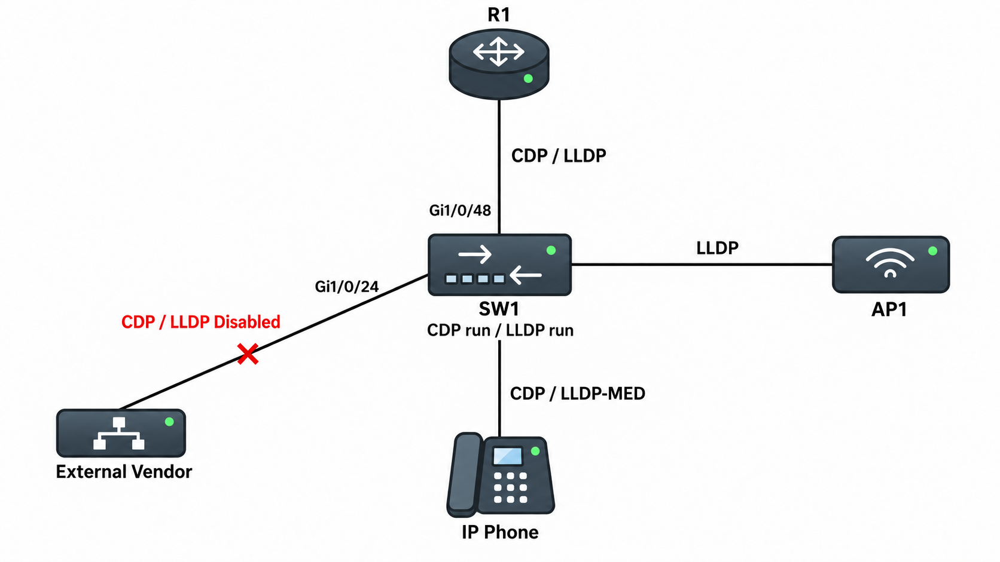

# CDP / LLDP

## 개념

### Neighbor Discovery Protocol

CDP와 LLDP는 같은 Link에 직접 연결된 Network 장비의 정보를 확인하는 Layer 2 Neighbor Discovery Protocol이다.

장비는 자신의 이름, Interface, Platform, IP Address 및 기능 등의 정보를 주기적으로 전송한다.

CDP와 LLDP는 Layer 2에서 동작하기 때문에 IP Address가 설정되지 않아도 Neighbor를 확인할 수 있다.

또한 Router를 넘어 전달되지 않으며 직접 연결된 장비만 확인할 수 있다.

### CDP

CDP(Cisco Discovery Protocol)는 Cisco에서 만든 Neighbor Discovery Protocol이다.

Cisco Router, Switch, Firewall, Wireless Controller 및 IP Phone 등의 정보를 확인할 때 사용한다.
```
SW1# show cdp neighbors detail

Device ID: R1
Entry address(es):
  IP address: 192.168.12.1
Platform: Cisco ISR4331/K9, Capabilities: Router
Interface: GigabitEthernet1/0/48
Port ID (outgoing port): GigabitEthernet0/0/0
Holdtime: 147 sec

Version:
Cisco IOS XE Software, Version 17.09.03

Native VLAN: 1
Duplex: full
Management address(es):
  IP address: 192.168.12.1
```

일반적인 Cisco IOS XE 장비에서는 CDP가 Global과 Interface에서 기본적으로 활성화되어 있다. 만약 활성화되어 있지 않다면 Global과 Interface에서 각각 활성화해야 한다.  
```
SW1(config)# cdp run
SW1(config)# interface gi1/0/1
SW1(config-if)# cdp enable
```

### LLDP

LLDP(Link Layer Discovery Protocol)는 IEEE `802.1AB` 표준 Neighbor Discovery Protocol이다.

Cisco 장비뿐만 아니라 다른 Vendor의 Router, Switch, Server, AP 및 IP Phone 정보를 확인할 수 있다.
```
SW1# show lldp neighbors detail

Chassis id: 0050.56aa.bbcc
Port id: GigabitEthernet0/1
Port Description: UPLINK_TO_SW1
System Name: AP1

System Description:
Vendor Wireless Access Point

System Capabilities: B,W
Enabled Capabilities: B,W

Management Addresses:
  IP: 192.168.10.20

Vlan ID: 10
```

일반적인 Cisco Catalyst IOS XE 장비에서는 LLDP가 기본적으로 비활성화되어 있으므로 직접 활성화해야 한다.
```
SW1(config)# lldp run
```

### CDP와 LLDP 비교

```
CDP
- Cisco 전용 Protocol
- Cisco 장비 사이에서 사용
- Cisco IP Phone과 Voice VLAN 연동에 사용
- 일반적인 Cisco 장비에서 기본 활성화

LLDP
- IEEE 802.1AB 표준 Protocol
- 여러 Vendor의 장비에서 사용
- Multi-Vendor 환경에서 사용
- 일반적인 Cisco Catalyst 장비에서 기본 비활성화
```
- Cisco 장비만 사용하는 환경에서는 CDP를 사용할 수 있고, 여러 Vendor의 장비가 함께 있는 환경에서는 LLDP를 사용하는 것이 좋다.


### TLV

CDP와 LLDP는 Neighbor에게 전달할 장비 정보를 TLV 형식으로 나누어 Message에 넣어 전달한다.

TLV(Type-Length-Value)는 정보의 종류, 길이 및 실제 값을 하나의 형식으로 전달하는 방식이다.

Neighbor 장비는 Message에 포함된 각 TLV를 확인하여 장비 이름, 연결된 Port, Management IP Address, 장비 기능 및 VLAN 등의 정보를 Neighbor Table에 저장한다.

### LLDP-MED

LLDP-MED(Link Layer Discovery Protocol-Media Endpoint Discovery)는 IP Phone과 같은 Media Endpoint를 위한 LLDP 확장 기능이다.

LLDP-MED를 사용하면 Switch가 IP Phone에 다음 정보를 전달할 수 있다.
- Voice VLAN
- CoS 및 DSCP
- PoE 전력 정보
- 장비 정보
- 위치 정보

Cisco IP Phone은 CDP를 통해서도 Voice VLAN 정보를 받을 수 있다. 다른 Vendor의 IP Phone과 연동할 때는 주로 LLDP-MED를 사용한다.

### Timer와 Holdtime

CDP와 LLDP는 Neighbor 정보를 주기적으로 전송하고, 수신한 장비는 Holdtime 동안 정보를 유지한다.

#### CDP 기본 Timer

```
Advertisement Interval: 60초
Holdtime: 180초
```
- CDP Message를 더 이상 받지 못하면 Holdtime이 만료된 후 Neighbor Table에서 해당 장비를 삭제한다.

#### LLDP 기본 Timer

```
Advertisement Interval: 30초
Holdtime: 120초
Reinitialization Delay: 2초
```
- Reinitialization Delay: LLDP를 다시 활성화한 후 초기화할 때까지 기다리는 시간이다.

### 보안

CDP와 LLDP는 장비의 Hostname, Model, Software Version, Interface 및 Management IP Address 등의 정보를 전달한다.

따라서 Internet, 외부 업체 및 신뢰할 수 없는 사용자가 연결된 Interface에서는 정보 노출을 방지하기 위해 비활성화하는 것이 좋다.
```
신뢰할 수 있는 장비 간 Uplink: 활성화
Internet 또는 외부 연결 Port: 비활성화
```
IP Phone이 연결된 Port에서는 Voice VLAN이나 PoE 정보를 전달하기 위해 CDP 또는 LLDP-MED가 사용될 수 있으므로, 비활성화하기 전에 IP Phone에서 사용하고 있는지 확인해야 한다.

## 동작 원리

### CDP와 LLDP 동작 과정

1\. R1과 SW1의 Interface가 직접 연결되고 Link가 Up 상태가 된다.

2\. 각 장비는 CDP 또는 LLDP Message에 자신의 장비 정보를 TLV 형태로 넣는다.

3\. CDP 또는 LLDP Message를 연결된 Interface로 주기적으로 전송한다.

4\. Neighbor 장비는 Message를 수신하고 TLV에 포함된 정보를 확인한다.

5\. 확인한 장비 정보를 CDP 또는 LLDP Neighbor Table에 저장한다.

6\. 관리자는 `show cdp neighbors` 또는 `show lldp neighbors` 명령어로 직접 연결된 장비를 확인한다.

7\. Holdtime 동안 새로운 Message를 받지 못하면 Neighbor Table에서 해당 정보를 삭제한다.

---

## 예시 및 구성

### 사내 Network 장비 연결 정보 확인

`MASON` 회사는 Cisco Router와 Switch뿐만 아니라 다른 Vendor의 AP와 IP Phone도 사용하고 있다.

관리자는 Cisco 장비 사이에서는 CDP를 사용하고, 다른 Vendor의 장비를 확인하기 위해 LLDP도 함께 활성화한다.



### CDP와 LLDP 활성화

SW1에서 CDP와 LLDP를 Global로 활성화한다.
```
SW1(config)# cdp run
SW1(config)# lldp run
```

R1과 연결된 Uplink에서 CDP와 LLDP를 활성화한다.
```
SW1(config)# interface gi1/0/48
SW1(config-if)# description UPLINK_TO_R1
SW1(config-if)# cdp enable
SW1(config-if)# lldp transmit
SW1(config-if)# lldp receive
SW1(config-if)# no shutdown
```
- `cdp enable`: 해당 Interface에서 CDP를 활성화한다.
- `lldp transmit`: 해당 Interface에서 LLDP Message를 전송한다.
- `lldp receive`: 해당 Interface에서 LLDP Message를 수신한다.

### 신뢰할 수 없는 Interface 비활성화

외부 업체 장비가 연결되는 `Gi1/0/24`에서 CDP와 LLDP를 비활성화한다.
```
SW1(config)# interface gi1/0/24
SW1(config-if)# description EXTERNAL_VENDOR
SW1(config-if)# no cdp enable
SW1(config-if)# no lldp transmit
SW1(config-if)# no lldp receive
```

---

## 명령어

CDP를 Global로 활성화한다.
```
SW1(config)# cdp run
```

CDP를 장비 전체에서 비활성화한다.
```
SW1(config)# no cdp run
```

CDP Message 전송 주기와 Holdtime을 설정한다.
```
SW1(config)# cdp timer 60
SW1(config)# cdp holdtime 180
```

특정 Interface에서 CDP를 활성화한다.
```
SW1(config)# interface gi1/0/1
SW1(config-if)# cdp enable
```

특정 Interface에서 CDP를 비활성화한다.
```
SW1(config-if)# no cdp enable
```

LLDP를 Global로 활성화한다.
```
SW1(config)# lldp run
```

LLDP를 장비 전체에서 비활성화한다.
```
SW1(config)# no lldp run
```

LLDP Timer를 설정한다.
```
SW1(config)# lldp timer 30
SW1(config)# lldp holdtime 120
SW1(config)# lldp reinit 2
```

CDP의 Global 상태와 Timer를 확인한다.
```
SW1# show cdp
```

CDP가 활성화된 Interface를 확인한다.
```
SW1# show cdp interface
SW1# show cdp interface gi1/0/48
```

직접 연결된 CDP Neighbor를 간단하게 확인한다.
```
SW1# show cdp neighbors
```

Neighbor의 Management IP Address, IOS Version, Native VLAN 및 Duplex 등의 상세 정보를 확인한다.
```
SW1# show cdp neighbors detail
```

CDP Packet의 송수신 Counter와 Error를 확인한다.
```
SW1# show cdp traffic
```

LLDP의 Global 상태와 Timer를 확인한다.
```
SW1# show lldp
```

LLDP 송신과 수신이 활성화된 Interface를 확인한다.
```
SW1# show lldp interface
SW1# show lldp interface gi1/0/48
```

직접 연결된 LLDP Neighbor를 간단하게 확인한다.
```
SW1# show lldp neighbors
```

Neighbor의 System Name, Management IP Address 및 TLV 등의 상세 정보를 확인한다.
```
SW1# show lldp neighbors detail
```

LLDP Packet의 송수신 Counter와 인식하지 못한 TLV를 확인한다.
```
SW1# show lldp traffic
```

---

## Troubleshooting

### CDP 또는 LLDP Neighbor가 확인되지 않는 경우

1\. 두 장비 사이의 Interface가 Up 상태인지 확인한다.
```
SW1# show interfaces status
SW1# show ip interface brief
```

2\. CDP 또는 LLDP가 Global로 활성화되어 있는지 확인한다.
```
SW1# show cdp
SW1# show lldp
SW1# show running-config | include cdp run|lldp run
```

3\. 연결된 Interface에서 CDP 또는 LLDP가 활성화되어 있는지 확인한다.
```
SW1# show cdp interface gi1/0/48
SW1# show lldp interface gi1/0/48
```

4\. LLDP의 송신과 수신 상태를 확인한다.
```
SW1# show lldp interface gi1/0/48
```
- SW1의 Receive가 활성화되어 있어도 Neighbor의 Transmit이 비활성화되어 있으면 SW1은 Neighbor 정보를 학습할 수 없다.


5\. 상대방 장비가 동일한 Neighbor Discovery Protocol을 지원하고 있는지 확인한다.
- Cisco가 아닌 장비는 CDP를 지원하지 않을 수 있으므로 LLDP를 사용한다.

6\. CDP와 LLDP Packet의 송수신 Counter가 증가하는지 확인한다.
```
SW1# show cdp traffic
SW1# show lldp traffic
```
- 송신 Counter만 증가하고 수신 Counter가 증가하지 않으면 상대방 장비의 설정을 확인한다.

---

## 주요 질문

CDP와 LLDP를 사용하는 이유는 무엇인가?
- 직접 연결된 Network 장비의 이름, 연결 Port, Platform, IP Address 및 기능을 확인하기 위해 사용한다.

CDP와 LLDP의 차이는 무엇인가?
- CDP는 Cisco 전용 Protocol이고, LLDP는 여러 Vendor에서 사용할 수 있는 IEEE `802.1AB` 표준 Protocol이다.

CDP와 LLDP는 어느 Layer에서 동작하는가?
- Data Link Layer인 Layer 2에서 동작한다.

Router를 넘어 있는 장비도 확인할 수 있는가?
- CDP와 LLDP는 직접 연결된 Neighbor 정보만 확인할 수 있다.

CDP와 LLDP를 동시에 사용할 수 있는가?
- Cisco 장비 확인에는 CDP를 사용하고 다른 Vendor 장비 확인에는 LLDP를 함께 사용할 수 있다.

LLDP의 Transmit과 Receive는 어떤 역할을 하는가?
- Transmit은 자신의 정보를 Neighbor에게 보내고, Receive는 Neighbor가 보낸 정보를 학습한다.

TLV란 무엇인가?
- CDP와 LLDP에서 정보의 종류, 길이 및 실제 값을 전달하는 형식이다.

LLDP-MED는 어디에 사용하는가?
- IP Phone에 Voice VLAN, QoS, PoE 및 위치 정보 등을 전달할 때 사용한다.

CDP와 LLDP를 외부 Interface에서 비활성화하는 이유는 무엇인가?
- 장비 이름, Model, Software Version 및 Management IP Address 등의 내부 정보가 외부에 노출되는 것을 방지하기 위해 비활성화한다.
